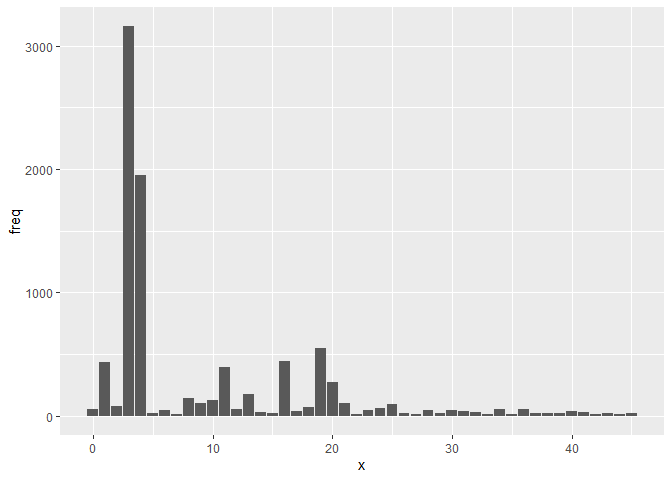
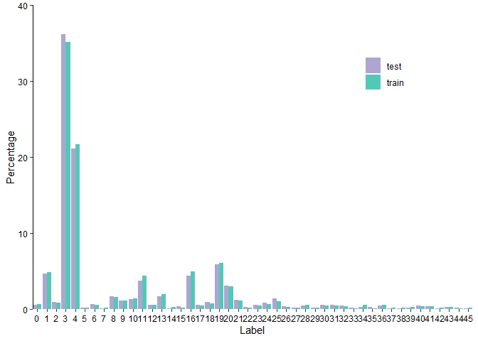
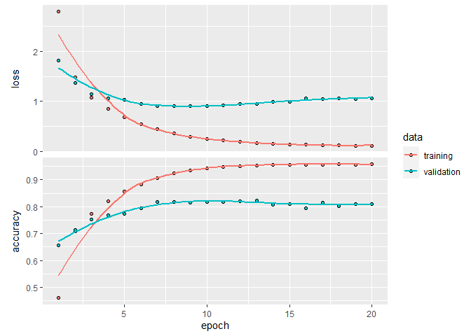
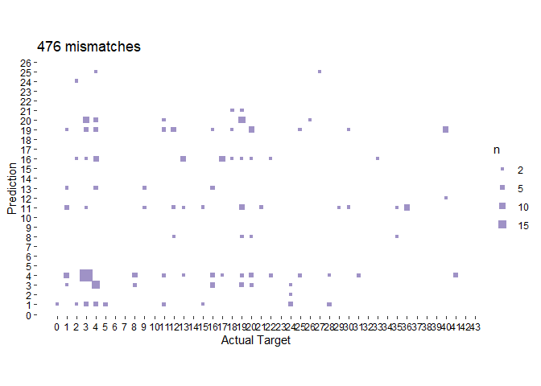

In this case study, we'll showcase two loss functions: `cateogircal_crossentropy`, which we saw in the MNIST case study, and `sparse_categorical_crossentropy`.

## Install tensorflow 

It's only necessary to run this once. 


```r
# for GPU
# install_keras(tensorflow = "gpu")

# or CPU:
# install_keras() # for cpu
```

# Part 1: Data Preparation

## Obtain data


```r
c(c(train_data, train_labels), c(test_data, test_labels)) %<-% dataset_reuters(num_words = 10000)
```

## Examine data:


```r
length(train_data)
```

```
## [1] 8982
```

```r
length(test_data)
```

```
## [1] 2246
```

An example of the data


```r
train_data[[1]]
```

```
##  [1]    1    2    2    8   43   10  447    5   25  207  270    5 3095  111   16
## [16]  369  186   90   67    7   89    5   19  102    6   19  124   15   90   67
## [31]   84   22  482   26    7   48    4   49    8  864   39  209  154    6  151
## [46]    6   83   11   15   22  155   11   15    7   48    9 4579 1005  504    6
## [61]  258    6  272   11   15   22  134   44   11   15   16    8  197 1245   90
## [76]   67   52   29  209   30   32  132    6  109   15   17   12
```

Map values back onto the lexicon which is stored as a named list. Each item in the list is an integer vector of length one. This number corresponds to the position in the word count list and the name of the vector is the actual word. 


```r
dataset_reuters_word_index() %>% 
  unlist() %>%                      # produce a vector
  sort() %>%                        # put them in order 
  names() -> word_index             # take the ordered names

# The indices are offset by 3 since 0, 1, and 2 are reserved 
# for "padding", "start of sequence", and "unknown"
library(purrr)
train_data[[1]] %>% 
  map(~ ifelse(.x >= 3, word_index[.x - 3], "?")) %>% 
  as_vector() %>% 
  cat()
```

```
## ? ? ? said as a result of its december acquisition of space co it expects earnings per share in 1987 of 1 15 to 1 30 dlrs per share up from 70 cts in 1986 the company said pretax net should rise to nine to 10 mln dlrs from six mln dlrs in 1986 and rental operation revenues to 19 to 22 mln dlrs from 12 5 mln dlrs it said cash flow per share this year should be 2 50 to three dlrs reuter 3
```

## Prepare the data:

Using one-hot encoding


```r
vectorize_sequences <- function(sequences, dimension = 10000) {
  # Create a matrix of 0s
  results <- matrix(0, nrow = length(sequences), ncol = dimension)

  # Populate the matrix with 1s
  for (i in 1:length(sequences))
    results[i, sequences[[i]]] <- 1
  results
}

train_data_vec <- vectorize_sequences(train_data)
test_data_vec <- vectorize_sequences(test_data)
```

Let's look at the first example from the training set. Recall that these are the index positions of the words 


```r
train_example <- sort(unique(train_data[[1]]))
train_example
```

```
##  [1]    1    2    4    5    6    7    8    9   10   11   12   15   16   17   19
## [16]   22   25   26   29   30   32   39   43   44   48   49   52   67   83   84
## [31]   89   90  102  109  111  124  132  134  151  154  155  186  197  207  209
## [46]  258  270  272  369  447  482  504  864 1005 1245 3095 4579
```

Now we have a large matrix, where each row is 10000 elements long. Wherever we have a value in the above data set, the matrix has a 1


```r
# Just the first 100 values in the first entry (row)
train_data_vec[1,1:100]
```

```
##   [1] 1 1 0 1 1 1 1 1 1 1 1 1 0 0 1 1 1 0 1 0 0 1 0 0 1 1 0 0 1 1 0 1 0 0 0 0 0
##  [38] 0 1 0 0 0 1 1 0 0 0 1 1 0 0 1 0 0 0 0 0 0 0 0 0 0 0 0 0 0 1 0 0 0 0 0 0 0
##  [75] 0 0 0 0 0 0 0 0 1 1 0 0 0 0 1 1 0 0 0 0 0 0 0 0 0 0
```

We can confirm this by counting the values:


```r
sum(train_data_vec[1,]) == length(train_example)
```

```
## [1] TRUE
```

The position of the 1s corresponds to the indices above:


```r
which(as.logical(train_data_vec[1,]))
```

```
##  [1]    1    2    4    5    6    7    8    9   10   11   12   15   16   17   19
## [16]   22   25   26   29   30   32   39   43   44   48   49   52   67   83   84
## [31]   89   90  102  109  111  124  132  134  151  154  155  186  197  207  209
## [46]  258  270  272  369  447  482  504  864 1005 1245 3095 4579
```

## Prepare labels:

The `_labels` objects contain the news wire labels. Each newswire can only have one *label* (i.e. "sigle-label"), from a total of 46 possible *classes* (i.e. "multi-class"). The classes are just given numerical values (0 - 45), it doesn't matter what they are actually called, although that information would be helpful in understanding mis-labeling.


```r
str(train_labels)
```

```
##  int [1:8982] 3 4 3 4 4 4 4 3 3 16 ...
```

```r
sort(unique(train_labels))
```

```
##  [1]  0  1  2  3  4  5  6  7  8  9 10 11 12 13 14 15 16 17 18 19 20 21 22 23 24
## [26] 25 26 27 28 29 30 31 32 33 34 35 36 37 38 39 40 41 42 43 44 45
```

Some classes are very common, which we'll see play out in our confusion matrix below 


```r
# Note plyr not dplyr here. I'm just using a shortcut
library(ggplot2)
train_labels %>% 
  plyr::count() %>%
  ggplot(aes(x, freq)) +
  geom_col()
```

<!-- -->

The distribution of the test and training set should be roughly equivalent, so let's have a look. 


```r
data.frame(x = train_labels) %>% 
  group_by(x) %>% 
  summarise(train_freq = 100 * n()/length(train_data)) -> train_labels_df
```

```
## `summarise()` ungrouping output (override with `.groups` argument)
```

```r
data.frame(x  = test_labels) %>% 
  group_by(x) %>% 
  summarise(train_freq = 100 * n()/length(test_data)) %>% 
  inner_join(train_labels_df, by="x") %>% 
  gather(key, value, -x) %>% 
  ggplot(aes(x, value, fill = key)) +
  geom_col(position = "dodge") +
  scale_y_continuous("Percentage", limits = c(0,40), expand = c(0,0)) +
  scale_x_continuous("Label", breaks = 0:45, expand = c(0,0)) +
  scale_fill_manual("", labels = c("test","train"), values = c("#AEA5D0", "#54C8B7")) +
  theme_classic() +
  theme(legend.position = c(0.8, 0.8),
        axis.line.x = element_blank(),
        axis.text = element_text(colour = "black"))
```

```
## `summarise()` ungrouping output (override with `.groups` argument)
```

<!-- -->

We treat these just like how we treated the MNIST labels in the previous unit. We make the format match the output we expect to get from softmax so that we can make a direct comparison.


```r
train_labels_vec <- to_categorical(train_labels)
test_labels_vec <- to_categorical(test_labels)
```


```r
str(train_labels_vec)
```

```
##  num [1:8982, 1:46] 0 0 0 0 0 0 0 0 0 0 ...
```

```r
str(test_labels_vec)
```

```
##  num [1:2246, 1:46] 0 0 0 0 0 0 0 0 0 0 ...
```

Notice the similiarity to how we prepared our training data with one-hot encoding, both are sparse matrices. Each row in the training data contains a 1 at the position where that word is present, and in the labels, each row contains a maximum of a single 1, indicating the class. 

# Part 2: Define Network

## Define the network


```r
network <- keras_model_sequential() %>% 
  layer_dense(units = 64, activation = "relu", input_shape = c(10000)) %>% 
  layer_dense(units = 64, activation = "relu") %>% 
  layer_dense(units = 46, activation = "softmax")
```

## View a summary of the network


```r
summary(network)
```

```
## Model: "sequential"
## ________________________________________________________________________________
## Layer (type)                        Output Shape                    Param #     
## ================================================================================
## dense_2 (Dense)                     (None, 64)                      640064      
## ________________________________________________________________________________
## dense_1 (Dense)                     (None, 64)                      4160        
## ________________________________________________________________________________
## dense (Dense)                       (None, 46)                      2990        
## ================================================================================
## Total params: 647,214
## Trainable params: 647,214
## Non-trainable params: 0
## ________________________________________________________________________________
```

## Compile


```r
network %>% compile(
  optimizer = "rmsprop",
  loss = "categorical_crossentropy",
  metrics = c("accuracy")
)
```

# Part 3: Validate our approach

Let's set apart 1,000 samples in our training data to use as a validation set:


```r
index <- 1:1000

val_data_vec <- train_data_vec[index,]
train_data_vec <- train_data_vec[-index,]

val_labels_vec <- train_labels_vec[index,]
train_labels_vec = train_labels_vec[-index,]
```

Now let's train our network for 20 epochs:


```r
history <- network %>% fit(
  train_data_vec,
  train_labels_vec,
  epochs = 20,
  batch_size = 512,
  validation_data = list(val_data_vec, val_labels_vec)
)
```

Let's display its loss and accuracy curves:


```r
plot(history)
```

```
## `geom_smooth()` using formula 'y ~ x'
```

<!-- -->

The network begins to overfit after nine epochs. Let's train a new network from scratch for nine epochs and then evaluate it on the test set.


```r
network <- keras_model_sequential() %>% 
  layer_dense(units = 64, activation = "relu", input_shape = c(10000)) %>% 
  layer_dense(units = 64, activation = "relu") %>% 
  layer_dense(units = 46, activation = "softmax")
  
network %>% compile(
  optimizer = "rmsprop",
  loss = "categorical_crossentropy",
  metrics = c("accuracy")
)

history <- network %>% fit(
  train_data_vec,
  train_labels_vec,
  epochs = 9,
  batch_size = 512,
  validation_data = list(val_data_vec, val_labels_vec)
)
```

# Part 4: Using sparse categorical crossentropy

Above, we vectorized the labels, like what we did with the MNIST data set. Alternatively, we could have just used the original integer values. To showcase this, let's create a new network, `network_int`, so that we don't mix up our results. The network architecture is the same:


```r
network_int <- keras_model_sequential() %>% 
  layer_dense(units = 64, activation = "relu", input_shape = c(10000)) %>% 
  layer_dense(units = 64, activation = "relu") %>% 
  layer_dense(units = 46, activation = "softmax")
```

Here, the only thing we need to chance is the loss function. `categorical_crossentropy`, expects the labels to follow a categorical encoding, but `sparse_categorical_crossentropy` expects integer labels. 


```r
network_int %>% compile(
  optimizer = "rmsprop",
  loss = "sparse_categorical_crossentropy",
  metrics = c("accuracy")
)
```

Before we train the model, let's make a validation set, like we did above. We'll use the original training set for this.


```r
val_train_labels <- train_labels[index]
train_labels <- train_labels[-index]
```

Now let's train our model `network_int` using the integer data, instead of the vectorized data:


```r
history_int <- network_int %>% fit(
  train_data_vec,
  train_labels,
  epochs = 9,
  batch_size = 512,
  validation_data = list(val_data_vec, val_train_labels)
)
```

This new loss function is mathematically the same as `categorical_crossentropy`. It just has a different interface. When we look at our metrics below we'll use the original model, that accessed the vectorized data. If you want to use `network_int` make sure you use the original integer labels of the test set, `test_labels`, not `test_labels_vec`. 

# Part 5: Check output

Let's return to our original model using the vectorized data:

## Metrics


```r
metrics <- network %>% evaluate(test_data_vec, test_labels_vec)
```


```r
metrics
```

```
##      loss  accuracy 
## 0.9942550 0.7880677
```

```r
metrics["accuracy"]
```

```
##  accuracy 
## 0.7880677
```

```r
# Error rate: incorrect calling
1 - metrics["accuracy"]
```

```
##  accuracy 
## 0.2119323
```

## Predictions


```r
network %>% predict_classes(test_data_vec[1:10,])
```

```
##  [1]  4 10  1  4 13  3  3  3  3  3
```


```r
predictions <- network %>% predict_classes(test_data_vec)
actual <- unlist(test_labels)
totalmisses <- sum(predictions != actual)
```

# Confusion Matrix

<!-- -->

# Session Info


```r
sessionInfo()
```

```
## R version 4.0.3 (2020-10-10)
## Platform: x86_64-w64-mingw32/x64 (64-bit)
## Running under: Windows 10 x64 (build 18363)
## 
## Matrix products: default
## 
## locale:
## [1] LC_COLLATE=English_United States.1252 
## [2] LC_CTYPE=English_United States.1252   
## [3] LC_MONETARY=English_United States.1252
## [4] LC_NUMERIC=C                          
## [5] LC_TIME=English_United States.1252    
## 
## attached base packages:
## [1] stats     graphics  grDevices utils     datasets  methods   base     
## 
## other attached packages:
##  [1] forcats_0.5.0   stringr_1.4.0   dplyr_1.0.2     purrr_0.3.4    
##  [5] readr_1.4.0     tidyr_1.1.2     tibble_3.0.4    ggplot2_3.3.3  
##  [9] tidyverse_1.3.0 keras_2.3.0.0  
## 
## loaded via a namespace (and not attached):
##  [1] Rcpp_1.0.6        lubridate_1.7.9.2 lattice_0.20-41   assertthat_0.2.1 
##  [5] zeallot_0.1.0     digest_0.6.27     R6_2.5.0          cellranger_1.1.0 
##  [9] plyr_1.8.6        backports_1.2.0   reprex_0.3.0      evaluate_0.14    
## [13] httr_1.4.2        pillar_1.4.7      tfruns_1.4        rlang_0.4.10     
## [17] readxl_1.3.1      rstudioapi_0.13   whisker_0.4       Matrix_1.2-18    
## [21] reticulate_1.18   rmarkdown_2.6     splines_4.0.3     labeling_0.4.2   
## [25] munsell_0.5.0     broom_0.7.3       compiler_4.0.3    modelr_0.1.8     
## [29] xfun_0.20         pkgconfig_2.0.3   base64enc_0.1-3   mgcv_1.8-33      
## [33] tensorflow_2.2.0  htmltools_0.5.0   tidyselect_1.1.0  fansi_0.4.1      
## [37] crayon_1.3.4      dbplyr_2.0.0      withr_2.4.0       rappdirs_0.3.1   
## [41] grid_4.0.3        nlme_3.1-149      jsonlite_1.7.2    gtable_0.3.0     
## [45] lifecycle_0.2.0   DBI_1.1.1         magrittr_2.0.1    scales_1.1.1     
## [49] cli_2.2.0         stringi_1.5.3     farver_2.0.3      fs_1.5.0         
## [53] xml2_1.3.2        ellipsis_0.3.1    generics_0.1.0    vctrs_0.3.6      
## [57] tools_4.0.3       glue_1.4.2        hms_1.0.0         yaml_2.2.1       
## [61] colorspace_2.0-0  rvest_0.3.6       knitr_1.30        haven_2.3.1
```

