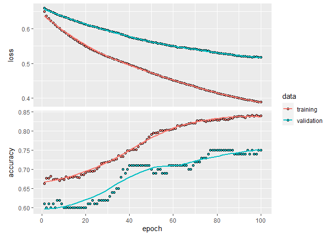
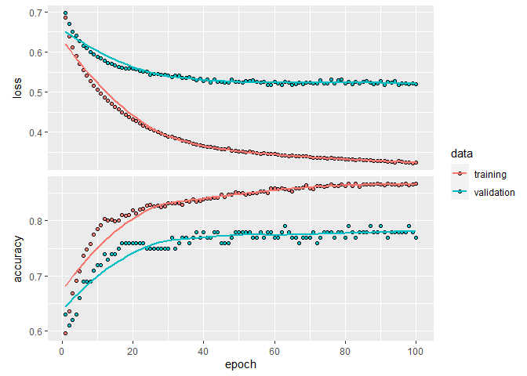
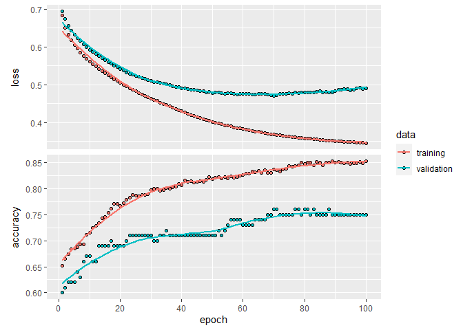
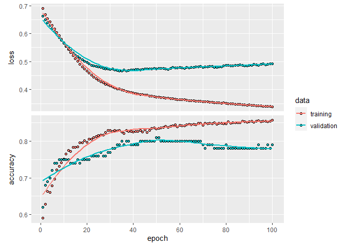
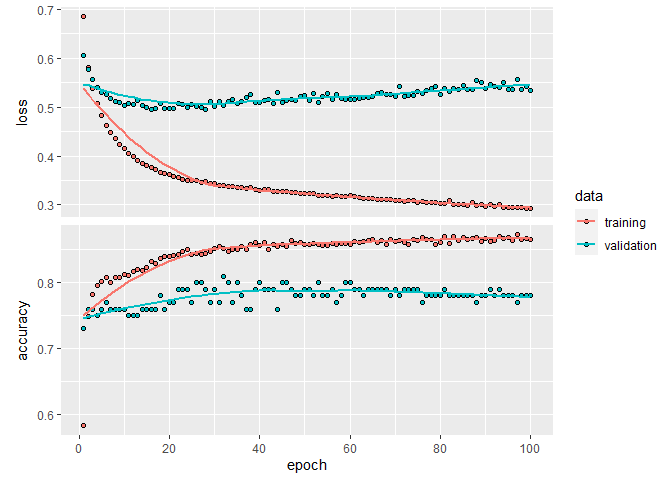
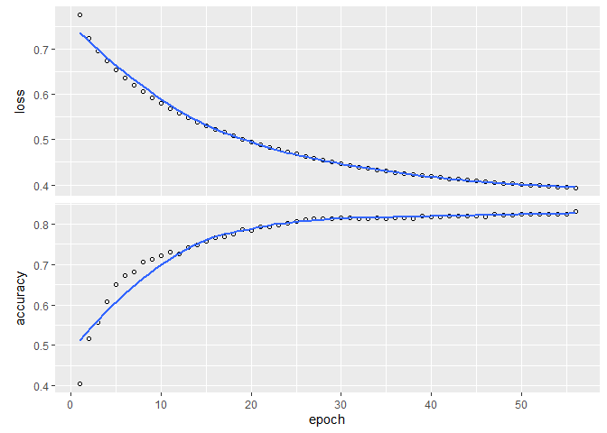

## OJ


```r
library(tidyverse)
```

```
## -- Attaching packages --------------------------------------- tidyverse 1.3.0 --
```

```
## v ggplot2 3.3.3     v purrr   0.3.4
## v tibble  3.0.4     v dplyr   1.0.2
## v tidyr   1.1.2     v stringr 1.4.0
## v readr   1.4.0     v forcats 0.5.0
```

```
## -- Conflicts ------------------------------------------ tidyverse_conflicts() --
## x dplyr::filter() masks stats::filter()
## x dplyr::lag()    masks stats::lag()
```

```r
library(ISLR)
library(tree)
```

```
## Registered S3 method overwritten by 'tree':
##   method     from
##   print.tree cli
```

```r
data(OJ)
#?OJ
```


```r
head(OJ)
```

```
##   Purchase WeekofPurchase StoreID PriceCH PriceMM DiscCH DiscMM SpecialCH
## 1       CH            237       1    1.75    1.99   0.00    0.0         0
## 2       CH            239       1    1.75    1.99   0.00    0.3         0
## 3       CH            245       1    1.86    2.09   0.17    0.0         0
## 4       MM            227       1    1.69    1.69   0.00    0.0         0
## 5       CH            228       7    1.69    1.69   0.00    0.0         0
## 6       CH            230       7    1.69    1.99   0.00    0.0         0
##   SpecialMM  LoyalCH SalePriceMM SalePriceCH PriceDiff Store7 PctDiscMM
## 1         0 0.500000        1.99        1.75      0.24     No  0.000000
## 2         1 0.600000        1.69        1.75     -0.06     No  0.150754
## 3         0 0.680000        2.09        1.69      0.40     No  0.000000
## 4         0 0.400000        1.69        1.69      0.00     No  0.000000
## 5         0 0.956535        1.69        1.69      0.00    Yes  0.000000
## 6         1 0.965228        1.99        1.69      0.30    Yes  0.000000
##   PctDiscCH ListPriceDiff STORE
## 1  0.000000          0.24     1
## 2  0.000000          0.24     1
## 3  0.091398          0.23     1
## 4  0.000000          0.00     1
## 5  0.000000          0.00     0
## 6  0.000000          0.30     0
```

```r
summary(OJ)
```

```
##  Purchase WeekofPurchase     StoreID        PriceCH         PriceMM     
##  CH:653   Min.   :227.0   Min.   :1.00   Min.   :1.690   Min.   :1.690  
##  MM:417   1st Qu.:240.0   1st Qu.:2.00   1st Qu.:1.790   1st Qu.:1.990  
##           Median :257.0   Median :3.00   Median :1.860   Median :2.090  
##           Mean   :254.4   Mean   :3.96   Mean   :1.867   Mean   :2.085  
##           3rd Qu.:268.0   3rd Qu.:7.00   3rd Qu.:1.990   3rd Qu.:2.180  
##           Max.   :278.0   Max.   :7.00   Max.   :2.090   Max.   :2.290  
##      DiscCH            DiscMM         SpecialCH        SpecialMM     
##  Min.   :0.00000   Min.   :0.0000   Min.   :0.0000   Min.   :0.0000  
##  1st Qu.:0.00000   1st Qu.:0.0000   1st Qu.:0.0000   1st Qu.:0.0000  
##  Median :0.00000   Median :0.0000   Median :0.0000   Median :0.0000  
##  Mean   :0.05186   Mean   :0.1234   Mean   :0.1477   Mean   :0.1617  
##  3rd Qu.:0.00000   3rd Qu.:0.2300   3rd Qu.:0.0000   3rd Qu.:0.0000  
##  Max.   :0.50000   Max.   :0.8000   Max.   :1.0000   Max.   :1.0000  
##     LoyalCH          SalePriceMM     SalePriceCH      PriceDiff       Store7   
##  Min.   :0.000011   Min.   :1.190   Min.   :1.390   Min.   :-0.6700   No :714  
##  1st Qu.:0.325257   1st Qu.:1.690   1st Qu.:1.750   1st Qu.: 0.0000   Yes:356  
##  Median :0.600000   Median :2.090   Median :1.860   Median : 0.2300            
##  Mean   :0.565782   Mean   :1.962   Mean   :1.816   Mean   : 0.1465            
##  3rd Qu.:0.850873   3rd Qu.:2.130   3rd Qu.:1.890   3rd Qu.: 0.3200            
##  Max.   :0.999947   Max.   :2.290   Max.   :2.090   Max.   : 0.6400            
##    PctDiscMM        PctDiscCH       ListPriceDiff       STORE      
##  Min.   :0.0000   Min.   :0.00000   Min.   :0.000   Min.   :0.000  
##  1st Qu.:0.0000   1st Qu.:0.00000   1st Qu.:0.140   1st Qu.:0.000  
##  Median :0.0000   Median :0.00000   Median :0.240   Median :2.000  
##  Mean   :0.0593   Mean   :0.02731   Mean   :0.218   Mean   :1.631  
##  3rd Qu.:0.1127   3rd Qu.:0.00000   3rd Qu.:0.300   3rd Qu.:3.000  
##  Max.   :0.4020   Max.   :0.25269   Max.   :0.440   Max.   :4.000
```


```r
OJ %>% select(StoreID, STORE) %>% head()
```

```
##   StoreID STORE
## 1       1     1
## 2       1     1
## 3       1     1
## 4       1     1
## 5       7     0
## 6       7     0
```
> StoreID and STORE are redundant
> because store is categorical we need to turn that into a series of dummy variables.


```r
store_cat <- OJ %>% select(StoreID) %>%
  mutate(row=1:nrow(.),data=1) %>%
  pivot_wider(id_cols = row, names_from=StoreID, values_from=data, values_fill=0, names_prefix="Store")
head(store_cat)
```

```
## # A tibble: 6 x 6
##     row Store1 Store7 Store2 Store3 Store4
##   <int>  <dbl>  <dbl>  <dbl>  <dbl>  <dbl>
## 1     1      1      0      0      0      0
## 2     2      1      0      0      0      0
## 3     3      1      0      0      0      0
## 4     4      1      0      0      0      0
## 5     5      0      1      0      0      0
## 6     6      0      1      0      0      0
```


```r
OJ <- OJ %>% select(-StoreID, -STORE, -Store7) %>% cbind(store_cat)
head(OJ)
```

```
##   Purchase WeekofPurchase PriceCH PriceMM DiscCH DiscMM SpecialCH SpecialMM
## 1       CH            237    1.75    1.99   0.00    0.0         0         0
## 2       CH            239    1.75    1.99   0.00    0.3         0         1
## 3       CH            245    1.86    2.09   0.17    0.0         0         0
## 4       MM            227    1.69    1.69   0.00    0.0         0         0
## 5       CH            228    1.69    1.69   0.00    0.0         0         0
## 6       CH            230    1.69    1.99   0.00    0.0         0         1
##    LoyalCH SalePriceMM SalePriceCH PriceDiff PctDiscMM PctDiscCH ListPriceDiff
## 1 0.500000        1.99        1.75      0.24  0.000000  0.000000          0.24
## 2 0.600000        1.69        1.75     -0.06  0.150754  0.000000          0.24
## 3 0.680000        2.09        1.69      0.40  0.000000  0.091398          0.23
## 4 0.400000        1.69        1.69      0.00  0.000000  0.000000          0.00
## 5 0.956535        1.69        1.69      0.00  0.000000  0.000000          0.00
## 6 0.965228        1.99        1.69      0.30  0.000000  0.000000          0.30
##   row Store1 Store7 Store2 Store3 Store4
## 1   1      1      0      0      0      0
## 2   2      1      0      0      0      0
## 3   3      1      0      0      0      0
## 4   4      1      0      0      0      0
## 5   5      0      1      0      0      0
## 6   6      0      1      0      0      0
```

## (a) Create a training set containing a random sample of 800 observations, and a test set containing the remaining observations.


```r
set.seed(10)
train <- sample(1:nrow(OJ), size = 800)
OJ.train <- OJ[train,]
OJ.test <- OJ[-train,]
str(OJ.test)
```

```
## 'data.frame':	270 obs. of  21 variables:
##  $ Purchase      : Factor w/ 2 levels "CH","MM": 1 1 1 1 1 1 1 1 1 1 ...
##  $ WeekofPurchase: num  239 245 268 257 264 272 278 258 277 236 ...
##  $ PriceCH       : num  1.75 1.86 1.86 1.86 1.86 1.86 2.06 1.76 1.99 1.79 ...
##  $ PriceMM       : num  1.99 2.09 2.13 2.18 2.13 2.13 2.13 2.18 2.13 2.09 ...
##  $ DiscCH        : num  0 0.17 0 0 0.37 0 0 0 0.24 0 ...
##  $ DiscMM        : num  0.3 0 0 0 0 0 0 0 0 0 ...
##  $ SpecialCH     : num  0 0 0 0 1 0 0 0 0 0 ...
##  $ SpecialMM     : num  1 0 0 0 0 0 0 0 0 0 ...
##  $ LoyalCH       : num  0.6 0.68 0.68 0.6 0.795 ...
##  $ SalePriceMM   : num  1.69 2.09 2.13 2.18 2.13 2.13 2.13 2.18 2.13 2.09 ...
##  $ SalePriceCH   : num  1.75 1.69 1.86 1.86 1.49 1.86 2.06 1.76 1.75 1.79 ...
##  $ PriceDiff     : num  -0.06 0.4 0.27 0.32 0.64 0.27 0.07 0.42 0.38 0.3 ...
##  $ PctDiscMM     : num  0.151 0 0 0 0 ...
##  $ PctDiscCH     : num  0 0.0914 0 0 0.1989 ...
##  $ ListPriceDiff : num  0.24 0.23 0.27 0.32 0.27 0.27 0.07 0.42 0.14 0.3 ...
##  $ row           : int  2 3 14 21 24 28 30 37 38 44 ...
##  $ Store1        : num  1 1 0 0 0 0 0 1 1 0 ...
##  $ Store7        : num  0 0 1 1 1 1 1 0 0 0 ...
##  $ Store2        : num  0 0 0 0 0 0 0 0 0 0 ...
##  $ Store3        : num  0 0 0 0 0 0 0 0 0 0 ...
##  $ Store4        : num  0 0 0 0 0 0 0 0 0 1 ...
```

```r
str(OJ.train)
```

```
## 'data.frame':	800 obs. of  21 variables:
##  $ Purchase      : Factor w/ 2 levels "CH","MM": 1 2 2 1 2 2 2 2 2 2 ...
##  $ WeekofPurchase: num  241 258 243 260 255 233 236 248 263 250 ...
##  $ PriceCH       : num  1.79 1.86 1.86 1.86 1.99 1.69 1.79 1.89 1.76 1.99 ...
##  $ PriceMM       : num  2.23 2.18 1.99 2.13 2.29 1.69 2.09 2.09 1.99 2.23 ...
##  $ DiscCH        : num  0 0 0 0 0 0 0 0 0 0 ...
##  $ DiscMM        : num  0 0 0.8 0.24 0 0 0 0 0.4 0 ...
##  $ SpecialCH     : num  0 0 0 0 0 0 0 0 0 0 ...
##  $ SpecialMM     : num  0 0 1 0 0 0 0 0 1 0 ...
##  $ LoyalCH       : num  0.869 0.256 0.6 0.895 0.6 ...
##  $ SalePriceMM   : num  2.23 2.18 1.19 1.89 2.29 1.69 2.09 2.09 1.59 2.23 ...
##  $ SalePriceCH   : num  1.79 1.86 1.86 1.86 1.99 1.69 1.79 1.89 1.76 1.99 ...
##  $ PriceDiff     : num  0.44 0.32 -0.67 0.03 0.3 0 0.3 0.2 -0.17 0.24 ...
##  $ PctDiscMM     : num  0 0 0.402 0.113 0 ...
##  $ PctDiscCH     : num  0 0 0 0 0 0 0 0 0 0 ...
##  $ ListPriceDiff : num  0.44 0.32 0.13 0.27 0.3 0 0.3 0.2 0.23 0.24 ...
##  $ row           : int  491 368 439 344 143 938 930 775 797 285 ...
##  $ Store1        : num  0 0 1 0 0 0 0 0 1 0 ...
##  $ Store7        : num  0 0 0 1 0 0 0 0 0 0 ...
##  $ Store2        : num  0 1 0 0 0 1 0 1 0 0 ...
##  $ Store3        : num  1 0 0 0 0 0 1 0 0 1 ...
##  $ Store4        : num  0 0 0 0 1 0 0 0 0 0 ...
```

## (b) Fit a tree to the training data, with Purchase as the response and the other variables as predictors. Use the summary() function to produce summary statistics about the tree, and describe the results obtained. What is the training error rate? How many terminal nodes does the tree have?


```r
tree.OJ=tree(Purchase~.,OJ,subset=train)
summary(tree.OJ)
```

```
## 
## Classification tree:
## tree(formula = Purchase ~ ., data = OJ, subset = train)
## Variables actually used in tree construction:
## [1] "LoyalCH"   "DiscMM"    "PriceDiff"
## Number of terminal nodes:  7 
## Residual mean deviance:  0.7983 = 633 / 793 
## Misclassification error rate: 0.1775 = 142 / 800
```
> Number of terminal nodes:  7

> Misclassification error rate: 0.1775

## (e) Predict the response on the test data, and produce a confusion matrix comparing the test labels to the predicted test labels. What is the test error rate?


```r
tree.pred=predict(tree.OJ,OJ.test,type="class")
purchase.test=OJ.test$Purchase
table(tree.pred,purchase.test)
```

```
##          purchase.test
## tree.pred  CH  MM
##        CH 135  20
##        MM  27  88
```

```r
(135+88)/270
```

```
## [1] 0.8259259
```

```r
1-((135+88)/270)
```

```
## [1] 0.1740741
```

> Accuracy is 82.59%

## Deep learning method


```r
library(keras)
library(reticulate)
library(tensorflow)
use_condaenv("r-reticulate")
```

> create label


```r
OJ.train.label <- OJ.train %>% select(Purchase) %>% mutate(Purchase=ifelse(Purchase=="CH", 0, 1)) %>% pull(Purchase)
str(OJ.train.label)
```

```
##  num [1:800] 0 1 1 0 1 1 1 1 1 1 ...
```

```r
OJ.test.label <- OJ.test %>% select(Purchase) %>% mutate(Purchase=ifelse(Purchase=="CH", 0, 1)) %>% pull(Purchase)
str(OJ.test.label)
```

```
##  num [1:270] 0 0 0 0 0 0 0 0 0 0 ...
```

> create data


```r
OJ.train <- OJ.train %>% select(-Purchase)
str(OJ.train)
```

```
## 'data.frame':	800 obs. of  20 variables:
##  $ WeekofPurchase: num  241 258 243 260 255 233 236 248 263 250 ...
##  $ PriceCH       : num  1.79 1.86 1.86 1.86 1.99 1.69 1.79 1.89 1.76 1.99 ...
##  $ PriceMM       : num  2.23 2.18 1.99 2.13 2.29 1.69 2.09 2.09 1.99 2.23 ...
##  $ DiscCH        : num  0 0 0 0 0 0 0 0 0 0 ...
##  $ DiscMM        : num  0 0 0.8 0.24 0 0 0 0 0.4 0 ...
##  $ SpecialCH     : num  0 0 0 0 0 0 0 0 0 0 ...
##  $ SpecialMM     : num  0 0 1 0 0 0 0 0 1 0 ...
##  $ LoyalCH       : num  0.869 0.256 0.6 0.895 0.6 ...
##  $ SalePriceMM   : num  2.23 2.18 1.19 1.89 2.29 1.69 2.09 2.09 1.59 2.23 ...
##  $ SalePriceCH   : num  1.79 1.86 1.86 1.86 1.99 1.69 1.79 1.89 1.76 1.99 ...
##  $ PriceDiff     : num  0.44 0.32 -0.67 0.03 0.3 0 0.3 0.2 -0.17 0.24 ...
##  $ PctDiscMM     : num  0 0 0.402 0.113 0 ...
##  $ PctDiscCH     : num  0 0 0 0 0 0 0 0 0 0 ...
##  $ ListPriceDiff : num  0.44 0.32 0.13 0.27 0.3 0 0.3 0.2 0.23 0.24 ...
##  $ row           : int  491 368 439 344 143 938 930 775 797 285 ...
##  $ Store1        : num  0 0 1 0 0 0 0 0 1 0 ...
##  $ Store7        : num  0 0 0 1 0 0 0 0 0 0 ...
##  $ Store2        : num  0 1 0 0 0 1 0 1 0 0 ...
##  $ Store3        : num  1 0 0 0 0 0 1 0 0 1 ...
##  $ Store4        : num  0 0 0 0 1 0 0 0 0 0 ...
```

```r
OJ.test <- OJ.test %>% select(-Purchase)
str(OJ.test)
```

```
## 'data.frame':	270 obs. of  20 variables:
##  $ WeekofPurchase: num  239 245 268 257 264 272 278 258 277 236 ...
##  $ PriceCH       : num  1.75 1.86 1.86 1.86 1.86 1.86 2.06 1.76 1.99 1.79 ...
##  $ PriceMM       : num  1.99 2.09 2.13 2.18 2.13 2.13 2.13 2.18 2.13 2.09 ...
##  $ DiscCH        : num  0 0.17 0 0 0.37 0 0 0 0.24 0 ...
##  $ DiscMM        : num  0.3 0 0 0 0 0 0 0 0 0 ...
##  $ SpecialCH     : num  0 0 0 0 1 0 0 0 0 0 ...
##  $ SpecialMM     : num  1 0 0 0 0 0 0 0 0 0 ...
##  $ LoyalCH       : num  0.6 0.68 0.68 0.6 0.795 ...
##  $ SalePriceMM   : num  1.69 2.09 2.13 2.18 2.13 2.13 2.13 2.18 2.13 2.09 ...
##  $ SalePriceCH   : num  1.75 1.69 1.86 1.86 1.49 1.86 2.06 1.76 1.75 1.79 ...
##  $ PriceDiff     : num  -0.06 0.4 0.27 0.32 0.64 0.27 0.07 0.42 0.38 0.3 ...
##  $ PctDiscMM     : num  0.151 0 0 0 0 ...
##  $ PctDiscCH     : num  0 0.0914 0 0 0.1989 ...
##  $ ListPriceDiff : num  0.24 0.23 0.27 0.32 0.27 0.27 0.07 0.42 0.14 0.3 ...
##  $ row           : int  2 3 14 21 24 28 30 37 38 44 ...
##  $ Store1        : num  1 1 0 0 0 0 0 1 1 0 ...
##  $ Store7        : num  0 0 1 1 1 1 1 0 0 0 ...
##  $ Store2        : num  0 0 0 0 0 0 0 0 0 0 ...
##  $ Store3        : num  0 0 0 0 0 0 0 0 0 0 ...
##  $ Store4        : num  0 0 0 0 0 0 0 0 0 1 ...
```

> scale it


```r
oj.mean <- apply(OJ.train, 2, mean)
oj.std <- apply(OJ.train, 2, sd)

OJ.train <- scale(OJ.train, center=oj.mean, scale=oj.std)
OJ.test <- scale(OJ.test, center=oj.mean, scale=oj.std)

str(OJ.train)
```

```
##  num [1:800, 1:20] -0.8555 0.242 -0.7264 0.3712 0.0483 ...
##  - attr(*, "dimnames")=List of 2
##   ..$ : chr [1:800] "491" "368" "439" "344" ...
##   ..$ : chr [1:20] "WeekofPurchase" "PriceCH" "PriceMM" "DiscCH" ...
##  - attr(*, "scaled:center")= Named num [1:20] 254.2512 1.8675 2.0851 0.0534 0.1243 ...
##   ..- attr(*, "names")= chr [1:20] "WeekofPurchase" "PriceCH" "PriceMM" "DiscCH" ...
##  - attr(*, "scaled:scale")= Named num [1:20] 15.489 0.102 0.134 0.12 0.214 ...
##   ..- attr(*, "names")= chr [1:20] "WeekofPurchase" "PriceCH" "PriceMM" "DiscCH" ...
```

```r
str(OJ.test)
```

```
##  num [1:270, 1:20] -0.985 -0.597 0.888 0.177 0.629 ...
##  - attr(*, "dimnames")=List of 2
##   ..$ : chr [1:270] "2" "3" "14" "21" ...
##   ..$ : chr [1:20] "WeekofPurchase" "PriceCH" "PriceMM" "DiscCH" ...
##  - attr(*, "scaled:center")= Named num [1:20] 254.2512 1.8675 2.0851 0.0534 0.1243 ...
##   ..- attr(*, "names")= chr [1:20] "WeekofPurchase" "PriceCH" "PriceMM" "DiscCH" ...
##  - attr(*, "scaled:scale")= Named num [1:20] 15.489 0.102 0.134 0.12 0.214 ...
##   ..- attr(*, "names")= chr [1:20] "WeekofPurchase" "PriceCH" "PriceMM" "DiscCH" ...
```

#### Listing 3.15. Setting aside a validation set


```r
set.seed(10)
val_indices <- sample(1:nrow(OJ.train), size = 100)

OJ.train_val <- OJ.train[val_indices,]
partial_OJ.train <- OJ.train[-val_indices,]

# OJ.test <- data.matrix(OJ.test, rownames.force = NA)
# OJ.train <- data.matrix(OJ.train, rownames.force = NA)
# OJ.train_val <- data.matrix(OJ.train_val, rownames.force = NA)
# partial_OJ.train <- data.matrix(partial_OJ.train, rownames.force = NA)

OJ.train_val.label <- OJ.train.label[val_indices]
partial_OJ.train.label <- OJ.train.label[-val_indices]

dim(OJ.train_val)
```

```
## [1] 100  20
```

```r
dim(partial_OJ.train)
```

```
## [1] 700  20
```

```r
str(OJ.train_val)
```

```
##  num [1:100, 1:20] -1.1138 0.8231 -0.0162 -0.2745 -0.0162 ...
##  - attr(*, "dimnames")=List of 2
##   ..$ : chr [1:100] "643" "777" "684" "736" ...
##   ..$ : chr [1:20] "WeekofPurchase" "PriceCH" "PriceMM" "DiscCH" ...
```

```r
str(partial_OJ.train)
```

```
##  num [1:700, 1:20] -0.8555 0.242 -0.7264 0.0483 -1.372 ...
##  - attr(*, "dimnames")=List of 2
##   ..$ : chr [1:700] "491" "368" "439" "143" ...
##   ..$ : chr [1:20] "WeekofPurchase" "PriceCH" "PriceMM" "DiscCH" ...
```

```r
str(OJ.train_val.label)
```

```
##  num [1:100] 0 1 1 0 0 0 0 0 1 0 ...
```

```r
str(partial_OJ.train.label)
```

```
##  num [1:700] 0 1 1 1 1 1 1 1 1 0 ...
```

### set up and run the model!


```r
model <- keras_model_sequential() %>% 
  layer_dense(units = 16, activation = "relu", input_shape = ncol(OJ.train) ) %>% 
  layer_dense(units = 16, activation = "relu") %>% 
  layer_dense(units = 1, activation = "sigmoid")


model %>% compile(
  optimizer = "rmsprop",
  loss = "binary_crossentropy",
  metrics = c("accuracy")
)

system.time(history <- model %>% fit(
  partial_OJ.train,
  partial_OJ.train.label,
  epochs = 100,
  batch_size = 256,
  validation_data = list(OJ.train_val, OJ.train_val.label)
))
```

```
##    user  system elapsed 
##    4.32    0.19    3.73
```


```r
str(history)
```

```
## List of 2
##  $ params :List of 3
##   ..$ verbose: int 1
##   ..$ epochs : int 100
##   ..$ steps  : int 3
##  $ metrics:List of 4
##   ..$ loss        : num [1:100] 0.663 0.638 0.623 0.611 0.601 ...
##   ..$ accuracy    : num [1:100] 0.611 0.619 0.639 0.653 0.663 ...
##   ..$ val_loss    : num [1:100] 0.674 0.661 0.651 0.643 0.635 ...
##   ..$ val_accuracy: num [1:100] 0.59 0.59 0.59 0.59 0.59 ...
##  - attr(*, "class")= chr "keras_training_history"
```


```r
plot(history)
```

```
## `geom_smooth()` using formula 'y ~ x'
```

<!-- -->

> I choose 56, run with 56 epochs and full training:


```r
model <- keras_model_sequential() %>% 
  layer_dense(units = 16, activation = "relu", input_shape = ncol(OJ.train) ) %>% 
  layer_dense(units = 16, activation = "relu") %>% 
  layer_dense(units = 1, activation = "sigmoid")


model %>% compile(
  optimizer = "rmsprop",
  loss = "binary_crossentropy",
  metrics = c("accuracy")
)

system.time(history <- model %>% fit(
  OJ.train,
  OJ.train.label,
  epochs = 56,
  batch_size = 256
))
```

```
##    user  system elapsed 
##    1.14    0.03    0.81
```


```r
plot(history)
```

```
## `geom_smooth()` using formula 'y ~ x'
```

<!-- -->


```r
results <- model %>% evaluate(OJ.test, OJ.test.label)

results
```

```
##      loss  accuracy 
## 0.3596928 0.8518519
```

> Accuracy is 84.81%, which is a little bit better than the trees (82.59%).

### variant 1: larger or smaller layers


```r
define_model <- function(powerto) {
  network_int <- keras_model_sequential() %>% 
    layer_dense(units = 2^powerto, activation = "relu", input_shape = ncol(OJ.train)) %>% 
    layer_dense(units = 2^powerto, activation = "relu") %>% 
    layer_dense(units = 1, activation = "sigmoid")
  
  network_int %>% compile(
    optimizer = "rmsprop",
    loss = "binary_crossentropy",
    metrics = c("accuracy")
  )
}
```


```r
run_model <- function(network, epochs) {
  network %>% fit(
    partial_OJ.train,
    partial_OJ.train.label,
    epochs = epochs,
    batch_size = 256,
    validation_data = list(OJ.train_val, OJ.train_val.label)
  )
}
```

> units = 8


```r
define_model(3) %>%
  run_model(100) -> history_3

history_3 %>%
  plot()
```

```
## `geom_smooth()` using formula 'y ~ x'
```

<!-- -->

> units = 16


```r
define_model(4) %>%
  run_model(100) -> history_4

history_4 %>%
  plot()
```

```
## `geom_smooth()` using formula 'y ~ x'
```

<!-- -->

> units = 32


```r
define_model(5) %>%
  run_model(100) -> history_5

history_5 %>%
  plot()
```

```
## `geom_smooth()` using formula 'y ~ x'
```

<!-- -->
> units = 64


```r
define_model(6) %>%
  run_model(100) -> history_6

history_6 %>%
  plot()
```

```
## `geom_smooth()` using formula 'y ~ x'
```

<!-- -->

### variant 2: how many layers


```r
define_model <- function(nlayers, powerto) {
  
  # input layer
  network <- keras_model_sequential() %>% 
    layer_dense(units = 2^powerto, activation = "relu", input_shape = ncol(OJ.train)) 
  
  # additional layers
  if (nlayers>1) {
  map(2:nlayers, ~ network %>% 
        layer_dense(units = 2^powerto, activation = "relu")
  )
  }
  
  # output layer
  network %>% 
    layer_dense(units = 1, activation = "sigmoid")
  
  # compile it
  network %>% compile(
    optimizer = "rmsprop",
    loss = "binary_crossentropy",
    metrics = c("accuracy")
  )
  
}
```

> 1 layer, units = 16


```r
define_model(1,4) %>%
  run_model(100) -> history_1_4

history_1_4 %>%
  plot()
```

```
## `geom_smooth()` using formula 'y ~ x'
```

<!-- -->

> 2 layer, units = 16


```r
define_model(2,4) %>%
  run_model(100) -> history_2_4

history_2_4 %>%
  plot()
```

```
## `geom_smooth()` using formula 'y ~ x'
```

<!-- -->

> 3 layer, units = 16


```r
define_model(3,4) %>%
  run_model(100) -> history_3_4

history_3_4 %>%
  plot()
```

```
## `geom_smooth()` using formula 'y ~ x'
```

<!-- -->
