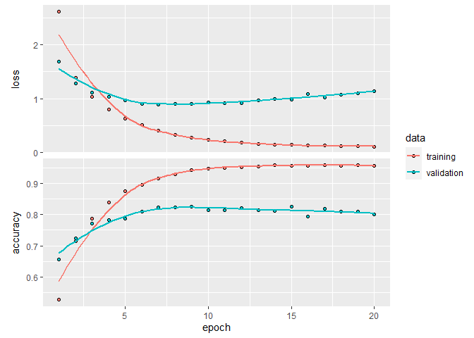
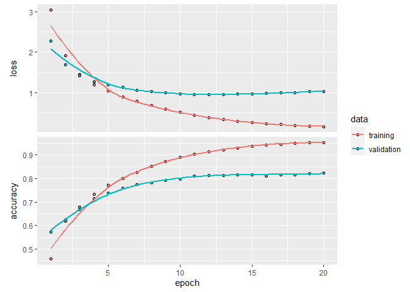
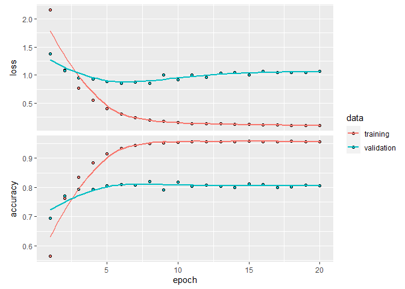
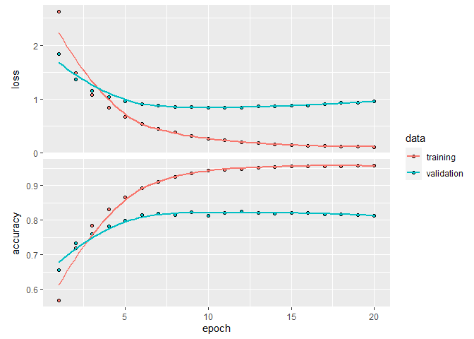
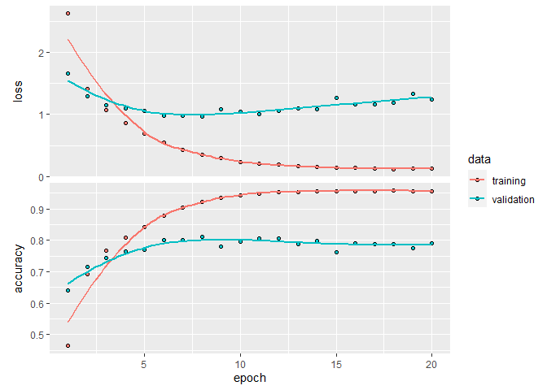
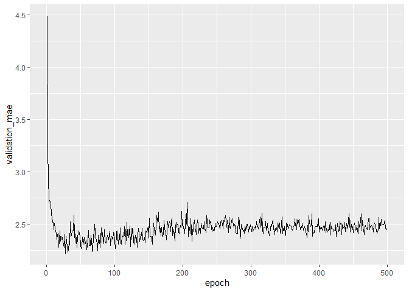
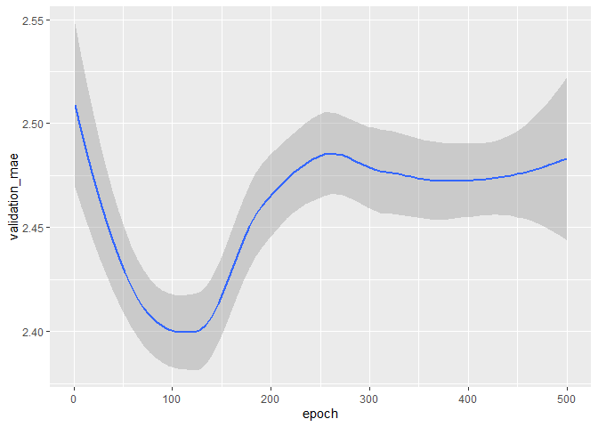

## 3.5. CLASSIFYING NEWSWIRES: A MULTICLASS CLASSIFICATION EXAMPLE

### 3.5.1. The Reuters dataset

#### Listing 3.10. Loading the Reuters dataset


```r
library(keras)

reuters <- dataset_reuters(num_words = 10000)
```

```
## Warning in normalizePath(path.expand(path), winslash, mustWork): path[1]="C:
## \Users\Min-Yao\.julia\conda\3\envs\_ORCA_jl_/python.exe": The system cannot find
## the file specified

## Warning in normalizePath(path.expand(path), winslash, mustWork): path[1]="C:
## \Users\Min-Yao\.julia\conda\3\envs\_ORCA_jl_/python.exe": The system cannot find
## the file specified
```

```r
c(c(train_data, train_labels), c(test_data, test_labels)) %<-% reuters
```


```r
length(train_data)
```

```
## [1] 8982
```


```r
length(test_data)
```

```
## [1] 2246
```


```r
train_data[[1]]
```

```
##  [1]    1    2    2    8   43   10  447    5   25  207  270    5 3095  111   16
## [16]  369  186   90   67    7   89    5   19  102    6   19  124   15   90   67
## [31]   84   22  482   26    7   48    4   49    8  864   39  209  154    6  151
## [46]    6   83   11   15   22  155   11   15    7   48    9 4579 1005  504    6
## [61]  258    6  272   11   15   22  134   44   11   15   16    8  197 1245   90
## [76]   67   52   29  209   30   32  132    6  109   15   17   12
```

#### Listing 3.11. Decoding newswires back to text


```r
word_index <- dataset_reuters_word_index()
reverse_word_index <- names(word_index)
names(reverse_word_index) <- word_index
decoded_newswire <- sapply(train_data[[1]], function(index) {
  word <- if (index >= 3) reverse_word_index[[as.character(index - 3)]]    
  if (!is.null(word)) word else "?"
})
```


```r
train_labels[[1]]
```

```
## [1] 3
```

### 3.5.2. Preparing the data

#### Listing 3.12. Encoding the data


```r
vectorize_sequences <- function(sequences, dimension = 10000) {
  results <- matrix(0, nrow = length(sequences), ncol = dimension)
  for (i in 1:length(sequences))
    results[i, sequences[[i]]] <- 1
  results
}

x_train <- vectorize_sequences(train_data)          
x_test <- vectorize_sequences(test_data)
```


```r
to_one_hot <- function(labels, dimension = 46) {
  results <- matrix(0, nrow = length(labels), ncol = dimension)
  for (i in 1:length(labels))
    results[i, labels[[i]] + 1] <- 1
  results
}

one_hot_train_labels <- to_one_hot(train_labels)
one_hot_test_labels <- to_one_hot(test_labels)
```


```r
one_hot_train_labels <- to_categorical(train_labels)
one_hot_test_labels <- to_categorical(test_labels)
```

### 3.5.3. Building your network

#### Listing 3.13. Model definition


```r
model <- keras_model_sequential() %>%
  layer_dense(units = 64, activation = "relu", input_shape = c(10000)) %>%
  layer_dense(units = 64, activation = "relu") %>%
  layer_dense(units = 46, activation = "softmax")
```

#### Listing 3.14. Compiling the model


```r
model %>% compile(
  optimizer = "rmsprop",
  loss = "categorical_crossentropy",
  metrics = c("accuracy")
)
```

### 3.5.4. Validating your approach

#### Listing 3.15. Setting aside a validation set


```r
val_indices <- 1:1000

x_val <- x_train[val_indices,]
partial_x_train <- x_train[-val_indices,]

y_val <- one_hot_train_labels[val_indices,]
partial_y_train = one_hot_train_labels[-val_indices,]
```

#### Listing 3.16. Training the model


```r
history <- model %>% fit(
  partial_x_train,
  partial_y_train,
  epochs = 20,
  batch_size = 512,
  validation_data = list(x_val, y_val)
)
```


```r
plot(history)
```

```
## `geom_smooth()` using formula 'y ~ x'
```

<!-- -->

#### Listing 3.18. Retraining a model from scratch


```r
model <- keras_model_sequential() %>%
  layer_dense(units = 64, activation = "relu", input_shape = c(10000)) %>%
  layer_dense(units = 64, activation = "relu") %>%
  layer_dense(units = 46, activation = "softmax")

model %>% compile(
  optimizer = "rmsprop",
  loss = "categorical_crossentropy",
  metrics = c("accuracy")
)

history <- model %>% fit(
  partial_x_train,
  partial_y_train,
  epochs = 9,
  batch_size = 512,
  validation_data = list(x_val, y_val)
)

results <- model %>% evaluate(x_test, one_hot_test_labels)
```


```r
results
```

```
##      loss  accuracy 
## 1.0234435 0.7760463
```


```r
test_labels_copy <- test_labels
test_labels_copy <- sample(test_labels_copy)
length(which(test_labels == test_labels_copy)) / length(test_labels)
```

```
## [1] 0.1918967
```

### 3.5.5. Generating predictions on new data

#### Listing 3.19. Generating predictions for new data


```r
predictions <- model %>% predict(x_test)
```


```r
dim(predictions)
```

```
## [1] 2246   46
```


```r
sum(predictions[1,])
```

```
## [1] 1
```


```r
which.max(predictions[1,])
```

```
## [1] 4
```

### 3.5.6. A different way to handle the labels and the loss


```r
model %>% compile(
  optimizer = "rmsprop",
  loss = "sparse_categorical_crossentropy",
  metrics = c("accuracy")
)
```

### 3.5.7. The importance of having sufficiently large intermediate layers

#### Listing 3.20. A model with an information bottleneck


```r
model <- keras_model_sequential() %>%
  layer_dense(units = 64, activation = "relu", input_shape = c(10000)) %>%
  layer_dense(units = 4, activation = "relu") %>%
  layer_dense(units = 46, activation = "softmax")

model %>% compile(
  optimizer = "rmsprop",
  loss = "categorical_crossentropy",
  metrics = c("accuracy")
)

model %>% fit(
  partial_x_train,
  partial_y_train,
  epochs = 20,
  batch_size = 128,
  validation_data = list(x_val, y_val)
)
```
### 3.5.8. Further experiments

1. Try using larger or smaller layers: 32 units, 128 units, and so on.

> smaller layers: 32 units, not better


```r
model <- keras_model_sequential() %>%
  layer_dense(units = 32, activation = "relu", input_shape = c(10000)) %>%
  layer_dense(units = 32, activation = "relu") %>%
  layer_dense(units = 46, activation = "softmax")

model %>% compile(
  optimizer = "rmsprop",
  loss = "categorical_crossentropy",
  metrics = c("accuracy")
)

val_indices <- 1:1000

x_val <- x_train[val_indices,]
partial_x_train <- x_train[-val_indices,]

y_val <- one_hot_train_labels[val_indices,]
partial_y_train = one_hot_train_labels[-val_indices,]

history <- model %>% fit(
  partial_x_train,
  partial_y_train,
  epochs = 20,
  batch_size = 512,
  validation_data = list(x_val, y_val)
)

plot(history)
```

```
## `geom_smooth()` using formula 'y ~ x'
```

<!-- -->


```r
model <- keras_model_sequential() %>%
  layer_dense(units = 32, activation = "relu", input_shape = c(10000)) %>%
  layer_dense(units = 32, activation = "relu") %>%
  layer_dense(units = 46, activation = "softmax")

model %>% compile(
  optimizer = "rmsprop",
  loss = "categorical_crossentropy",
  metrics = c("accuracy")
)

history <- model %>% fit(
  partial_x_train,
  partial_y_train,
  epochs = 9,
  batch_size = 512,
  validation_data = list(x_val, y_val)
)

results <- model %>% evaluate(x_test, one_hot_test_labels)
results
```

```
##      loss  accuracy 
## 1.0524182 0.7635797
```

> larger layers: 128 units


```r
model <- keras_model_sequential() %>%
  layer_dense(units = 128, activation = "relu", input_shape = c(10000)) %>%
  layer_dense(units = 128, activation = "relu") %>%
  layer_dense(units = 46, activation = "softmax")

model %>% compile(
  optimizer = "rmsprop",
  loss = "categorical_crossentropy",
  metrics = c("accuracy")
)

val_indices <- 1:1000

x_val <- x_train[val_indices,]
partial_x_train <- x_train[-val_indices,]

y_val <- one_hot_train_labels[val_indices,]
partial_y_train = one_hot_train_labels[-val_indices,]

history <- model %>% fit(
  partial_x_train,
  partial_y_train,
  epochs = 20,
  batch_size = 512,
  validation_data = list(x_val, y_val)
)

plot(history)
```

```
## `geom_smooth()` using formula 'y ~ x'
```

<!-- -->


```r
model <- keras_model_sequential() %>%
  layer_dense(units = 128, activation = "relu", input_shape = c(10000)) %>%
  layer_dense(units = 128, activation = "relu") %>%
  layer_dense(units = 46, activation = "softmax")

model %>% compile(
  optimizer = "rmsprop",
  loss = "categorical_crossentropy",
  metrics = c("accuracy")
)

history <- model %>% fit(
  partial_x_train,
  partial_y_train,
  epochs = 7,
  batch_size = 512,
  validation_data = list(x_val, y_val)
)

results <- model %>% evaluate(x_test, one_hot_test_labels)
results
```

```
##      loss  accuracy 
## 1.0006504 0.7845058
```

> a little bit better

2. You used two hidden layers. Now try using a single hidden layer, or three hidden layers.


```r
model <- keras_model_sequential() %>%
  layer_dense(units = 64, activation = "relu", input_shape = c(10000)) %>%
  layer_dense(units = 46, activation = "softmax")

model %>% compile(
  optimizer = "rmsprop",
  loss = "categorical_crossentropy",
  metrics = c("accuracy")
)

val_indices <- 1:1000

x_val <- x_train[val_indices,]
partial_x_train <- x_train[-val_indices,]

y_val <- one_hot_train_labels[val_indices,]
partial_y_train = one_hot_train_labels[-val_indices,]

history <- model %>% fit(
  partial_x_train,
  partial_y_train,
  epochs = 20,
  batch_size = 512,
  validation_data = list(x_val, y_val)
)

plot(history)
```

```
## `geom_smooth()` using formula 'y ~ x'
```

<!-- -->


```r
model <- keras_model_sequential() %>%
  layer_dense(units = 64, activation = "relu", input_shape = c(10000)) %>%
  layer_dense(units = 46, activation = "softmax")

model %>% compile(
  optimizer = "rmsprop",
  loss = "categorical_crossentropy",
  metrics = c("accuracy")
)

history <- model %>% fit(
  partial_x_train,
  partial_y_train,
  epochs = 8,
  batch_size = 512,
  validation_data = list(x_val, y_val)
)

results <- model %>% evaluate(x_test, one_hot_test_labels)
results
```

```
##      loss  accuracy 
## 0.9210368 0.7956367
```

> better


```r
model <- keras_model_sequential() %>%
  layer_dense(units = 64, activation = "relu", input_shape = c(10000)) %>%
  layer_dense(units = 64, activation = "relu") %>%
  layer_dense(units = 64, activation = "relu") %>%
  layer_dense(units = 46, activation = "softmax")

model %>% compile(
  optimizer = "rmsprop",
  loss = "categorical_crossentropy",
  metrics = c("accuracy")
)

val_indices <- 1:1000

x_val <- x_train[val_indices,]
partial_x_train <- x_train[-val_indices,]

y_val <- one_hot_train_labels[val_indices,]
partial_y_train = one_hot_train_labels[-val_indices,]

history <- model %>% fit(
  partial_x_train,
  partial_y_train,
  epochs = 20,
  batch_size = 512,
  validation_data = list(x_val, y_val)
)

plot(history)
```

```
## `geom_smooth()` using formula 'y ~ x'
```

<!-- -->


```r
model <- keras_model_sequential() %>%
  layer_dense(units = 64, activation = "relu", input_shape = c(10000)) %>%
  layer_dense(units = 64, activation = "relu") %>%
  layer_dense(units = 64, activation = "relu") %>%
  layer_dense(units = 46, activation = "softmax")

model %>% compile(
  optimizer = "rmsprop",
  loss = "categorical_crossentropy",
  metrics = c("accuracy")
)

history <- model %>% fit(
  partial_x_train,
  partial_y_train,
  epochs = 7,
  batch_size = 512,
  validation_data = list(x_val, y_val)
)

results <- model %>% evaluate(x_test, one_hot_test_labels)
results
```

```
##      loss  accuracy 
## 1.0393932 0.7769368
```

> not better

### 3.5.9. Wrapping up

## 3.6. PREDICTING HOUSE PRICES: A REGRESSION EXAMPLE

Don’t confuse regression with the algorithm logistic regression. Confusingly, logistic regression isn’t a regression algorithm—it’s a classification algorithm.

### 3.6.1. The Boston Housing Price dataset

#### Listing 3.21. Loading the Boston housing dataset


```r
library(keras)

dataset <- dataset_boston_housing()
c(c(train_data, train_targets), c(test_data, test_targets)) %<-% dataset
```


```r
str(train_data)
```

```
##  num [1:404, 1:13] 1.2325 0.0218 4.8982 0.0396 3.6931 ...
```


```r
str(test_data)
```

```
##  num [1:102, 1:13] 18.0846 0.1233 0.055 1.2735 0.0715 ...
```


```r
str(train_targets)
```

```
##  num [1:404(1d)] 15.2 42.3 50 21.1 17.7 18.5 11.3 15.6 15.6 14.4 ...
```

### 3.6.2. Preparing the data

#### Listing 3.22. Normalizing the data


```r
mean <- apply(train_data, 2, mean)                
std <- apply(train_data, 2, sd)
train_data <- scale(train_data, center = mean, scale = std)
test_data <- scale(test_data, center = mean, scale = std)
```

### 3.6.3. Building your network

#### Listing 3.23. Model definition


```r
build_model <- function() {                               
  model <- keras_model_sequential() %>%
    layer_dense(units = 64, activation = "relu",
                input_shape = dim(train_data)[[2]]) %>%
    layer_dense(units = 64, activation = "relu") %>%
    layer_dense(units = 1)
  model %>% compile(
    optimizer = "rmsprop",
    loss = "mse",
    metrics = c("mae")
  )
}
```

### 3.6.4. Validating your approach using K-fold validation

#### Figure 3.9. 3-fold cross-validation

#### Listing 3.24. K-fold validation


```r
k <- 4
indices <- sample(1:nrow(train_data))
folds <- cut(indices, breaks = k, labels = FALSE)

num_epochs <- 100
all_scores <- c()
for (i in 1:k) {
  cat("processing fold #", i, "\n")

  val_indices <- which(folds == i, arr.ind = TRUE)                     #1 Prepares the validation data: data from partition #k
  val_data <- train_data[val_indices,]
  val_targets <- train_targets[val_indices]
  partial_train_data <- train_data[-val_indices,]                      #2 Prepares the training data: data from all other partitions
  partial_train_targets <- train_targets[-val_indices]

  model <- build_model()                                               #3 Builds the Keras model (already compiled)

  model %>% fit(partial_train_data, partial_train_targets,             
                epochs = num_epochs, batch_size = 1, verbose = 0)      #4 Trains the model (in silent mode, verbose = 0)

  results <- model %>% evaluate(val_data, val_targets, verbose = 0)    #5 Evaluates the model on the validation data
  
  all_scores <- c(all_scores, results["mae"])
}
```

```
## processing fold # 1 
## processing fold # 2 
## processing fold # 3 
## processing fold # 4
```

```r
head(results)
```

```
##      loss       mae 
## 10.531848  2.336562
```


```r
all_scores
```

```
##      mae      mae      mae      mae 
## 2.636745 2.050135 2.610283 2.336562
```


```r
mean(all_scores)
```

```
## [1] 2.408431
```

#### Listing 3.25. Saving the validation logs at each fold


```r
num_epochs <- 500
all_mae_histories <- NULL
for (i in 1:k) {
  cat("processing fold #", i, "\n")

  val_indices <- which(folds == i, arr.ind = TRUE)              #1 Prepares the validation data: data from partition #k
  val_data <- train_data[val_indices,]
  val_targets <- train_targets[val_indices]

  partial_train_data <- train_data[-val_indices,]               #2 Prepares the training data: data from all other partitions
  
  partial_train_targets <- train_targets[-val_indices]

  model <- build_model()                                        #3 Builds the Keras model (already compiled)

  print(
    system.time( #329.849  36.252 278.699 
      history <- model %>% fit(                                    
        partial_train_data, partial_train_targets,
        validation_data = list(val_data, val_targets),
        epochs = num_epochs, batch_size = 1, verbose = 0
      )
    )
  )                                                            #4 Trains the model (in silent mode, verbose=0)
  
  mae_history <- history$metrics$val_mae
  all_mae_histories <- rbind(all_mae_histories, mae_history)
}
```

```
## processing fold # 1 
##    user  system elapsed 
##  545.85   13.64  413.19 
## processing fold # 2 
##    user  system elapsed 
##  564.84   14.11  442.76 
## processing fold # 3 
##    user  system elapsed 
##  575.61   14.16  446.69 
## processing fold # 4 
##    user  system elapsed 
##  579.87   14.48  453.90
```

#### Listing 3.26. Building the history of successive mean K-fold validation scores


```r
average_mae_history <- data.frame(
  epoch = seq(1:ncol(all_mae_histories)),
  validation_mae = apply(all_mae_histories, 2, mean)
)
```


```r
library(ggplot2)
ggplot(average_mae_history, aes(x = epoch, y = validation_mae)) + geom_line()
```

<!-- -->

#### Listing 3.28. Plotting validation scores with geom_smooth()


```r
ggplot(average_mae_history, aes(x = epoch, y = validation_mae)) + geom_smooth()
```

```
## `geom_smooth()` using method = 'loess' and formula 'y ~ x'
```

<!-- -->

#### Listing 3.29. Training the final model


```r
model <- build_model()
model %>% fit(train_data, train_targets,                  
          epochs = 80, batch_size = 16, verbose = 0)
result <- model %>% evaluate(test_data, test_targets)
```


```r
result
```

```
##      loss       mae 
## 17.603874  2.561553
```

### 3.6.5. Wrapping up

## 3.7. SUMMARY

