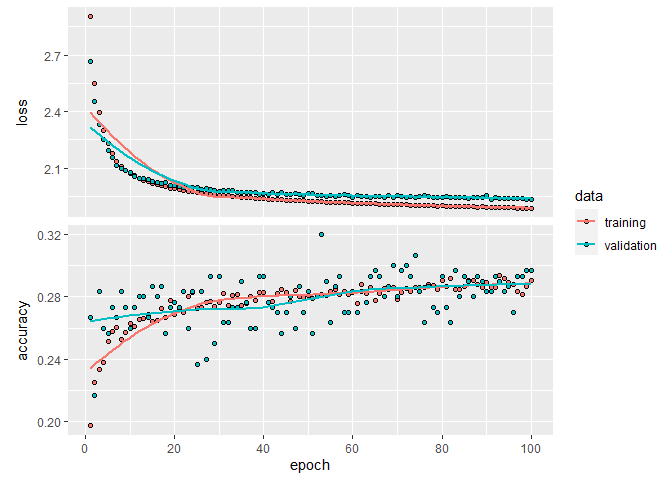

```r
library(keras)
library(reticulate)
library(tensorflow)
library(tidyverse)
```

```
## -- Attaching packages --------------------------------------- tidyverse 1.3.0 --
```

```
## v ggplot2 3.3.3     v purrr   0.3.4
## v tibble  3.0.5     v dplyr   1.0.3
## v tidyr   1.1.2     v stringr 1.4.0
## v readr   1.4.0     v forcats 0.5.0
```

```
## -- Conflicts ------------------------------------------ tidyverse_conflicts() --
## x dplyr::filter() masks stats::filter()
## x dplyr::lag()    masks stats::lag()
```

```r
library(janitor)
```

```
## 
## Attaching package: 'janitor'
```

```
## The following objects are masked from 'package:stats':
## 
##     chisq.test, fisher.test
```

```r
use_condaenv("r-reticulate")
```

### load data


```r
abalone <- readr::read_csv("C:/Users/sandy/rclub/Deep_learning_data/Abalone/abalone.data.csv",col_names = c("sex","length","diameter","height","wholeweight","shockedweight","visceraweight","shellweight","rings"))
```

```
## 
## -- Column specification --------------------------------------------------------
## cols(
##   sex = col_character(),
##   length = col_double(),
##   diameter = col_double(),
##   height = col_double(),
##   wholeweight = col_double(),
##   shockedweight = col_double(),
##   visceraweight = col_double(),
##   shellweight = col_double(),
##   rings = col_double()
## )
```

```r
dim(abalone)
```

```
## [1] 4177    9
```

```r
head(abalone)
```

```
## # A tibble: 6 x 9
##   sex   length diameter height wholeweight shockedweight visceraweight
##   <chr>  <dbl>    <dbl>  <dbl>       <dbl>         <dbl>         <dbl>
## 1 M      0.455    0.365  0.095       0.514        0.224         0.101 
## 2 M      0.35     0.265  0.09        0.226        0.0995        0.0485
## 3 F      0.53     0.42   0.135       0.677        0.256         0.142 
## 4 M      0.44     0.365  0.125       0.516        0.216         0.114 
## 5 I      0.33     0.255  0.08        0.205        0.0895        0.0395
## 6 I      0.425    0.3    0.095       0.352        0.141         0.0775
## # ... with 2 more variables: shellweight <dbl>, rings <dbl>
```

```r
str(abalone)
```

```
## tibble [4,177 x 9] (S3: spec_tbl_df/tbl_df/tbl/data.frame)
##  $ sex          : chr [1:4177] "M" "M" "F" "M" ...
##  $ length       : num [1:4177] 0.455 0.35 0.53 0.44 0.33 0.425 0.53 0.545 0.475 0.55 ...
##  $ diameter     : num [1:4177] 0.365 0.265 0.42 0.365 0.255 0.3 0.415 0.425 0.37 0.44 ...
##  $ height       : num [1:4177] 0.095 0.09 0.135 0.125 0.08 0.095 0.15 0.125 0.125 0.15 ...
##  $ wholeweight  : num [1:4177] 0.514 0.226 0.677 0.516 0.205 ...
##  $ shockedweight: num [1:4177] 0.2245 0.0995 0.2565 0.2155 0.0895 ...
##  $ visceraweight: num [1:4177] 0.101 0.0485 0.1415 0.114 0.0395 ...
##  $ shellweight  : num [1:4177] 0.15 0.07 0.21 0.155 0.055 0.12 0.33 0.26 0.165 0.32 ...
##  $ rings        : num [1:4177] 15 7 9 10 7 8 20 16 9 19 ...
##  - attr(*, "spec")=
##   .. cols(
##   ..   sex = col_character(),
##   ..   length = col_double(),
##   ..   diameter = col_double(),
##   ..   height = col_double(),
##   ..   wholeweight = col_double(),
##   ..   shockedweight = col_double(),
##   ..   visceraweight = col_double(),
##   ..   shellweight = col_double(),
##   ..   rings = col_double()
##   .. )
```

### prepare data and label


```r
library(ggplot2)
abalone$rings %>% 
  plyr::count() %>%
  ggplot(aes(x, freq)) +
  geom_col()
```

<!-- -->


```r
abalone_label <- abalone %>% pull(rings)
abalone_label <- as.integer(as.factor(abalone_label)) -1
str(abalone_label)
```

```
##  num [1:4177] 14 6 8 9 6 7 19 15 8 18 ...
```

```r
table(abalone_label)
```

```
## abalone_label
##   0   1   2   3   4   5   6   7   8   9  10  11  12  13  14  15  16  17  18  19 
##   1   1  15  57 115 259 391 568 689 634 487 267 203 126 103  67  58  42  32  26 
##  20  21  22  23  24  25  26  27 
##  14   6   9   2   1   1   2   1
```

```r
abalone_data <- abalone %>% mutate(sex=as.integer(as.factor(sex))) %>% 
  select(-c(rings,sex))

set.seed(2)
train <- 1:3133
val <- sample(train,size = 300)

abalone_data_train <- abalone_data[train,]
abalone_data_test <- abalone_data[-train,]
```

#### scale


```r
abalone_mean <- apply(abalone_data_train, 2, mean)
abalone_std <- apply(abalone_data_train, 2, sd)

abalone.train <- scale(abalone_data_train, center = abalone_mean, scale = abalone_std)
abalone.test <- scale(abalone_data_test, center = abalone_mean, scale = abalone_std)

str(abalone.train)
```

```
##  num [1:3133, 1:7] -0.5594 -1.4279 0.0609 -0.6835 -1.5933 ...
##  - attr(*, "dimnames")=List of 2
##   ..$ : NULL
##   ..$ : chr [1:7] "length" "diameter" "height" "wholeweight" ...
##  - attr(*, "scaled:center")= Named num [1:7] 0.523 0.407 0.139 0.825 0.358 ...
##   ..- attr(*, "names")= chr [1:7] "length" "diameter" "height" "wholeweight" ...
##  - attr(*, "scaled:scale")= Named num [1:7] 0.1209 0.1 0.0431 0.4936 0.2242 ...
##   ..- attr(*, "names")= chr [1:7] "length" "diameter" "height" "wholeweight" ...
```

```r
str(abalone.test)
```

```
##  num [1:1044, 1:7] -0.311 -0.518 -0.518 0.102 -0.477 ...
##  - attr(*, "dimnames")=List of 2
##   ..$ : NULL
##   ..$ : chr [1:7] "length" "diameter" "height" "wholeweight" ...
##  - attr(*, "scaled:center")= Named num [1:7] 0.523 0.407 0.139 0.825 0.358 ...
##   ..- attr(*, "names")= chr [1:7] "length" "diameter" "height" "wholeweight" ...
##  - attr(*, "scaled:scale")= Named num [1:7] 0.1209 0.1 0.0431 0.4936 0.2242 ...
##   ..- attr(*, "names")= chr [1:7] "length" "diameter" "height" "wholeweight" ...
```

#### Setting aside a validation set


```r
abalone_data_val <- abalone.train[val,]
abalone_data_part <- abalone.train[-val,]

abalone_label_train <- abalone_label[train]
abalone_label_test <- abalone_label[-train]
abalone_label_val <- abalone_label_train[val]
abalone_label_part <- abalone_label_train[-val]
```


```r
str(abalone_label_train)
```

```
##  num [1:3133] 14 6 8 9 6 7 19 15 8 18 ...
```

```r
table(abalone_label_train)
```

```
## abalone_label_train
##   0   1   2   3   4   5   6   7   8   9  10  11  12  13  14  15  16  17  18  19 
##   1   1  12  43  91 190 310 428 522 475 347 200 144  93  77  45  47  30  24  21 
##  20  21  22  24  25  26  27 
##  12   6   9   1   1   2   1
```

```r
abalone_label_train %>% 
  plyr::count() %>%
  ggplot(aes(x, freq)) +
  geom_col()
```

<!-- -->

## try different hyperparamaters


```r
define_model <- function(nlayers, powerto) {
  
  # input layer
  network <- keras_model_sequential() %>% 
    layer_dense(units = 2^powerto, activation = "relu", input_shape = ncol(abalone.train) ) 
  
  # additional layers
  if (nlayers>1) {
  map(2:nlayers, ~ network %>% 
        layer_dense(units = 2^powerto, activation = "relu")
  )
  }
  
  # output layer
  network %>% 
    layer_dense(units = 28, activation = "softmax")
  
  # compile it
  network %>% compile(
    optimizer = "rmsprop",
    loss = "sparse_categorical_crossentropy",
    metrics = c("accuracy")
  )
  
}
```


```r
run_model <- function(network, epochs = 20) {
  network %>% fit(
    abalone_data_part,
    abalone_label_part,
    epochs = epochs,
    batch_size = 64,
    verbose = 0,
    validation_data = list(abalone_data_val, abalone_label_val)
  )
}
```


```r
str(abalone_data_part)
```

```
##  num [1:2833, 1:7] -0.5594 -1.4279 0.0609 -0.6835 -1.5933 ...
##  - attr(*, "dimnames")=List of 2
##   ..$ : NULL
##   ..$ : chr [1:7] "length" "diameter" "height" "wholeweight" ...
```

```r
str(abalone_label_part)
```

```
##  num [1:2833] 14 6 8 9 6 7 19 8 18 13 ...
```

```r
str(abalone_data_val)
```

```
##  num [1:300, 1:7] 0.0609 -1.8828 -1.097 0.8054 -0.394 ...
##  - attr(*, "dimnames")=List of 2
##   ..$ : NULL
##   ..$ : chr [1:7] "length" "diameter" "height" "wholeweight" ...
```

```r
str(abalone_label_val)
```

```
##  num [1:300] 7 6 6 14 9 13 11 8 10 10 ...
```

> 1 layer, units = 64


```r
define_model(1,6) %>%
  run_model(100) -> history_1_6

history_1_6 %>%
  plot()
```

```
## `geom_smooth()` using formula 'y ~ x'
```

<!-- -->

> 2 layer, units = 64


```r
define_model(2,6) %>%
  run_model(200) -> history_2_6

history_2_6 %>%
  plot()
```

```
## `geom_smooth()` using formula 'y ~ x'
```

<!-- -->

> 3 layer, units = 64


```r
define_model(3,6) %>%
  run_model(100) -> history_3_6

history_3_6 %>%
  plot()
```

```
## `geom_smooth()` using formula 'y ~ x'
```

<!-- -->

> 2 layer, units = 128


```r
define_model(2,7) %>%
  run_model(100) -> history_2_7

history_2_7 %>%
  plot()
```

```
## `geom_smooth()` using formula 'y ~ x'
```

<!-- -->

> 2 layer, units = 32


```r
define_model(2,5) %>%
  run_model(200) -> history_2_5

history_2_5 %>%
  plot()
```

```
## `geom_smooth()` using formula 'y ~ x'
```

<!-- -->
## run the model

### I decided to choose units = 64 & 2 layers to run the model.


```r
model <- keras_model_sequential() %>% 
  layer_dense(units = 64, activation = "relu", input_shape = ncol(abalone.train) ) %>% 
  layer_dense(units = 64, activation = "relu") %>% 
  layer_dense(units = 28, activation = "softmax")


model %>% compile(
  optimizer = "rmsprop",
  loss = "sparse_categorical_crossentropy",
  metrics = c("accuracy")
)

system.time(history <- model %>% fit(
  abalone_data_part,
  abalone_label_part,
  epochs = 50,
  batch_size = 64,
  validation_data = list(abalone_data_val, abalone_label_val)
))
```

```
##    user  system elapsed 
##    8.23    0.41    5.66
```

### View a summary of the model


```r
summary(model)
```

```
## Model: "sequential_5"
## ________________________________________________________________________________
## Layer (type)                        Output Shape                    Param #     
## ================================================================================
## dense_17 (Dense)                    (None, 64)                      512         
## ________________________________________________________________________________
## dense_16 (Dense)                    (None, 64)                      4160        
## ________________________________________________________________________________
## dense_15 (Dense)                    (None, 28)                      1820        
## ================================================================================
## Total params: 6,492
## Trainable params: 6,492
## Non-trainable params: 0
## ________________________________________________________________________________
```


```r
str(history)
```

```
## List of 2
##  $ params :List of 3
##   ..$ verbose: int 1
##   ..$ epochs : int 50
##   ..$ steps  : int 45
##  $ metrics:List of 4
##   ..$ loss        : num [1:50] 2.88 2.42 2.25 2.16 2.11 ...
##   ..$ accuracy    : num [1:50] 0.19 0.227 0.23 0.256 0.257 ...
##   ..$ val_loss    : num [1:50] 2.55 2.29 2.17 2.11 2.07 ...
##   ..$ val_accuracy: num [1:50] 0.273 0.267 0.263 0.263 0.27 ...
##  - attr(*, "class")= chr "keras_training_history"
```


```r
plot(history)
```

```
## `geom_smooth()` using formula 'y ~ x'
```

<!-- -->

```r
model <- keras_model_sequential() %>% 
  layer_dense(units = 64, activation = "relu", input_shape = ncol(abalone.train) ) %>% 
  layer_dense(units = 64, activation = "relu") %>% 
  layer_dense(units = 28, activation = "softmax")


model %>% compile(
  optimizer = "rmsprop",
  loss = "sparse_categorical_crossentropy",
  metrics = c("accuracy")
)

system.time(history <- model %>% fit(
  abalone.train,
  abalone_label_train,
  epochs = 50,
  batch_size = 64
))
```

```
##    user  system elapsed 
##    7.34    0.22    4.11
```


```r
plot(history)
```

```
## `geom_smooth()` using formula 'y ~ x'
```

<!-- -->


```r
results <- model %>% evaluate(abalone.test, abalone_label_test)

results
```

```
##      loss  accuracy 
## 1.9615839 0.2749042
```


