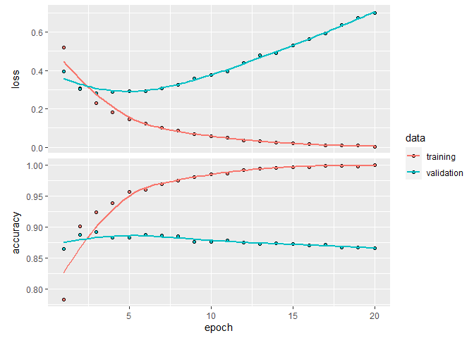
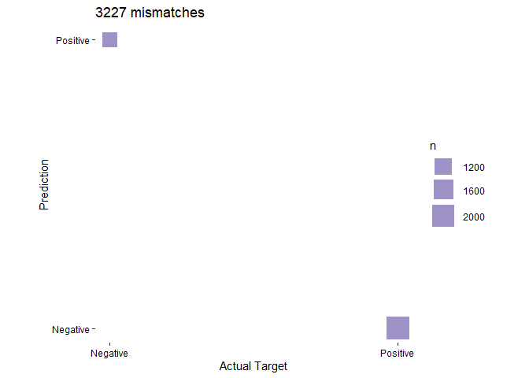

In this case study, we'll see another classification problem. Here, we're trying to predict one of two classes, i.e. binary. The set up is just like in the Reuters case study, but we have some changes to the netwrok architecture. Two new functions are used: the final activation function, `sigmoid`, and a new loss function, `binary_crossentropy`.

## Install tensorflow 

It's only necessary to run this once. 


```r
# for GPU
# install_keras(tensorflow = "gpu")

# or CPU:
# install_keras() # for cpu
```

# Part 1: Data Preparation

## Obtain data


```r
c(c(train_data, train_labels), c(test_data, test_labels)) %<-% dataset_imdb(num_words = 10000)
```

## Examine data:


```r
length(train_data)
```

```
## [1] 25000
```

```r
length(test_data)
```

```
## [1] 25000
```

An example of the data


```r
train_data[[1]]
```

```
##   [1]    1   14   22   16   43  530  973 1622 1385   65  458 4468   66 3941    4
##  [16]  173   36  256    5   25  100   43  838  112   50  670    2    9   35  480
##  [31]  284    5  150    4  172  112  167    2  336  385   39    4  172 4536 1111
##  [46]   17  546   38   13  447    4  192   50   16    6  147 2025   19   14   22
##  [61]    4 1920 4613  469    4   22   71   87   12   16   43  530   38   76   15
##  [76]   13 1247    4   22   17  515   17   12   16  626   18    2    5   62  386
##  [91]   12    8  316    8  106    5    4 2223 5244   16  480   66 3785   33    4
## [106]  130   12   16   38  619    5   25  124   51   36  135   48   25 1415   33
## [121]    6   22   12  215   28   77   52    5   14  407   16   82    2    8    4
## [136]  107  117 5952   15  256    4    2    7 3766    5  723   36   71   43  530
## [151]  476   26  400  317   46    7    4    2 1029   13  104   88    4  381   15
## [166]  297   98   32 2071   56   26  141    6  194 7486   18    4  226   22   21
## [181]  134  476   26  480    5  144   30 5535   18   51   36   28  224   92   25
## [196]  104    4  226   65   16   38 1334   88   12   16  283    5   16 4472  113
## [211]  103   32   15   16 5345   19  178   32
```

Map values back onto the lexicon which is stored as a named list. Each item in the list is an integer vector of length one. This number corresponds to the position in the word count list and the name of the vector is the actual word. 


```r
dataset_imdb_word_index() %>% 
  unlist() %>%                      # produce a vector
  sort() %>%                        # put them in order 
  names() -> word_index             # take the ordered names

# The indices are offset by 3 since 0, 1, and 2 are reserved 
# for "padding", "start of sequence", and "unknown"
library(purrr)
train_data[[1]] %>% 
  map(~ ifelse(.x >= 3, word_index[.x - 3], "?")) %>% 
  as_vector() %>% 
  cat()
```

```
## ? this film was just brilliant casting location scenery story direction everyone's really suited the part they played and you could just imagine being there robert ? is an amazing actor and now the same being director ? father came from the same scottish island as myself so i loved the fact there was a real connection with this film the witty remarks throughout the film were great it was just brilliant so much that i bought the film as soon as it was released for ? and would recommend it to everyone to watch and the fly fishing was amazing really cried at the end it was so sad and you know what they say if you cry at a film it must have been good and this definitely was also ? to the two little boy's that played the ? of norman and paul they were just brilliant children are often left out of the ? list i think because the stars that play them all grown up are such a big profile for the whole film but these children are amazing and should be praised for what they have done don't you think the whole story was so lovely because it was true and was someone's life after all that was shared with us all
```

## Prepare the data:

This process is *exactly* the same that we saw with the Reuter's newswire data set. We'll again use one-hot encoding.


```r
vectorize_sequences <- function(sequences, dimension = 10000) {
  # Create a matrix of 0s
  results <- matrix(0, nrow = length(sequences), ncol = dimension)

  # Populate the matrix with 1s
  for (i in 1:length(sequences))
    results[i, sequences[[i]]] <- 1
  results
}

train_data_vec <- vectorize_sequences(train_data)
test_data_vec <- vectorize_sequences(test_data)
```

Let's look at the first example from the training set. Recall that these are the index positions of the words 


```r
train_example <- sort(unique(train_data[[1]]))
train_example
```

```
##   [1]    1    2    4    5    6    7    8    9   12   13   14   15   16   17   18
##  [16]   19   21   22   25   26   28   30   32   33   35   36   38   39   43   46
##  [31]   48   50   51   52   56   62   65   66   71   76   77   82   87   88   92
##  [46]   98  100  103  104  106  107  112  113  117  124  130  134  135  141  144
##  [61]  147  150  167  172  173  178  192  194  215  224  226  256  283  284  297
##  [76]  316  317  336  381  385  386  400  407  447  458  469  476  480  515  530
##  [91]  546  619  626  670  723  838  973 1029 1111 1247 1334 1385 1415 1622 1920
## [106] 2025 2071 2223 3766 3785 3941 4468 4472 4536 4613 5244 5345 5535 5952 7486
```

Now we have a large matrix, where each row is 10000 elements long. Wherever we have a value in the above data set, the matrix has a 1


```r
# Just the first 100 values in the first entry (row)
train_data_vec[1,1:100]
```

```
##   [1] 1 1 0 1 1 1 1 1 1 0 0 1 1 1 1 1 1 1 1 0 1 1 0 0 1 1 0 1 0 1 0 1 1 0 1 1 0
##  [38] 1 1 0 0 0 1 0 0 1 0 1 0 1 1 1 0 0 0 1 0 0 0 0 0 1 0 0 1 1 0 0 0 0 1 0 0 0
##  [75] 0 1 1 0 0 0 0 1 0 0 0 0 1 1 0 0 0 1 0 0 0 0 0 1 0 1
```

We can confirm this by counting the values:


```r
sum(train_data_vec[1,]) == length(train_example)
```

```
## [1] TRUE
```

The position of the 1s corresponds to the indices above:


```r
which(as.logical(train_data_vec[1,]))
```

```
##   [1]    1    2    4    5    6    7    8    9   12   13   14   15   16   17   18
##  [16]   19   21   22   25   26   28   30   32   33   35   36   38   39   43   46
##  [31]   48   50   51   52   56   62   65   66   71   76   77   82   87   88   92
##  [46]   98  100  103  104  106  107  112  113  117  124  130  134  135  141  144
##  [61]  147  150  167  172  173  178  192  194  215  224  226  256  283  284  297
##  [76]  316  317  336  381  385  386  400  407  447  458  469  476  480  515  530
##  [91]  546  619  626  670  723  838  973 1029 1111 1247 1334 1385 1415 1622 1920
## [106] 2025 2071 2223 3766 3785 3941 4468 4472 4536 4613 5244 5345 5535 5952 7486
```

## Prepare labels:

The `_labels` objects contain the review labels. Each review can only have one *label* (i.e. "sigle-label"), from a total of 2 possible *classes* (i.e. "binary"). `0` == `"negative"`, `1` == `"positive"`.


```r
str(train_labels)
```

```
##  int [1:25000] 1 0 0 1 0 0 1 0 1 0 ...
```

There are only two possible classes: 0, 1


```r
sort(unique(train_labels))
```

```
## [1] 0 1
```

And there is a 50:50 split


```r
table(train_labels)
```

```
## train_labels
##     0     1 
## 12500 12500
```

In contrast to our previous case studies, the labels of a binary classification will just be one value, 0 or 1, so we will just make the integer vector numeric.


```r
train_labels <- as.numeric(train_labels)
test_labels <- as.numeric(test_labels)
```


```r
str(train_labels)
```

```
##  num [1:25000] 1 0 0 1 0 0 1 0 1 0 ...
```

```r
str(test_labels)
```

```
##  num [1:25000] 0 1 1 0 1 1 1 0 0 1 ...
```

You can probably already recognize that we're not going to end our network with softmax, since that requires a probability distribution.

# Part 2: Define Network

## Define the network

Here we specify the final activation function. We're going to use the sigmoid activation function, which will return a single value. That matches the format of our labels.


```r
network <- keras_model_sequential() %>% 
  layer_dense(units = 16, activation = "relu", input_shape = c(10000)) %>% 
  layer_dense(units = 16, activation = "relu") %>% 
  layer_dense(units = 1, activation = "sigmoid")
```

## View a summary of the network


```r
summary(network)
```

```
## Model: "sequential"
## ________________________________________________________________________________
## Layer (type)                        Output Shape                    Param #     
## ================================================================================
## dense_2 (Dense)                     (None, 16)                      160016      
## ________________________________________________________________________________
## dense_1 (Dense)                     (None, 16)                      272         
## ________________________________________________________________________________
## dense (Dense)                       (None, 1)                       17          
## ================================================================================
## Total params: 160,305
## Trainable params: 160,305
## Non-trainable params: 0
## ________________________________________________________________________________
```

## Compile

Instead of `categorical_crossentropy` we're going to use `binary_crossentropy` since we only have two possible classes.


```r
network %>% compile(
  optimizer = "rmsprop",
  loss = "binary_crossentropy",
  metrics = c("accuracy")
)
```

# Part 3: Validate our approach

Let's set apart 10,000 samples in our training data to use as a validation set:


```r
index <- 1:10000

val_data_vec <- train_data_vec[index,]
train_data_vec <- train_data_vec[-index,]

val_labels <- train_labels[index]
train_labels = train_labels[-index]
```

Now let's train our network for 20 epochs:


```r
history <- network %>% fit(
  train_data_vec,
  train_labels,
  epochs = 20,
  batch_size = 512,
  validation_data = list(val_data_vec, val_labels)
)
```

Let's display its loss and accuracy curves:


```r
plot(history)
```

```
## `geom_smooth()` using formula 'y ~ x'
```

<!-- -->

The network begins to overfit after four epochs. Let's train a new network from scratch for four epochs and then evaluate it on the test set.


```r
network <- keras_model_sequential() %>% 
  layer_dense(units = 16, activation = "relu", input_shape = c(10000)) %>% 
  layer_dense(units = 16, activation = "relu") %>% 
  layer_dense(units = 1, activation = "sigmoid")
  
network %>% compile(
  optimizer = "rmsprop",
  loss = "binary_crossentropy",
  metrics = c("accuracy")
)

history <- network %>% fit(
  train_data_vec,
  train_labels,
  epochs = 4,
  batch_size = 512,
  validation_data = list(val_data_vec, val_labels)
)
```

# Part 4: Check output

## Metrics


```r
metrics <- network %>% evaluate(test_data_vec, test_labels)
```


```r
metrics
```

```
##      loss  accuracy 
## 0.3190214 0.8709200
```

```r
metrics["accuracy"]
```

```
## accuracy 
##  0.87092
```

```r
# Error rate: incorrect calling
1 - metrics["accuracy"]
```

```
## accuracy 
##  0.12908
```

## Predictions


```r
network %>% predict_classes(test_data_vec[1:10,])
```

```
##       [,1]
##  [1,]    0
##  [2,]    1
##  [3,]    1
##  [4,]    1
##  [5,]    1
##  [6,]    1
##  [7,]    1
##  [8,]    0
##  [9,]    1
## [10,]    1
```


```r
predictions <- network %>% predict_classes(test_data_vec)
actual <- unlist(test_labels)
totalmisses <- sum(predictions != actual)
totalmisses
```

```
## [1] 3227
```

A total of 3227 mismatches occured.

# Confusion Matrix

<!-- -->

# Session Info


```r
sessionInfo()
```

```
## R version 4.0.3 (2020-10-10)
## Platform: x86_64-w64-mingw32/x64 (64-bit)
## Running under: Windows 10 x64 (build 18363)
## 
## Matrix products: default
## 
## locale:
## [1] LC_COLLATE=English_United States.1252 
## [2] LC_CTYPE=English_United States.1252   
## [3] LC_MONETARY=English_United States.1252
## [4] LC_NUMERIC=C                          
## [5] LC_TIME=English_United States.1252    
## 
## attached base packages:
## [1] stats     graphics  grDevices utils     datasets  methods   base     
## 
## other attached packages:
##  [1] forcats_0.5.0   stringr_1.4.0   dplyr_1.0.2     purrr_0.3.4    
##  [5] readr_1.4.0     tidyr_1.1.2     tibble_3.0.4    ggplot2_3.3.3  
##  [9] tidyverse_1.3.0 keras_2.3.0.0  
## 
## loaded via a namespace (and not attached):
##  [1] Rcpp_1.0.6        lubridate_1.7.9.2 lattice_0.20-41   assertthat_0.2.1 
##  [5] zeallot_0.1.0     digest_0.6.27     R6_2.5.0          cellranger_1.1.0 
##  [9] backports_1.2.0   reprex_0.3.0      evaluate_0.14     httr_1.4.2       
## [13] pillar_1.4.7      tfruns_1.4        rlang_0.4.10      readxl_1.3.1     
## [17] rstudioapi_0.13   whisker_0.4       Matrix_1.2-18     reticulate_1.18  
## [21] rmarkdown_2.6     labeling_0.4.2    splines_4.0.3     munsell_0.5.0    
## [25] broom_0.7.3       compiler_4.0.3    modelr_0.1.8      xfun_0.20        
## [29] pkgconfig_2.0.3   base64enc_0.1-3   mgcv_1.8-33       tensorflow_2.2.0 
## [33] htmltools_0.5.0   tidyselect_1.1.0  fansi_0.4.1       crayon_1.3.4     
## [37] dbplyr_2.0.0      withr_2.4.0       rappdirs_0.3.1    grid_4.0.3       
## [41] nlme_3.1-149      jsonlite_1.7.2    gtable_0.3.0      lifecycle_0.2.0  
## [45] DBI_1.1.1         magrittr_2.0.1    scales_1.1.1      cli_2.2.0        
## [49] stringi_1.5.3     farver_2.0.3      fs_1.5.0          xml2_1.3.2       
## [53] ellipsis_0.3.1    generics_0.1.0    vctrs_0.3.6       tools_4.0.3      
## [57] glue_1.4.2        hms_1.0.0         yaml_2.2.1        colorspace_2.0-0 
## [61] rvest_0.3.6       knitr_1.30        haven_2.3.1
```

