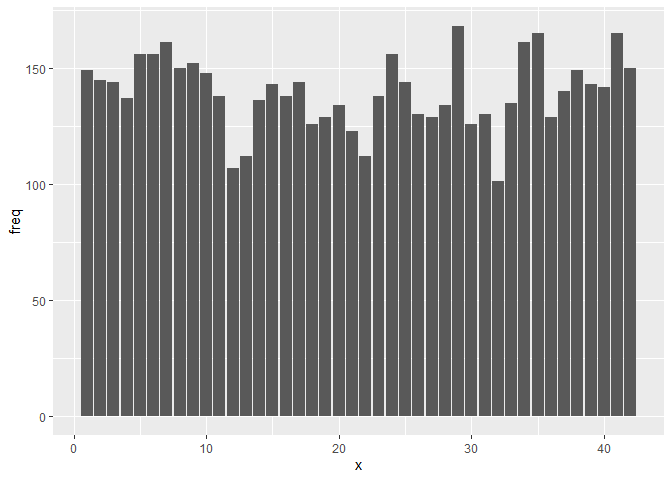
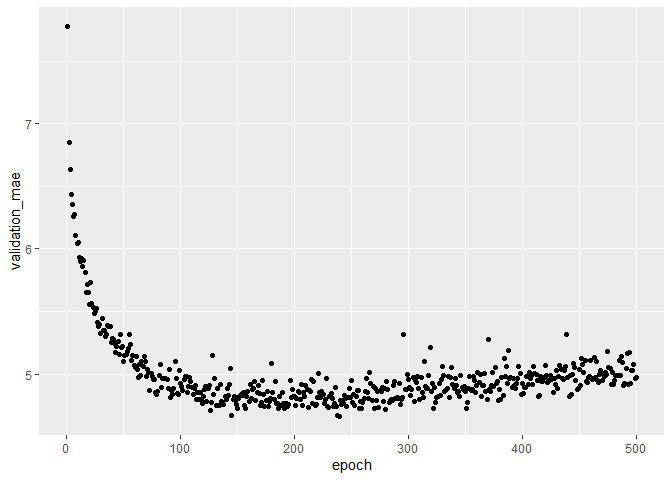
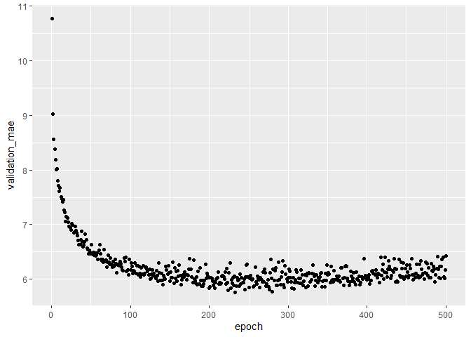
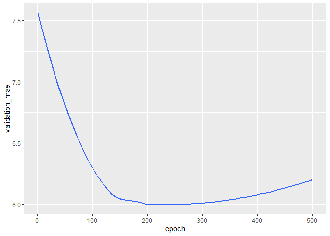

```r
library(keras)
library(reticulate)
library(tensorflow)
library(tidyverse)
```

```
## -- Attaching packages --------------------------------------- tidyverse 1.3.0 --
```

```
## v ggplot2 3.3.3     v purrr   0.3.4
## v tibble  3.0.5     v dplyr   1.0.3
## v tidyr   1.1.2     v stringr 1.4.0
## v readr   1.4.0     v forcats 0.5.0
```

```
## -- Conflicts ------------------------------------------ tidyverse_conflicts() --
## x dplyr::filter() masks stats::filter()
## x dplyr::lag()    masks stats::lag()
```

```r
library(janitor)
```

```
## 
## Attaching package: 'janitor'
```

```
## The following objects are masked from 'package:stats':
## 
##     chisq.test, fisher.test
```

```r
use_condaenv("r-reticulate")
```

### load data


```r
parkinsons <- readr::read_csv("C:/Users/sandy/rclub/Deep_learning_data/Parkinsons/parkinsons_updrs.data.csv")
```

```
## 
## -- Column specification --------------------------------------------------------
## cols(
##   .default = col_double()
## )
## i Use `spec()` for the full column specifications.
```

```r
dim(parkinsons)
```

```
## [1] 5875   22
```

```r
head(parkinsons)
```

```
## # A tibble: 6 x 22
##   `subject#`   age   sex test_time motor_UPDRS total_UPDRS `Jitter(%)`
##        <dbl> <dbl> <dbl>     <dbl>       <dbl>       <dbl>       <dbl>
## 1          1    72     0      5.64        28.2        34.4     0.00662
## 2          1    72     0     12.7         28.4        34.9     0.003  
## 3          1    72     0     19.7         28.7        35.4     0.00481
## 4          1    72     0     25.6         28.9        35.8     0.00528
## 5          1    72     0     33.6         29.2        36.4     0.00335
## 6          1    72     0     40.7         29.4        36.9     0.00353
## # ... with 15 more variables: `Jitter(Abs)` <dbl>, `Jitter:RAP` <dbl>,
## #   `Jitter:PPQ5` <dbl>, `Jitter:DDP` <dbl>, Shimmer <dbl>,
## #   `Shimmer(dB)` <dbl>, `Shimmer:APQ3` <dbl>, `Shimmer:APQ5` <dbl>,
## #   `Shimmer:APQ11` <dbl>, `Shimmer:DDA` <dbl>, NHR <dbl>, HNR <dbl>,
## #   RPDE <dbl>, DFA <dbl>, PPE <dbl>
```
### prepare data and label


```r
parkinsons <- janitor::clean_names(parkinsons)
parkinsons
```

```
## # A tibble: 5,875 x 22
##    subject_number   age   sex test_time motor_updrs total_updrs jitter_percent
##             <dbl> <dbl> <dbl>     <dbl>       <dbl>       <dbl>          <dbl>
##  1              1    72     0      5.64        28.2        34.4        0.00662
##  2              1    72     0     12.7         28.4        34.9        0.003  
##  3              1    72     0     19.7         28.7        35.4        0.00481
##  4              1    72     0     25.6         28.9        35.8        0.00528
##  5              1    72     0     33.6         29.2        36.4        0.00335
##  6              1    72     0     40.7         29.4        36.9        0.00353
##  7              1    72     0     47.6         29.7        37.4        0.00422
##  8              1    72     0     54.6         29.9        37.9        0.00476
##  9              1    72     0     61.7         30.2        38.4        0.00432
## 10              1    72     0     68.7         30.4        38.8        0.00496
## # ... with 5,865 more rows, and 15 more variables: jitter_abs <dbl>,
## #   jitter_rap <dbl>, jitter_ppq5 <dbl>, jitter_ddp <dbl>, shimmer <dbl>,
## #   shimmer_d_b <dbl>, shimmer_apq3 <dbl>, shimmer_apq5 <dbl>,
## #   shimmer_apq11 <dbl>, shimmer_dda <dbl>, nhr <dbl>, hnr <dbl>, rpde <dbl>,
## #   dfa <dbl>, ppe <dbl>
```

```r
str(parkinsons)
```

```
## tibble [5,875 x 22] (S3: spec_tbl_df/tbl_df/tbl/data.frame)
##  $ subject_number: num [1:5875] 1 1 1 1 1 1 1 1 1 1 ...
##  $ age           : num [1:5875] 72 72 72 72 72 72 72 72 72 72 ...
##  $ sex           : num [1:5875] 0 0 0 0 0 0 0 0 0 0 ...
##  $ test_time     : num [1:5875] 5.64 12.67 19.68 25.65 33.64 ...
##  $ motor_updrs   : num [1:5875] 28.2 28.4 28.7 28.9 29.2 ...
##  $ total_updrs   : num [1:5875] 34.4 34.9 35.4 35.8 36.4 ...
##  $ jitter_percent: num [1:5875] 0.00662 0.003 0.00481 0.00528 0.00335 0.00353 0.00422 0.00476 0.00432 0.00496 ...
##  $ jitter_abs    : num [1:5875] 3.38e-05 1.68e-05 2.46e-05 2.66e-05 2.01e-05 ...
##  $ jitter_rap    : num [1:5875] 0.00401 0.00132 0.00205 0.00191 0.00093 0.00119 0.00212 0.00226 0.00156 0.00258 ...
##  $ jitter_ppq5   : num [1:5875] 0.00317 0.0015 0.00208 0.00264 0.0013 0.00159 0.00221 0.00259 0.00207 0.00253 ...
##  $ jitter_ddp    : num [1:5875] 0.01204 0.00395 0.00616 0.00573 0.00278 ...
##  $ shimmer       : num [1:5875] 0.0256 0.0202 0.0168 0.0231 0.017 ...
##  $ shimmer_d_b   : num [1:5875] 0.23 0.179 0.181 0.327 0.176 0.214 0.445 0.212 0.371 0.31 ...
##  $ shimmer_apq3  : num [1:5875] 0.01438 0.00994 0.00734 0.01106 0.00679 ...
##  $ shimmer_apq5  : num [1:5875] 0.01309 0.01072 0.00844 0.01265 0.00929 ...
##  $ shimmer_apq11 : num [1:5875] 0.0166 0.0169 0.0146 0.0196 0.0182 ...
##  $ shimmer_dda   : num [1:5875] 0.0431 0.0298 0.022 0.0332 0.0204 ...
##  $ nhr           : num [1:5875] 0.0143 0.0111 0.0202 0.0278 0.0116 ...
##  $ hnr           : num [1:5875] 21.6 27.2 23 24.4 26.1 ...
##  $ rpde          : num [1:5875] 0.419 0.435 0.462 0.487 0.472 ...
##  $ dfa           : num [1:5875] 0.548 0.565 0.544 0.578 0.561 ...
##  $ ppe           : num [1:5875] 0.16 0.108 0.21 0.333 0.194 ...
##  - attr(*, "spec")=
##   .. cols(
##   ..   `subject#` = col_double(),
##   ..   age = col_double(),
##   ..   sex = col_double(),
##   ..   test_time = col_double(),
##   ..   motor_UPDRS = col_double(),
##   ..   total_UPDRS = col_double(),
##   ..   `Jitter(%)` = col_double(),
##   ..   `Jitter(Abs)` = col_double(),
##   ..   `Jitter:RAP` = col_double(),
##   ..   `Jitter:PPQ5` = col_double(),
##   ..   `Jitter:DDP` = col_double(),
##   ..   Shimmer = col_double(),
##   ..   `Shimmer(dB)` = col_double(),
##   ..   `Shimmer:APQ3` = col_double(),
##   ..   `Shimmer:APQ5` = col_double(),
##   ..   `Shimmer:APQ11` = col_double(),
##   ..   `Shimmer:DDA` = col_double(),
##   ..   NHR = col_double(),
##   ..   HNR = col_double(),
##   ..   RPDE = col_double(),
##   ..   DFA = col_double(),
##   ..   PPE = col_double()
##   .. )
```

#### check data are evenly distributed across subject


```r
table(parkinsons$subject_number)
```

```
## 
##   1   2   3   4   5   6   7   8   9  10  11  12  13  14  15  16  17  18  19  20 
## 149 145 144 137 156 156 161 150 152 148 138 107 112 136 143 138 144 126 129 134 
##  21  22  23  24  25  26  27  28  29  30  31  32  33  34  35  36  37  38  39  40 
## 123 112 138 156 144 130 129 134 168 126 130 101 135 161 165 129 140 149 143 142 
##  41  42 
## 165 150
```

```r
library(ggplot2)
parkinsons$subject_number %>% 
  plyr::count() %>%
  ggplot(aes(x, freq)) +
  geom_col()
```

<!-- -->

#### prepare train and test data


```r
parkinsons_test <- parkinsons %>% 
  filter(between(subject_number, 1, 10)) %>% 
  arrange(subject_number)
str(parkinsons_test)
```

```
## tibble [1,498 x 22] (S3: spec_tbl_df/tbl_df/tbl/data.frame)
##  $ subject_number: num [1:1498] 1 1 1 1 1 1 1 1 1 1 ...
##  $ age           : num [1:1498] 72 72 72 72 72 72 72 72 72 72 ...
##  $ sex           : num [1:1498] 0 0 0 0 0 0 0 0 0 0 ...
##  $ test_time     : num [1:1498] 5.64 12.67 19.68 25.65 33.64 ...
##  $ motor_updrs   : num [1:1498] 28.2 28.4 28.7 28.9 29.2 ...
##  $ total_updrs   : num [1:1498] 34.4 34.9 35.4 35.8 36.4 ...
##  $ jitter_percent: num [1:1498] 0.00662 0.003 0.00481 0.00528 0.00335 0.00353 0.00422 0.00476 0.00432 0.00496 ...
##  $ jitter_abs    : num [1:1498] 3.38e-05 1.68e-05 2.46e-05 2.66e-05 2.01e-05 ...
##  $ jitter_rap    : num [1:1498] 0.00401 0.00132 0.00205 0.00191 0.00093 0.00119 0.00212 0.00226 0.00156 0.00258 ...
##  $ jitter_ppq5   : num [1:1498] 0.00317 0.0015 0.00208 0.00264 0.0013 0.00159 0.00221 0.00259 0.00207 0.00253 ...
##  $ jitter_ddp    : num [1:1498] 0.01204 0.00395 0.00616 0.00573 0.00278 ...
##  $ shimmer       : num [1:1498] 0.0256 0.0202 0.0168 0.0231 0.017 ...
##  $ shimmer_d_b   : num [1:1498] 0.23 0.179 0.181 0.327 0.176 0.214 0.445 0.212 0.371 0.31 ...
##  $ shimmer_apq3  : num [1:1498] 0.01438 0.00994 0.00734 0.01106 0.00679 ...
##  $ shimmer_apq5  : num [1:1498] 0.01309 0.01072 0.00844 0.01265 0.00929 ...
##  $ shimmer_apq11 : num [1:1498] 0.0166 0.0169 0.0146 0.0196 0.0182 ...
##  $ shimmer_dda   : num [1:1498] 0.0431 0.0298 0.022 0.0332 0.0204 ...
##  $ nhr           : num [1:1498] 0.0143 0.0111 0.0202 0.0278 0.0116 ...
##  $ hnr           : num [1:1498] 21.6 27.2 23 24.4 26.1 ...
##  $ rpde          : num [1:1498] 0.419 0.435 0.462 0.487 0.472 ...
##  $ dfa           : num [1:1498] 0.548 0.565 0.544 0.578 0.561 ...
##  $ ppe           : num [1:1498] 0.16 0.108 0.21 0.333 0.194 ...
##  - attr(*, "spec")=
##   .. cols(
##   ..   `subject#` = col_double(),
##   ..   age = col_double(),
##   ..   sex = col_double(),
##   ..   test_time = col_double(),
##   ..   motor_UPDRS = col_double(),
##   ..   total_UPDRS = col_double(),
##   ..   `Jitter(%)` = col_double(),
##   ..   `Jitter(Abs)` = col_double(),
##   ..   `Jitter:RAP` = col_double(),
##   ..   `Jitter:PPQ5` = col_double(),
##   ..   `Jitter:DDP` = col_double(),
##   ..   Shimmer = col_double(),
##   ..   `Shimmer(dB)` = col_double(),
##   ..   `Shimmer:APQ3` = col_double(),
##   ..   `Shimmer:APQ5` = col_double(),
##   ..   `Shimmer:APQ11` = col_double(),
##   ..   `Shimmer:DDA` = col_double(),
##   ..   NHR = col_double(),
##   ..   HNR = col_double(),
##   ..   RPDE = col_double(),
##   ..   DFA = col_double(),
##   ..   PPE = col_double()
##   .. )
```

```r
parkinsons_train <- parkinsons %>% 
  filter(between(subject_number, 11, 42)) %>% 
  arrange(subject_number)
str(parkinsons_train)
```

```
## tibble [4,377 x 22] (S3: spec_tbl_df/tbl_df/tbl/data.frame)
##  $ subject_number: num [1:4377] 11 11 11 11 11 11 11 11 11 11 ...
##  $ age           : num [1:4377] 55 55 55 55 55 55 55 55 55 55 ...
##  $ sex           : num [1:4377] 0 0 0 0 0 0 0 0 0 0 ...
##  $ test_time     : num [1:4377] 7.6 14.5 21.5 28.5 35.4 ...
##  $ motor_updrs   : num [1:4377] 17.5 17.9 18.3 18.7 19.2 ...
##  $ total_updrs   : num [1:4377] 19.6 20.2 20.8 21.3 21.9 ...
##  $ jitter_percent: num [1:4377] 0.00432 0.00355 0.00387 0.00372 0.00254 0.00372 0.00339 0.00365 0.0052 0.00505 ...
##  $ jitter_abs    : num [1:4377] 2.98e-05 2.69e-05 3.07e-05 2.75e-05 1.92e-05 ...
##  $ jitter_rap    : num [1:4377] 0.00184 0.00137 0.0018 0.00178 0.0012 0.00167 0.00149 0.00178 0.00204 0.00213 ...
##  $ jitter_ppq5   : num [1:4377] 0.00216 0.00187 0.00233 0.00205 0.00151 0.00209 0.00195 0.00218 0.00237 0.00231 ...
##  $ jitter_ddp    : num [1:4377] 0.00551 0.00412 0.0054 0.00534 0.0036 0.00501 0.00447 0.00535 0.00612 0.00639 ...
##  $ shimmer       : num [1:4377] 0.0261 0.0192 0.0264 0.0291 0.016 ...
##  $ shimmer_d_b   : num [1:4377] 0.221 0.165 0.221 0.255 0.14 0.214 0.242 0.208 0.21 0.227 ...
##  $ shimmer_apq3  : num [1:4377] 0.01287 0.00909 0.01373 0.01353 0.00794 ...
##  $ shimmer_apq5  : num [1:4377] 0.0155 0.0108 0.0155 0.0165 0.0103 ...
##  $ shimmer_apq11 : num [1:4377] 0.0221 0.0162 0.0218 0.0265 0.0152 ...
##  $ shimmer_dda   : num [1:4377] 0.0386 0.0273 0.0412 0.0406 0.0238 ...
##  $ nhr           : num [1:4377] 0.0148 0.01849 0.00829 0.0192 0.00383 ...
##  $ hnr           : num [1:4377] 23.3 24.3 24.3 21.6 25.7 ...
##  $ rpde          : num [1:4377] 0.478 0.452 0.425 0.579 0.397 ...
##  $ dfa           : num [1:4377] 0.657 0.649 0.681 0.596 0.599 ...
##  $ ppe           : num [1:4377] 0.19 0.177 0.181 0.174 0.139 ...
##  - attr(*, "spec")=
##   .. cols(
##   ..   `subject#` = col_double(),
##   ..   age = col_double(),
##   ..   sex = col_double(),
##   ..   test_time = col_double(),
##   ..   motor_UPDRS = col_double(),
##   ..   total_UPDRS = col_double(),
##   ..   `Jitter(%)` = col_double(),
##   ..   `Jitter(Abs)` = col_double(),
##   ..   `Jitter:RAP` = col_double(),
##   ..   `Jitter:PPQ5` = col_double(),
##   ..   `Jitter:DDP` = col_double(),
##   ..   Shimmer = col_double(),
##   ..   `Shimmer(dB)` = col_double(),
##   ..   `Shimmer:APQ3` = col_double(),
##   ..   `Shimmer:APQ5` = col_double(),
##   ..   `Shimmer:APQ11` = col_double(),
##   ..   `Shimmer:DDA` = col_double(),
##   ..   NHR = col_double(),
##   ..   HNR = col_double(),
##   ..   RPDE = col_double(),
##   ..   DFA = col_double(),
##   ..   PPE = col_double()
##   .. )
```

#### prepare data


```r
parkinsons_test_data <- parkinsons_test %>% 
  select(-c("subject_number","age","sex","test_time","motor_updrs","total_updrs"))
parkinsons_test_data
```

```
## # A tibble: 1,498 x 16
##    jitter_percent jitter_abs jitter_rap jitter_ppq5 jitter_ddp shimmer
##             <dbl>      <dbl>      <dbl>       <dbl>      <dbl>   <dbl>
##  1        0.00662  0.0000338    0.00401     0.00317    0.0120   0.0256
##  2        0.003    0.0000168    0.00132     0.0015     0.00395  0.0202
##  3        0.00481  0.0000246    0.00205     0.00208    0.00616  0.0168
##  4        0.00528  0.0000266    0.00191     0.00264    0.00573  0.0231
##  5        0.00335  0.0000201    0.00093     0.0013     0.00278  0.0170
##  6        0.00353  0.0000229    0.00119     0.00159    0.00357  0.0223
##  7        0.00422  0.0000240    0.00212     0.00221    0.00637  0.0435
##  8        0.00476  0.0000247    0.00226     0.00259    0.00678  0.0219
##  9        0.00432  0.0000285    0.00156     0.00207    0.00468  0.0430
## 10        0.00496  0.0000270    0.00258     0.00253    0.00773  0.0361
## # ... with 1,488 more rows, and 10 more variables: shimmer_d_b <dbl>,
## #   shimmer_apq3 <dbl>, shimmer_apq5 <dbl>, shimmer_apq11 <dbl>,
## #   shimmer_dda <dbl>, nhr <dbl>, hnr <dbl>, rpde <dbl>, dfa <dbl>, ppe <dbl>
```

```r
str(parkinsons_test_data)
```

```
## tibble [1,498 x 16] (S3: tbl_df/tbl/data.frame)
##  $ jitter_percent: num [1:1498] 0.00662 0.003 0.00481 0.00528 0.00335 0.00353 0.00422 0.00476 0.00432 0.00496 ...
##  $ jitter_abs    : num [1:1498] 3.38e-05 1.68e-05 2.46e-05 2.66e-05 2.01e-05 ...
##  $ jitter_rap    : num [1:1498] 0.00401 0.00132 0.00205 0.00191 0.00093 0.00119 0.00212 0.00226 0.00156 0.00258 ...
##  $ jitter_ppq5   : num [1:1498] 0.00317 0.0015 0.00208 0.00264 0.0013 0.00159 0.00221 0.00259 0.00207 0.00253 ...
##  $ jitter_ddp    : num [1:1498] 0.01204 0.00395 0.00616 0.00573 0.00278 ...
##  $ shimmer       : num [1:1498] 0.0256 0.0202 0.0168 0.0231 0.017 ...
##  $ shimmer_d_b   : num [1:1498] 0.23 0.179 0.181 0.327 0.176 0.214 0.445 0.212 0.371 0.31 ...
##  $ shimmer_apq3  : num [1:1498] 0.01438 0.00994 0.00734 0.01106 0.00679 ...
##  $ shimmer_apq5  : num [1:1498] 0.01309 0.01072 0.00844 0.01265 0.00929 ...
##  $ shimmer_apq11 : num [1:1498] 0.0166 0.0169 0.0146 0.0196 0.0182 ...
##  $ shimmer_dda   : num [1:1498] 0.0431 0.0298 0.022 0.0332 0.0204 ...
##  $ nhr           : num [1:1498] 0.0143 0.0111 0.0202 0.0278 0.0116 ...
##  $ hnr           : num [1:1498] 21.6 27.2 23 24.4 26.1 ...
##  $ rpde          : num [1:1498] 0.419 0.435 0.462 0.487 0.472 ...
##  $ dfa           : num [1:1498] 0.548 0.565 0.544 0.578 0.561 ...
##  $ ppe           : num [1:1498] 0.16 0.108 0.21 0.333 0.194 ...
```

```r
dim(parkinsons_test_data)
```

```
## [1] 1498   16
```

```r
parkinsons_train_data <- parkinsons_train %>% 
  select(-c("subject_number","age","sex","test_time","motor_updrs","total_updrs"))
parkinsons_train_data
```

```
## # A tibble: 4,377 x 16
##    jitter_percent jitter_abs jitter_rap jitter_ppq5 jitter_ddp shimmer
##             <dbl>      <dbl>      <dbl>       <dbl>      <dbl>   <dbl>
##  1        0.00432  0.0000298    0.00184     0.00216    0.00551  0.0261
##  2        0.00355  0.0000269    0.00137     0.00187    0.00412  0.0192
##  3        0.00387  0.0000307    0.0018      0.00233    0.0054   0.0264
##  4        0.00372  0.0000275    0.00178     0.00205    0.00534  0.0291
##  5        0.00254  0.0000192    0.00120     0.00151    0.0036   0.0160
##  6        0.00372  0.0000290    0.00167     0.00209    0.00501  0.0247
##  7        0.00339  0.0000275    0.00149     0.00195    0.00447  0.0283
##  8        0.00365  0.0000283    0.00178     0.00218    0.00535  0.0241
##  9        0.0052   0.0000400    0.00204     0.00237    0.00612  0.0242
## 10        0.00505  0.0000371    0.00213     0.00231    0.00639  0.0245
## # ... with 4,367 more rows, and 10 more variables: shimmer_d_b <dbl>,
## #   shimmer_apq3 <dbl>, shimmer_apq5 <dbl>, shimmer_apq11 <dbl>,
## #   shimmer_dda <dbl>, nhr <dbl>, hnr <dbl>, rpde <dbl>, dfa <dbl>, ppe <dbl>
```

```r
str(parkinsons_train_data)
```

```
## tibble [4,377 x 16] (S3: tbl_df/tbl/data.frame)
##  $ jitter_percent: num [1:4377] 0.00432 0.00355 0.00387 0.00372 0.00254 0.00372 0.00339 0.00365 0.0052 0.00505 ...
##  $ jitter_abs    : num [1:4377] 2.98e-05 2.69e-05 3.07e-05 2.75e-05 1.92e-05 ...
##  $ jitter_rap    : num [1:4377] 0.00184 0.00137 0.0018 0.00178 0.0012 0.00167 0.00149 0.00178 0.00204 0.00213 ...
##  $ jitter_ppq5   : num [1:4377] 0.00216 0.00187 0.00233 0.00205 0.00151 0.00209 0.00195 0.00218 0.00237 0.00231 ...
##  $ jitter_ddp    : num [1:4377] 0.00551 0.00412 0.0054 0.00534 0.0036 0.00501 0.00447 0.00535 0.00612 0.00639 ...
##  $ shimmer       : num [1:4377] 0.0261 0.0192 0.0264 0.0291 0.016 ...
##  $ shimmer_d_b   : num [1:4377] 0.221 0.165 0.221 0.255 0.14 0.214 0.242 0.208 0.21 0.227 ...
##  $ shimmer_apq3  : num [1:4377] 0.01287 0.00909 0.01373 0.01353 0.00794 ...
##  $ shimmer_apq5  : num [1:4377] 0.0155 0.0108 0.0155 0.0165 0.0103 ...
##  $ shimmer_apq11 : num [1:4377] 0.0221 0.0162 0.0218 0.0265 0.0152 ...
##  $ shimmer_dda   : num [1:4377] 0.0386 0.0273 0.0412 0.0406 0.0238 ...
##  $ nhr           : num [1:4377] 0.0148 0.01849 0.00829 0.0192 0.00383 ...
##  $ hnr           : num [1:4377] 23.3 24.3 24.3 21.6 25.7 ...
##  $ rpde          : num [1:4377] 0.478 0.452 0.425 0.579 0.397 ...
##  $ dfa           : num [1:4377] 0.657 0.649 0.681 0.596 0.599 ...
##  $ ppe           : num [1:4377] 0.19 0.177 0.181 0.174 0.139 ...
```

```r
dim(parkinsons_train_data)
```

```
## [1] 4377   16
```


```r
# novariation_train <- apply(parkinsons_train_data, 2, sd)==0
# parkinsons_train_rm <- parkinsons_train_data[,!novariation_train]
# parkinsons_test_rm <- parkinsons_test_data[,!novariation_train]
# dim(parkinsons_train_rm)
# dim(parkinsons_test_rm)
```
> nothing to remove

#### scale


```r
parkinsons_mean <- apply(parkinsons_train_data, 2, mean)
parkinsons_std <- apply(parkinsons_train_data, 2, sd)

parkinsons.train <- scale(parkinsons_train_data, center = parkinsons_mean, scale = parkinsons_std)
parkinsons.test <- scale(parkinsons_test_data, center = parkinsons_mean, scale = parkinsons_std)

str(parkinsons.train)
```

```
##  num [1:4377, 1:16] -0.318 -0.447 -0.393 -0.418 -0.616 ...
##  - attr(*, "dimnames")=List of 2
##   ..$ : NULL
##   ..$ : chr [1:16] "jitter_percent" "jitter_abs" "jitter_rap" "jitter_ppq5" ...
##  - attr(*, "scaled:center")= Named num [1:16] 0.006223 0.000043 0.003032 0.003339 0.009097 ...
##   ..- attr(*, "names")= chr [1:16] "jitter_percent" "jitter_abs" "jitter_rap" "jitter_ppq5" ...
##  - attr(*, "scaled:scale")= Named num [1:16] 0.005981 0.000036 0.003274 0.004043 0.009823 ...
##   ..- attr(*, "names")= chr [1:16] "jitter_percent" "jitter_abs" "jitter_rap" "jitter_ppq5" ...
```

```r
str(parkinsons.test)
```

```
##  num [1:1498, 1:16] 0.0664 -0.5388 -0.2362 -0.1576 -0.4803 ...
##  - attr(*, "dimnames")=List of 2
##   ..$ : NULL
##   ..$ : chr [1:16] "jitter_percent" "jitter_abs" "jitter_rap" "jitter_ppq5" ...
##  - attr(*, "scaled:center")= Named num [1:16] 0.006223 0.000043 0.003032 0.003339 0.009097 ...
##   ..- attr(*, "names")= chr [1:16] "jitter_percent" "jitter_abs" "jitter_rap" "jitter_ppq5" ...
##  - attr(*, "scaled:scale")= Named num [1:16] 0.005981 0.000036 0.003274 0.004043 0.009823 ...
##   ..- attr(*, "names")= chr [1:16] "jitter_percent" "jitter_abs" "jitter_rap" "jitter_ppq5" ...
```

#### prepare labels


```r
parkinsons.test_labelm <- parkinsons_test$motor_updrs 
str(parkinsons.test_labelm)
```

```
##  num [1:1498] 28.2 28.4 28.7 28.9 29.2 ...
```

```r
parkinsons.test_labelt <- parkinsons_test$total_updrs 
str(parkinsons.test_labelt)
```

```
##  num [1:1498] 34.4 34.9 35.4 35.8 36.4 ...
```

```r
parkinsons.train_labelm <- parkinsons_train$motor_updrs 
str(parkinsons.train_labelm)
```

```
##  num [1:4377] 17.5 17.9 18.3 18.7 19.2 ...
```

```r
parkinsons.train_labelt <- parkinsons_train$total_updrs 
str(parkinsons.train_labelt)
```

```
##  num [1:4377] 19.6 20.2 20.8 21.3 21.9 ...
```

### Define the model as a function


```r
build_model <- function(nlayers, powerto) {
  # input layer
  network <- keras_model_sequential() %>% 
    layer_dense(units = 2^powerto, activation = "relu", input_shape = ncol(parkinsons.train)) 
    
  # additional layers
  if (nlayers>1) {
  map(2:nlayers, ~ network %>% 
        layer_dense(units = 2^powerto, activation = "relu")
  )
  }
    
  # output layer
  network %>% 
    layer_dense(units = 1) 
    
  # compile it
  network %>% compile(
    optimizer = "rmsprop", 
    loss = "mse", 
    metrics = c("mae")
  )
}
```

### k-fold cross validation


```r
set.seed(1)
k <- 4 # four groups
indices <- sample(1:nrow(parkinsons.train)) # randomize the training set before splitting for k-fold cross validation:
#indices <- 1:nrow(parkinsons.train) #no randomize
folds <- cut(indices, breaks = k, labels = FALSE) # divide the ordered indices into k intervals, labelled 1:k.
```

### Train the models with motor_updrs, try different hyperparamaters

#### 2 layer, units = 64


```r
num_epochs <- 100
all_scores <- c() # An empty vector to store the results from evaluation

for (i in 1:k) {
  cat("processing fold #", i, "\n")
  # Prepare the validation data: data from partition # k
  val_indices <- which(folds == i, arr.ind = TRUE) 
  
  # validation set: the ith partition
  val_data <- parkinsons.train[val_indices,]
  val_targets <- parkinsons.train_labelm[val_indices]
  
  # Training set: all other partitions
  partial_parkinsons.train <- parkinsons.train[-val_indices,]
  partial_parkinsons.train_labelm <- parkinsons.train_labelm[-val_indices]
  
  # Call our model function (see above)
  network <- build_model(2,6)
  
  # summary(model)
  # Train the model (in silent mode, verbose=0)
  network %>% fit(partial_parkinsons.train,
                  partial_parkinsons.train_labelm,
                  epochs = num_epochs,
                  batch_size = 16,
                  verbose = 0)
                
  # Evaluate the model on the validation data
  results <- network %>% evaluate(val_data, val_targets, verbose = 0)
  all_scores <- c(all_scores, results["mae"])
}  
```

```
## processing fold # 1 
## processing fold # 2 
## processing fold # 3 
## processing fold # 4
```
We get 4 mae values


```r
all_scores
```

```
##      mae      mae      mae      mae 
## 4.869197 4.803766 4.815236 4.638713
```

#### 1 layer, units = 64


```r
num_epochs <- 300
all_scores <- c() # An empty vector to store the results from evaluation

for (i in 1:k) {
  cat("processing fold #", i, "\n")
  # Prepare the validation data: data from partition # k
  val_indices <- which(folds == i, arr.ind = TRUE) 
  
  # validation set: the ith partition
  val_data <- parkinsons.train[val_indices,]
  val_targets <- parkinsons.train_labelm[val_indices]
  
  # Training set: all other partitions
  partial_parkinsons.train <- parkinsons.train[-val_indices,]
  partial_parkinsons.train_labelm <- parkinsons.train_labelm[-val_indices]
  
  # Call our model function (see above)
  network <- build_model(1,6)
  
  # summary(model)
  # Train the model (in silent mode, verbose=0)
  network %>% fit(partial_parkinsons.train,
                  partial_parkinsons.train_labelm,
                  epochs = num_epochs,
                  batch_size = 16,
                  verbose = 0)
                
  # Evaluate the model on the validation data
  results <- network %>% evaluate(val_data, val_targets, verbose = 0)
  all_scores <- c(all_scores, results["mae"])
}  
```

```
## processing fold # 1 
## processing fold # 2 
## processing fold # 3 
## processing fold # 4
```
We get 4 mae values


```r
all_scores
```

```
##      mae      mae      mae      mae 
## 5.128862 5.361883 5.203078 4.982860
```

#### 2 layer, units = 32


```r
num_epochs <- 100
all_scores <- c() # An empty vector to store the results from evaluation

for (i in 1:k) {
  cat("processing fold #", i, "\n")
  # Prepare the validation data: data from partition # k
  val_indices <- which(folds == i, arr.ind = TRUE) 
  
  # validation set: the ith partition
  val_data <- parkinsons.train[val_indices,]
  val_targets <- parkinsons.train_labelm[val_indices]
  
  # Training set: all other partitions
  partial_parkinsons.train <- parkinsons.train[-val_indices,]
  partial_parkinsons.train_labelm <- parkinsons.train_labelm[-val_indices]
  
  # Call our model function (see above)
  network <- build_model(2,5)
  
  # summary(model)
  # Train the model (in silent mode, verbose=0)
  network %>% fit(partial_parkinsons.train,
                  partial_parkinsons.train_labelm,
                  epochs = num_epochs,
                  batch_size = 16,
                  verbose = 0)
                
  # Evaluate the model on the validation data
  results <- network %>% evaluate(val_data, val_targets, verbose = 0)
  all_scores <- c(all_scores, results["mae"])
}  
```

```
## processing fold # 1 
## processing fold # 2 
## processing fold # 3 
## processing fold # 4
```


```r
all_scores
```

```
##      mae      mae      mae      mae 
## 5.010810 5.460303 5.210241 4.850194
```

#### I decided to use 2 layer, units = 64


```r
num_epochs <- 500
all_mae_histories <- NULL # an empty object to cumulatively store the model metrics

for (i in 1:k) {
  cat("processing fold #", i, "\n")
  
  # Prepare the validation data: data from partition # k
  val_indices <- which(folds == i, arr.ind = TRUE)
  val_data <- parkinsons.train[val_indices,]
  val_targets <- parkinsons.train_labelm[val_indices]
  
  # Prepare the training data: data from all other partitions
  partial_parkinsons.train <- parkinsons.train[-val_indices,]
  partial_parkinsons.train_labelm <- parkinsons.train_labelm[-val_indices]
  
  # Build the Keras model (already compiled)
  model <- build_model(2,6)
  
  # Train the model (in silent mode, verbose=0)
  history <- model %>% fit(partial_parkinsons.train, 
                           partial_parkinsons.train_labelm,
                           validation_data = list(val_data, val_targets),
                           epochs = num_epochs, 
                           batch_size = 16,
                           verbose = 0
  )
  mae_history <- history$metrics$val_mae
  all_mae_histories <- rbind(all_mae_histories, mae_history)
}
```

```
## processing fold # 1 
## processing fold # 2 
## processing fold # 3 
## processing fold # 4
```

#### Calculate the average per-epoch MAE score for all folds


```r
average_mae_history <- data.frame(
  epoch = seq(1:ncol(all_mae_histories)),
  validation_mae = apply(all_mae_histories, 2, mean)
)

p <- ggplot(average_mae_history, aes(x = epoch, y = validation_mae))

p + 
  geom_point()
```

<!-- -->

```r
p + 
  geom_smooth(method = 'loess', se = FALSE)
```

```
## `geom_smooth()` using formula 'y ~ x'
```

<!-- -->

#### train a final "production" model on all of the training data, with the best parameters 200, then look at its performance on the test data:


```r
# Get a fresh, compiled model.
model <- build_model(2,6)

# Train it on the entirety of the data.
model %>% fit(parkinsons.train, 
              parkinsons.train_labelm,
              epochs = 200, 
              batch_size = 16, 
              verbose = 0)

result <- model %>% evaluate(parkinsons.test, parkinsons.test_labelm)
```


```r
result
```

```
##       loss        mae 
## 104.806808   8.572537
```


```r
round(result["mae"] * 1000)
```

```
##  mae 
## 8573
```

### Train the models with total_updrs, try different hyperparamaters

#### 2 layer, units = 64


```r
num_epochs <- 400
all_scores <- c() # An empty vector to store the results from evaluation

for (i in 1:k) {
  cat("processing fold #", i, "\n")
  # Prepare the validation data: data from partition # k
  val_indices <- which(folds == i, arr.ind = TRUE) 
  
  # validation set: the ith partition
  val_data <- parkinsons.train[val_indices,]
  val_targets <- parkinsons.train_labelt[val_indices]
  
  # Training set: all other partitions
  partial_parkinsons.train <- parkinsons.train[-val_indices,]
  partial_parkinsons.train_labelt <- parkinsons.train_labelt[-val_indices]
  
  # Call our model function (see above)
  network <- build_model(2,6)
  
  # summary(model)
  # Train the model (in silent mode, verbose=0)
  network %>% fit(partial_parkinsons.train,
                  partial_parkinsons.train_labelt,
                  epochs = num_epochs,
                  batch_size = 16,
                  verbose = 0)
                
  # Evaluate the model on the validation data
  results <- network %>% evaluate(val_data, val_targets, verbose = 0)
  all_scores <- c(all_scores, results["mae"])
}  
```

```
## processing fold # 1 
## processing fold # 2 
## processing fold # 3 
## processing fold # 4
```
We get 4 mae values


```r
all_scores
```

```
##      mae      mae      mae      mae 
## 5.747490 5.935037 5.974150 6.372455
```

#### 1 layer, units = 64


```r
num_epochs <- 400
all_scores <- c() # An empty vector to store the results from evaluation

for (i in 1:k) {
  cat("processing fold #", i, "\n")
  # Prepare the validation data: data from partition # k
  val_indices <- which(folds == i, arr.ind = TRUE) 
  
  # validation set: the ith partition
  val_data <- parkinsons.train[val_indices,]
  val_targets <- parkinsons.train_labelt[val_indices]
  
  # Training set: all other partitions
  partial_parkinsons.train <- parkinsons.train[-val_indices,]
  partial_parkinsons.train_labelt <- parkinsons.train_labelt[-val_indices]
  
  # Call our model function (see above)
  network <- build_model(1,6)
  
  # summary(model)
  # Train the model (in silent mode, verbose=0)
  network %>% fit(partial_parkinsons.train,
                  partial_parkinsons.train_labelt,
                  epochs = num_epochs,
                  batch_size = 16,
                  verbose = 0)
                
  # Evaluate the model on the validation data
  results <- network %>% evaluate(val_data, val_targets, verbose = 0)
  all_scores <- c(all_scores, results["mae"])
}  
```

```
## processing fold # 1 
## processing fold # 2 
## processing fold # 3 
## processing fold # 4
```


```r
all_scores
```

```
##      mae      mae      mae      mae 
## 6.338547 6.410189 6.626755 6.232726
```

#### I decided to use 2 layer, units = 64


```r
num_epochs <- 500
all_mae_histories <- NULL # an empty object to cumulatively store the model metrics

for (i in 1:k) {
  cat("processing fold #", i, "\n")
  
  # Prepare the validation data: data from partition # k
  val_indices <- which(folds == i, arr.ind = TRUE)
  val_data <- parkinsons.train[val_indices,]
  val_targets <- parkinsons.train_labelt[val_indices]
  
  # Prepare the training data: data from all other partitions
  partial_parkinsons.train <- parkinsons.train[-val_indices,]
  partial_parkinsons.train_labelt <- parkinsons.train_labelt[-val_indices]
  
  # Build the Keras model (already compiled)
  model <- build_model(2,6)
  
  # Train the model (in silent mode, verbose=0)
  history <- model %>% fit(partial_parkinsons.train, 
                           partial_parkinsons.train_labelt,
                           validation_data = list(val_data, val_targets),
                           epochs = num_epochs, 
                           batch_size = 16,
                           verbose = 0
  )
  mae_history <- history$metrics$val_mae
  all_mae_histories <- rbind(all_mae_histories, mae_history)
}
```

```
## processing fold # 1 
## processing fold # 2 
## processing fold # 3 
## processing fold # 4
```

#### Calculate the average per-epoch MAE score for all folds


```r
average_mae_history <- data.frame(
  epoch = seq(1:ncol(all_mae_histories)),
  validation_mae = apply(all_mae_histories, 2, mean)
)

p <- ggplot(average_mae_history, aes(x = epoch, y = validation_mae))

p + 
  geom_point()
```

<!-- -->

```r
p + 
  geom_smooth(method = 'loess', se = FALSE)
```

```
## `geom_smooth()` using formula 'y ~ x'
```

<!-- -->

#### train a final "production" model on all of the training data, with the best parameters 310, then look at its performance on the test data:


```r
# Get a fresh, compiled model.
model <- build_model(2,6)

# Train it on the entirety of the data.
model %>% fit(parkinsons.train, 
              parkinsons.train_labelt,
              epochs = 310, 
              batch_size = 16, 
              verbose = 0)

result <- model %>% evaluate(parkinsons.test, parkinsons.test_labelt)
```


```r
result
```

```
##      loss       mae 
## 213.98570  12.31917
```


```r
round(result["mae"] * 1000)
```

```
##   mae 
## 12319
```
