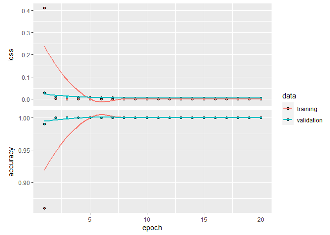
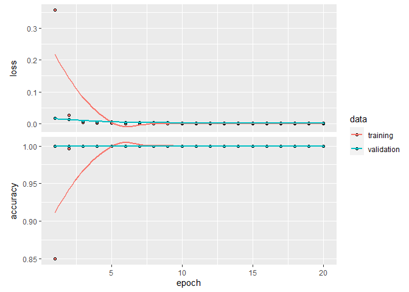
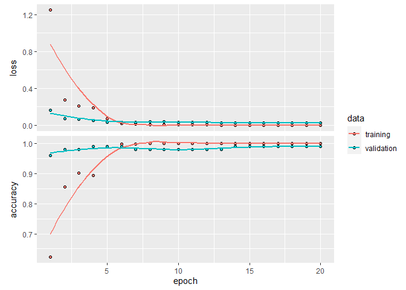
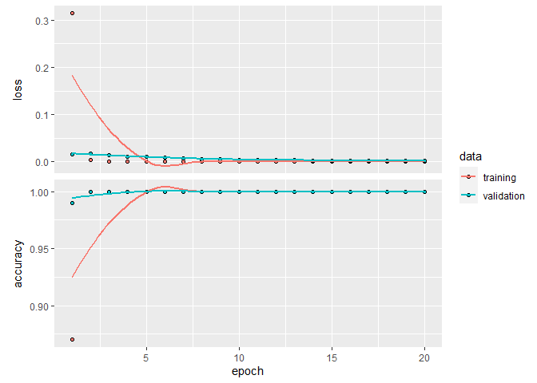
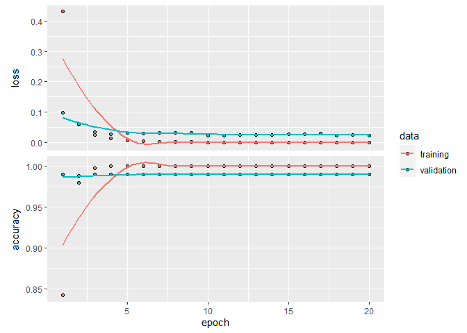
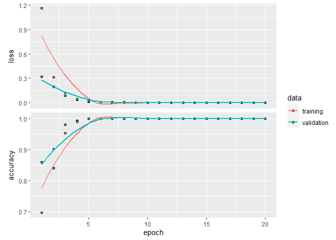
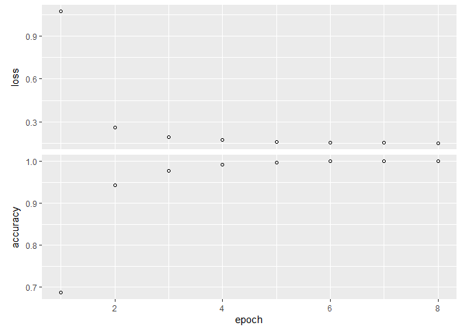

```r
library(keras)
library(reticulate)
library(tensorflow)
library(tidyverse)
```

```
## -- Attaching packages --------------------------------------- tidyverse 1.3.0 --
```

```
## v ggplot2 3.3.3     v purrr   0.3.4
## v tibble  3.0.4     v dplyr   1.0.2
## v tidyr   1.1.2     v stringr 1.4.0
## v readr   1.4.0     v forcats 0.5.0
```

```
## -- Conflicts ------------------------------------------ tidyverse_conflicts() --
## x dplyr::filter() masks stats::filter()
## x dplyr::lag()    masks stats::lag()
```

```r
use_condaenv("r-reticulate")
```

### prepare data


```r
cancer <- readr::read_csv("C:/Users/sandy/rclub/Deep_learning_data/TCGA-PANCAN-HiSeq-801x20531/data.csv")
```

```
## Warning: Missing column names filled in: 'X1' [1]
```

```
## 
## -- Column specification --------------------------------------------------------
## cols(
##   .default = col_double(),
##   X1 = col_character()
## )
## i Use `spec()` for the full column specifications.
```

```r
dim(cancer)
```

```
## [1]   801 20532
```

```r
head(cancer)
```

```
## # A tibble: 6 x 20,532
##   X1    gene_0 gene_1 gene_2 gene_3 gene_4 gene_5 gene_6 gene_7 gene_8 gene_9
##   <chr>  <dbl>  <dbl>  <dbl>  <dbl>  <dbl>  <dbl>  <dbl>  <dbl>  <dbl>  <dbl>
## 1 samp~      0  2.02    3.27   5.48  10.4       0   7.18  0.592      0      0
## 2 samp~      0  0.593   1.59   7.59   9.62      0   6.82  0          0      0
## 3 samp~      0  3.51    4.33   6.88   9.87      0   6.97  0.453      0      0
## 4 samp~      0  3.66    4.51   6.66  10.2       0   7.84  0.435      0      0
## 5 samp~      0  2.66    2.82   6.54   9.74      0   6.57  0.361      0      0
## 6 samp~      0  3.47    3.58   6.62   9.71      0   7.76  0          0      0
## # ... with 20,521 more variables: gene_10 <dbl>, gene_11 <dbl>, gene_12 <dbl>,
## #   gene_13 <dbl>, gene_14 <dbl>, gene_15 <dbl>, gene_16 <dbl>, gene_17 <dbl>,
## #   gene_18 <dbl>, gene_19 <dbl>, gene_20 <dbl>, gene_21 <dbl>, gene_22 <dbl>,
## #   gene_23 <dbl>, gene_24 <dbl>, gene_25 <dbl>, gene_26 <dbl>, gene_27 <dbl>,
## #   gene_28 <dbl>, gene_29 <dbl>, gene_30 <dbl>, gene_31 <dbl>, gene_32 <dbl>,
## #   gene_33 <dbl>, gene_34 <dbl>, gene_35 <dbl>, gene_36 <dbl>, gene_37 <dbl>,
## #   gene_38 <dbl>, gene_39 <dbl>, gene_40 <dbl>, gene_41 <dbl>, gene_42 <dbl>,
## #   gene_43 <dbl>, gene_44 <dbl>, gene_45 <dbl>, gene_46 <dbl>, gene_47 <dbl>,
## #   gene_48 <dbl>, gene_49 <dbl>, gene_50 <dbl>, gene_51 <dbl>, gene_52 <dbl>,
## #   gene_53 <dbl>, gene_54 <dbl>, gene_55 <dbl>, gene_56 <dbl>, gene_57 <dbl>,
## #   gene_58 <dbl>, gene_59 <dbl>, gene_60 <dbl>, gene_61 <dbl>, gene_62 <dbl>,
## #   gene_63 <dbl>, gene_64 <dbl>, gene_65 <dbl>, gene_66 <dbl>, gene_67 <dbl>,
## #   gene_68 <dbl>, gene_69 <dbl>, gene_70 <dbl>, gene_71 <dbl>, gene_72 <dbl>,
## #   gene_73 <dbl>, gene_74 <dbl>, gene_75 <dbl>, gene_76 <dbl>, gene_77 <dbl>,
## #   gene_78 <dbl>, gene_79 <dbl>, gene_80 <dbl>, gene_81 <dbl>, gene_82 <dbl>,
## #   gene_83 <dbl>, gene_84 <dbl>, gene_85 <dbl>, gene_86 <dbl>, gene_87 <dbl>,
## #   gene_88 <dbl>, gene_89 <dbl>, gene_90 <dbl>, gene_91 <dbl>, gene_92 <dbl>,
## #   gene_93 <dbl>, gene_94 <dbl>, gene_95 <dbl>, gene_96 <dbl>, gene_97 <dbl>,
## #   gene_98 <dbl>, gene_99 <dbl>, gene_100 <dbl>, gene_101 <dbl>,
## #   gene_102 <dbl>, gene_103 <dbl>, gene_104 <dbl>, gene_105 <dbl>,
## #   gene_106 <dbl>, gene_107 <dbl>, gene_108 <dbl>, gene_109 <dbl>, ...
```


```r
set.seed(10)
train <- sample(1:nrow(cancer), size = 600)
cancer.train <- cancer[train,]
cancer.test <- cancer[-train,]
dim(cancer.train)
```

```
## [1]   600 20532
```

```r
dim(cancer.test)
```

```
## [1]   201 20532
```

> z scale, Remember to remove the sample ID column


```r
cancer.train <- cancer.train %>% select(-X1)
head(cancer.train)
```

```
## # A tibble: 6 x 20,531
##   gene_0 gene_1 gene_2 gene_3 gene_4 gene_5 gene_6 gene_7 gene_8 gene_9 gene_10
##    <dbl>  <dbl>  <dbl>  <dbl>  <dbl>  <dbl>  <dbl>  <dbl>  <dbl>  <dbl>   <dbl>
## 1      0   4.89   4.51   7.83   9.50      0   7.18  0.494      0      0   0    
## 2      0   3.85   3.60   6.52  10.1       0   7.45  0.895      0      0   0.516
## 3      0   3.97   3.37   6.64   9.36      0   8.31  0.431      0      0   0    
## 4      0   2.15   1.62   7.07  10.3       0   7.56  0.509      0      0   1.82 
## 5      0   3.14   3.42   7.01  10.1       0   6.99  0.942      0      0   0    
## 6      0   2.07   2.11   5.83  10.4       0   8.57  1          0      0   1.81 
## # ... with 20,520 more variables: gene_11 <dbl>, gene_12 <dbl>, gene_13 <dbl>,
## #   gene_14 <dbl>, gene_15 <dbl>, gene_16 <dbl>, gene_17 <dbl>, gene_18 <dbl>,
## #   gene_19 <dbl>, gene_20 <dbl>, gene_21 <dbl>, gene_22 <dbl>, gene_23 <dbl>,
## #   gene_24 <dbl>, gene_25 <dbl>, gene_26 <dbl>, gene_27 <dbl>, gene_28 <dbl>,
## #   gene_29 <dbl>, gene_30 <dbl>, gene_31 <dbl>, gene_32 <dbl>, gene_33 <dbl>,
## #   gene_34 <dbl>, gene_35 <dbl>, gene_36 <dbl>, gene_37 <dbl>, gene_38 <dbl>,
## #   gene_39 <dbl>, gene_40 <dbl>, gene_41 <dbl>, gene_42 <dbl>, gene_43 <dbl>,
## #   gene_44 <dbl>, gene_45 <dbl>, gene_46 <dbl>, gene_47 <dbl>, gene_48 <dbl>,
## #   gene_49 <dbl>, gene_50 <dbl>, gene_51 <dbl>, gene_52 <dbl>, gene_53 <dbl>,
## #   gene_54 <dbl>, gene_55 <dbl>, gene_56 <dbl>, gene_57 <dbl>, gene_58 <dbl>,
## #   gene_59 <dbl>, gene_60 <dbl>, gene_61 <dbl>, gene_62 <dbl>, gene_63 <dbl>,
## #   gene_64 <dbl>, gene_65 <dbl>, gene_66 <dbl>, gene_67 <dbl>, gene_68 <dbl>,
## #   gene_69 <dbl>, gene_70 <dbl>, gene_71 <dbl>, gene_72 <dbl>, gene_73 <dbl>,
## #   gene_74 <dbl>, gene_75 <dbl>, gene_76 <dbl>, gene_77 <dbl>, gene_78 <dbl>,
## #   gene_79 <dbl>, gene_80 <dbl>, gene_81 <dbl>, gene_82 <dbl>, gene_83 <dbl>,
## #   gene_84 <dbl>, gene_85 <dbl>, gene_86 <dbl>, gene_87 <dbl>, gene_88 <dbl>,
## #   gene_89 <dbl>, gene_90 <dbl>, gene_91 <dbl>, gene_92 <dbl>, gene_93 <dbl>,
## #   gene_94 <dbl>, gene_95 <dbl>, gene_96 <dbl>, gene_97 <dbl>, gene_98 <dbl>,
## #   gene_99 <dbl>, gene_100 <dbl>, gene_101 <dbl>, gene_102 <dbl>,
## #   gene_103 <dbl>, gene_104 <dbl>, gene_105 <dbl>, gene_106 <dbl>,
## #   gene_107 <dbl>, gene_108 <dbl>, gene_109 <dbl>, gene_110 <dbl>, ...
```

```r
cancer.test <- cancer.test %>% select(-X1)
head(cancer.test)
```

```
## # A tibble: 6 x 20,531
##   gene_0 gene_1 gene_2 gene_3 gene_4 gene_5 gene_6 gene_7 gene_8 gene_9 gene_10
##    <dbl>  <dbl>  <dbl>  <dbl>  <dbl>  <dbl>  <dbl>  <dbl>  <dbl>  <dbl>   <dbl>
## 1      0  2.02    3.27   5.48  10.4       0   7.18  0.592      0      0   0.592
## 2      0  1.55    3.53   6.33  10.6       0   8.94  0          0      0   1.41 
## 3      0  2.90    3.69   6.67  10.0       0   6.95  0          0      0   0    
## 4      0  1.13    2.35   6.85   9.20      0   7.85  0.463      0      0   2.26 
## 5      0  3.12    2.47   7.12  10.7       0   5.51  0          0      0   0    
## 6      0  0.657   1.03   5.41   9.60      0   6.26  0          0      0   0    
## # ... with 20,520 more variables: gene_11 <dbl>, gene_12 <dbl>, gene_13 <dbl>,
## #   gene_14 <dbl>, gene_15 <dbl>, gene_16 <dbl>, gene_17 <dbl>, gene_18 <dbl>,
## #   gene_19 <dbl>, gene_20 <dbl>, gene_21 <dbl>, gene_22 <dbl>, gene_23 <dbl>,
## #   gene_24 <dbl>, gene_25 <dbl>, gene_26 <dbl>, gene_27 <dbl>, gene_28 <dbl>,
## #   gene_29 <dbl>, gene_30 <dbl>, gene_31 <dbl>, gene_32 <dbl>, gene_33 <dbl>,
## #   gene_34 <dbl>, gene_35 <dbl>, gene_36 <dbl>, gene_37 <dbl>, gene_38 <dbl>,
## #   gene_39 <dbl>, gene_40 <dbl>, gene_41 <dbl>, gene_42 <dbl>, gene_43 <dbl>,
## #   gene_44 <dbl>, gene_45 <dbl>, gene_46 <dbl>, gene_47 <dbl>, gene_48 <dbl>,
## #   gene_49 <dbl>, gene_50 <dbl>, gene_51 <dbl>, gene_52 <dbl>, gene_53 <dbl>,
## #   gene_54 <dbl>, gene_55 <dbl>, gene_56 <dbl>, gene_57 <dbl>, gene_58 <dbl>,
## #   gene_59 <dbl>, gene_60 <dbl>, gene_61 <dbl>, gene_62 <dbl>, gene_63 <dbl>,
## #   gene_64 <dbl>, gene_65 <dbl>, gene_66 <dbl>, gene_67 <dbl>, gene_68 <dbl>,
## #   gene_69 <dbl>, gene_70 <dbl>, gene_71 <dbl>, gene_72 <dbl>, gene_73 <dbl>,
## #   gene_74 <dbl>, gene_75 <dbl>, gene_76 <dbl>, gene_77 <dbl>, gene_78 <dbl>,
## #   gene_79 <dbl>, gene_80 <dbl>, gene_81 <dbl>, gene_82 <dbl>, gene_83 <dbl>,
## #   gene_84 <dbl>, gene_85 <dbl>, gene_86 <dbl>, gene_87 <dbl>, gene_88 <dbl>,
## #   gene_89 <dbl>, gene_90 <dbl>, gene_91 <dbl>, gene_92 <dbl>, gene_93 <dbl>,
## #   gene_94 <dbl>, gene_95 <dbl>, gene_96 <dbl>, gene_97 <dbl>, gene_98 <dbl>,
## #   gene_99 <dbl>, gene_100 <dbl>, gene_101 <dbl>, gene_102 <dbl>,
## #   gene_103 <dbl>, gene_104 <dbl>, gene_105 <dbl>, gene_106 <dbl>,
## #   gene_107 <dbl>, gene_108 <dbl>, gene_109 <dbl>, gene_110 <dbl>, ...
```

> NAs in the loss function arise because of NAs in the input data set or because of low information predictors (genes).

> If you are scaling the genes, then you will get NAs for genes with a standard deviation of 0 (and there are some).

> Additionally, there are genes that do have a positive standard deviation but still have such a small amount of information that they also cause NAs in the loss function.

> So I remove genes that are either 0  SD or have an average expression of < 1.


```r
dim(cancer.train)
```

```
## [1]   600 20531
```

```r
novariation_train <- apply(cancer.train, 2, sd)==0
cancer.train_rm <- cancer.train[,!novariation_train]
cancer.test_rm <- cancer.test[,!novariation_train]
dim(cancer.train_rm)
```

```
## [1]   600 20257
```

```r
dim(cancer.test_rm)
```

```
## [1]   201 20257
```

```r
lowexpression_train <- apply(cancer.train_rm, 2, mean) < 1
cancer.train_rm <- cancer.train_rm[, !lowexpression_train]
cancer.test_rm <- cancer.test_rm[, !lowexpression_train]
dim(cancer.train_rm)
```

```
## [1]   600 17408
```

```r
dim(cancer.test_rm)
```

```
## [1]   201 17408
```


```r
cancer.mean <- apply(cancer.train_rm, 2, mean)
cancer.std <- apply(cancer.train_rm, 2, sd)

cancer.train_rm <- scale(cancer.train_rm, center = cancer.mean, scale = cancer.std)
cancer.test_rm <- scale(cancer.test_rm, center = cancer.mean, scale = cancer.std)

str(cancer.train_rm)
```

```
##  num [1:600, 1:17408] 1.571 0.709 0.811 -0.711 0.116 ...
##  - attr(*, "dimnames")=List of 2
##   ..$ : NULL
##   ..$ : chr [1:17408] "gene_1" "gene_2" "gene_3" "gene_4" ...
##  - attr(*, "scaled:center")= Named num [1:17408] 3 3.09 6.72 9.81 7.39 ...
##   ..- attr(*, "names")= chr [1:17408] "gene_1" "gene_2" "gene_3" "gene_4" ...
##  - attr(*, "scaled:scale")= Named num [1:17408] 1.201 1.056 0.658 0.505 1.118 ...
##   ..- attr(*, "names")= chr [1:17408] "gene_1" "gene_2" "gene_3" "gene_4" ...
```

```r
str(cancer.test_rm)
```

```
##  num [1:201, 1:17408] -0.8181 -1.2063 -0.0817 -1.5555 0.1019 ...
##  - attr(*, "dimnames")=List of 2
##   ..$ : NULL
##   ..$ : chr [1:17408] "gene_1" "gene_2" "gene_3" "gene_4" ...
##  - attr(*, "scaled:center")= Named num [1:17408] 3 3.09 6.72 9.81 7.39 ...
##   ..- attr(*, "names")= chr [1:17408] "gene_1" "gene_2" "gene_3" "gene_4" ...
##  - attr(*, "scaled:scale")= Named num [1:17408] 1.201 1.056 0.658 0.505 1.118 ...
##   ..- attr(*, "names")= chr [1:17408] "gene_1" "gene_2" "gene_3" "gene_4" ...
```


### prepare label


```r
cancer_label <- readr::read_csv("C:/Users/sandy/rclub/Deep_learning_data/TCGA-PANCAN-HiSeq-801x20531/labels.csv")
```

```
## Warning: Missing column names filled in: 'X1' [1]
```

```
## 
## -- Column specification --------------------------------------------------------
## cols(
##   X1 = col_character(),
##   Class = col_character()
## )
```

```r
dim(cancer_label)
```

```
## [1] 801   2
```

```r
head(cancer_label)
```

```
## # A tibble: 6 x 2
##   X1       Class
##   <chr>    <chr>
## 1 sample_0 PRAD 
## 2 sample_1 LUAD 
## 3 sample_2 PRAD 
## 4 sample_3 PRAD 
## 5 sample_4 BRCA 
## 6 sample_5 PRAD
```

```r
str(cancer_label)
```

```
## tibble [801 x 2] (S3: spec_tbl_df/tbl_df/tbl/data.frame)
##  $ X1   : chr [1:801] "sample_0" "sample_1" "sample_2" "sample_3" ...
##  $ Class: chr [1:801] "PRAD" "LUAD" "PRAD" "PRAD" ...
##  - attr(*, "spec")=
##   .. cols(
##   ..   X1 = col_character(),
##   ..   Class = col_character()
##   .. )
```

```r
table(cancer_label$Class)
```

```
## 
## BRCA COAD KIRC LUAD PRAD 
##  300   78  146  141  136
```


```r
cancer_label.train <- cancer_label[train,]
cancer_label.test <- cancer_label[-train,]
dim(cancer_label.train)
```

```
## [1] 600   2
```

```r
dim(cancer_label.test)
```

```
## [1] 201   2
```

> Prepare label. Remember that keras uses zero indexing, so your labels need to be integers from 0 to 4, rather than from 1 to 5.


```r
cancer_label.train_vec <- as.integer(as.factor(cancer_label.train$Class)) -1
str(cancer_label.train_vec)
```

```
##  num [1:600] 1 3 0 0 0 2 2 0 0 1 ...
```

```r
cancer_label.test_vec <- as.integer(as.factor(cancer_label.test$Class)) -1
str(cancer_label.test_vec)
```

```
##  num [1:201] 4 0 0 3 0 0 0 0 2 3 ...
```

> Setting aside a validation set


```r
set.seed(10)
val_indices <- sample(1:nrow(cancer.train_rm), size = 100)

cancer.train_rm_val <- cancer.train_rm[val_indices,]
cancer.train_rm_part <- cancer.train_rm[-val_indices,]

cancer.train_rm_val.label <- cancer_label.train_vec[val_indices]
cancer.train_rm_part.label <- cancer_label.train_vec[-val_indices]

dim(cancer.train_rm_val)
```

```
## [1]   100 17408
```

```r
dim(cancer.train_rm_part)
```

```
## [1]   500 17408
```

```r
str(cancer.train_rm_val)
```

```
##  num [1:100, 1:17408] -1.584 -2.498 -0.297 -1.618 -0.874 ...
##  - attr(*, "dimnames")=List of 2
##   ..$ : NULL
##   ..$ : chr [1:17408] "gene_1" "gene_2" "gene_3" "gene_4" ...
```

```r
str(cancer.train_rm_part)
```

```
##  num [1:500, 1:17408] 1.571 0.709 0.811 0.116 -0.778 ...
##  - attr(*, "dimnames")=List of 2
##   ..$ : NULL
##   ..$ : chr [1:17408] "gene_1" "gene_2" "gene_3" "gene_4" ...
```

```r
str(cancer.train_rm_val.label)
```

```
##  num [1:100] 3 0 2 0 4 4 4 0 0 2 ...
```

```r
str(cancer.train_rm_part.label)
```

```
##  num [1:500] 1 3 0 0 2 2 0 0 1 0 ...
```

## try different hyperparamaters


```r
define_model <- function(nlayers, powerto) {
  
  # input layer
  network <- keras_model_sequential() %>% 
    layer_dense(units = 2^powerto, activation = "relu", input_shape = ncol(cancer.train_rm) ) 
  
  # additional layers
  if (nlayers>1) {
  map(2:nlayers, ~ network %>% 
        layer_dense(units = 2^powerto, activation = "relu")
  )
  }
  
  # output layer
  network %>% 
    layer_dense(units = 5, activation = "softmax")
  
  # compile it
  network %>% compile(
    optimizer = "rmsprop",
    loss = "sparse_categorical_crossentropy",
    metrics = c("accuracy")
  )
  
}
```


```r
run_model <- function(network, epochs = 20) {
  network %>% fit(
    cancer.train_rm_part,
    cancer.train_rm_part.label,
    epochs = epochs,
    batch_size = 64,
    validation_data = list(cancer.train_rm_val, cancer.train_rm_val.label)
  )
}
```

> 1 layer, units = 16


```r
define_model(1,4) %>%
  run_model(20) -> history_1_4

history_1_4 %>%
  plot()
```

```
## `geom_smooth()` using formula 'y ~ x'
```

<!-- -->

> 2 layer, units = 16


```r
define_model(2,4) %>%
  run_model(20) -> history_2_4

history_2_4 %>%
  plot()
```

```
## `geom_smooth()` using formula 'y ~ x'
```

<!-- -->

> 3 layer, units = 16


```r
define_model(3,4) %>%
  run_model(20) -> history_3_4

history_3_4 %>%
  plot()
```

```
## `geom_smooth()` using formula 'y ~ x'
```

<!-- -->

> 2 layer, units = 32


```r
define_model(2,5) %>%
  run_model(20) -> history_2_5

history_2_5 %>%
  plot()
```

```
## `geom_smooth()` using formula 'y ~ x'
```

<!-- -->

> 2 layer, units = 8


```r
define_model(2,3) %>%
  run_model(20) -> history_2_3

history_2_3 %>%
  plot()
```

```
## `geom_smooth()` using formula 'y ~ x'
```

<!-- -->

## run the model

### I decided to choose units = 16 & 2 layers to run the model.


```r
model <- keras_model_sequential() %>% 
  layer_dense(units = 16, activation = "relu", input_shape = ncol(cancer.train_rm) ) %>% 
  layer_dense(units = 16, activation = "relu") %>% 
  layer_dense(units = 5, activation = "softmax")


model %>% compile(
  optimizer = "rmsprop",
  loss = "sparse_categorical_crossentropy",
  metrics = c("accuracy")
)

system.time(history <- model %>% fit(
  cancer.train_rm_part,
  cancer.train_rm_part.label,
  epochs = 20,
  batch_size = 64,
  validation_data = list(cancer.train_rm_val, cancer.train_rm_val.label)
))
```

```
##    user  system elapsed 
##    4.22    2.23    2.38
```

### View a summary of the model


```r
summary(model)
```

```
## Model: "sequential_5"
## ________________________________________________________________________________
## Layer (type)                        Output Shape                    Param #     
## ================================================================================
## dense_17 (Dense)                    (None, 16)                      278544      
## ________________________________________________________________________________
## dense_16 (Dense)                    (None, 16)                      272         
## ________________________________________________________________________________
## dense_15 (Dense)                    (None, 5)                       85          
## ================================================================================
## Total params: 278,901
## Trainable params: 278,901
## Non-trainable params: 0
## ________________________________________________________________________________
```


```r
str(history)
```

```
## List of 2
##  $ params :List of 3
##   ..$ verbose: int 1
##   ..$ epochs : int 20
##   ..$ steps  : int 8
##  $ metrics:List of 4
##   ..$ loss        : num [1:20] 1.1607 0.3136 0.124 0.0392 0.0132 ...
##   ..$ accuracy    : num [1:20] 0.696 0.902 0.954 0.994 1 ...
##   ..$ val_loss    : num [1:20] 0.3186 0.197 0.09 0.0448 0.017 ...
##   ..$ val_accuracy: num [1:20] 0.86 0.84 0.98 0.99 1 ...
##  - attr(*, "class")= chr "keras_training_history"
```


```r
plot(history)
```

```
## `geom_smooth()` using formula 'y ~ x'
```

<!-- -->

```r
model <- keras_model_sequential() %>% 
  layer_dense(units = 16, activation = "relu", input_shape = ncol(cancer.train_rm) ) %>% 
  layer_dense(units = 16, activation = "relu") %>% 
  layer_dense(units = 5, activation = "softmax")


model %>% compile(
  optimizer = "rmsprop",
  loss = "sparse_categorical_crossentropy",
  metrics = c("accuracy")
)

system.time(history <- model %>% fit(
  cancer.train_rm,
  cancer_label.train_vec,
  epochs = 8,
  batch_size = 64
))
```

```
##    user  system elapsed 
##    2.06    0.69    0.96
```


```r
plot(history)
```

<!-- -->


```r
results <- model %>% evaluate(cancer.test_rm, cancer_label.test_vec)

results
```

```
##      loss  accuracy 
## 0.1220048 0.9950249
```
