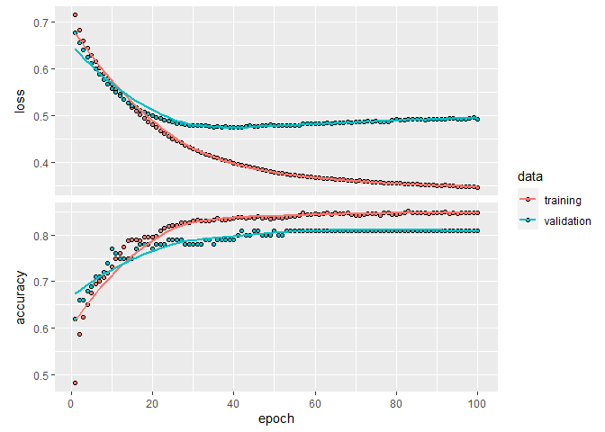

## OJ


```r
library(tidyverse)
```

```
## -- Attaching packages --------------------------------------- tidyverse 1.3.0 --
```

```
## v ggplot2 3.3.3     v purrr   0.3.4
## v tibble  3.0.5     v dplyr   1.0.3
## v tidyr   1.1.2     v stringr 1.4.0
## v readr   1.4.0     v forcats 0.5.0
```

```
## -- Conflicts ------------------------------------------ tidyverse_conflicts() --
## x dplyr::filter() masks stats::filter()
## x dplyr::lag()    masks stats::lag()
```

```r
library(ISLR)
library(tree)
```

```
## Registered S3 method overwritten by 'tree':
##   method     from
##   print.tree cli
```

```r
data(OJ)
OJ
```

```
##      Purchase WeekofPurchase StoreID PriceCH PriceMM DiscCH DiscMM SpecialCH
## 1          CH            237       1    1.75    1.99   0.00   0.00         0
## 2          CH            239       1    1.75    1.99   0.00   0.30         0
## 3          CH            245       1    1.86    2.09   0.17   0.00         0
## 4          MM            227       1    1.69    1.69   0.00   0.00         0
## 5          CH            228       7    1.69    1.69   0.00   0.00         0
## 6          CH            230       7    1.69    1.99   0.00   0.00         0
## 7          CH            232       7    1.69    1.99   0.00   0.40         1
## 8          CH            234       7    1.75    1.99   0.00   0.40         1
## 9          CH            235       7    1.75    1.99   0.00   0.40         0
## 10         CH            238       7    1.75    1.99   0.00   0.40         0
## 11         CH            240       7    1.86    2.09   0.00   0.00         0
## 12         CH            263       7    1.86    2.13   0.27   0.00         0
## 13         CH            276       7    1.99    2.13   0.00   0.54         0
## 14         CH            268       7    1.86    2.13   0.00   0.00         0
## 15         CH            278       7    2.06    2.13   0.00   0.00         0
## 16         CH            278       7    2.06    2.13   0.00   0.00         0
## 17         MM            240       1    1.75    1.99   0.00   0.30         0
## 18         MM            268       2    1.86    2.18   0.00   0.00         0
## 19         MM            269       2    1.86    2.18   0.00   0.00         0
## 20         CH            254       7    1.86    2.18   0.00   0.00         0
## 21         CH            257       7    1.86    2.18   0.00   0.00         0
## 22         CH            258       1    1.76    2.18   0.00   0.00         0
## 23         CH            259       7    1.86    2.18   0.00   0.00         0
## 24         CH            264       7    1.86    2.13   0.37   0.00         1
## 25         CH            268       7    1.86    2.13   0.00   0.00         0
## 26         CH            269       7    1.86    2.13   0.27   0.00         1
## 27         CH            271       7    1.86    2.13   0.00   0.00         0
## 28         CH            272       7    1.86    2.13   0.00   0.00         0
## 29         CH            274       7    1.86    2.13   0.47   0.54         1
## 30         CH            278       7    2.06    2.13   0.00   0.00         0
## 31         CH            246       2    1.89    2.09   0.00   0.00         0
## 32         CH            265       7    1.86    2.13   0.37   0.00         1
## 33         MM            275       2    1.96    2.18   0.00   0.80         0
## 34         MM            232       2    1.69    1.69   0.00   0.00         1
## 35         CH            251       3    1.99    2.23   0.00   0.00         0
## 36         CH            256       3    1.99    2.29   0.00   0.00         0
## 37         CH            258       1    1.76    2.18   0.00   0.00         0
## 38         CH            277       1    1.99    2.13   0.24   0.00         0
## 39         CH            271       4    1.99    2.09   0.10   0.40         1
## 40         CH            227       4    1.79    1.79   0.00   0.00         0
## 41         CH            229       4    1.79    1.79   0.00   0.00         0
## 42         CH            230       4    1.79    1.79   0.00   0.00         0
## 43         CH            233       4    1.79    2.09   0.00   0.00         0
## 44         CH            236       4    1.79    2.09   0.00   0.00         0
## 45         MM            237       4    1.79    2.09   0.00   0.00         0
## 46         CH            240       4    1.79    2.23   0.00   0.00         0
## 47         CH            244       4    1.99    2.23   0.00   0.00         0
## 48         CH            245       4    1.99    2.23   0.00   0.00         0
## 49         CH            246       4    1.99    2.23   0.00   0.00         0
## 50         CH            247       4    1.99    2.23   0.00   0.00         0
## 51         MM            248       4    1.99    2.23   0.00   0.00         0
## 52         CH            249       4    1.99    2.23   0.00   0.00         0
## 53         CH            252       4    1.99    2.23   0.00   0.00         0
## 54         MM            254       4    1.99    2.29   0.00   0.00         1
## 55         CH            256       4    1.99    2.29   0.00   0.00         0
## 56         CH            256       4    1.99    2.29   0.00   0.00         0
## 57         CH            257       4    1.99    2.29   0.00   0.40         0
## 58         CH            258       4    1.99    2.29   0.00   0.00         0
## 59         CH            258       7    1.86    2.18   0.00   0.00         0
## 60         CH            259       4    1.99    2.29   0.00   0.00         0
## 61         CH            260       4    1.99    2.09   0.00   0.00         0
## 62         CH            263       4    1.99    2.09   0.00   0.00         0
## 63         MM            265       4    1.99    2.09   0.10   0.00         0
## 64         CH            265       4    1.99    2.09   0.10   0.00         0
## 65         CH            266       4    1.99    2.09   0.10   0.00         0
## 66         CH            267       4    1.99    2.09   0.10   0.00         0
## 67         MM            269       4    1.99    2.09   0.10   0.00         0
## 68         MM            270       4    1.99    2.09   0.10   0.00         0
## 69         CH            272       4    1.99    2.09   0.00   0.40         0
## 70         CH            272       4    1.99    2.09   0.00   0.40         0
## 71         CH            274       4    1.99    2.09   0.00   0.40         0
## 72         CH            275       4    2.09    2.09   0.00   0.40         0
## 73         CH            276       4    2.09    2.09   0.20   0.40         0
## 74         CH            278       4    2.09    2.09   0.20   0.00         0
## 75         CH            230       7    1.69    1.99   0.00   0.00         0
## 76         CH            238       4    1.79    2.09   0.00   0.00         0
## 77         CH            239       4    1.79    2.23   0.00   0.00         0
## 78         CH            251       4    1.99    2.23   0.00   0.00         0
## 79         CH            252       2    1.89    2.09   0.13   0.00         0
## 80         CH            255       4    1.99    2.29   0.00   0.00         0
## 81         CH            263       4    1.99    2.09   0.00   0.00         0
## 82         CH            264       4    1.99    2.09   0.10   0.00         0
## 83         CH            269       4    1.99    2.09   0.10   0.00         0
## 84         CH            273       4    1.99    2.09   0.00   0.40         0
## 85         CH            275       4    2.09    2.09   0.00   0.40         0
## 86         CH            276       2    1.99    2.18   0.00   0.00         0
## 87         CH            277       4    2.09    2.09   0.20   0.40         0
## 88         CH            252       4    1.99    2.23   0.00   0.00         0
## 89         CH            275       4    2.09    2.09   0.00   0.40         0
## 90         CH            277       3    2.09    2.09   0.20   0.40         0
## 91         CH            237       4    1.79    2.09   0.00   0.00         0
## 92         CH            269       4    1.99    2.09   0.10   0.00         0
## 93         CH            242       4    1.99    2.23   0.00   0.00         0
## 94         CH            244       7    1.86    2.09   0.00   0.20         0
## 95         CH            241       2    1.75    1.99   0.00   0.30         0
## 96         CH            277       2    1.99    2.18   0.00   0.00         0
## 97         CH            277       7    1.99    2.13   0.50   0.00         0
## 98         CH            227       2    1.69    1.69   0.00   0.00         0
## 99         CH            229       2    1.69    1.69   0.00   0.00         0
## 100        CH            234       2    1.69    1.99   0.00   0.00         0
## 101        CH            236       2    1.75    1.99   0.00   0.00         0
## 102        CH            237       2    1.75    1.99   0.00   0.00         0
## 103        CH            240       2    1.75    1.99   0.00   0.30         0
## 104        MM            241       2    1.75    1.99   0.00   0.30         0
## 105        CH            243       2    1.86    2.09   0.00   0.00         0
## 106        CH            245       2    1.89    2.09   0.00   0.00         0
## 107        CH            245       1    1.86    2.09   0.17   0.00         0
## 108        CH            248       2    1.89    2.09   0.00   0.00         0
## 109        CH            248       2    1.89    2.09   0.00   0.00         0
## 110        CH            249       2    1.89    2.09   0.00   0.00         0
## 111        CH            249       1    1.86    2.09   0.00   0.00         0
## 112        MM            251       3    1.99    2.23   0.00   0.00         0
## 113        CH            253       2    1.89    2.09   0.13   0.00         0
## 114        CH            254       2    1.89    2.09   0.13   0.00         0
## 115        CH            255       2    1.89    2.18   0.13   0.00         0
## 116        CH            257       3    1.99    2.29   0.00   0.40         0
## 117        CH            257       2    1.86    2.18   0.00   0.00         0
## 118        CH            258       2    1.86    2.18   0.00   0.00         0
## 119        CH            259       3    1.99    2.29   0.00   0.00         0
## 120        CH            259       2    1.86    2.18   0.00   0.40         0
## 121        CH            260       2    1.86    2.18   0.00   0.70         0
## 122        CH            261       1    1.76    1.99   0.00   0.00         0
## 123        CH            261       2    1.86    2.18   0.00   0.00         0
## 124        CH            263       2    1.86    2.18   0.00   0.00         0
## 125        MM            264       2    1.86    2.18   0.00   0.00         0
## 126        CH            265       2    1.86    2.18   0.00   0.00         0
## 127        CH            266       1    1.86    1.99   0.00   0.10         0
## 128        CH            266       2    1.86    2.18   0.00   0.00         0
## 129        CH            267       2    1.86    2.18   0.00   0.40         0
## 130        CH            270       2    1.86    2.18   0.00   0.00         0
## 131        CH            270       1    1.86    2.18   0.00   0.00         0
## 132        CH            271       2    1.86    2.18   0.00   0.06         0
## 133        CH            272       2    1.86    2.18   0.00   0.06         0
## 134        CH            273       7    1.86    2.13   0.00   0.54         0
## 135        CH            273       1    1.86    2.18   0.00   0.00         0
## 136        CH            274       2    1.96    2.18   0.00   0.80         0
## 137        CH            275       2    1.96    2.18   0.00   0.80         0
## 138        CH            276       7    1.99    2.13   0.00   0.54         0
## 139        CH            278       2    1.99    2.18   0.00   0.00         0
## 140        CH            242       3    1.99    2.23   0.00   0.00         0
## 141        CH            237       1    1.75    1.99   0.00   0.00         0
## 142        CH            251       4    1.99    2.23   0.00   0.00         0
## 143        MM            255       4    1.99    2.29   0.00   0.00         0
## 144        MM            261       7    1.86    2.13   0.00   0.24         0
## 145        CH            277       4    2.09    2.09   0.20   0.40         0
## 146        MM            233       7    1.75    1.99   0.00   0.40         1
## 147        MM            236       7    1.75    1.99   0.00   0.40         0
## 148        MM            243       7    1.86    2.09   0.00   0.20         0
## 149        MM            244       7    1.86    2.09   0.00   0.20         0
## 150        MM            245       7    1.86    2.09   0.00   0.20         0
## 151        MM            252       7    1.86    2.09   0.10   0.00         0
## 152        MM            277       7    1.99    2.13   0.50   0.00         0
## 153        CH            228       4    1.79    1.79   0.00   0.00         0
## 154        CH            230       3    1.79    1.79   0.00   0.00         0
## 155        CH            231       3    1.79    1.79   0.00   0.00         0
## 156        CH            233       1    1.69    1.99   0.00   0.00         0
## 157        CH            263       4    1.99    2.09   0.00   0.00         0
## 158        CH            264       4    1.99    2.09   0.10   0.00         0
## 159        CH            265       4    1.99    2.09   0.10   0.00         0
## 160        CH            266       4    1.99    2.09   0.10   0.00         0
## 161        CH            267       4    1.99    2.09   0.10   0.00         0
## 162        CH            269       4    1.99    2.09   0.10   0.00         0
## 163        CH            270       1    1.86    2.18   0.00   0.00         0
## 164        CH            271       4    1.99    2.09   0.10   0.40         1
## 165        CH            272       4    1.99    2.09   0.00   0.40         0
## 166        CH            274       4    1.99    2.09   0.00   0.40         0
## 167        CH            276       4    2.09    2.09   0.20   0.40         0
## 168        CH            277       4    2.09    2.09   0.20   0.40         0
## 169        CH            278       3    2.09    2.09   0.20   0.00         0
## 170        CH            269       2    1.86    2.18   0.00   0.00         0
## 171        CH            229       7    1.69    1.69   0.00   0.20         0
## 172        CH            230       7    1.69    1.99   0.00   0.00         0
## 173        CH            231       4    1.79    1.79   0.00   0.00         0
## 174        CH            233       4    1.79    2.09   0.00   0.00         0
## 175        CH            239       7    1.79    2.09   0.00   0.00         0
## 176        CH            240       4    1.79    2.23   0.00   0.00         0
## 177        CH            242       7    1.86    2.09   0.00   0.00         0
## 178        CH            243       4    1.99    2.23   0.00   0.00         0
## 179        CH            244       7    1.86    2.09   0.00   0.20         0
## 180        CH            246       4    1.99    2.23   0.00   0.00         0
## 181        CH            249       4    1.99    2.23   0.00   0.00         0
## 182        CH            250       7    1.86    2.09   0.00   0.00         0
## 183        CH            251       4    1.99    2.23   0.00   0.00         0
## 184        CH            254       4    1.99    2.29   0.00   0.00         1
## 185        CH            255       4    1.99    2.29   0.00   0.00         0
## 186        CH            257       4    1.99    2.29   0.00   0.40         0
## 187        CH            260       4    1.99    2.09   0.00   0.00         0
## 188        CH            261       4    1.99    2.09   0.00   0.00         0
## 189        CH            262       4    1.99    2.09   0.00   0.00         0
## 190        CH            264       4    1.99    2.09   0.10   0.00         0
## 191        CH            265       4    1.99    2.09   0.10   0.00         0
## 192        CH            266       7    1.86    2.13   0.37   0.00         1
## 193        CH            267       7    1.86    2.13   0.00   0.00         1
## 194        CH            269       7    1.86    2.13   0.27   0.00         1
## 195        CH            271       4    1.99    2.09   0.10   0.40         1
## 196        CH            272       4    1.99    2.09   0.00   0.40         0
## 197        CH            274       4    1.99    2.09   0.00   0.40         0
## 198        CH            275       7    1.99    2.13   0.00   0.54         1
## 199        CH            276       4    2.09    2.09   0.20   0.40         0
## 200        CH            277       7    1.99    2.13   0.50   0.00         0
## 201        CH            278       4    2.09    2.09   0.20   0.00         0
## 202        MM            229       7    1.69    1.69   0.00   0.20         0
## 203        CH            230       7    1.69    1.99   0.00   0.00         0
## 204        CH            231       7    1.69    1.99   0.00   0.00         0
## 205        CH            233       7    1.75    1.99   0.00   0.40         1
## 206        CH            237       7    1.75    1.99   0.00   0.40         0
## 207        CH            241       7    1.86    2.09   0.00   0.00         0
## 208        CH            242       7    1.86    2.09   0.00   0.00         0
## 209        CH            253       7    1.86    2.09   0.10   0.00         0
## 210        CH            256       7    1.86    2.18   0.00   0.00         0
## 211        CH            258       7    1.86    2.18   0.00   0.00         0
## 212        CH            259       7    1.86    2.18   0.00   0.00         0
## 213        CH            260       7    1.86    2.13   0.00   0.24         0
## 214        CH            263       7    1.86    2.13   0.27   0.00         0
## 215        CH            264       7    1.86    2.13   0.37   0.00         1
## 216        CH            265       7    1.86    2.13   0.37   0.00         1
## 217        CH            265       7    1.86    2.13   0.37   0.00         1
## 218        CH            267       7    1.86    2.13   0.00   0.00         1
## 219        CH            270       7    1.86    2.13   0.27   0.00         1
## 220        CH            272       7    1.86    2.13   0.00   0.00         0
## 221        CH            274       2    1.96    2.18   0.00   0.80         0
## 222        MM            228       1    1.69    1.69   0.00   0.00         0
## 223        CH            234       1    1.69    1.99   0.00   0.00         0
## 224        MM            243       1    1.86    1.99   0.00   0.80         0
## 225        CH            251       1    1.76    2.09   0.00   0.00         0
## 226        MM            253       1    1.76    2.09   0.00   0.00         0
## 227        MM            242       3    1.99    2.23   0.00   0.00         0
## 228        MM            244       3    1.99    2.23   0.00   0.00         0
## 229        MM            247       3    1.99    2.23   0.00   0.00         0
## 230        CH            274       7    1.86    2.13   0.47   0.54         1
## 231        MM            276       7    1.99    2.13   0.00   0.54         0
## 232        CH            228       7    1.69    1.69   0.00   0.00         0
## 233        CH            233       7    1.75    1.99   0.00   0.40         1
## 234        MM            234       7    1.75    1.99   0.00   0.40         1
## 235        CH            235       7    1.75    1.99   0.00   0.40         0
## 236        CH            236       3    1.79    2.09   0.00   0.00         0
## 237        CH            238       3    1.79    2.09   0.00   0.00         0
## 238        CH            240       7    1.86    2.09   0.00   0.00         0
## 239        CH            250       7    1.86    2.09   0.00   0.00         0
## 240        CH            254       7    1.86    2.18   0.00   0.00         0
## 241        CH            257       7    1.86    2.18   0.00   0.00         0
## 242        CH            258       7    1.86    2.18   0.00   0.00         0
## 243        CH            259       7    1.86    2.18   0.00   0.00         0
## 244        CH            260       7    1.86    2.13   0.00   0.24         0
## 245        CH            261       7    1.86    2.13   0.00   0.24         0
## 246        CH            262       7    1.86    2.13   0.00   0.00         0
## 247        CH            264       7    1.86    2.13   0.37   0.00         1
## 248        CH            266       7    1.86    2.13   0.37   0.00         1
## 249        CH            268       7    1.86    2.13   0.00   0.00         0
## 250        CH            268       7    1.86    2.13   0.00   0.00         0
## 251        CH            269       7    1.86    2.13   0.27   0.00         1
## 252        CH            270       7    1.86    2.13   0.27   0.00         1
## 253        CH            271       7    1.86    2.13   0.00   0.00         0
## 254        CH            272       7    1.86    2.13   0.00   0.00         0
## 255        MM            275       7    1.99    2.13   0.00   0.54         1
## 256        CH            229       7    1.69    1.69   0.00   0.20         0
## 257        CH            232       7    1.69    1.99   0.00   0.40         1
## 258        CH            257       2    1.86    2.18   0.00   0.00         0
## 259        MM            264       3    1.99    2.09   0.10   0.00         0
## 260        MM            265       2    1.86    2.18   0.00   0.00         0
## 261        MM            267       2    1.86    2.18   0.00   0.40         0
## 262        CH            270       2    1.86    2.18   0.00   0.00         0
## 263        CH            272       2    1.86    2.18   0.00   0.06         0
## 264        CH            273       2    1.86    2.18   0.00   0.06         0
## 265        CH            276       2    1.99    2.18   0.00   0.00         0
## 266        CH            278       2    1.99    2.18   0.00   0.00         0
## 267        MM            259       2    1.86    2.18   0.00   0.40         0
## 268        MM            229       3    1.79    1.79   0.00   0.00         0
## 269        MM            235       3    1.79    2.09   0.00   0.00         0
## 270        MM            261       2    1.86    2.18   0.00   0.00         0
## 271        MM            273       2    1.86    2.18   0.00   0.06         0
## 272        MM            276       3    2.09    2.09   0.20   0.40         0
## 273        MM            278       3    2.09    2.09   0.20   0.00         0
## 274        MM            229       3    1.79    1.79   0.00   0.00         0
## 275        MM            234       3    1.79    2.09   0.00   0.00         0
## 276        MM            239       3    1.79    2.23   0.00   0.00         0
## 277        MM            240       3    1.79    2.23   0.00   0.00         0
## 278        MM            240       3    1.79    2.23   0.00   0.00         0
## 279        MM            241       3    1.79    2.23   0.00   0.00         0
## 280        MM            242       3    1.99    2.23   0.00   0.00         0
## 281        MM            243       3    1.99    2.23   0.00   0.00         0
## 282        MM            244       3    1.99    2.23   0.00   0.00         0
## 283        MM            247       3    1.99    2.23   0.00   0.00         0
## 284        MM            248       3    1.99    2.23   0.00   0.00         0
## 285        MM            250       3    1.99    2.23   0.00   0.00         0
## 286        MM            253       3    1.99    2.23   0.00   0.00         0
## 287        MM            259       3    1.99    2.29   0.00   0.00         0
## 288        MM            261       3    1.99    2.09   0.00   0.00         0
## 289        MM            263       3    1.99    2.09   0.00   0.00         0
## 290        MM            264       3    1.99    2.09   0.10   0.00         0
## 291        MM            266       3    1.99    2.09   0.10   0.00         0
## 292        MM            267       3    1.99    2.09   0.10   0.00         0
## 293        MM            270       2    1.86    2.18   0.00   0.00         0
## 294        MM            273       2    1.86    2.18   0.00   0.06         0
## 295        MM            275       2    1.96    2.18   0.00   0.80         0
## 296        MM            276       3    2.09    2.09   0.20   0.40         0
## 297        CH            228       2    1.69    1.69   0.00   0.00         0
## 298        MM            229       2    1.69    1.69   0.00   0.00         0
## 299        MM            231       2    1.69    1.69   0.30   0.00         1
## 300        MM            233       2    1.69    1.69   0.00   0.00         0
## 301        CH            234       3    1.79    2.09   0.00   0.00         0
## 302        MM            240       2    1.75    1.99   0.00   0.30         0
## 303        MM            242       2    1.75    1.99   0.16   0.30         0
## 304        CH            245       2    1.89    2.09   0.00   0.00         0
## 305        MM            253       3    1.99    2.23   0.00   0.00         0
## 306        MM            256       2    1.89    2.18   0.13   0.00         0
## 307        MM            262       2    1.86    2.18   0.00   0.60         0
## 308        MM            263       2    1.86    2.18   0.00   0.00         0
## 309        CH            269       3    1.99    2.09   0.10   0.00         0
## 310        CH            270       2    1.86    2.18   0.00   0.00         0
## 311        CH            272       2    1.86    2.18   0.00   0.06         0
## 312        CH            273       2    1.86    2.18   0.00   0.06         0
## 313        CH            275       2    1.96    2.18   0.00   0.80         0
## 314        CH            276       2    1.99    2.18   0.00   0.00         0
## 315        CH            276       2    1.99    2.18   0.00   0.00         0
## 316        CH            278       2    1.99    2.18   0.00   0.00         0
## 317        MM            238       3    1.79    2.09   0.00   0.00         0
## 318        CH            241       3    1.79    2.23   0.00   0.00         0
## 319        CH            246       3    1.99    2.23   0.00   0.00         0
## 320        CH            251       3    1.99    2.23   0.00   0.00         0
## 321        CH            257       3    1.99    2.29   0.00   0.40         0
## 322        CH            264       3    1.99    2.09   0.10   0.00         0
## 323        MM            271       3    1.99    2.09   0.10   0.40         1
## 324        CH            271       3    1.99    2.09   0.10   0.40         1
## 325        MM            230       1    1.69    1.69   0.00   0.20         0
## 326        CH            231       1    1.69    1.69   0.30   0.20         1
## 327        CH            251       1    1.76    2.09   0.00   0.00         0
## 328        CH            266       1    1.86    1.99   0.00   0.10         0
## 329        MM            267       4    1.99    2.09   0.10   0.00         0
## 330        CH            268       7    1.86    2.13   0.00   0.00         0
## 331        MM            262       1    1.76    1.99   0.00   0.40         0
## 332        MM            266       1    1.86    1.99   0.00   0.10         0
## 333        MM            229       7    1.69    1.69   0.00   0.20         0
## 334        MM            236       7    1.75    1.99   0.00   0.40         0
## 335        MM            237       7    1.75    1.99   0.00   0.40         0
## 336        MM            238       7    1.75    1.99   0.00   0.40         0
## 337        MM            242       7    1.86    2.09   0.00   0.00         0
## 338        MM            254       7    1.86    2.18   0.00   0.00         0
## 339        MM            255       7    1.86    2.18   0.00   0.00         0
## 340        CH            233       7    1.75    1.99   0.00   0.40         1
## 341        CH            251       7    1.86    2.09   0.10   0.00         0
## 342        CH            253       7    1.86    2.09   0.10   0.00         0
## 343        CH            254       1    1.76    2.09   0.00   0.00         0
## 344        CH            260       7    1.86    2.13   0.00   0.24         0
## 345        CH            261       7    1.86    2.13   0.00   0.24         0
## 346        CH            263       7    1.86    2.13   0.27   0.00         0
## 347        CH            264       7    1.86    2.13   0.37   0.00         1
## 348        CH            267       7    1.86    2.13   0.00   0.00         1
## 349        CH            268       7    1.86    2.13   0.00   0.00         0
## 350        CH            269       7    1.86    2.13   0.27   0.00         1
## 351        CH            277       7    1.99    2.13   0.50   0.00         0
## 352        CH            278       7    2.06    2.13   0.00   0.00         0
## 353        CH            230       4    1.79    1.79   0.00   0.00         0
## 354        MM            273       4    1.99    2.09   0.00   0.40         0
## 355        MM            227       4    1.79    1.79   0.00   0.00         0
## 356        MM            229       4    1.79    1.79   0.00   0.00         0
## 357        MM            230       4    1.79    1.79   0.00   0.00         0
## 358        MM            252       4    1.99    2.23   0.00   0.00         0
## 359        CH            265       4    1.99    2.09   0.10   0.00         0
## 360        CH            262       4    1.99    2.09   0.00   0.00         0
## 361        MM            275       7    1.99    2.13   0.00   0.54         1
## 362        MM            259       7    1.86    2.18   0.00   0.00         0
## 363        MM            261       7    1.86    2.13   0.00   0.24         0
## 364        MM            240       4    1.79    2.23   0.00   0.00         0
## 365        MM            244       1    1.86    2.09   0.00   0.00         0
## 366        MM            233       7    1.75    1.99   0.00   0.40         1
## 367        MM            256       3    1.99    2.29   0.00   0.00         0
## 368        MM            258       2    1.86    2.18   0.00   0.00         0
## 369        CH            264       7    1.86    2.13   0.37   0.00         1
## 370        CH            266       2    1.86    2.18   0.00   0.00         0
## 371        MM            267       1    1.86    1.99   0.00   0.20         0
## 372        MM            274       2    1.96    2.18   0.00   0.80         0
## 373        CH            274       7    1.86    2.13   0.47   0.54         1
## 374        MM            228       1    1.69    1.69   0.00   0.00         0
## 375        MM            237       2    1.75    1.99   0.00   0.00         0
## 376        CH            258       1    1.76    2.18   0.00   0.00         0
## 377        MM            228       2    1.69    1.69   0.00   0.00         0
## 378        MM            229       2    1.69    1.69   0.00   0.00         0
## 379        MM            236       2    1.75    1.99   0.00   0.00         0
## 380        MM            242       2    1.75    1.99   0.16   0.30         0
## 381        CH            254       2    1.89    2.09   0.13   0.00         0
## 382        CH            257       2    1.86    2.18   0.00   0.00         0
## 383        MM            260       2    1.86    2.18   0.00   0.70         0
## 384        CH            227       7    1.69    1.69   0.00   0.00         0
## 385        MM            227       2    1.69    1.69   0.00   0.00         0
## 386        MM            228       2    1.69    1.69   0.00   0.00         0
## 387        MM            229       2    1.69    1.69   0.00   0.00         0
## 388        MM            230       7    1.69    1.99   0.00   0.00         0
## 389        MM            233       2    1.69    1.69   0.00   0.00         0
## 390        CH            235       7    1.75    1.99   0.00   0.40         0
## 391        MM            236       2    1.75    1.99   0.00   0.00         0
## 392        MM            237       2    1.75    1.99   0.00   0.00         0
## 393        MM            237       2    1.75    1.99   0.00   0.00         0
## 394        CH            239       7    1.79    2.09   0.00   0.00         0
## 395        MM            240       7    1.86    2.09   0.00   0.00         0
## 396        MM            242       2    1.75    1.99   0.16   0.30         0
## 397        CH            257       7    1.86    2.18   0.00   0.00         0
## 398        MM            258       7    1.86    2.18   0.00   0.00         0
## 399        CH            264       7    1.86    2.13   0.37   0.00         1
## 400        MM            271       7    1.86    2.13   0.00   0.00         0
## 401        MM            272       3    1.99    2.09   0.00   0.40         0
## 402        MM            272       2    1.86    2.18   0.00   0.06         0
## 403        MM            274       7    1.86    2.13   0.47   0.54         1
## 404        MM            274       2    1.96    2.18   0.00   0.80         0
## 405        MM            275       7    1.99    2.13   0.00   0.54         1
## 406        MM            276       7    1.99    2.13   0.00   0.54         0
## 407        MM            227       1    1.69    1.69   0.00   0.00         0
## 408        MM            236       1    1.75    1.99   0.00   0.00         0
## 409        CH            243       1    1.86    1.99   0.00   0.80         0
## 410        MM            255       7    1.86    2.18   0.00   0.00         0
## 411        MM            261       7    1.86    2.13   0.00   0.24         0
## 412        MM            230       3    1.79    1.79   0.00   0.00         0
## 413        MM            234       7    1.75    1.99   0.00   0.40         1
## 414        MM            235       3    1.79    2.09   0.00   0.00         0
## 415        MM            238       3    1.79    2.09   0.00   0.00         0
## 416        MM            241       3    1.79    2.23   0.00   0.00         0
## 417        MM            244       7    1.86    2.09   0.00   0.20         0
## 418        MM            257       3    1.99    2.29   0.00   0.40         0
## 419        MM            258       2    1.86    2.18   0.00   0.00         0
## 420        MM            259       3    1.99    2.29   0.00   0.00         0
## 421        MM            260       3    1.99    2.09   0.00   0.00         0
## 422        MM            261       3    1.99    2.09   0.00   0.00         0
## 423        CH            232       2    1.69    1.69   0.00   0.00         1
## 424        CH            235       2    1.69    1.99   0.00   0.00         0
## 425        CH            242       3    1.99    2.23   0.00   0.00         0
## 426        CH            277       3    2.09    2.09   0.20   0.40         0
## 427        CH            262       4    1.99    2.09   0.00   0.00         0
## 428        CH            264       7    1.86    2.13   0.37   0.00         1
## 429        MM            265       7    1.86    2.13   0.37   0.00         1
## 430        MM            267       4    1.99    2.09   0.10   0.00         0
## 431        MM            270       4    1.99    2.09   0.10   0.00         0
## 432        MM            272       7    1.86    2.13   0.00   0.00         0
## 433        CH            234       7    1.75    1.99   0.00   0.40         1
## 434        MM            243       1    1.86    1.99   0.00   0.80         0
## 435        MM            257       4    1.99    2.29   0.00   0.40         0
## 436        MM            261       1    1.76    1.99   0.00   0.00         0
## 437        CH            265       1    1.76    1.99   0.00   0.10         0
## 438        MM            275       1    1.96    2.13   0.00   0.74         0
## 439        MM            243       1    1.86    1.99   0.00   0.80         0
## 440        CH            251       1    1.76    2.09   0.00   0.00         0
## 441        CH            256       1    1.76    2.18   0.00   0.00         0
## 442        CH            257       1    1.76    2.18   0.00   0.00         0
## 443        CH            258       1    1.76    2.18   0.00   0.00         0
## 444        CH            261       1    1.76    1.99   0.00   0.00         0
## 445        CH            266       1    1.86    1.99   0.00   0.10         0
## 446        MM            275       1    1.96    2.13   0.00   0.74         0
## 447        CH            233       7    1.75    1.99   0.00   0.40         1
## 448        CH            256       7    1.86    2.18   0.00   0.00         0
## 449        MM            260       3    1.99    2.09   0.00   0.00         0
## 450        MM            262       2    1.86    2.18   0.00   0.60         0
## 451        MM            263       2    1.86    2.18   0.00   0.00         0
## 452        CH            264       7    1.86    2.13   0.37   0.00         1
## 453        CH            267       2    1.86    2.18   0.00   0.40         0
## 454        CH            268       2    1.86    2.18   0.00   0.00         0
## 455        MM            271       3    1.99    2.09   0.10   0.40         1
## 456        CH            272       2    1.86    2.18   0.00   0.06         0
## 457        CH            274       7    1.86    2.13   0.47   0.54         1
## 458        MM            275       7    1.99    2.13   0.00   0.54         1
## 459        MM            275       2    1.96    2.18   0.00   0.80         0
## 460        MM            277       3    2.09    2.09   0.20   0.40         0
## 461        MM            246       2    1.89    2.09   0.00   0.00         0
## 462        CH            227       4    1.79    1.79   0.00   0.00         0
## 463        CH            228       7    1.69    1.69   0.00   0.00         0
## 464        CH            255       7    1.86    2.18   0.00   0.00         0
## 465        CH            265       7    1.86    2.13   0.37   0.00         1
## 466        CH            267       7    1.86    2.13   0.00   0.00         1
## 467        CH            269       7    1.86    2.13   0.27   0.00         1
## 468        CH            271       7    1.86    2.13   0.00   0.00         0
## 469        CH            272       7    1.86    2.13   0.00   0.00         0
## 470        CH            274       7    1.86    2.13   0.47   0.54         1
## 471        CH            274       7    1.86    2.13   0.47   0.54         1
## 472        MM            275       2    1.96    2.18   0.00   0.80         0
## 473        MM            276       7    1.99    2.13   0.00   0.54         0
## 474        CH            277       7    1.99    2.13   0.50   0.00         0
## 475        MM            246       7    1.86    2.09   0.00   0.00         0
## 476        CH            253       7    1.86    2.09   0.10   0.00         0
## 477        CH            266       7    1.86    2.13   0.37   0.00         1
## 478        CH            266       7    1.86    2.13   0.37   0.00         1
## 479        CH            267       7    1.86    2.13   0.00   0.00         1
## 480        CH            269       7    1.86    2.13   0.27   0.00         1
## 481        CH            274       7    1.86    2.13   0.47   0.54         1
## 482        CH            253       2    1.89    2.09   0.13   0.00         0
## 483        CH            255       2    1.89    2.18   0.13   0.00         0
## 484        CH            264       2    1.86    2.18   0.00   0.00         0
## 485        CH            235       3    1.79    2.09   0.00   0.00         0
## 486        CH            236       3    1.79    2.09   0.00   0.00         0
## 487        CH            237       2    1.75    1.99   0.00   0.00         0
## 488        CH            238       2    1.75    1.99   0.00   0.00         0
## 489        CH            239       3    1.79    2.23   0.00   0.00         0
## 490        CH            240       2    1.75    1.99   0.00   0.30         0
## 491        CH            241       3    1.79    2.23   0.00   0.00         0
## 492        CH            242       2    1.75    1.99   0.16   0.30         0
## 493        CH            245       3    1.99    2.23   0.00   0.00         0
## 494        CH            246       3    1.99    2.23   0.00   0.00         0
## 495        MM            267       3    1.99    2.09   0.10   0.00         0
## 496        MM            232       2    1.69    1.69   0.00   0.00         1
## 497        MM            262       2    1.86    2.18   0.00   0.60         0
## 498        MM            267       2    1.86    2.18   0.00   0.40         0
## 499        MM            274       2    1.96    2.18   0.00   0.80         0
## 500        MM            276       7    1.99    2.13   0.00   0.54         0
## 501        CH            229       3    1.79    1.79   0.00   0.00         0
## 502        CH            232       3    1.79    2.09   0.00   0.00         0
## 503        CH            235       3    1.79    2.09   0.00   0.00         0
## 504        CH            240       3    1.79    2.23   0.00   0.00         0
## 505        CH            244       3    1.99    2.23   0.00   0.00         0
## 506        CH            248       3    1.99    2.23   0.00   0.00         0
## 507        CH            249       3    1.99    2.23   0.00   0.00         0
## 508        CH            252       3    1.99    2.23   0.00   0.00         0
## 509        CH            255       3    1.99    2.29   0.00   0.00         0
## 510        CH            258       3    1.99    2.29   0.00   0.00         0
## 511        CH            260       3    1.99    2.09   0.00   0.00         0
## 512        CH            263       3    1.99    2.09   0.00   0.00         0
## 513        CH            266       3    1.99    2.09   0.10   0.00         0
## 514        CH            269       3    1.99    2.09   0.10   0.00         0
## 515        CH            271       3    1.99    2.09   0.10   0.40         1
## 516        CH            274       3    1.99    2.09   0.00   0.40         0
## 517        CH            276       3    2.09    2.09   0.20   0.40         0
## 518        CH            278       3    2.09    2.09   0.20   0.00         0
## 519        CH            231       2    1.69    1.69   0.30   0.00         1
## 520        CH            257       2    1.86    2.18   0.00   0.00         0
## 521        CH            259       2    1.86    2.18   0.00   0.40         0
## 522        MM            275       2    1.96    2.18   0.00   0.80         0
## 523        MM            241       1    1.86    1.99   0.00   0.30         0
## 524        MM            277       7    1.99    2.13   0.50   0.00         0
## 525        MM            262       1    1.76    1.99   0.00   0.40         0
## 526        MM            263       1    1.76    1.99   0.00   0.40         0
## 527        CH            242       3    1.99    2.23   0.00   0.00         0
## 528        CH            247       2    1.89    2.09   0.00   0.00         0
## 529        CH            250       2    1.89    2.09   0.00   0.00         0
## 530        CH            236       7    1.75    1.99   0.00   0.40         0
## 531        MM            236       2    1.75    1.99   0.00   0.00         0
## 532        CH            237       7    1.75    1.99   0.00   0.40         0
## 533        CH            238       4    1.79    2.09   0.00   0.00         0
## 534        CH            239       2    1.75    1.99   0.00   0.30         0
## 535        CH            254       7    1.86    2.18   0.00   0.00         0
## 536        CH            263       7    1.86    2.13   0.27   0.00         0
## 537        CH            264       7    1.86    2.13   0.37   0.00         1
## 538        CH            266       4    1.99    2.09   0.10   0.00         0
## 539        CH            259       7    1.86    2.18   0.00   0.00         0
## 540        MM            274       7    1.86    2.13   0.47   0.54         1
## 541        CH            274       7    1.86    2.13   0.47   0.54         1
## 542        CH            259       7    1.86    2.18   0.00   0.00         0
## 543        CH            274       7    1.86    2.13   0.47   0.54         1
## 544        MM            228       3    1.79    1.79   0.00   0.00         0
## 545        MM            231       2    1.69    1.69   0.30   0.00         1
## 546        MM            232       2    1.69    1.69   0.00   0.00         1
## 547        MM            234       2    1.69    1.99   0.00   0.00         0
## 548        MM            235       2    1.69    1.99   0.00   0.00         0
## 549        MM            236       2    1.75    1.99   0.00   0.00         0
## 550        MM            236       7    1.75    1.99   0.00   0.40         0
## 551        MM            238       2    1.75    1.99   0.00   0.00         0
## 552        MM            239       2    1.75    1.99   0.00   0.30         0
## 553        CH            241       1    1.86    1.99   0.00   0.30         0
## 554        MM            245       2    1.89    2.09   0.00   0.00         0
## 555        CH            251       2    1.89    2.09   0.13   0.00         0
## 556        CH            258       7    1.86    2.18   0.00   0.00         0
## 557        MM            275       1    1.96    2.13   0.00   0.74         0
## 558        MM            276       1    1.99    2.13   0.00   0.00         0
## 559        CH            233       7    1.75    1.99   0.00   0.40         1
## 560        CH            270       7    1.86    2.13   0.27   0.00         1
## 561        MM            245       2    1.89    2.09   0.00   0.00         0
## 562        CH            278       7    2.06    2.13   0.00   0.00         0
## 563        CH            230       4    1.79    1.79   0.00   0.00         0
## 564        CH            253       1    1.76    2.09   0.00   0.00         0
## 565        CH            266       7    1.86    2.13   0.37   0.00         1
## 566        MM            227       4    1.79    1.79   0.00   0.00         0
## 567        MM            233       7    1.75    1.99   0.00   0.40         1
## 568        CH            277       7    1.99    2.13   0.50   0.00         0
## 569        MM            247       1    1.86    2.09   0.00   0.00         0
## 570        MM            253       1    1.76    2.09   0.00   0.00         0
## 571        MM            236       3    1.79    2.09   0.00   0.00         0
## 572        CH            237       3    1.79    2.09   0.00   0.00         0
## 573        MM            240       3    1.79    2.23   0.00   0.00         0
## 574        CH            255       3    1.99    2.29   0.00   0.00         0
## 575        MM            256       3    1.99    2.29   0.00   0.00         0
## 576        CH            270       3    1.99    2.09   0.10   0.00         0
## 577        CH            230       7    1.69    1.99   0.00   0.00         0
## 578        CH            250       7    1.86    2.09   0.00   0.00         0
## 579        CH            272       7    1.86    2.13   0.00   0.00         0
## 580        CH            254       7    1.86    2.18   0.00   0.00         0
## 581        CH            255       7    1.86    2.18   0.00   0.00         0
## 582        CH            258       7    1.86    2.18   0.00   0.00         0
## 583        CH            260       7    1.86    2.13   0.00   0.24         0
## 584        CH            263       7    1.86    2.13   0.27   0.00         0
## 585        CH            264       7    1.86    2.13   0.37   0.00         1
## 586        CH            265       7    1.86    2.13   0.37   0.00         1
## 587        CH            272       7    1.86    2.13   0.00   0.00         0
## 588        CH            231       1    1.69    1.69   0.30   0.20         1
## 589        MM            234       7    1.75    1.99   0.00   0.40         1
## 590        CH            251       7    1.86    2.09   0.10   0.00         0
## 591        CH            253       7    1.86    2.09   0.10   0.00         0
## 592        CH            254       7    1.86    2.18   0.00   0.00         0
## 593        CH            254       7    1.86    2.18   0.00   0.00         0
## 594        CH            255       7    1.86    2.18   0.00   0.00         0
## 595        CH            256       7    1.86    2.18   0.00   0.00         0
## 596        CH            257       7    1.86    2.18   0.00   0.00         0
## 597        CH            258       7    1.86    2.18   0.00   0.00         0
## 598        CH            259       7    1.86    2.18   0.00   0.00         0
## 599        CH            259       7    1.86    2.18   0.00   0.00         0
## 600        CH            260       7    1.86    2.13   0.00   0.24         0
## 601        CH            260       7    1.86    2.13   0.00   0.24         0
## 602        CH            261       7    1.86    2.13   0.00   0.24         0
## 603        CH            262       7    1.86    2.13   0.00   0.00         0
## 604        CH            262       7    1.86    2.13   0.00   0.00         0
## 605        CH            264       7    1.86    2.13   0.37   0.00         1
## 606        CH            265       7    1.86    2.13   0.37   0.00         1
## 607        CH            266       1    1.86    1.99   0.00   0.10         0
## 608        CH            267       7    1.86    2.13   0.00   0.00         1
## 609        CH            269       7    1.86    2.13   0.27   0.00         1
## 610        CH            277       7    1.99    2.13   0.50   0.00         0
## 611        MM            251       7    1.86    2.09   0.10   0.00         0
## 612        CH            233       7    1.75    1.99   0.00   0.40         1
## 613        CH            259       7    1.86    2.18   0.00   0.00         0
## 614        CH            259       7    1.86    2.18   0.00   0.00         0
## 615        CH            260       7    1.86    2.13   0.00   0.24         0
## 616        CH            262       7    1.86    2.13   0.00   0.00         0
## 617        CH            262       7    1.86    2.13   0.00   0.00         0
## 618        CH            264       1    1.76    1.99   0.00   0.40         0
## 619        CH            265       1    1.76    1.99   0.00   0.10         0
## 620        CH            267       7    1.86    2.13   0.00   0.00         1
## 621        CH            269       7    1.86    2.13   0.27   0.00         1
## 622        CH            270       1    1.86    2.18   0.00   0.00         0
## 623        CH            271       1    1.86    2.18   0.00   0.00         0
## 624        CH            272       1    1.86    2.18   0.00   0.00         0
## 625        CH            272       1    1.86    2.18   0.00   0.00         0
## 626        CH            273       7    1.86    2.13   0.00   0.54         0
## 627        CH            274       7    1.86    2.13   0.47   0.54         1
## 628        MM            242       2    1.75    1.99   0.16   0.30         0
## 629        CH            256       2    1.89    2.18   0.13   0.00         0
## 630        MM            260       2    1.86    2.18   0.00   0.70         0
## 631        CH            246       3    1.99    2.23   0.00   0.00         0
## 632        CH            274       7    1.86    2.13   0.47   0.54         1
## 633        MM            242       1    1.86    1.99   0.00   0.30         0
## 634        CH            239       3    1.79    2.23   0.00   0.00         0
## 635        CH            241       3    1.79    2.23   0.00   0.00         0
## 636        CH            244       3    1.99    2.23   0.00   0.00         0
## 637        CH            268       3    1.99    2.09   0.10   0.00         0
## 638        CH            237       3    1.79    2.09   0.00   0.00         0
## 639        MM            248       3    1.99    2.23   0.00   0.00         0
## 640        MM            262       2    1.86    2.18   0.00   0.60         0
## 641        CH            233       3    1.79    2.09   0.00   0.00         0
## 642        MM            236       2    1.75    1.99   0.00   0.00         0
## 643        CH            237       2    1.75    1.99   0.00   0.00         0
## 644        CH            238       2    1.75    1.99   0.00   0.00         0
## 645        CH            239       3    1.79    2.23   0.00   0.00         0
## 646        CH            240       2    1.75    1.99   0.00   0.30         0
## 647        CH            241       3    1.79    2.23   0.00   0.00         0
## 648        CH            247       3    1.99    2.23   0.00   0.00         0
## 649        CH            248       3    1.99    2.23   0.00   0.00         0
## 650        CH            249       2    1.89    2.09   0.00   0.00         0
## 651        CH            251       2    1.89    2.09   0.13   0.00         0
## 652        CH            254       2    1.89    2.09   0.13   0.00         0
## 653        CH            260       2    1.86    2.18   0.00   0.70         0
## 654        CH            261       2    1.86    2.18   0.00   0.00         0
## 655        CH            262       3    1.99    2.09   0.00   0.00         0
## 656        CH            266       2    1.86    2.18   0.00   0.00         0
## 657        CH            269       2    1.86    2.18   0.00   0.00         0
## 658        CH            270       2    1.86    2.18   0.00   0.00         0
## 659        MM            271       2    1.86    2.18   0.00   0.06         0
## 660        CH            271       2    1.86    2.18   0.00   0.06         0
## 661        CH            253       1    1.76    2.09   0.00   0.00         0
## 662        CH            266       7    1.86    2.13   0.37   0.00         1
## 663        CH            265       7    1.86    2.13   0.37   0.00         1
## 664        CH            267       7    1.86    2.13   0.00   0.00         1
## 665        MM            228       2    1.69    1.69   0.00   0.00         0
## 666        MM            243       1    1.86    1.99   0.00   0.80         0
## 667        MM            256       2    1.89    2.18   0.13   0.00         0
## 668        MM            259       2    1.86    2.18   0.00   0.40         0
## 669        MM            261       2    1.86    2.18   0.00   0.00         0
## 670        CH            254       4    1.99    2.29   0.00   0.00         1
## 671        CH            260       1    1.76    1.99   0.00   0.20         0
## 672        CH            266       1    1.86    1.99   0.00   0.10         0
## 673        MM            267       1    1.86    1.99   0.00   0.20         0
## 674        MM            268       1    1.86    1.99   0.00   0.20         0
## 675        CH            270       1    1.86    2.18   0.00   0.00         0
## 676        CH            273       1    1.86    2.18   0.00   0.00         0
## 677        CH            274       1    1.96    2.13   0.00   0.74         0
## 678        MM            274       1    1.96    2.13   0.00   0.74         0
## 679        CH            277       1    1.99    2.13   0.24   0.00         0
## 680        MM            235       7    1.75    1.99   0.00   0.40         0
## 681        MM            240       7    1.86    2.09   0.00   0.00         0
## 682        MM            242       3    1.99    2.23   0.00   0.00         0
## 683        MM            243       7    1.86    2.09   0.00   0.20         0
## 684        MM            254       7    1.86    2.18   0.00   0.00         0
## 685        MM            256       7    1.86    2.18   0.00   0.00         0
## 686        MM            259       7    1.86    2.18   0.00   0.00         0
## 687        MM            260       7    1.86    2.13   0.00   0.24         0
## 688        MM            278       7    2.06    2.13   0.00   0.00         0
## 689        MM            227       3    1.79    1.79   0.00   0.00         0
## 690        MM            228       3    1.79    1.79   0.00   0.00         0
## 691        MM            229       3    1.79    1.79   0.00   0.00         0
## 692        MM            230       3    1.79    1.79   0.00   0.00         0
## 693        MM            231       3    1.79    1.79   0.00   0.00         0
## 694        MM            232       3    1.79    2.09   0.00   0.00         0
## 695        MM            233       3    1.79    2.09   0.00   0.00         0
## 696        MM            234       3    1.79    2.09   0.00   0.00         0
## 697        MM            235       3    1.79    2.09   0.00   0.00         0
## 698        MM            236       3    1.79    2.09   0.00   0.00         0
## 699        MM            241       3    1.79    2.23   0.00   0.00         0
## 700        MM            245       3    1.99    2.23   0.00   0.00         0
## 701        MM            247       3    1.99    2.23   0.00   0.00         0
## 702        MM            248       3    1.99    2.23   0.00   0.00         0
## 703        MM            249       3    1.99    2.23   0.00   0.00         0
## 704        MM            250       3    1.99    2.23   0.00   0.00         0
## 705        MM            254       3    1.99    2.29   0.00   0.00         1
## 706        MM            255       3    1.99    2.29   0.00   0.00         0
## 707        MM            256       3    1.99    2.29   0.00   0.00         0
## 708        MM            257       3    1.99    2.29   0.00   0.40         0
## 709        MM            259       3    1.99    2.29   0.00   0.00         0
## 710        MM            259       3    1.99    2.29   0.00   0.00         0
## 711        MM            260       3    1.99    2.09   0.00   0.00         0
## 712        MM            263       3    1.99    2.09   0.00   0.00         0
## 713        MM            264       3    1.99    2.09   0.10   0.00         0
## 714        MM            265       3    1.99    2.09   0.10   0.00         0
## 715        MM            266       3    1.99    2.09   0.10   0.00         0
## 716        MM            267       3    1.99    2.09   0.10   0.00         0
## 717        MM            267       3    1.99    2.09   0.10   0.00         0
## 718        MM            268       3    1.99    2.09   0.10   0.00         0
## 719        MM            269       3    1.99    2.09   0.10   0.00         0
## 720        MM            269       3    1.99    2.09   0.10   0.00         0
## 721        MM            270       3    1.99    2.09   0.10   0.00         0
## 722        MM            271       3    1.99    2.09   0.10   0.40         1
## 723        MM            272       3    1.99    2.09   0.00   0.40         0
## 724        MM            273       3    1.99    2.09   0.00   0.40         0
## 725        MM            274       3    1.99    2.09   0.00   0.40         0
## 726        MM            275       3    2.09    2.09   0.00   0.40         0
## 727        MM            276       3    2.09    2.09   0.20   0.40         0
## 728        CH            269       7    1.86    2.13   0.27   0.00         1
## 729        CH            270       7    1.86    2.13   0.27   0.00         1
## 730        CH            275       1    1.96    2.13   0.00   0.74         0
## 731        MM            274       4    1.99    2.09   0.00   0.40         0
## 732        MM            275       4    2.09    2.09   0.00   0.40         0
## 733        MM            276       4    2.09    2.09   0.20   0.40         0
## 734        MM            230       1    1.69    1.69   0.00   0.20         0
## 735        MM            242       1    1.86    1.99   0.00   0.30         0
## 736        CH            250       7    1.86    2.09   0.00   0.00         0
## 737        MM            229       3    1.79    1.79   0.00   0.00         0
## 738        MM            246       3    1.99    2.23   0.00   0.00         0
## 739        MM            252       3    1.99    2.23   0.00   0.00         0
## 740        CH            253       3    1.99    2.23   0.00   0.00         0
## 741        CH            256       3    1.99    2.29   0.00   0.00         0
## 742        CH            259       3    1.99    2.29   0.00   0.00         0
## 743        CH            259       3    1.99    2.29   0.00   0.00         0
## 744        CH            271       3    1.99    2.09   0.10   0.40         1
## 745        MM            275       3    2.09    2.09   0.00   0.40         0
## 746        CH            233       7    1.75    1.99   0.00   0.40         1
## 747        MM            262       1    1.76    1.99   0.00   0.40         0
## 748        MM            234       3    1.79    2.09   0.00   0.00         0
## 749        MM            238       7    1.75    1.99   0.00   0.40         0
## 750        CH            228       2    1.69    1.69   0.00   0.00         0
## 751        CH            229       7    1.69    1.69   0.00   0.20         0
## 752        CH            232       4    1.79    2.09   0.00   0.00         0
## 753        MM            232       1    1.69    1.99   0.00   0.00         1
## 754        CH            266       1    1.86    1.99   0.00   0.10         0
## 755        MM            241       1    1.86    1.99   0.00   0.30         0
## 756        CH            248       2    1.89    2.09   0.00   0.00         0
## 757        CH            273       1    1.86    2.18   0.00   0.00         0
## 758        MM            256       2    1.89    2.18   0.13   0.00         0
## 759        MM            259       2    1.86    2.18   0.00   0.40         0
## 760        MM            237       2    1.75    1.99   0.00   0.00         0
## 761        CH            242       3    1.99    2.23   0.00   0.00         0
## 762        CH            278       3    2.09    2.09   0.20   0.00         0
## 763        CH            250       2    1.89    2.09   0.00   0.00         0
## 764        CH            253       2    1.89    2.09   0.13   0.00         0
## 765        CH            256       2    1.89    2.18   0.13   0.00         0
## 766        CH            260       2    1.86    2.18   0.00   0.70         0
## 767        CH            261       2    1.86    2.18   0.00   0.00         0
## 768        CH            263       7    1.86    2.13   0.27   0.00         0
## 769        MM            278       7    2.06    2.13   0.00   0.00         0
## 770        MM            228       2    1.69    1.69   0.00   0.00         0
## 771        MM            229       2    1.69    1.69   0.00   0.00         0
## 772        MM            235       2    1.69    1.99   0.00   0.00         0
## 773        MM            244       2    1.86    2.09   0.00   0.00         0
## 774        MM            245       2    1.89    2.09   0.00   0.00         0
## 775        MM            248       2    1.89    2.09   0.00   0.00         0
## 776        CH            232       7    1.69    1.99   0.00   0.40         1
## 777        MM            267       2    1.86    2.18   0.00   0.40         0
## 778        MM            260       1    1.76    1.99   0.00   0.20         0
## 779        CH            276       2    1.99    2.18   0.00   0.00         0
## 780        CH            278       2    1.99    2.18   0.00   0.00         0
## 781        CH            232       1    1.69    1.99   0.00   0.00         1
## 782        CH            247       1    1.86    2.09   0.00   0.00         0
## 783        CH            250       1    1.86    2.09   0.00   0.00         0
## 784        MM            230       3    1.79    1.79   0.00   0.00         0
## 785        MM            232       3    1.79    2.09   0.00   0.00         0
## 786        MM            233       3    1.79    2.09   0.00   0.00         0
## 787        MM            234       3    1.79    2.09   0.00   0.00         0
## 788        CH            273       3    1.99    2.09   0.00   0.40         0
## 789        CH            274       7    1.86    2.13   0.47   0.54         1
## 790        MM            275       2    1.96    2.18   0.00   0.80         0
## 791        MM            241       3    1.79    2.23   0.00   0.00         0
## 792        CH            259       2    1.86    2.18   0.00   0.40         0
## 793        MM            237       1    1.75    1.99   0.00   0.00         0
## 794        MM            257       1    1.76    2.18   0.00   0.00         0
## 795        MM            259       1    1.76    1.99   0.00   0.20         0
## 796        MM            262       1    1.76    1.99   0.00   0.40         0
## 797        MM            263       1    1.76    1.99   0.00   0.40         0
## 798        MM            274       1    1.96    2.13   0.00   0.74         0
## 799        MM            244       7    1.86    2.09   0.00   0.20         0
## 800        MM            276       7    1.99    2.13   0.00   0.54         0
## 801        MM            277       7    1.99    2.13   0.50   0.00         0
## 802        CH            237       3    1.79    2.09   0.00   0.00         0
## 803        CH            241       3    1.79    2.23   0.00   0.00         0
## 804        CH            256       7    1.86    2.18   0.00   0.00         0
## 805        CH            258       1    1.76    2.18   0.00   0.00         0
## 806        CH            259       7    1.86    2.18   0.00   0.00         0
## 807        CH            259       7    1.86    2.18   0.00   0.00         0
## 808        CH            262       7    1.86    2.13   0.00   0.00         0
## 809        CH            264       7    1.86    2.13   0.37   0.00         1
## 810        CH            265       7    1.86    2.13   0.37   0.00         1
## 811        CH            265       7    1.86    2.13   0.37   0.00         1
## 812        CH            266       7    1.86    2.13   0.37   0.00         1
## 813        CH            267       7    1.86    2.13   0.00   0.00         1
## 814        CH            268       7    1.86    2.13   0.00   0.00         0
## 815        CH            269       7    1.86    2.13   0.27   0.00         1
## 816        CH            269       1    1.86    2.18   0.00   0.00         0
## 817        CH            270       7    1.86    2.13   0.27   0.00         1
## 818        CH            271       7    1.86    2.13   0.00   0.00         0
## 819        CH            273       7    1.86    2.13   0.00   0.54         0
## 820        CH            274       7    1.86    2.13   0.47   0.54         1
## 821        CH            277       7    1.99    2.13   0.50   0.00         0
## 822        CH            228       4    1.79    1.79   0.00   0.00         0
## 823        CH            229       4    1.79    1.79   0.00   0.00         0
## 824        CH            231       4    1.79    1.79   0.00   0.00         0
## 825        CH            232       4    1.79    2.09   0.00   0.00         0
## 826        CH            240       4    1.79    2.23   0.00   0.00         0
## 827        CH            244       4    1.99    2.23   0.00   0.00         0
## 828        CH            248       1    1.86    2.09   0.00   0.00         0
## 829        CH            251       4    1.99    2.23   0.00   0.00         0
## 830        CH            270       4    1.99    2.09   0.10   0.00         0
## 831        CH            274       4    1.99    2.09   0.00   0.40         0
## 832        MM            228       2    1.69    1.69   0.00   0.00         0
## 833        MM            237       3    1.79    2.09   0.00   0.00         0
## 834        MM            241       3    1.79    2.23   0.00   0.00         0
## 835        MM            252       3    1.99    2.23   0.00   0.00         0
## 836        MM            231       4    1.79    1.79   0.00   0.00         0
## 837        CH            251       4    1.99    2.23   0.00   0.00         0
## 838        MM            243       1    1.86    1.99   0.00   0.80         0
## 839        MM            262       2    1.86    2.18   0.00   0.60         0
## 840        MM            268       1    1.86    1.99   0.00   0.20         0
## 841        CH            268       2    1.86    2.18   0.00   0.00         0
## 842        MM            270       2    1.86    2.18   0.00   0.00         0
## 843        CH            273       2    1.86    2.18   0.00   0.06         0
## 844        MM            274       7    1.86    2.13   0.47   0.54         1
## 845        MM            274       2    1.96    2.18   0.00   0.80         0
## 846        MM            274       2    1.96    2.18   0.00   0.80         0
## 847        MM            275       2    1.96    2.18   0.00   0.80         0
## 848        MM            275       2    1.96    2.18   0.00   0.80         0
## 849        MM            234       7    1.75    1.99   0.00   0.40         1
## 850        CH            269       7    1.86    2.13   0.27   0.00         1
## 851        CH            232       1    1.69    1.99   0.00   0.00         1
## 852        CH            232       1    1.69    1.99   0.00   0.00         1
## 853        CH            234       1    1.69    1.99   0.00   0.00         0
## 854        CH            237       1    1.75    1.99   0.00   0.00         0
## 855        CH            240       7    1.86    2.09   0.00   0.00         0
## 856        CH            242       1    1.86    1.99   0.00   0.30         0
## 857        CH            246       1    1.86    2.09   0.00   0.00         0
## 858        CH            251       7    1.86    2.09   0.10   0.00         0
## 859        CH            253       7    1.86    2.09   0.10   0.00         0
## 860        CH            259       1    1.76    1.99   0.00   0.20         0
## 861        CH            274       7    1.86    2.13   0.47   0.54         1
## 862        MM            234       7    1.75    1.99   0.00   0.40         1
## 863        CH            256       7    1.86    2.18   0.00   0.00         0
## 864        CH            228       7    1.69    1.69   0.00   0.00         0
## 865        MM            231       7    1.69    1.99   0.00   0.00         0
## 866        CH            233       7    1.75    1.99   0.00   0.40         1
## 867        CH            236       7    1.75    1.99   0.00   0.40         0
## 868        MM            260       4    1.99    2.09   0.00   0.00         0
## 869        CH            268       7    1.86    2.13   0.00   0.00         0
## 870        CH            269       7    1.86    2.13   0.27   0.00         1
## 871        CH            274       7    1.86    2.13   0.47   0.54         1
## 872        MM            275       7    1.99    2.13   0.00   0.54         1
## 873        MM            276       7    1.99    2.13   0.00   0.54         0
## 874        CH            248       4    1.99    2.23   0.00   0.00         0
## 875        CH            251       4    1.99    2.23   0.00   0.00         0
## 876        CH            254       4    1.99    2.29   0.00   0.00         1
## 877        CH            256       4    1.99    2.29   0.00   0.00         0
## 878        MM            258       4    1.99    2.29   0.00   0.00         0
## 879        CH            260       4    1.99    2.09   0.00   0.00         0
## 880        CH            262       4    1.99    2.09   0.00   0.00         0
## 881        CH            264       4    1.99    2.09   0.10   0.00         0
## 882        CH            267       4    1.99    2.09   0.10   0.00         0
## 883        CH            277       4    2.09    2.09   0.20   0.40         0
## 884        MM            236       7    1.75    1.99   0.00   0.40         0
## 885        CH            233       7    1.75    1.99   0.00   0.40         1
## 886        MM            262       1    1.76    1.99   0.00   0.40         0
## 887        CH            265       7    1.86    2.13   0.37   0.00         1
## 888        CH            269       7    1.86    2.13   0.27   0.00         1
## 889        CH            273       1    1.86    2.18   0.00   0.00         0
## 890        CH            274       7    1.86    2.13   0.47   0.54         1
## 891        CH            252       7    1.86    2.09   0.10   0.00         0
## 892        CH            253       7    1.86    2.09   0.10   0.00         0
## 893        CH            254       7    1.86    2.18   0.00   0.00         0
## 894        CH            256       7    1.86    2.18   0.00   0.00         0
## 895        CH            257       7    1.86    2.18   0.00   0.00         0
## 896        CH            258       7    1.86    2.18   0.00   0.00         0
## 897        CH            259       7    1.86    2.18   0.00   0.00         0
## 898        CH            260       7    1.86    2.13   0.00   0.24         0
## 899        CH            262       7    1.86    2.13   0.00   0.00         0
## 900        CH            265       7    1.86    2.13   0.37   0.00         1
## 901        CH            266       7    1.86    2.13   0.37   0.00         1
## 902        CH            269       7    1.86    2.13   0.27   0.00         1
## 903        CH            274       7    1.86    2.13   0.47   0.54         1
## 904        MM            275       7    1.99    2.13   0.00   0.54         1
## 905        CH            277       7    1.99    2.13   0.50   0.00         0
## 906        MM            231       7    1.69    1.99   0.00   0.00         0
## 907        MM            233       7    1.75    1.99   0.00   0.40         1
## 908        CH            238       1    1.75    1.99   0.00   0.00         0
## 909        CH            247       1    1.86    2.09   0.00   0.00         0
## 910        CH            273       1    1.86    2.18   0.00   0.00         0
## 911        MM            275       1    1.96    2.13   0.00   0.74         0
## 912        MM            276       2    1.99    2.18   0.00   0.00         0
## 913        CH            236       2    1.75    1.99   0.00   0.00         0
## 914        MM            273       2    1.86    2.18   0.00   0.06         0
## 915        MM            247       2    1.89    2.09   0.00   0.00         0
## 916        MM            246       2    1.89    2.09   0.00   0.00         0
## 917        CH            246       2    1.89    2.09   0.00   0.00         0
## 918        MM            266       3    1.99    2.09   0.10   0.00         0
## 919        MM            277       1    1.99    2.13   0.24   0.00         0
## 920        CH            268       2    1.86    2.18   0.00   0.00         0
## 921        CH            269       7    1.86    2.13   0.27   0.00         1
## 922        CH            269       2    1.86    2.18   0.00   0.00         0
## 923        MM            272       2    1.86    2.18   0.00   0.06         0
## 924        MM            275       7    1.99    2.13   0.00   0.54         1
## 925        MM            276       7    1.99    2.13   0.00   0.54         0
## 926        MM            231       3    1.79    1.79   0.00   0.00         0
## 927        MM            231       3    1.79    1.79   0.00   0.00         0
## 928        MM            231       3    1.79    1.79   0.00   0.00         0
## 929        MM            234       3    1.79    2.09   0.00   0.00         0
## 930        MM            236       3    1.79    2.09   0.00   0.00         0
## 931        CH            242       3    1.99    2.23   0.00   0.00         0
## 932        CH            227       4    1.79    1.79   0.00   0.00         0
## 933        CH            251       4    1.99    2.23   0.00   0.00         0
## 934        CH            272       3    1.99    2.09   0.00   0.40         0
## 935        MM            227       2    1.69    1.69   0.00   0.00         0
## 936        MM            229       2    1.69    1.69   0.00   0.00         0
## 937        MM            231       2    1.69    1.69   0.30   0.00         1
## 938        MM            233       2    1.69    1.69   0.00   0.00         0
## 939        MM            237       2    1.75    1.99   0.00   0.00         0
## 940        MM            249       2    1.89    2.09   0.00   0.00         0
## 941        MM            250       2    1.89    2.09   0.00   0.00         0
## 942        MM            251       2    1.89    2.09   0.13   0.00         0
## 943        MM            255       2    1.89    2.18   0.13   0.00         0
## 944        MM            256       3    1.99    2.29   0.00   0.00         0
## 945        MM            256       2    1.89    2.18   0.13   0.00         0
## 946        MM            258       2    1.86    2.18   0.00   0.00         0
## 947        MM            259       7    1.86    2.18   0.00   0.00         0
## 948        MM            260       3    1.99    2.09   0.00   0.00         0
## 949        MM            262       2    1.86    2.18   0.00   0.60         0
## 950        MM            263       2    1.86    2.18   0.00   0.00         0
## 951        MM            265       2    1.86    2.18   0.00   0.00         0
## 952        MM            266       2    1.86    2.18   0.00   0.00         0
## 953        MM            267       2    1.86    2.18   0.00   0.40         0
## 954        MM            268       3    1.99    2.09   0.10   0.00         0
## 955        CH            269       2    1.86    2.18   0.00   0.00         0
## 956        CH            270       2    1.86    2.18   0.00   0.00         0
## 957        MM            271       3    1.99    2.09   0.10   0.40         1
## 958        MM            273       3    1.99    2.09   0.00   0.40         0
## 959        MM            275       2    1.96    2.18   0.00   0.80         0
## 960        MM            276       2    1.99    2.18   0.00   0.00         0
## 961        MM            277       2    1.99    2.18   0.00   0.00         0
## 962        MM            232       1    1.69    1.99   0.00   0.00         1
## 963        CH            227       1    1.69    1.69   0.00   0.00         0
## 964        MM            229       1    1.69    1.69   0.00   0.00         0
## 965        MM            230       1    1.69    1.69   0.00   0.20         0
## 966        CH            233       1    1.69    1.99   0.00   0.00         0
## 967        MM            236       1    1.75    1.99   0.00   0.00         0
## 968        MM            237       1    1.75    1.99   0.00   0.00         0
## 969        MM            238       1    1.75    1.99   0.00   0.00         0
## 970        MM            239       1    1.75    1.99   0.00   0.30         0
## 971        MM            240       1    1.75    1.99   0.00   0.30         0
## 972        MM            241       1    1.86    1.99   0.00   0.30         0
## 973        CH            242       1    1.86    1.99   0.00   0.30         0
## 974        MM            243       1    1.86    1.99   0.00   0.80         0
## 975        MM            244       1    1.86    2.09   0.00   0.00         0
## 976        MM            246       1    1.86    2.09   0.00   0.00         0
## 977        MM            275       1    1.96    2.13   0.00   0.74         0
## 978        MM            276       1    1.99    2.13   0.00   0.00         0
## 979        MM            277       1    1.99    2.13   0.24   0.00         0
## 980        MM            278       1    1.99    2.13   0.24   0.00         0
## 981        CH            233       7    1.75    1.99   0.00   0.40         1
## 982        CH            254       7    1.86    2.18   0.00   0.00         0
## 983        MM            262       1    1.76    1.99   0.00   0.40         0
## 984        CH            264       7    1.86    2.13   0.37   0.00         1
## 985        CH            265       7    1.86    2.13   0.37   0.00         1
## 986        CH            269       7    1.86    2.13   0.27   0.00         1
## 987        MM            274       1    1.96    2.13   0.00   0.74         0
## 988        CH            274       7    1.86    2.13   0.47   0.54         1
## 989        CH            269       3    1.99    2.09   0.10   0.00         0
## 990        MM            271       3    1.99    2.09   0.10   0.40         1
## 991        MM            253       7    1.86    2.09   0.10   0.00         0
## 992        MM            275       2    1.96    2.18   0.00   0.80         0
## 993        MM            229       7    1.69    1.69   0.00   0.20         0
## 994        MM            239       4    1.79    2.23   0.00   0.00         0
## 995        MM            243       4    1.99    2.23   0.00   0.00         0
## 996        MM            258       7    1.86    2.18   0.00   0.00         0
## 997        CH            229       7    1.69    1.69   0.00   0.20         0
## 998        MM            231       7    1.69    1.99   0.00   0.00         0
## 999        CH            254       7    1.86    2.18   0.00   0.00         0
## 1000       MM            275       7    1.99    2.13   0.00   0.54         1
## 1001       MM            228       2    1.69    1.69   0.00   0.00         0
## 1002       MM            263       2    1.86    2.18   0.00   0.00         0
## 1003       MM            227       3    1.79    1.79   0.00   0.00         0
## 1004       MM            235       3    1.79    2.09   0.00   0.00         0
## 1005       MM            238       3    1.79    2.09   0.00   0.00         0
## 1006       MM            260       3    1.99    2.09   0.00   0.00         0
## 1007       CH            272       3    1.99    2.09   0.00   0.40         0
## 1008       MM            272       3    1.99    2.09   0.00   0.40         0
## 1009       CH            229       7    1.69    1.69   0.00   0.20         0
## 1010       CH            230       7    1.69    1.99   0.00   0.00         0
## 1011       CH            231       7    1.69    1.99   0.00   0.00         0
## 1012       CH            232       7    1.69    1.99   0.00   0.40         1
## 1013       CH            233       7    1.75    1.99   0.00   0.40         1
## 1014       CH            233       7    1.75    1.99   0.00   0.40         1
## 1015       CH            234       1    1.69    1.99   0.00   0.00         0
## 1016       CH            235       7    1.75    1.99   0.00   0.40         0
## 1017       CH            236       7    1.75    1.99   0.00   0.40         0
## 1018       CH            237       7    1.75    1.99   0.00   0.40         0
## 1019       CH            240       7    1.86    2.09   0.00   0.00         0
## 1020       MM            240       7    1.86    2.09   0.00   0.00         0
## 1021       MM            244       7    1.86    2.09   0.00   0.20         0
## 1022       CH            252       2    1.89    2.09   0.13   0.00         0
## 1023       MM            254       4    1.99    2.29   0.00   0.00         1
## 1024       CH            256       2    1.89    2.18   0.13   0.00         0
## 1025       CH            258       4    1.99    2.29   0.00   0.00         0
## 1026       CH            260       7    1.86    2.13   0.00   0.24         0
## 1027       CH            260       7    1.86    2.13   0.00   0.24         0
## 1028       CH            260       1    1.76    1.99   0.00   0.20         0
## 1029       CH            263       7    1.86    2.13   0.27   0.00         0
## 1030       CH            265       7    1.86    2.13   0.37   0.00         1
## 1031       CH            265       7    1.86    2.13   0.37   0.00         1
## 1032       CH            269       4    1.99    2.09   0.10   0.00         0
## 1033       CH            270       7    1.86    2.13   0.27   0.00         1
## 1034       CH            272       4    1.99    2.09   0.00   0.40         0
## 1035       CH            277       7    1.99    2.13   0.50   0.00         0
## 1036       MM            228       1    1.69    1.69   0.00   0.00         0
## 1037       MM            228       1    1.69    1.69   0.00   0.00         0
## 1038       MM            233       1    1.69    1.99   0.00   0.00         0
## 1039       MM            235       1    1.69    1.99   0.00   0.00         0
## 1040       CH            237       7    1.75    1.99   0.00   0.40         0
## 1041       CH            238       1    1.75    1.99   0.00   0.00         0
## 1042       CH            238       1    1.75    1.99   0.00   0.00         0
## 1043       CH            239       1    1.75    1.99   0.00   0.30         0
## 1044       CH            240       1    1.75    1.99   0.00   0.30         0
## 1045       CH            241       1    1.86    1.99   0.00   0.30         0
## 1046       CH            252       1    1.76    2.09   0.00   0.00         0
## 1047       CH            253       1    1.76    2.09   0.00   0.00         0
## 1048       CH            255       1    1.76    2.18   0.00   0.00         0
## 1049       CH            256       1    1.76    2.18   0.00   0.00         0
## 1050       MM            228       7    1.69    1.69   0.00   0.00         0
## 1051       CH            230       7    1.69    1.99   0.00   0.00         0
## 1052       CH            231       7    1.69    1.99   0.00   0.00         0
## 1053       CH            237       7    1.75    1.99   0.00   0.40         0
## 1054       CH            238       7    1.75    1.99   0.00   0.40         0
## 1055       CH            243       2    1.86    2.09   0.00   0.00         0
## 1056       MM            227       1    1.69    1.69   0.00   0.00         0
## 1057       CH            228       7    1.69    1.69   0.00   0.00         0
## 1058       CH            232       1    1.69    1.99   0.00   0.00         1
## 1059       CH            233       7    1.75    1.99   0.00   0.40         1
## 1060       CH            235       1    1.69    1.99   0.00   0.00         0
## 1061       MM            236       1    1.75    1.99   0.00   0.00         0
## 1062       MM            242       1    1.86    1.99   0.00   0.30         0
## 1063       MM            245       7    1.86    2.09   0.00   0.20         0
## 1064       CH            251       1    1.76    2.09   0.00   0.00         0
## 1065       CH            251       7    1.86    2.09   0.10   0.00         0
## 1066       CH            252       7    1.86    2.09   0.10   0.00         0
## 1067       CH            256       7    1.86    2.18   0.00   0.00         0
## 1068       MM            257       7    1.86    2.18   0.00   0.00         0
## 1069       CH            261       7    1.86    2.13   0.00   0.24         0
## 1070       CH            270       1    1.86    2.18   0.00   0.00         0
##      SpecialMM  LoyalCH SalePriceMM SalePriceCH PriceDiff Store7 PctDiscMM
## 1            0 0.500000        1.99        1.75      0.24     No  0.000000
## 2            1 0.600000        1.69        1.75     -0.06     No  0.150754
## 3            0 0.680000        2.09        1.69      0.40     No  0.000000
## 4            0 0.400000        1.69        1.69      0.00     No  0.000000
## 5            0 0.956535        1.69        1.69      0.00    Yes  0.000000
## 6            1 0.965228        1.99        1.69      0.30    Yes  0.000000
## 7            1 0.972182        1.59        1.69     -0.10    Yes  0.201005
## 8            0 0.977746        1.59        1.75     -0.16    Yes  0.201005
## 9            0 0.982197        1.59        1.75     -0.16    Yes  0.201005
## 10           0 0.985757        1.59        1.75     -0.16    Yes  0.201005
## 11           0 0.988606        2.09        1.86      0.23    Yes  0.000000
## 12           0 0.990885        2.13        1.59      0.54    Yes  0.000000
## 13           1 0.992708        1.59        1.99     -0.40    Yes  0.253521
## 14           0 0.680000        2.13        1.86      0.27    Yes  0.000000
## 15           0 0.744000        2.13        2.06      0.07    Yes  0.000000
## 16           0 0.795200        2.13        2.06      0.07    Yes  0.000000
## 17           1 0.500000        1.69        1.75     -0.06     No  0.150754
## 18           1 0.400000        2.18        1.86      0.32     No  0.000000
## 19           0 0.320000        2.18        1.86      0.32     No  0.000000
## 20           0 0.500000        2.18        1.86      0.32    Yes  0.000000
## 21           0 0.600000        2.18        1.86      0.32    Yes  0.000000
## 22           0 0.680000        2.18        1.76      0.42     No  0.000000
## 23           0 0.744000        2.18        1.86      0.32    Yes  0.000000
## 24           0 0.795200        2.13        1.49      0.64    Yes  0.000000
## 25           0 0.836160        2.13        1.86      0.27    Yes  0.000000
## 26           0 0.868928        2.13        1.59      0.54    Yes  0.000000
## 27           0 0.895142        2.13        1.86      0.27    Yes  0.000000
## 28           0 0.916114        2.13        1.86      0.27    Yes  0.000000
## 29           0 0.932891        1.59        1.39      0.20    Yes  0.253521
## 30           0 0.946313        2.13        2.06      0.07    Yes  0.000000
## 31           0 0.500000        2.09        1.89      0.20     No  0.000000
## 32           0 0.600000        2.13        1.49      0.64    Yes  0.000000
## 33           1 0.680000        1.38        1.96     -0.58     No  0.366972
## 34           0 0.680000        1.69        1.69      0.00     No  0.000000
## 35           0 0.544000        2.23        1.99      0.24     No  0.000000
## 36           0 0.635200        2.29        1.99      0.30     No  0.000000
## 37           0 0.708160        2.18        1.76      0.42     No  0.000000
## 38           0 0.795200        2.13        1.75      0.38     No  0.000000
## 39           0 0.400000        1.69        1.89     -0.20     No  0.191388
## 40           1 0.920961        1.79        1.79      0.00     No  0.000000
## 41           0 0.936769        1.79        1.79      0.00     No  0.000000
## 42           0 0.949415        1.79        1.79      0.00     No  0.000000
## 43           0 0.959532        2.09        1.79      0.30     No  0.000000
## 44           0 0.967626        2.09        1.79      0.30     No  0.000000
## 45           0 0.974100        2.09        1.79      0.30     No  0.000000
## 46           0 0.779280        2.23        1.79      0.44     No  0.000000
## 47           0 0.823424        2.23        1.99      0.24     No  0.000000
## 48           0 0.858739        2.23        1.99      0.24     No  0.000000
## 49           0 0.886992        2.23        1.99      0.24     No  0.000000
## 50           0 0.909593        2.23        1.99      0.24     No  0.000000
## 51           0 0.927675        2.23        1.99      0.24     No  0.000000
## 52           0 0.742140        2.23        1.99      0.24     No  0.000000
## 53           0 0.793712        2.23        1.99      0.24     No  0.000000
## 54           0 0.834969        2.29        1.99      0.30     No  0.000000
## 55           0 0.667976        2.29        1.99      0.30     No  0.000000
## 56           0 0.734380        2.29        1.99      0.30     No  0.000000
## 57           1 0.787504        1.89        1.99     -0.10     No  0.174672
## 58           0 0.830003        2.29        1.99      0.30     No  0.000000
## 59           0 0.864003        2.18        1.86      0.32    Yes  0.000000
## 60           0 0.891202        2.29        1.99      0.30     No  0.000000
## 61           0 0.912962        2.09        1.99      0.10     No  0.000000
## 62           0 0.930369        2.09        1.99      0.10     No  0.000000
## 63           0 0.944296        2.09        1.89      0.20     No  0.000000
## 64           0 0.755436        2.09        1.89      0.20     No  0.000000
## 65           0 0.804349        2.09        1.89      0.20     No  0.000000
## 66           0 0.843479        2.09        1.89      0.20     No  0.000000
## 67           0 0.874783        2.09        1.89      0.20     No  0.000000
## 68           0 0.699827        2.09        1.89      0.20     No  0.000000
## 69           0 0.559861        1.69        1.99     -0.30     No  0.191388
## 70           0 0.647889        1.69        1.99     -0.30     No  0.191388
## 71           0 0.718311        1.69        1.99     -0.30     No  0.191388
## 72           0 0.774649        1.69        2.09     -0.40     No  0.191388
## 73           0 0.819719        1.69        1.89     -0.20     No  0.191388
## 74           0 0.855775        2.09        1.89      0.20     No  0.000000
## 75           1 0.680000        1.99        1.69      0.30    Yes  0.000000
## 76           0 0.744000        2.09        1.79      0.30     No  0.000000
## 77           0 0.795200        2.23        1.79      0.44     No  0.000000
## 78           0 0.836160        2.23        1.99      0.24     No  0.000000
## 79           0 0.868928        2.09        1.76      0.33     No  0.000000
## 80           0 0.895142        2.29        1.99      0.30     No  0.000000
## 81           0 0.916114        2.09        1.99      0.10     No  0.000000
## 82           0 0.932891        2.09        1.89      0.20     No  0.000000
## 83           0 0.946313        2.09        1.89      0.20     No  0.000000
## 84           0 0.957050        1.69        1.99     -0.30     No  0.191388
## 85           0 0.965640        1.69        2.09     -0.40     No  0.191388
## 86           1 0.972512        2.18        1.99      0.19     No  0.000000
## 87           0 0.978010        1.69        1.89     -0.20     No  0.191388
## 88           0 0.680000        2.23        1.99      0.24     No  0.000000
## 89           0 0.744000        1.69        2.09     -0.40     No  0.191388
## 90           0 0.795200        1.69        1.89     -0.20     No  0.191388
## 91           0 0.500000        2.09        1.79      0.30     No  0.000000
## 92           0 0.600000        2.09        1.89      0.20     No  0.000000
## 93           0 0.500000        2.23        1.99      0.24     No  0.000000
## 94           0 0.600000        1.89        1.86      0.03    Yes  0.095694
## 95           1 0.500000        1.69        1.75     -0.06     No  0.150754
## 96           0 0.600000        2.18        1.99      0.19     No  0.000000
## 97           1 0.400000        2.13        1.49      0.64    Yes  0.000000
## 98           0 0.744000        1.69        1.69      0.00     No  0.000000
## 99           0 0.795200        1.69        1.69      0.00     No  0.000000
## 100          0 0.836160        1.99        1.69      0.30     No  0.000000
## 101          0 0.868928        1.99        1.75      0.24     No  0.000000
## 102          0 0.895142        1.99        1.75      0.24     No  0.000000
## 103          1 0.916114        1.69        1.75     -0.06     No  0.150754
## 104          1 0.932891        1.69        1.75     -0.06     No  0.150754
## 105          1 0.746313        2.09        1.86      0.23     No  0.000000
## 106          0 0.797050        2.09        1.89      0.20     No  0.000000
## 107          0 0.837640        2.09        1.69      0.40     No  0.000000
## 108          0 0.870112        2.09        1.89      0.20     No  0.000000
## 109          0 0.896090        2.09        1.89      0.20     No  0.000000
## 110          0 0.916872        2.09        1.89      0.20     No  0.000000
## 111          0 0.933497        2.09        1.86      0.23     No  0.000000
## 112          0 0.946798        2.23        1.99      0.24     No  0.000000
## 113          0 0.757438        2.09        1.76      0.33     No  0.000000
## 114          0 0.805951        2.09        1.76      0.33     No  0.000000
## 115          0 0.844761        2.18        1.76      0.42     No  0.000000
## 116          1 0.875808        1.89        1.99     -0.10     No  0.174672
## 117          0 0.900647        2.18        1.86      0.32     No  0.000000
## 118          0 0.920517        2.18        1.86      0.32     No  0.000000
## 119          0 0.936414        2.29        1.99      0.30     No  0.000000
## 120          1 0.949131        1.78        1.86     -0.08     No  0.183486
## 121          0 0.959305        1.48        1.86     -0.38     No  0.321101
## 122          0 0.967444        1.99        1.76      0.23     No  0.000000
## 123          0 0.973955        2.18        1.86      0.32     No  0.000000
## 124          1 0.979164        2.18        1.86      0.32     No  0.000000
## 125          0 0.983331        2.18        1.86      0.32     No  0.000000
## 126          0 0.786665        2.18        1.86      0.32     No  0.000000
## 127          0 0.829332        1.89        1.86      0.03     No  0.050251
## 128          0 0.863466        2.18        1.86      0.32     No  0.000000
## 129          1 0.890772        1.78        1.86     -0.08     No  0.183486
## 130          0 0.912618        2.18        1.86      0.32     No  0.000000
## 131          0 0.930094        2.18        1.86      0.32     No  0.000000
## 132          0 0.944076        2.12        1.86      0.26     No  0.027523
## 133          0 0.955260        2.12        1.86      0.26     No  0.027523
## 134          0 0.964208        1.59        1.86     -0.27    Yes  0.253521
## 135          0 0.971367        2.18        1.86      0.32     No  0.000000
## 136          1 0.977093        1.38        1.96     -0.58     No  0.366972
## 137          1 0.981675        1.38        1.96     -0.58     No  0.366972
## 138          1 0.985340        1.59        1.99     -0.40    Yes  0.253521
## 139          0 0.988272        2.18        1.99      0.19     No  0.000000
## 140          0 0.600000        2.23        1.99      0.24     No  0.000000
## 141          0 0.520000        1.99        1.75      0.24     No  0.000000
## 142          0 0.500000        2.23        1.99      0.24     No  0.000000
## 143          0 0.600000        2.29        1.99      0.30     No  0.000000
## 144          0 0.480000        1.89        1.86      0.03    Yes  0.112676
## 145          0 0.384000        1.69        1.89     -0.20     No  0.191388
## 146          0 0.500000        1.59        1.75     -0.16    Yes  0.201005
## 147          0 0.400000        1.59        1.75     -0.16    Yes  0.201005
## 148          0 0.320000        1.89        1.86      0.03    Yes  0.095694
## 149          0 0.256000        1.89        1.86      0.03    Yes  0.095694
## 150          0 0.204800        1.89        1.86      0.03    Yes  0.095694
## 151          0 0.163840        2.09        1.76      0.33    Yes  0.000000
## 152          1 0.131072        2.13        1.49      0.64    Yes  0.000000
## 153          0 0.836160        1.79        1.79      0.00     No  0.000000
## 154          0 0.868928        1.79        1.79      0.00     No  0.000000
## 155          0 0.895142        1.79        1.79      0.00     No  0.000000
## 156          0 0.916114        1.99        1.69      0.30     No  0.000000
## 157          0 0.932891        2.09        1.99      0.10     No  0.000000
## 158          0 0.946313        2.09        1.89      0.20     No  0.000000
## 159          0 0.957050        2.09        1.89      0.20     No  0.000000
## 160          0 0.965640        2.09        1.89      0.20     No  0.000000
## 161          0 0.972512        2.09        1.89      0.20     No  0.000000
## 162          0 0.978010        2.09        1.89      0.20     No  0.000000
## 163          0 0.982408        2.18        1.86      0.32     No  0.000000
## 164          0 0.985926        1.69        1.89     -0.20     No  0.191388
## 165          0 0.988741        1.69        1.99     -0.30     No  0.191388
## 166          0 0.990993        1.69        1.99     -0.30     No  0.191388
## 167          0 0.992794        1.69        1.89     -0.20     No  0.191388
## 168          0 0.994235        1.69        1.89     -0.20     No  0.191388
## 169          0 0.995388        2.09        1.89      0.20     No  0.000000
## 170          0 0.600000        2.18        1.86      0.32     No  0.000000
## 171          1 0.957050        1.49        1.69     -0.20    Yes  0.118343
## 172          1 0.965640        1.99        1.69      0.30    Yes  0.000000
## 173          0 0.972512        1.79        1.79      0.00     No  0.000000
## 174          0 0.978010        2.09        1.79      0.30     No  0.000000
## 175          0 0.982408        2.09        1.79      0.30    Yes  0.000000
## 176          0 0.985926        2.23        1.79      0.44     No  0.000000
## 177          0 0.988741        2.09        1.86      0.23    Yes  0.000000
## 178          0 0.990993        2.23        1.99      0.24     No  0.000000
## 179          0 0.992794        1.89        1.86      0.03    Yes  0.095694
## 180          0 0.994235        2.23        1.99      0.24     No  0.000000
## 181          0 0.995388        2.23        1.99      0.24     No  0.000000
## 182          0 0.996311        2.09        1.86      0.23    Yes  0.000000
## 183          0 0.997049        2.23        1.99      0.24     No  0.000000
## 184          0 0.997639        2.29        1.99      0.30     No  0.000000
## 185          0 0.998111        2.29        1.99      0.30     No  0.000000
## 186          1 0.998489        1.89        1.99     -0.10     No  0.174672
## 187          0 0.998791        2.09        1.99      0.10     No  0.000000
## 188          0 0.999033        2.09        1.99      0.10     No  0.000000
## 189          0 0.999226        2.09        1.99      0.10     No  0.000000
## 190          0 0.999381        2.09        1.89      0.20     No  0.000000
## 191          0 0.999505        2.09        1.89      0.20     No  0.000000
## 192          0 0.999604        2.13        1.49      0.64    Yes  0.000000
## 193          0 0.999683        2.13        1.86      0.27    Yes  0.000000
## 194          0 0.999746        2.13        1.59      0.54    Yes  0.000000
## 195          0 0.999797        1.69        1.89     -0.20     No  0.191388
## 196          0 0.999838        1.69        1.99     -0.30     No  0.191388
## 197          0 0.999870        1.69        1.99     -0.30     No  0.191388
## 198          0 0.999896        1.59        1.99     -0.40    Yes  0.253521
## 199          0 0.999917        1.69        1.89     -0.20     No  0.191388
## 200          1 0.999934        2.13        1.49      0.64    Yes  0.000000
## 201          0 0.999947        2.09        1.89      0.20     No  0.000000
## 202          1 0.680000        1.49        1.69     -0.20    Yes  0.118343
## 203          1 0.544000        1.99        1.69      0.30    Yes  0.000000
## 204          0 0.635200        1.99        1.69      0.30    Yes  0.000000
## 205          0 0.708160        1.59        1.75     -0.16    Yes  0.201005
## 206          0 0.766528        1.59        1.75     -0.16    Yes  0.201005
## 207          0 0.813222        2.09        1.86      0.23    Yes  0.000000
## 208          0 0.850578        2.09        1.86      0.23    Yes  0.000000
## 209          0 0.880462        2.09        1.76      0.33    Yes  0.000000
## 210          0 0.904370        2.18        1.86      0.32    Yes  0.000000
## 211          0 0.923496        2.18        1.86      0.32    Yes  0.000000
## 212          0 0.938797        2.18        1.86      0.32    Yes  0.000000
## 213          0 0.951037        1.89        1.86      0.03    Yes  0.112676
## 214          0 0.960830        2.13        1.59      0.54    Yes  0.000000
## 215          0 0.968664        2.13        1.49      0.64    Yes  0.000000
## 216          0 0.974931        2.13        1.49      0.64    Yes  0.000000
## 217          0 0.979945        2.13        1.49      0.64    Yes  0.000000
## 218          0 0.983956        2.13        1.86      0.27    Yes  0.000000
## 219          0 0.987165        2.13        1.59      0.54    Yes  0.000000
## 220          0 0.989732        2.13        1.86      0.27    Yes  0.000000
## 221          1 0.991785        1.38        1.96     -0.58     No  0.366972
## 222          0 0.320000        1.69        1.69      0.00     No  0.000000
## 223          0 0.256000        1.99        1.69      0.30     No  0.000000
## 224          1 0.404800        1.19        1.86     -0.67     No  0.402010
## 225          0 0.323840        2.09        1.76      0.33     No  0.000000
## 226          0 0.459072        2.09        1.76      0.33     No  0.000000
## 227          0 0.500000        2.23        1.99      0.24     No  0.000000
## 228          0 0.400000        2.23        1.99      0.24     No  0.000000
## 229          0 0.320000        2.23        1.99      0.24     No  0.000000
## 230          0 0.520000        1.59        1.39      0.20    Yes  0.253521
## 231          1 0.616000        1.59        1.99     -0.40    Yes  0.253521
## 232          0 0.535142        1.69        1.69      0.00    Yes  0.000000
## 233          0 0.628114        1.59        1.75     -0.16    Yes  0.201005
## 234          0 0.702491        1.59        1.75     -0.16    Yes  0.201005
## 235          0 0.561993        1.59        1.75     -0.16    Yes  0.201005
## 236          0 0.649594        2.09        1.79      0.30     No  0.000000
## 237          0 0.719675        2.09        1.79      0.30     No  0.000000
## 238          0 0.775740        2.09        1.86      0.23    Yes  0.000000
## 239          0 0.820592        2.09        1.86      0.23    Yes  0.000000
## 240          0 0.856474        2.18        1.86      0.32    Yes  0.000000
## 241          0 0.885179        2.18        1.86      0.32    Yes  0.000000
## 242          0 0.908143        2.18        1.86      0.32    Yes  0.000000
## 243          0 0.926515        2.18        1.86      0.32    Yes  0.000000
## 244          0 0.941212        1.89        1.86      0.03    Yes  0.112676
## 245          0 0.952969        1.89        1.86      0.03    Yes  0.112676
## 246          0 0.962375        2.13        1.86      0.27    Yes  0.000000
## 247          0 0.969900        2.13        1.49      0.64    Yes  0.000000
## 248          0 0.975920        2.13        1.49      0.64    Yes  0.000000
## 249          0 0.980736        2.13        1.86      0.27    Yes  0.000000
## 250          0 0.984589        2.13        1.86      0.27    Yes  0.000000
## 251          0 0.987671        2.13        1.59      0.54    Yes  0.000000
## 252          0 0.990137        2.13        1.59      0.54    Yes  0.000000
## 253          0 0.992110        2.13        1.86      0.27    Yes  0.000000
## 254          0 0.993688        2.13        1.86      0.27    Yes  0.000000
## 255          0 0.994950        1.59        1.99     -0.40    Yes  0.253521
## 256          1 0.163840        1.49        1.69     -0.20    Yes  0.118343
## 257          1 0.331072        1.59        1.69     -0.10    Yes  0.201005
## 258          0 0.500000        2.18        1.86      0.32     No  0.000000
## 259          0 0.600000        2.09        1.89      0.20     No  0.000000
## 260          0 0.480000        2.18        1.86      0.32     No  0.000000
## 261          1 0.384000        1.78        1.86     -0.08     No  0.183486
## 262          0 0.307200        2.18        1.86      0.32     No  0.000000
## 263          0 0.445760        2.12        1.86      0.26     No  0.027523
## 264          0 0.556608        2.12        1.86      0.26     No  0.027523
## 265          1 0.645286        2.18        1.99      0.19     No  0.000000
## 266          0 0.716229        2.18        1.99      0.19     No  0.000000
## 267          1 0.667200        1.78        1.86     -0.08     No  0.183486
## 268          0 0.564800        1.79        1.79      0.00     No  0.000000
## 269          0 0.451840        2.09        1.79      0.30     No  0.000000
## 270          0 0.533760        2.18        1.86      0.32     No  0.000000
## 271          0 0.427008        2.12        1.86      0.26     No  0.027523
## 272          0 0.341606        1.69        1.89     -0.20     No  0.191388
## 273          0 0.273285        2.09        1.89      0.20     No  0.000000
## 274          0 0.027488        1.79        1.79      0.00     No  0.000000
## 275          0 0.021990        2.09        1.79      0.30     No  0.000000
## 276          0 0.017592        2.23        1.79      0.44     No  0.000000
## 277          0 0.014074        2.23        1.79      0.44     No  0.000000
## 278          0 0.011259        2.23        1.79      0.44     No  0.000000
## 279          0 0.009007        2.23        1.79      0.44     No  0.000000
## 280          0 0.007206        2.23        1.99      0.24     No  0.000000
## 281          0 0.005765        2.23        1.99      0.24     No  0.000000
## 282          0 0.004612        2.23        1.99      0.24     No  0.000000
## 283          0 0.003689        2.23        1.99      0.24     No  0.000000
## 284          0 0.002951        2.23        1.99      0.24     No  0.000000
## 285          0 0.002361        2.23        1.99      0.24     No  0.000000
## 286          0 0.001889        2.23        1.99      0.24     No  0.000000
## 287          0 0.001511        2.29        1.99      0.30     No  0.000000
## 288          0 0.001209        2.09        1.99      0.10     No  0.000000
## 289          0 0.000967        2.09        1.99      0.10     No  0.000000
## 290          0 0.000774        2.09        1.89      0.20     No  0.000000
## 291          0 0.000619        2.09        1.89      0.20     No  0.000000
## 292          0 0.000495        2.09        1.89      0.20     No  0.000000
## 293          0 0.000396        2.18        1.86      0.32     No  0.000000
## 294          0 0.000317        2.12        1.86      0.26     No  0.027523
## 295          1 0.000254        1.38        1.96     -0.58     No  0.366972
## 296          0 0.000203        1.69        1.89     -0.20     No  0.191388
## 297          0 0.480000        1.69        1.69      0.00     No  0.000000
## 298          0 0.584000        1.69        1.69      0.00     No  0.000000
## 299          0 0.467200        1.69        1.39      0.30     No  0.000000
## 300          0 0.373760        1.69        1.69      0.00     No  0.000000
## 301          0 0.299008        2.09        1.79      0.30     No  0.000000
## 302          1 0.439206        1.69        1.75     -0.06     No  0.150754
## 303          1 0.351365        1.69        1.59      0.10     No  0.150754
## 304          0 0.281092        2.09        1.89      0.20     No  0.000000
## 305          0 0.424874        2.23        1.99      0.24     No  0.000000
## 306          0 0.339899        2.18        1.76      0.42     No  0.000000
## 307          1 0.271919        1.58        1.86     -0.28     No  0.275229
## 308          1 0.217535        2.18        1.86      0.32     No  0.000000
## 309          0 0.174028        2.09        1.89      0.20     No  0.000000
## 310          0 0.339223        2.18        1.86      0.32     No  0.000000
## 311          0 0.471378        2.12        1.86      0.26     No  0.027523
## 312          0 0.577102        2.12        1.86      0.26     No  0.027523
## 313          1 0.661682        1.38        1.96     -0.58     No  0.366972
## 314          1 0.729346        2.18        1.99      0.19     No  0.000000
## 315          1 0.783476        2.18        1.99      0.19     No  0.000000
## 316          0 0.826781        2.18        1.99      0.19     No  0.000000
## 317          0 0.795200        2.09        1.79      0.30     No  0.000000
## 318          0 0.636160        2.23        1.79      0.44     No  0.000000
## 319          0 0.708928        2.23        1.99      0.24     No  0.000000
## 320          0 0.500000        2.23        1.99      0.24     No  0.000000
## 321          1 0.600000        1.89        1.99     -0.10     No  0.174672
## 322          0 0.680000        2.09        1.89      0.20     No  0.000000
## 323          0 0.500000        1.69        1.89     -0.20     No  0.191388
## 324          0 0.400000        1.69        1.89     -0.20     No  0.191388
## 325          0 0.400000        1.49        1.69     -0.20     No  0.118343
## 326          0 0.320000        1.49        1.39      0.10     No  0.118343
## 327          0 0.456000        2.09        1.76      0.33     No  0.000000
## 328          0 0.564800        1.89        1.86      0.03     No  0.050251
## 329          0 0.651840        2.09        1.89      0.20     No  0.000000
## 330          0 0.400000        2.13        1.86      0.27    Yes  0.000000
## 331          1 0.500000        1.59        1.76     -0.17     No  0.201005
## 332          0 0.400000        1.89        1.86      0.03     No  0.050251
## 333          1 0.149422        1.49        1.69     -0.20    Yes  0.118343
## 334          0 0.119538        1.59        1.75     -0.16    Yes  0.201005
## 335          0 0.095630        1.59        1.75     -0.16    Yes  0.201005
## 336          0 0.076504        1.59        1.75     -0.16    Yes  0.201005
## 337          0 0.061203        2.09        1.86      0.23    Yes  0.000000
## 338          0 0.048963        2.18        1.86      0.32    Yes  0.000000
## 339          0 0.039170        2.18        1.86      0.32    Yes  0.000000
## 340          0 0.744000        1.59        1.75     -0.16    Yes  0.201005
## 341          0 0.795200        2.09        1.76      0.33    Yes  0.000000
## 342          0 0.836160        2.09        1.76      0.33    Yes  0.000000
## 343          0 0.868928        2.09        1.76      0.33     No  0.000000
## 344          0 0.895142        1.89        1.86      0.03    Yes  0.112676
## 345          0 0.916114        1.89        1.86      0.03    Yes  0.112676
## 346          0 0.932891        2.13        1.59      0.54    Yes  0.000000
## 347          0 0.946313        2.13        1.49      0.64    Yes  0.000000
## 348          0 0.957050        2.13        1.86      0.27    Yes  0.000000
## 349          0 0.965640        2.13        1.86      0.27    Yes  0.000000
## 350          0 0.972512        2.13        1.59      0.54    Yes  0.000000
## 351          1 0.978010        2.13        1.49      0.64    Yes  0.000000
## 352          0 0.982408        2.13        2.06      0.07    Yes  0.000000
## 353          0 0.520000        1.79        1.79      0.00     No  0.000000
## 354          0 0.616000        1.69        1.99     -0.30     No  0.191388
## 355          1 0.500000        1.79        1.79      0.00     No  0.000000
## 356          0 0.400000        1.79        1.79      0.00     No  0.000000
## 357          0 0.320000        1.79        1.79      0.00     No  0.000000
## 358          0 0.500000        2.23        1.99      0.24     No  0.000000
## 359          0 0.400000        2.09        1.89      0.20     No  0.000000
## 360          0 0.600000        2.09        1.99      0.10     No  0.000000
## 361          0 0.600000        1.59        1.99     -0.40    Yes  0.253521
## 362          0 0.400000        2.18        1.86      0.32    Yes  0.000000
## 363          0 0.320000        1.89        1.86      0.03    Yes  0.112676
## 364          0 0.500000        2.23        1.79      0.44     No  0.000000
## 365          0 0.400000        2.09        1.86      0.23     No  0.000000
## 366          0 0.400000        1.59        1.75     -0.16    Yes  0.201005
## 367          0 0.320000        2.29        1.99      0.30     No  0.000000
## 368          0 0.256000        2.18        1.86      0.32     No  0.000000
## 369          0 0.204800        2.13        1.49      0.64    Yes  0.000000
## 370          0 0.363840        2.18        1.86      0.32     No  0.000000
## 371          1 0.491072        1.79        1.86     -0.07     No  0.100503
## 372          1 0.392858        1.38        1.96     -0.58     No  0.366972
## 373          0 0.314286        1.59        1.39      0.20    Yes  0.253521
## 374          0 0.500000        1.69        1.69      0.00     No  0.000000
## 375          0 0.400000        1.99        1.75      0.24     No  0.000000
## 376          0 0.320000        2.18        1.76      0.42     No  0.000000
## 377          0 0.256000        1.69        1.69      0.00     No  0.000000
## 378          0 0.204800        1.69        1.69      0.00     No  0.000000
## 379          0 0.163840        1.99        1.75      0.24     No  0.000000
## 380          1 0.131072        1.69        1.59      0.10     No  0.150754
## 381          0 0.104858        2.09        1.76      0.33     No  0.000000
## 382          0 0.283886        2.18        1.86      0.32     No  0.000000
## 383          0 0.427109        1.48        1.86     -0.38     No  0.321101
## 384          1 0.072993        1.69        1.69      0.00    Yes  0.000000
## 385          0 0.258395        1.69        1.69      0.00     No  0.000000
## 386          0 0.206716        1.69        1.69      0.00     No  0.000000
## 387          0 0.165373        1.69        1.69      0.00     No  0.000000
## 388          1 0.132298        1.99        1.69      0.30    Yes  0.000000
## 389          0 0.105838        1.69        1.69      0.00     No  0.000000
## 390          0 0.084671        1.59        1.75     -0.16    Yes  0.201005
## 391          0 0.267737        1.99        1.75      0.24     No  0.000000
## 392          0 0.214189        1.99        1.75      0.24     No  0.000000
## 393          0 0.171351        1.99        1.75      0.24     No  0.000000
## 394          0 0.137081        2.09        1.79      0.30    Yes  0.000000
## 395          0 0.309665        2.09        1.86      0.23    Yes  0.000000
## 396          1 0.247732        1.69        1.59      0.10     No  0.150754
## 397          0 0.198186        2.18        1.86      0.32    Yes  0.000000
## 398          0 0.358548        2.18        1.86      0.32    Yes  0.000000
## 399          0 0.286839        2.13        1.49      0.64    Yes  0.000000
## 400          0 0.429471        2.13        1.86      0.27    Yes  0.000000
## 401          0 0.343577        1.69        1.99     -0.30     No  0.191388
## 402          0 0.274861        2.12        1.86      0.26     No  0.027523
## 403          0 0.219889        1.59        1.39      0.20    Yes  0.253521
## 404          1 0.175911        1.38        1.96     -0.58     No  0.366972
## 405          0 0.140729        1.59        1.99     -0.40    Yes  0.253521
## 406          1 0.112583        1.59        1.99     -0.40    Yes  0.253521
## 407          0 0.433472        1.69        1.69      0.00     No  0.000000
## 408          0 0.346778        1.99        1.75      0.24     No  0.000000
## 409          1 0.277422        1.19        1.86     -0.67     No  0.402010
## 410          0 0.421938        2.18        1.86      0.32    Yes  0.000000
## 411          0 0.337550        1.89        1.86      0.03    Yes  0.112676
## 412          0 0.283886        1.79        1.79      0.00     No  0.000000
## 413          0 0.227109        1.59        1.75     -0.16    Yes  0.201005
## 414          0 0.181687        2.09        1.79      0.30     No  0.000000
## 415          0 0.145350        2.09        1.79      0.30     No  0.000000
## 416          0 0.116280        2.23        1.79      0.44     No  0.000000
## 417          0 0.093024        1.89        1.86      0.03    Yes  0.095694
## 418          1 0.074419        1.89        1.99     -0.10     No  0.174672
## 419          0 0.059535        2.18        1.86      0.32     No  0.000000
## 420          0 0.047628        2.29        1.99      0.30     No  0.000000
## 421          0 0.038103        2.09        1.99      0.10     No  0.000000
## 422          0 0.030482        2.09        1.99      0.10     No  0.000000
## 423          0 0.435200        1.69        1.69      0.00     No  0.000000
## 424          0 0.548160        1.99        1.69      0.30     No  0.000000
## 425          0 0.416000        2.23        1.99      0.24     No  0.000000
## 426          0 0.532800        1.69        1.89     -0.20     No  0.191388
## 427          0 0.104858        2.09        1.99      0.10     No  0.000000
## 428          0 0.283886        2.13        1.49      0.64    Yes  0.000000
## 429          0 0.427109        2.13        1.49      0.64    Yes  0.000000
## 430          0 0.341687        2.09        1.89      0.20     No  0.000000
## 431          0 0.273350        2.09        1.89      0.20     No  0.000000
## 432          0 0.218680        2.13        1.86      0.27    Yes  0.000000
## 433          0 0.500000        1.59        1.75     -0.16    Yes  0.201005
## 434          1 0.600000        1.19        1.86     -0.67     No  0.402010
## 435          1 0.480000        1.89        1.99     -0.10     No  0.174672
## 436          0 0.384000        1.99        1.76      0.23     No  0.000000
## 437          0 0.307200        1.89        1.76      0.13     No  0.050251
## 438          1 0.445760        1.39        1.96     -0.57     No  0.347418
## 439          1 0.600000        1.19        1.86     -0.67     No  0.402010
## 440          0 0.480000        2.09        1.76      0.33     No  0.000000
## 441          0 0.584000        2.18        1.76      0.42     No  0.000000
## 442          0 0.667200        2.18        1.76      0.42     No  0.000000
## 443          0 0.733760        2.18        1.76      0.42     No  0.000000
## 444          0 0.787008        1.99        1.76      0.23     No  0.000000
## 445          0 0.829606        1.89        1.86      0.03     No  0.050251
## 446          1 0.863685        1.39        1.96     -0.57     No  0.347418
## 447          0 0.524608        1.59        1.75     -0.16    Yes  0.201005
## 448          0 0.619686        2.18        1.86      0.32    Yes  0.000000
## 449          0 0.695749        2.09        1.99      0.10     No  0.000000
## 450          1 0.556599        1.58        1.86     -0.28     No  0.275229
## 451          1 0.445279        2.18        1.86      0.32     No  0.000000
## 452          0 0.356224        2.13        1.49      0.64    Yes  0.000000
## 453          1 0.484979        1.78        1.86     -0.08     No  0.183486
## 454          1 0.587983        2.18        1.86      0.32     No  0.000000
## 455          0 0.670386        1.69        1.89     -0.20     No  0.191388
## 456          0 0.536309        2.12        1.86      0.26     No  0.027523
## 457          0 0.629047        1.59        1.39      0.20    Yes  0.253521
## 458          0 0.703238        1.59        1.99     -0.40    Yes  0.253521
## 459          1 0.562590        1.38        1.96     -0.58     No  0.366972
## 460          0 0.450072        1.69        1.89     -0.20     No  0.191388
## 461          0 0.480000        2.09        1.89      0.20     No  0.000000
## 462          1 0.480000        1.79        1.79      0.00     No  0.000000
## 463          0 0.584000        1.69        1.69      0.00    Yes  0.000000
## 464          0 0.667200        2.18        1.86      0.32    Yes  0.000000
## 465          0 0.733760        2.13        1.49      0.64    Yes  0.000000
## 466          0 0.787008        2.13        1.86      0.27    Yes  0.000000
## 467          0 0.829606        2.13        1.59      0.54    Yes  0.000000
## 468          0 0.863685        2.13        1.86      0.27    Yes  0.000000
## 469          0 0.890948        2.13        1.86      0.27    Yes  0.000000
## 470          0 0.912758        1.59        1.39      0.20    Yes  0.253521
## 471          0 0.500000        1.59        1.39      0.20    Yes  0.253521
## 472          1 0.600000        1.38        1.96     -0.58     No  0.366972
## 473          1 0.480000        1.59        1.99     -0.40    Yes  0.253521
## 474          1 0.384000        2.13        1.49      0.64    Yes  0.000000
## 475          0 0.256000        2.09        1.86      0.23    Yes  0.000000
## 476          0 0.400000        2.09        1.76      0.33    Yes  0.000000
## 477          0 0.520000        2.13        1.49      0.64    Yes  0.000000
## 478          0 0.616000        2.13        1.49      0.64    Yes  0.000000
## 479          0 0.692800        2.13        1.86      0.27    Yes  0.000000
## 480          0 0.754240        2.13        1.59      0.54    Yes  0.000000
## 481          0 0.803392        1.59        1.39      0.20    Yes  0.253521
## 482          0 0.600000        2.09        1.76      0.33     No  0.000000
## 483          0 0.680000        2.18        1.76      0.42     No  0.000000
## 484          0 0.584000        2.18        1.86      0.32     No  0.000000
## 485          0 0.500000        2.09        1.79      0.30     No  0.000000
## 486          0 0.600000        2.09        1.79      0.30     No  0.000000
## 487          0 0.680000        1.99        1.75      0.24     No  0.000000
## 488          0 0.744000        1.99        1.75      0.24     No  0.000000
## 489          0 0.795200        2.23        1.79      0.44     No  0.000000
## 490          1 0.836160        1.69        1.75     -0.06     No  0.150754
## 491          0 0.868928        2.23        1.79      0.44     No  0.000000
## 492          1 0.895142        1.69        1.59      0.10     No  0.150754
## 493          0 0.916114        2.23        1.99      0.24     No  0.000000
## 494          0 0.500000        2.23        1.99      0.24     No  0.000000
## 495          0 0.600000        2.09        1.89      0.20     No  0.000000
## 496          0 0.500000        1.69        1.69      0.00     No  0.000000
## 497          1 0.400000        1.58        1.86     -0.28     No  0.275229
## 498          1 0.320000        1.78        1.86     -0.08     No  0.183486
## 499          1 0.256000        1.38        1.96     -0.58     No  0.366972
## 500          1 0.204800        1.59        1.99     -0.40    Yes  0.253521
## 501          0 0.400000        1.79        1.79      0.00     No  0.000000
## 502          0 0.520000        2.09        1.79      0.30     No  0.000000
## 503          0 0.616000        2.09        1.79      0.30     No  0.000000
## 504          0 0.692800        2.23        1.79      0.44     No  0.000000
## 505          0 0.754240        2.23        1.99      0.24     No  0.000000
## 506          0 0.803392        2.23        1.99      0.24     No  0.000000
## 507          0 0.842714        2.23        1.99      0.24     No  0.000000
## 508          0 0.874171        2.23        1.99      0.24     No  0.000000
## 509          0 0.899337        2.29        1.99      0.30     No  0.000000
## 510          0 0.919469        2.29        1.99      0.30     No  0.000000
## 511          0 0.935575        2.09        1.99      0.10     No  0.000000
## 512          0 0.948460        2.09        1.99      0.10     No  0.000000
## 513          0 0.958768        2.09        1.89      0.20     No  0.000000
## 514          0 0.967015        2.09        1.89      0.20     No  0.000000
## 515          0 0.973612        1.69        1.89     -0.20     No  0.191388
## 516          0 0.978889        1.69        1.99     -0.30     No  0.191388
## 517          0 0.983112        1.69        1.89     -0.20     No  0.191388
## 518          0 0.986489        2.09        1.89      0.20     No  0.000000
## 519          0 0.500000        1.69        1.39      0.30     No  0.000000
## 520          0 0.600000        2.18        1.86      0.32     No  0.000000
## 521          1 0.680000        1.78        1.86     -0.08     No  0.183486
## 522          1 0.744000        1.38        1.96     -0.58     No  0.366972
## 523          1 0.500000        1.69        1.86     -0.17     No  0.150754
## 524          1 0.400000        2.13        1.49      0.64    Yes  0.000000
## 525          1 0.500000        1.59        1.76     -0.17     No  0.201005
## 526          1 0.400000        1.59        1.76     -0.17     No  0.201005
## 527          0 0.600000        2.23        1.99      0.24     No  0.000000
## 528          0 0.680000        2.09        1.89      0.20     No  0.000000
## 529          0 0.744000        2.09        1.89      0.20     No  0.000000
## 530          0 0.600000        1.59        1.75     -0.16    Yes  0.201005
## 531          0 0.680000        1.99        1.75      0.24     No  0.000000
## 532          0 0.544000        1.59        1.75     -0.16    Yes  0.201005
## 533          0 0.635200        2.09        1.79      0.30     No  0.000000
## 534          1 0.708160        1.69        1.75     -0.06     No  0.150754
## 535          0 0.766528        2.18        1.86      0.32    Yes  0.000000
## 536          0 0.813222        2.13        1.59      0.54    Yes  0.000000
## 537          0 0.850578        2.13        1.49      0.64    Yes  0.000000
## 538          0 0.880462        2.09        1.89      0.20     No  0.000000
## 539          0 0.320000        2.18        1.86      0.32    Yes  0.000000
## 540          0 0.500000        1.59        1.39      0.20    Yes  0.253521
## 541          0 0.400000        1.59        1.39      0.20    Yes  0.253521
## 542          0 0.500000        2.18        1.86      0.32    Yes  0.000000
## 543          0 0.600000        1.59        1.39      0.20    Yes  0.253521
## 544          0 0.266240        1.79        1.79      0.00     No  0.000000
## 545          0 0.212992        1.69        1.39      0.30     No  0.000000
## 546          0 0.170394        1.69        1.69      0.00     No  0.000000
## 547          0 0.136315        1.99        1.69      0.30     No  0.000000
## 548          0 0.109052        1.99        1.69      0.30     No  0.000000
## 549          0 0.087242        1.99        1.75      0.24     No  0.000000
## 550          0 0.069793        1.59        1.75     -0.16    Yes  0.201005
## 551          0 0.055835        1.99        1.75      0.24     No  0.000000
## 552          1 0.044668        1.69        1.75     -0.06     No  0.150754
## 553          1 0.035734        1.69        1.86     -0.17     No  0.150754
## 554          0 0.228587        2.09        1.89      0.20     No  0.000000
## 555          0 0.182870        2.09        1.76      0.33     No  0.000000
## 556          0 0.346296        2.18        1.86      0.32    Yes  0.000000
## 557          1 0.477037        1.39        1.96     -0.57     No  0.347418
## 558          1 0.381629        2.13        1.99      0.14     No  0.000000
## 559          0 0.500000        1.59        1.75     -0.16    Yes  0.201005
## 560          0 0.600000        2.13        1.59      0.54    Yes  0.000000
## 561          0 0.500000        2.09        1.89      0.20     No  0.000000
## 562          0 0.400000        2.13        2.06      0.07    Yes  0.000000
## 563          0 0.667200        1.79        1.79      0.00     No  0.000000
## 564          0 0.500000        2.09        1.76      0.33     No  0.000000
## 565          0 0.600000        2.13        1.49      0.64    Yes  0.000000
## 566          1 0.400000        1.79        1.79      0.00     No  0.000000
## 567          0 0.400000        1.59        1.75     -0.16    Yes  0.201005
## 568          1 0.320000        2.13        1.49      0.64    Yes  0.000000
## 569          0 0.500000        2.09        1.86      0.23     No  0.000000
## 570          0 0.400000        2.09        1.76      0.33     No  0.000000
## 571          0 0.077677        2.09        1.79      0.30     No  0.000000
## 572          0 0.062142        2.09        1.79      0.30     No  0.000000
## 573          0 0.249713        2.23        1.79      0.44     No  0.000000
## 574          0 0.199771        2.29        1.99      0.30     No  0.000000
## 575          0 0.359817        2.29        1.99      0.30     No  0.000000
## 576          0 0.287853        2.09        1.89      0.20     No  0.000000
## 577          1 0.600000        1.99        1.69      0.30    Yes  0.000000
## 578          0 0.500000        2.09        1.86      0.23    Yes  0.000000
## 579          0 0.600000        2.13        1.86      0.27    Yes  0.000000
## 580          0 0.500000        2.18        1.86      0.32    Yes  0.000000
## 581          0 0.600000        2.18        1.86      0.32    Yes  0.000000
## 582          0 0.680000        2.18        1.86      0.32    Yes  0.000000
## 583          0 0.744000        1.89        1.86      0.03    Yes  0.112676
## 584          0 0.795200        2.13        1.59      0.54    Yes  0.000000
## 585          0 0.836160        2.13        1.49      0.64    Yes  0.000000
## 586          0 0.868928        2.13        1.49      0.64    Yes  0.000000
## 587          0 0.895142        2.13        1.86      0.27    Yes  0.000000
## 588          0 0.500000        1.49        1.39      0.10     No  0.118343
## 589          0 0.600000        1.59        1.75     -0.16    Yes  0.201005
## 590          0 0.480000        2.09        1.76      0.33    Yes  0.000000
## 591          0 0.584000        2.09        1.76      0.33    Yes  0.000000
## 592          0 0.667200        2.18        1.86      0.32    Yes  0.000000
## 593          0 0.733760        2.18        1.86      0.32    Yes  0.000000
## 594          0 0.787008        2.18        1.86      0.32    Yes  0.000000
## 595          0 0.829606        2.18        1.86      0.32    Yes  0.000000
## 596          0 0.863685        2.18        1.86      0.32    Yes  0.000000
## 597          0 0.890948        2.18        1.86      0.32    Yes  0.000000
## 598          0 0.912758        2.18        1.86      0.32    Yes  0.000000
## 599          0 0.930207        2.18        1.86      0.32    Yes  0.000000
## 600          0 0.944165        1.89        1.86      0.03    Yes  0.112676
## 601          0 0.955332        1.89        1.86      0.03    Yes  0.112676
## 602          0 0.964266        1.89        1.86      0.03    Yes  0.112676
## 603          0 0.971413        2.13        1.86      0.27    Yes  0.000000
## 604          0 0.977130        2.13        1.86      0.27    Yes  0.000000
## 605          0 0.981704        2.13        1.49      0.64    Yes  0.000000
## 606          0 0.985363        2.13        1.49      0.64    Yes  0.000000
## 607          0 0.988291        1.89        1.86      0.03     No  0.050251
## 608          0 0.990633        2.13        1.86      0.27    Yes  0.000000
## 609          0 0.992506        2.13        1.59      0.54    Yes  0.000000
## 610          1 0.994005        2.13        1.49      0.64    Yes  0.000000
## 611          0 0.600000        2.09        1.76      0.33    Yes  0.000000
## 612          0 0.204800        1.59        1.75     -0.16    Yes  0.201005
## 613          0 0.363840        2.18        1.86      0.32    Yes  0.000000
## 614          0 0.491072        2.18        1.86      0.32    Yes  0.000000
## 615          0 0.592858        1.89        1.86      0.03    Yes  0.112676
## 616          0 0.674286        2.13        1.86      0.27    Yes  0.000000
## 617          0 0.739429        2.13        1.86      0.27    Yes  0.000000
## 618          0 0.791543        1.59        1.76     -0.17     No  0.201005
## 619          0 0.833234        1.89        1.76      0.13     No  0.050251
## 620          0 0.866588        2.13        1.86      0.27    Yes  0.000000
## 621          0 0.893270        2.13        1.59      0.54    Yes  0.000000
## 622          0 0.914616        2.18        1.86      0.32     No  0.000000
## 623          0 0.931693        2.18        1.86      0.32     No  0.000000
## 624          0 0.945354        2.18        1.86      0.32     No  0.000000
## 625          0 0.956283        2.18        1.86      0.32     No  0.000000
## 626          0 0.965027        1.59        1.86     -0.27    Yes  0.253521
## 627          0 0.972021        1.59        1.39      0.20    Yes  0.253521
## 628          1 0.400000        1.69        1.59      0.10     No  0.150754
## 629          0 0.320000        2.18        1.76      0.42     No  0.000000
## 630          0 0.456000        1.48        1.86     -0.38     No  0.321101
## 631          0 0.500000        2.23        1.99      0.24     No  0.000000
## 632          0 0.600000        1.59        1.39      0.20    Yes  0.253521
## 633          1 0.307200        1.69        1.86     -0.17     No  0.150754
## 634          0 0.813222        2.23        1.79      0.44     No  0.000000
## 635          0 0.850578        2.23        1.79      0.44     No  0.000000
## 636          0 0.880462        2.23        1.99      0.24     No  0.000000
## 637          0 0.904370        2.09        1.89      0.20     No  0.000000
## 638          0 0.540992        2.09        1.79      0.30     No  0.000000
## 639          0 0.500000        2.23        1.99      0.24     No  0.000000
## 640          1 0.400000        1.58        1.86     -0.28     No  0.275229
## 641          0 0.507200        2.09        1.79      0.30     No  0.000000
## 642          0 0.605760        1.99        1.75      0.24     No  0.000000
## 643          0 0.484608        1.99        1.75      0.24     No  0.000000
## 644          0 0.587686        1.99        1.75      0.24     No  0.000000
## 645          0 0.670149        2.23        1.79      0.44     No  0.000000
## 646          1 0.736119        1.69        1.75     -0.06     No  0.150754
## 647          0 0.788895        2.23        1.79      0.44     No  0.000000
## 648          0 0.831116        2.23        1.99      0.24     No  0.000000
## 649          0 0.864893        2.23        1.99      0.24     No  0.000000
## 650          0 0.891914        2.09        1.89      0.20     No  0.000000
## 651          0 0.913532        2.09        1.76      0.33     No  0.000000
## 652          0 0.930825        2.09        1.76      0.33     No  0.000000
## 653          0 0.944660        1.48        1.86     -0.38     No  0.321101
## 654          0 0.955728        2.18        1.86      0.32     No  0.000000
## 655          0 0.964583        2.09        1.99      0.10     No  0.000000
## 656          0 0.971666        2.18        1.86      0.32     No  0.000000
## 657          0 0.977333        2.18        1.86      0.32     No  0.000000
## 658          0 0.981866        2.18        1.86      0.32     No  0.000000
## 659          0 0.985493        2.12        1.86      0.26     No  0.027523
## 660          0 0.788394        2.12        1.86      0.26     No  0.027523
## 661          0 0.600000        2.09        1.76      0.33     No  0.000000
## 662          0 0.680000        2.13        1.49      0.64    Yes  0.000000
## 663          0 0.400000        2.13        1.49      0.64    Yes  0.000000
## 664          0 0.520000        2.13        1.86      0.27    Yes  0.000000
## 665          0 0.500000        1.69        1.69      0.00     No  0.000000
## 666          1 0.400000        1.19        1.86     -0.67     No  0.402010
## 667          0 0.400000        2.18        1.76      0.42     No  0.000000
## 668          1 0.320000        1.78        1.86     -0.08     No  0.183486
## 669          0 0.256000        2.18        1.86      0.32     No  0.000000
## 670          0 0.500000        2.29        1.99      0.30     No  0.000000
## 671          0 0.600000        1.79        1.76      0.03     No  0.100503
## 672          0 0.680000        1.89        1.86      0.03     No  0.050251
## 673          1 0.744000        1.79        1.86     -0.07     No  0.100503
## 674          1 0.595200        1.79        1.86     -0.07     No  0.100503
## 675          0 0.476160        2.18        1.86      0.32     No  0.000000
## 676          0 0.580928        2.18        1.86      0.32     No  0.000000
## 677          1 0.664742        1.39        1.96     -0.57     No  0.347418
## 678          1 0.731794        1.39        1.96     -0.57     No  0.347418
## 679          0 0.585435        2.13        1.75      0.38     No  0.000000
## 680          0 0.400000        1.59        1.75     -0.16    Yes  0.201005
## 681          0 0.320000        2.09        1.86      0.23    Yes  0.000000
## 682          0 0.256000        2.23        1.99      0.24     No  0.000000
## 683          0 0.204800        1.89        1.86      0.03    Yes  0.095694
## 684          0 0.163840        2.18        1.86      0.32    Yes  0.000000
## 685          0 0.131072        2.18        1.86      0.32    Yes  0.000000
## 686          0 0.104858        2.18        1.86      0.32    Yes  0.000000
## 687          0 0.083886        1.89        1.86      0.03    Yes  0.112676
## 688          0 0.067109        2.13        2.06      0.07    Yes  0.000000
## 689          1 0.053687        1.79        1.79      0.00     No  0.000000
## 690          0 0.042950        1.79        1.79      0.00     No  0.000000
## 691          0 0.034360        1.79        1.79      0.00     No  0.000000
## 692          0 0.027488        1.79        1.79      0.00     No  0.000000
## 693          0 0.021990        1.79        1.79      0.00     No  0.000000
## 694          0 0.017592        2.09        1.79      0.30     No  0.000000
## 695          0 0.014074        2.09        1.79      0.30     No  0.000000
## 696          0 0.011259        2.09        1.79      0.30     No  0.000000
## 697          0 0.009007        2.09        1.79      0.30     No  0.000000
## 698          0 0.007206        2.09        1.79      0.30     No  0.000000
## 699          0 0.005765        2.23        1.79      0.44     No  0.000000
## 700          0 0.004612        2.23        1.99      0.24     No  0.000000
## 701          0 0.003689        2.23        1.99      0.24     No  0.000000
## 702          0 0.002951        2.23        1.99      0.24     No  0.000000
## 703          0 0.002361        2.23        1.99      0.24     No  0.000000
## 704          0 0.001889        2.23        1.99      0.24     No  0.000000
## 705          0 0.001511        2.29        1.99      0.30     No  0.000000
## 706          0 0.001209        2.29        1.99      0.30     No  0.000000
## 707          0 0.000967        2.29        1.99      0.30     No  0.000000
## 708          1 0.000774        1.89        1.99     -0.10     No  0.174672
## 709          0 0.000619        2.29        1.99      0.30     No  0.000000
## 710          0 0.000495        2.29        1.99      0.30     No  0.000000
## 711          0 0.000396        2.09        1.99      0.10     No  0.000000
## 712          0 0.000317        2.09        1.99      0.10     No  0.000000
## 713          0 0.000254        2.09        1.89      0.20     No  0.000000
## 714          0 0.000203        2.09        1.89      0.20     No  0.000000
## 715          0 0.000162        2.09        1.89      0.20     No  0.000000
## 716          0 0.000130        2.09        1.89      0.20     No  0.000000
## 717          0 0.000104        2.09        1.89      0.20     No  0.000000
## 718          0 0.000083        2.09        1.89      0.20     No  0.000000
## 719          0 0.000066        2.09        1.89      0.20     No  0.000000
## 720          0 0.000053        2.09        1.89      0.20     No  0.000000
## 721          0 0.000043        2.09        1.89      0.20     No  0.000000
## 722          0 0.000034        1.69        1.89     -0.20     No  0.191388
## 723          0 0.000027        1.69        1.99     -0.30     No  0.191388
## 724          0 0.000022        1.69        1.99     -0.30     No  0.191388
## 725          0 0.000017        1.69        1.99     -0.30     No  0.191388
## 726          0 0.000014        1.69        2.09     -0.40     No  0.191388
## 727          0 0.000011        1.69        1.89     -0.20     No  0.191388
## 728          0 0.500000        2.13        1.59      0.54    Yes  0.000000
## 729          0 0.600000        2.13        1.59      0.54    Yes  0.000000
## 730          1 0.680000        1.39        1.96     -0.57     No  0.347418
## 731          0 0.500000        1.69        1.99     -0.30     No  0.191388
## 732          0 0.400000        1.69        2.09     -0.40     No  0.191388
## 733          0 0.320000        1.69        1.89     -0.20     No  0.191388
## 734          0 0.307200        1.49        1.69     -0.20     No  0.118343
## 735          1 0.245760        1.69        1.86     -0.17     No  0.150754
## 736          0 0.196608        2.09        1.86      0.23    Yes  0.000000
## 737          0 0.480000        1.79        1.79      0.00     No  0.000000
## 738          0 0.384000        2.23        1.99      0.24     No  0.000000
## 739          0 0.307200        2.23        1.99      0.24     No  0.000000
## 740          0 0.245760        2.23        1.99      0.24     No  0.000000
## 741          0 0.396608        2.29        1.99      0.30     No  0.000000
## 742          0 0.517286        2.29        1.99      0.30     No  0.000000
## 743          0 0.613829        2.29        1.99      0.30     No  0.000000
## 744          0 0.691063        1.69        1.89     -0.20     No  0.191388
## 745          0 0.752851        1.69        2.09     -0.40     No  0.191388
## 746          0 0.500000        1.59        1.75     -0.16    Yes  0.201005
## 747          1 0.600000        1.59        1.76     -0.17     No  0.201005
## 748          0 0.256000        2.09        1.79      0.30     No  0.000000
## 749          0 0.204800        1.59        1.75     -0.16    Yes  0.201005
## 750          0 0.600000        1.69        1.69      0.00     No  0.000000
## 751          1 0.680000        1.49        1.69     -0.20    Yes  0.118343
## 752          0 0.400000        2.09        1.79      0.30     No  0.000000
## 753          0 0.520000        1.99        1.69      0.30     No  0.000000
## 754          0 0.416000        1.89        1.86      0.03     No  0.050251
## 755          1 0.364800        1.69        1.86     -0.17     No  0.150754
## 756          0 0.291840        2.09        1.89      0.20     No  0.000000
## 757          0 0.433472        2.18        1.86      0.32     No  0.000000
## 758          0 0.500000        2.18        1.76      0.42     No  0.000000
## 759          1 0.400000        1.78        1.86     -0.08     No  0.183486
## 760          0 0.564800        1.99        1.75      0.24     No  0.000000
## 761          0 0.451840        2.23        1.99      0.24     No  0.000000
## 762          0 0.561472        2.09        1.89      0.20     No  0.000000
## 763          0 0.600000        2.09        1.89      0.20     No  0.000000
## 764          0 0.680000        2.09        1.76      0.33     No  0.000000
## 765          0 0.744000        2.18        1.76      0.42     No  0.000000
## 766          0 0.795200        1.48        1.86     -0.38     No  0.321101
## 767          0 0.836160        2.18        1.86      0.32     No  0.000000
## 768          0 0.868928        2.13        1.59      0.54    Yes  0.000000
## 769          0 0.600000        2.13        2.06      0.07    Yes  0.000000
## 770          0 0.500000        1.69        1.69      0.00     No  0.000000
## 771          0 0.400000        1.69        1.69      0.00     No  0.000000
## 772          0 0.320000        1.99        1.69      0.30     No  0.000000
## 773          0 0.256000        2.09        1.86      0.23     No  0.000000
## 774          0 0.204800        2.09        1.89      0.20     No  0.000000
## 775          0 0.163840        2.09        1.89      0.20     No  0.000000
## 776          1 0.600000        1.59        1.69     -0.10    Yes  0.201005
## 777          1 0.680000        1.78        1.86     -0.08     No  0.183486
## 778          0 0.600000        1.79        1.76      0.03     No  0.100503
## 779          1 0.500000        2.18        1.99      0.19     No  0.000000
## 780          0 0.600000        2.18        1.99      0.19     No  0.000000
## 781          0 0.586313        1.99        1.69      0.30     No  0.000000
## 782          0 0.669050        2.09        1.86      0.23     No  0.000000
## 783          0 0.735240        2.09        1.86      0.23     No  0.000000
## 784          0 0.131072        1.79        1.79      0.00     No  0.000000
## 785          0 0.104858        2.09        1.79      0.30     No  0.000000
## 786          0 0.083886        2.09        1.79      0.30     No  0.000000
## 787          0 0.067109        2.09        1.79      0.30     No  0.000000
## 788          0 0.053687        1.69        1.99     -0.30     No  0.191388
## 789          0 0.500000        1.59        1.39      0.20    Yes  0.253521
## 790          1 0.600000        1.38        1.96     -0.58     No  0.366972
## 791          0 0.500000        2.23        1.79      0.44     No  0.000000
## 792          1 0.400000        1.78        1.86     -0.08     No  0.183486
## 793          0 0.104858        1.99        1.75      0.24     No  0.000000
## 794          0 0.083886        2.18        1.76      0.42     No  0.000000
## 795          1 0.067109        1.79        1.76      0.03     No  0.100503
## 796          1 0.053687        1.59        1.76     -0.17     No  0.201005
## 797          1 0.042950        1.59        1.76     -0.17     No  0.201005
## 798          1 0.034360        1.39        1.96     -0.57     No  0.347418
## 799          0 0.520000        1.89        1.86      0.03    Yes  0.095694
## 800          1 0.416000        1.59        1.99     -0.40    Yes  0.253521
## 801          1 0.332800        2.13        1.49      0.64    Yes  0.000000
## 802          0 0.500000        2.09        1.79      0.30     No  0.000000
## 803          0 0.600000        2.23        1.79      0.44     No  0.000000
## 804          0 0.500000        2.18        1.86      0.32    Yes  0.000000
## 805          0 0.600000        2.18        1.76      0.42     No  0.000000
## 806          0 0.680000        2.18        1.86      0.32    Yes  0.000000
## 807          0 0.744000        2.18        1.86      0.32    Yes  0.000000
## 808          0 0.795200        2.13        1.86      0.27    Yes  0.000000
## 809          0 0.836160        2.13        1.49      0.64    Yes  0.000000
## 810          0 0.868928        2.13        1.49      0.64    Yes  0.000000
## 811          0 0.895142        2.13        1.49      0.64    Yes  0.000000
## 812          0 0.916114        2.13        1.49      0.64    Yes  0.000000
## 813          0 0.932891        2.13        1.86      0.27    Yes  0.000000
## 814          0 0.946313        2.13        1.86      0.27    Yes  0.000000
## 815          0 0.957050        2.13        1.59      0.54    Yes  0.000000
## 816          0 0.965640        2.18        1.86      0.32     No  0.000000
## 817          0 0.972512        2.13        1.59      0.54    Yes  0.000000
## 818          0 0.978010        2.13        1.86      0.27    Yes  0.000000
## 819          0 0.982408        1.59        1.86     -0.27    Yes  0.253521
## 820          0 0.985926        1.59        1.39      0.20    Yes  0.253521
## 821          1 0.988741        2.13        1.49      0.64    Yes  0.000000
## 822          0 0.740314        1.79        1.79      0.00     No  0.000000
## 823          0 0.792251        1.79        1.79      0.00     No  0.000000
## 824          0 0.833801        1.79        1.79      0.00     No  0.000000
## 825          0 0.867041        2.09        1.79      0.30     No  0.000000
## 826          0 0.893632        2.23        1.79      0.44     No  0.000000
## 827          0 0.914906        2.23        1.99      0.24     No  0.000000
## 828          0 0.931925        2.09        1.86      0.23     No  0.000000
## 829          0 0.945540        2.23        1.99      0.24     No  0.000000
## 830          0 0.956432        2.09        1.89      0.20     No  0.000000
## 831          0 0.965145        1.69        1.99     -0.30     No  0.191388
## 832          0 0.320000        1.69        1.69      0.00     No  0.000000
## 833          0 0.256000        2.09        1.79      0.30     No  0.000000
## 834          0 0.204800        2.23        1.79      0.44     No  0.000000
## 835          0 0.163840        2.23        1.99      0.24     No  0.000000
## 836          0 0.600000        1.79        1.79      0.00     No  0.000000
## 837          0 0.480000        2.23        1.99      0.24     No  0.000000
## 838          1 0.320000        1.19        1.86     -0.67     No  0.402010
## 839          1 0.256000        1.58        1.86     -0.28     No  0.275229
## 840          1 0.204800        1.79        1.86     -0.07     No  0.100503
## 841          1 0.163840        2.18        1.86      0.32     No  0.000000
## 842          0 0.331072        2.18        1.86      0.32     No  0.000000
## 843          0 0.264858        2.12        1.86      0.26     No  0.027523
## 844          0 0.411886        1.59        1.39      0.20    Yes  0.253521
## 845          1 0.329509        1.38        1.96     -0.58     No  0.366972
## 846          1 0.263607        1.38        1.96     -0.58     No  0.366972
## 847          1 0.210886        1.38        1.96     -0.58     No  0.366972
## 848          1 0.168709        1.38        1.96     -0.58     No  0.366972
## 849          0 0.500000        1.59        1.75     -0.16    Yes  0.201005
## 850          0 0.400000        2.13        1.59      0.54    Yes  0.000000
## 851          0 0.795200        1.99        1.69      0.30     No  0.000000
## 852          0 0.836160        1.99        1.69      0.30     No  0.000000
## 853          0 0.868928        1.99        1.69      0.30     No  0.000000
## 854          0 0.895142        1.99        1.75      0.24     No  0.000000
## 855          0 0.916114        2.09        1.86      0.23    Yes  0.000000
## 856          1 0.932891        1.69        1.86     -0.17     No  0.150754
## 857          0 0.946313        2.09        1.86      0.23     No  0.000000
## 858          0 0.957050        2.09        1.76      0.33    Yes  0.000000
## 859          0 0.965640        2.09        1.76      0.33    Yes  0.000000
## 860          1 0.972512        1.79        1.76      0.03     No  0.100503
## 861          0 0.978010        1.59        1.39      0.20    Yes  0.253521
## 862          0 0.500000        1.59        1.75     -0.16    Yes  0.201005
## 863          0 0.400000        2.18        1.86      0.32    Yes  0.000000
## 864          0 0.351365        1.69        1.69      0.00    Yes  0.000000
## 865          0 0.481092        1.99        1.69      0.30    Yes  0.000000
## 866          0 0.384874        1.59        1.75     -0.16    Yes  0.201005
## 867          0 0.507899        1.59        1.75     -0.16    Yes  0.201005
## 868          0 0.606319        2.09        1.99      0.10     No  0.000000
## 869          0 0.485055        2.13        1.86      0.27    Yes  0.000000
## 870          0 0.588044        2.13        1.59      0.54    Yes  0.000000
## 871          0 0.670435        1.59        1.39      0.20    Yes  0.253521
## 872          0 0.736348        1.59        1.99     -0.40    Yes  0.253521
## 873          1 0.589079        1.59        1.99     -0.40    Yes  0.253521
## 874          0 0.500000        2.23        1.99      0.24     No  0.000000
## 875          0 0.600000        2.23        1.99      0.24     No  0.000000
## 876          0 0.680000        2.29        1.99      0.30     No  0.000000
## 877          0 0.744000        2.29        1.99      0.30     No  0.000000
## 878          0 0.795200        2.29        1.99      0.30     No  0.000000
## 879          0 0.636160        2.09        1.99      0.10     No  0.000000
## 880          0 0.708928        2.09        1.99      0.10     No  0.000000
## 881          0 0.767142        2.09        1.89      0.20     No  0.000000
## 882          0 0.813714        2.09        1.89      0.20     No  0.000000
## 883          0 0.850971        1.69        1.89     -0.20     No  0.191388
## 884          0 0.400000        1.59        1.75     -0.16    Yes  0.201005
## 885          0 0.600000        1.59        1.75     -0.16    Yes  0.201005
## 886          1 0.680000        1.59        1.76     -0.17     No  0.201005
## 887          0 0.544000        2.13        1.49      0.64    Yes  0.000000
## 888          0 0.635200        2.13        1.59      0.54    Yes  0.000000
## 889          0 0.708160        2.18        1.86      0.32     No  0.000000
## 890          0 0.766528        1.59        1.39      0.20    Yes  0.253521
## 891          0 0.500000        2.09        1.76      0.33    Yes  0.000000
## 892          0 0.600000        2.09        1.76      0.33    Yes  0.000000
## 893          0 0.680000        2.18        1.86      0.32    Yes  0.000000
## 894          0 0.744000        2.18        1.86      0.32    Yes  0.000000
## 895          0 0.795200        2.18        1.86      0.32    Yes  0.000000
## 896          0 0.836160        2.18        1.86      0.32    Yes  0.000000
## 897          0 0.868928        2.18        1.86      0.32    Yes  0.000000
## 898          0 0.895142        1.89        1.86      0.03    Yes  0.112676
## 899          0 0.916114        2.13        1.86      0.27    Yes  0.000000
## 900          0 0.932891        2.13        1.49      0.64    Yes  0.000000
## 901          0 0.946313        2.13        1.49      0.64    Yes  0.000000
## 902          0 0.957050        2.13        1.59      0.54    Yes  0.000000
## 903          0 0.965640        1.59        1.39      0.20    Yes  0.253521
## 904          0 0.972512        1.59        1.99     -0.40    Yes  0.253521
## 905          1 0.778010        2.13        1.49      0.64    Yes  0.000000
## 906          0 0.256000        1.99        1.69      0.30    Yes  0.000000
## 907          0 0.204800        1.59        1.75     -0.16    Yes  0.201005
## 908          0 0.163840        1.99        1.75      0.24     No  0.000000
## 909          0 0.331072        2.09        1.86      0.23     No  0.000000
## 910          0 0.464858        2.18        1.86      0.32     No  0.000000
## 911          1 0.571886        1.39        1.96     -0.57     No  0.347418
## 912          1 0.320000        2.18        1.99      0.19     No  0.000000
## 913          0 0.500000        1.99        1.75      0.24     No  0.000000
## 914          0 0.600000        2.12        1.86      0.26     No  0.027523
## 915          0 0.680000        2.09        1.89      0.20     No  0.000000
## 916          0 0.500000        2.09        1.89      0.20     No  0.000000
## 917          0 0.400000        2.09        1.89      0.20     No  0.000000
## 918          0 0.520000        2.09        1.89      0.20     No  0.000000
## 919          0 0.416000        2.13        1.75      0.38     No  0.000000
## 920          1 0.400000        2.18        1.86      0.32     No  0.000000
## 921          0 0.520000        2.13        1.59      0.54    Yes  0.000000
## 922          0 0.616000        2.18        1.86      0.32     No  0.000000
## 923          0 0.692800        2.12        1.86      0.26     No  0.027523
## 924          0 0.554240        1.59        1.99     -0.40    Yes  0.253521
## 925          1 0.443392        1.59        1.99     -0.40    Yes  0.253521
## 926          0 0.400000        1.79        1.79      0.00     No  0.000000
## 927          0 0.320000        1.79        1.79      0.00     No  0.000000
## 928          0 0.256000        1.79        1.79      0.00     No  0.000000
## 929          0 0.204800        2.09        1.79      0.30     No  0.000000
## 930          0 0.163840        2.09        1.79      0.30     No  0.000000
## 931          0 0.131072        2.23        1.99      0.24     No  0.000000
## 932          1 0.500000        1.79        1.79      0.00     No  0.000000
## 933          0 0.600000        2.23        1.99      0.24     No  0.000000
## 934          0 0.600000        1.69        1.99     -0.30     No  0.191388
## 935          0 0.211886        1.69        1.69      0.00     No  0.000000
## 936          0 0.169509        1.69        1.69      0.00     No  0.000000
## 937          0 0.135607        1.69        1.39      0.30     No  0.000000
## 938          0 0.108486        1.69        1.69      0.00     No  0.000000
## 939          0 0.086789        1.99        1.75      0.24     No  0.000000
## 940          0 0.069431        2.09        1.89      0.20     No  0.000000
## 941          0 0.055545        2.09        1.89      0.20     No  0.000000
## 942          0 0.044436        2.09        1.76      0.33     No  0.000000
## 943          0 0.035549        2.18        1.76      0.42     No  0.000000
## 944          0 0.028439        2.29        1.99      0.30     No  0.000000
## 945          0 0.022751        2.18        1.76      0.42     No  0.000000
## 946          0 0.018201        2.18        1.86      0.32     No  0.000000
## 947          0 0.014561        2.18        1.86      0.32    Yes  0.000000
## 948          0 0.011649        2.09        1.99      0.10     No  0.000000
## 949          1 0.009319        1.58        1.86     -0.28     No  0.275229
## 950          1 0.007455        2.18        1.86      0.32     No  0.000000
## 951          0 0.005964        2.18        1.86      0.32     No  0.000000
## 952          0 0.004771        2.18        1.86      0.32     No  0.000000
## 953          1 0.003817        1.78        1.86     -0.08     No  0.183486
## 954          0 0.003054        2.09        1.89      0.20     No  0.000000
## 955          0 0.002443        2.18        1.86      0.32     No  0.000000
## 956          0 0.201954        2.18        1.86      0.32     No  0.000000
## 957          0 0.361563        1.69        1.89     -0.20     No  0.191388
## 958          0 0.289251        1.69        1.99     -0.30     No  0.191388
## 959          1 0.231401        1.38        1.96     -0.58     No  0.366972
## 960          1 0.185120        2.18        1.99      0.19     No  0.000000
## 961          0 0.148096        2.18        1.99      0.19     No  0.000000
## 962          0 0.480000        1.99        1.69      0.30     No  0.000000
## 963          0 0.600000        1.69        1.69      0.00     No  0.000000
## 964          0 0.680000        1.69        1.69      0.00     No  0.000000
## 965          0 0.544000        1.49        1.69     -0.20     No  0.118343
## 966          0 0.435200        1.99        1.69      0.30     No  0.000000
## 967          0 0.548160        1.99        1.75      0.24     No  0.000000
## 968          0 0.438528        1.99        1.75      0.24     No  0.000000
## 969          0 0.350822        1.99        1.75      0.24     No  0.000000
## 970          1 0.280658        1.69        1.75     -0.06     No  0.150754
## 971          1 0.224526        1.69        1.75     -0.06     No  0.150754
## 972          1 0.179621        1.69        1.86     -0.17     No  0.150754
## 973          1 0.143697        1.69        1.86     -0.17     No  0.150754
## 974          1 0.314957        1.19        1.86     -0.67     No  0.402010
## 975          0 0.251966        2.09        1.86      0.23     No  0.000000
## 976          0 0.201573        2.09        1.86      0.23     No  0.000000
## 977          1 0.161258        1.39        1.96     -0.57     No  0.347418
## 978          1 0.129007        2.13        1.99      0.14     No  0.000000
## 979          0 0.103205        2.13        1.75      0.38     No  0.000000
## 980          0 0.082564        2.13        1.75      0.38     No  0.000000
## 981          0 0.400000        1.59        1.75     -0.16    Yes  0.201005
## 982          0 0.520000        2.18        1.86      0.32    Yes  0.000000
## 983          1 0.616000        1.59        1.76     -0.17     No  0.201005
## 984          0 0.492800        2.13        1.49      0.64    Yes  0.000000
## 985          0 0.594240        2.13        1.49      0.64    Yes  0.000000
## 986          0 0.675392        2.13        1.59      0.54    Yes  0.000000
## 987          1 0.740314        1.39        1.96     -0.57     No  0.347418
## 988          0 0.592251        1.59        1.39      0.20    Yes  0.253521
## 989          0 0.500000        2.09        1.89      0.20     No  0.000000
## 990          0 0.600000        1.69        1.89     -0.20     No  0.191388
## 991          0 0.500000        2.09        1.76      0.33    Yes  0.000000
## 992          1 0.400000        1.38        1.96     -0.58     No  0.366972
## 993          1 0.500000        1.49        1.69     -0.20    Yes  0.118343
## 994          0 0.400000        2.23        1.79      0.44     No  0.000000
## 995          0 0.320000        2.23        1.99      0.24     No  0.000000
## 996          0 0.256000        2.18        1.86      0.32    Yes  0.000000
## 997          1 0.600000        1.49        1.69     -0.20    Yes  0.118343
## 998          0 0.680000        1.99        1.69      0.30    Yes  0.000000
## 999          0 0.544000        2.18        1.86      0.32    Yes  0.000000
## 1000         0 0.635200        1.59        1.99     -0.40    Yes  0.253521
## 1001         0 0.400000        1.69        1.69      0.00     No  0.000000
## 1002         1 0.320000        2.18        1.86      0.32     No  0.000000
## 1003         1 0.163840        1.79        1.79      0.00     No  0.000000
## 1004         0 0.131072        2.09        1.79      0.30     No  0.000000
## 1005         0 0.104858        2.09        1.79      0.30     No  0.000000
## 1006         0 0.083886        2.09        1.99      0.10     No  0.000000
## 1007         0 0.067109        1.69        1.99     -0.30     No  0.191388
## 1008         0 0.253687        1.69        1.99     -0.30     No  0.191388
## 1009         1 0.400000        1.49        1.69     -0.20    Yes  0.118343
## 1010         1 0.564800        1.99        1.69      0.30    Yes  0.000000
## 1011         0 0.651840        1.99        1.69      0.30    Yes  0.000000
## 1012         1 0.721472        1.59        1.69     -0.10    Yes  0.201005
## 1013         0 0.777178        1.59        1.75     -0.16    Yes  0.201005
## 1014         0 0.821742        1.59        1.75     -0.16    Yes  0.201005
## 1015         0 0.857394        1.99        1.69      0.30     No  0.000000
## 1016         0 0.885915        1.59        1.75     -0.16    Yes  0.201005
## 1017         0 0.908732        1.59        1.75     -0.16    Yes  0.201005
## 1018         0 0.926986        1.59        1.75     -0.16    Yes  0.201005
## 1019         0 0.941588        2.09        1.86      0.23    Yes  0.000000
## 1020         0 0.953271        2.09        1.86      0.23    Yes  0.000000
## 1021         0 0.762617        1.89        1.86      0.03    Yes  0.095694
## 1022         0 0.610093        2.09        1.76      0.33     No  0.000000
## 1023         0 0.688075        2.29        1.99      0.30     No  0.000000
## 1024         0 0.550460        2.18        1.76      0.42     No  0.000000
## 1025         0 0.640368        2.29        1.99      0.30     No  0.000000
## 1026         0 0.712294        1.89        1.86      0.03    Yes  0.112676
## 1027         0 0.769835        1.89        1.86      0.03    Yes  0.112676
## 1028         0 0.815868        1.79        1.76      0.03     No  0.100503
## 1029         0 0.852695        2.13        1.59      0.54    Yes  0.000000
## 1030         0 0.882156        2.13        1.49      0.64    Yes  0.000000
## 1031         0 0.905725        2.13        1.49      0.64    Yes  0.000000
## 1032         0 0.924580        2.09        1.89      0.20     No  0.000000
## 1033         0 0.939664        2.13        1.59      0.54    Yes  0.000000
## 1034         0 0.951731        1.69        1.99     -0.30     No  0.191388
## 1035         1 0.961385        2.13        1.49      0.64    Yes  0.000000
## 1036         0 0.500000        1.69        1.69      0.00     No  0.000000
## 1037         0 0.400000        1.69        1.69      0.00     No  0.000000
## 1038         0 0.500000        1.99        1.69      0.30     No  0.000000
## 1039         0 0.400000        1.99        1.69      0.30     No  0.000000
## 1040         0 0.320000        1.59        1.75     -0.16    Yes  0.201005
## 1041         0 0.456000        1.99        1.75      0.24     No  0.000000
## 1042         0 0.564800        1.99        1.75      0.24     No  0.000000
## 1043         1 0.651840        1.69        1.75     -0.06     No  0.150754
## 1044         1 0.721472        1.69        1.75     -0.06     No  0.150754
## 1045         1 0.777178        1.69        1.86     -0.17     No  0.150754
## 1046         0 0.821742        2.09        1.76      0.33     No  0.000000
## 1047         0 0.857394        2.09        1.76      0.33     No  0.000000
## 1048         0 0.885915        2.18        1.76      0.42     No  0.000000
## 1049         0 0.908732        2.18        1.76      0.42     No  0.000000
## 1050         0 0.744000        1.69        1.69      0.00    Yes  0.000000
## 1051         1 0.595200        1.99        1.69      0.30    Yes  0.000000
## 1052         0 0.676160        1.99        1.69      0.30    Yes  0.000000
## 1053         0 0.740928        1.59        1.75     -0.16    Yes  0.201005
## 1054         0 0.792742        1.59        1.75     -0.16    Yes  0.201005
## 1055         1 0.834194        2.09        1.86      0.23     No  0.000000
## 1056         0 0.320000        1.69        1.69      0.00     No  0.000000
## 1057         0 0.256000        1.69        1.69      0.00    Yes  0.000000
## 1058         0 0.404800        1.99        1.69      0.30     No  0.000000
## 1059         0 0.523840        1.59        1.75     -0.16    Yes  0.201005
## 1060         0 0.619072        1.99        1.69      0.30     No  0.000000
## 1061         0 0.695258        1.99        1.75      0.24     No  0.000000
## 1062         1 0.556206        1.69        1.86     -0.17     No  0.150754
## 1063         0 0.444965        1.89        1.86      0.03    Yes  0.095694
## 1064         0 0.355972        2.09        1.76      0.33     No  0.000000
## 1065         0 0.484778        2.09        1.76      0.33    Yes  0.000000
## 1066         0 0.587822        2.09        1.76      0.33    Yes  0.000000
## 1067         0 0.670258        2.18        1.86      0.32    Yes  0.000000
## 1068         0 0.736206        2.18        1.86      0.32    Yes  0.000000
## 1069         0 0.588965        1.89        1.86      0.03    Yes  0.112676
## 1070         0 0.671172        2.18        1.86      0.32     No  0.000000
##      PctDiscCH ListPriceDiff STORE
## 1     0.000000          0.24     1
## 2     0.000000          0.24     1
## 3     0.091398          0.23     1
## 4     0.000000          0.00     1
## 5     0.000000          0.00     0
## 6     0.000000          0.30     0
## 7     0.000000          0.30     0
## 8     0.000000          0.24     0
## 9     0.000000          0.24     0
## 10    0.000000          0.24     0
## 11    0.000000          0.23     0
## 12    0.145161          0.27     0
## 13    0.000000          0.14     0
## 14    0.000000          0.27     0
## 15    0.000000          0.07     0
## 16    0.000000          0.07     0
## 17    0.000000          0.24     1
## 18    0.000000          0.32     2
## 19    0.000000          0.32     2
## 20    0.000000          0.32     0
## 21    0.000000          0.32     0
## 22    0.000000          0.42     1
## 23    0.000000          0.32     0
## 24    0.198925          0.27     0
## 25    0.000000          0.27     0
## 26    0.145161          0.27     0
## 27    0.000000          0.27     0
## 28    0.000000          0.27     0
## 29    0.252688          0.27     0
## 30    0.000000          0.07     0
## 31    0.000000          0.20     2
## 32    0.198925          0.27     0
## 33    0.000000          0.22     2
## 34    0.000000          0.00     2
## 35    0.000000          0.24     3
## 36    0.000000          0.30     3
## 37    0.000000          0.42     1
## 38    0.120603          0.14     1
## 39    0.050251          0.10     4
## 40    0.000000          0.00     4
## 41    0.000000          0.00     4
## 42    0.000000          0.00     4
## 43    0.000000          0.30     4
## 44    0.000000          0.30     4
## 45    0.000000          0.30     4
## 46    0.000000          0.44     4
## 47    0.000000          0.24     4
## 48    0.000000          0.24     4
## 49    0.000000          0.24     4
## 50    0.000000          0.24     4
## 51    0.000000          0.24     4
## 52    0.000000          0.24     4
## 53    0.000000          0.24     4
## 54    0.000000          0.30     4
## 55    0.000000          0.30     4
## 56    0.000000          0.30     4
## 57    0.000000          0.30     4
## 58    0.000000          0.30     4
## 59    0.000000          0.32     0
## 60    0.000000          0.30     4
## 61    0.000000          0.10     4
## 62    0.000000          0.10     4
## 63    0.050251          0.10     4
## 64    0.050251          0.10     4
## 65    0.050251          0.10     4
## 66    0.050251          0.10     4
## 67    0.050251          0.10     4
## 68    0.050251          0.10     4
## 69    0.000000          0.10     4
## 70    0.000000          0.10     4
## 71    0.000000          0.10     4
## 72    0.000000          0.00     4
## 73    0.095694          0.00     4
## 74    0.095694          0.00     4
## 75    0.000000          0.30     0
## 76    0.000000          0.30     4
## 77    0.000000          0.44     4
## 78    0.000000          0.24     4
## 79    0.068783          0.20     2
## 80    0.000000          0.30     4
## 81    0.000000          0.10     4
## 82    0.050251          0.10     4
## 83    0.050251          0.10     4
## 84    0.000000          0.10     4
## 85    0.000000          0.00     4
## 86    0.000000          0.19     2
## 87    0.095694          0.00     4
## 88    0.000000          0.24     4
## 89    0.000000          0.00     4
## 90    0.095694          0.00     3
## 91    0.000000          0.30     4
## 92    0.050251          0.10     4
## 93    0.000000          0.24     4
## 94    0.000000          0.23     0
## 95    0.000000          0.24     2
## 96    0.000000          0.19     2
## 97    0.251256          0.14     0
## 98    0.000000          0.00     2
## 99    0.000000          0.00     2
## 100   0.000000          0.30     2
## 101   0.000000          0.24     2
## 102   0.000000          0.24     2
## 103   0.000000          0.24     2
## 104   0.000000          0.24     2
## 105   0.000000          0.23     2
## 106   0.000000          0.20     2
## 107   0.091398          0.23     1
## 108   0.000000          0.20     2
## 109   0.000000          0.20     2
## 110   0.000000          0.20     2
## 111   0.000000          0.23     1
## 112   0.000000          0.24     3
## 113   0.068783          0.20     2
## 114   0.068783          0.20     2
## 115   0.068783          0.29     2
## 116   0.000000          0.30     3
## 117   0.000000          0.32     2
## 118   0.000000          0.32     2
## 119   0.000000          0.30     3
## 120   0.000000          0.32     2
## 121   0.000000          0.32     2
## 122   0.000000          0.23     1
## 123   0.000000          0.32     2
## 124   0.000000          0.32     2
## 125   0.000000          0.32     2
## 126   0.000000          0.32     2
## 127   0.000000          0.13     1
## 128   0.000000          0.32     2
## 129   0.000000          0.32     2
## 130   0.000000          0.32     2
## 131   0.000000          0.32     1
## 132   0.000000          0.32     2
## 133   0.000000          0.32     2
## 134   0.000000          0.27     0
## 135   0.000000          0.32     1
## 136   0.000000          0.22     2
## 137   0.000000          0.22     2
## 138   0.000000          0.14     0
## 139   0.000000          0.19     2
## 140   0.000000          0.24     3
## 141   0.000000          0.24     1
## 142   0.000000          0.24     4
## 143   0.000000          0.30     4
## 144   0.000000          0.27     0
## 145   0.095694          0.00     4
## 146   0.000000          0.24     0
## 147   0.000000          0.24     0
## 148   0.000000          0.23     0
## 149   0.000000          0.23     0
## 150   0.000000          0.23     0
## 151   0.053763          0.23     0
## 152   0.251256          0.14     0
## 153   0.000000          0.00     4
## 154   0.000000          0.00     3
## 155   0.000000          0.00     3
## 156   0.000000          0.30     1
## 157   0.000000          0.10     4
## 158   0.050251          0.10     4
## 159   0.050251          0.10     4
## 160   0.050251          0.10     4
## 161   0.050251          0.10     4
## 162   0.050251          0.10     4
## 163   0.000000          0.32     1
## 164   0.050251          0.10     4
## 165   0.000000          0.10     4
## 166   0.000000          0.10     4
## 167   0.095694          0.00     4
## 168   0.095694          0.00     4
## 169   0.095694          0.00     3
## 170   0.000000          0.32     2
## 171   0.000000          0.00     0
## 172   0.000000          0.30     0
## 173   0.000000          0.00     4
## 174   0.000000          0.30     4
## 175   0.000000          0.30     0
## 176   0.000000          0.44     4
## 177   0.000000          0.23     0
## 178   0.000000          0.24     4
## 179   0.000000          0.23     0
## 180   0.000000          0.24     4
## 181   0.000000          0.24     4
## 182   0.000000          0.23     0
## 183   0.000000          0.24     4
## 184   0.000000          0.30     4
## 185   0.000000          0.30     4
## 186   0.000000          0.30     4
## 187   0.000000          0.10     4
## 188   0.000000          0.10     4
## 189   0.000000          0.10     4
## 190   0.050251          0.10     4
## 191   0.050251          0.10     4
## 192   0.198925          0.27     0
## 193   0.000000          0.27     0
## 194   0.145161          0.27     0
## 195   0.050251          0.10     4
## 196   0.000000          0.10     4
## 197   0.000000          0.10     4
## 198   0.000000          0.14     0
## 199   0.095694          0.00     4
## 200   0.251256          0.14     0
## 201   0.095694          0.00     4
## 202   0.000000          0.00     0
## 203   0.000000          0.30     0
## 204   0.000000          0.30     0
## 205   0.000000          0.24     0
## 206   0.000000          0.24     0
## 207   0.000000          0.23     0
## 208   0.000000          0.23     0
## 209   0.053763          0.23     0
## 210   0.000000          0.32     0
## 211   0.000000          0.32     0
## 212   0.000000          0.32     0
## 213   0.000000          0.27     0
## 214   0.145161          0.27     0
## 215   0.198925          0.27     0
## 216   0.198925          0.27     0
## 217   0.198925          0.27     0
## 218   0.000000          0.27     0
## 219   0.145161          0.27     0
## 220   0.000000          0.27     0
## 221   0.000000          0.22     2
## 222   0.000000          0.00     1
## 223   0.000000          0.30     1
## 224   0.000000          0.13     1
## 225   0.000000          0.33     1
## 226   0.000000          0.33     1
## 227   0.000000          0.24     3
## 228   0.000000          0.24     3
## 229   0.000000          0.24     3
## 230   0.252688          0.27     0
## 231   0.000000          0.14     0
## 232   0.000000          0.00     0
## 233   0.000000          0.24     0
## 234   0.000000          0.24     0
## 235   0.000000          0.24     0
## 236   0.000000          0.30     3
## 237   0.000000          0.30     3
## 238   0.000000          0.23     0
## 239   0.000000          0.23     0
## 240   0.000000          0.32     0
## 241   0.000000          0.32     0
## 242   0.000000          0.32     0
## 243   0.000000          0.32     0
## 244   0.000000          0.27     0
## 245   0.000000          0.27     0
## 246   0.000000          0.27     0
## 247   0.198925          0.27     0
## 248   0.198925          0.27     0
## 249   0.000000          0.27     0
## 250   0.000000          0.27     0
## 251   0.145161          0.27     0
## 252   0.145161          0.27     0
## 253   0.000000          0.27     0
## 254   0.000000          0.27     0
## 255   0.000000          0.14     0
## 256   0.000000          0.00     0
## 257   0.000000          0.30     0
## 258   0.000000          0.32     2
## 259   0.050251          0.10     3
## 260   0.000000          0.32     2
## 261   0.000000          0.32     2
## 262   0.000000          0.32     2
## 263   0.000000          0.32     2
## 264   0.000000          0.32     2
## 265   0.000000          0.19     2
## 266   0.000000          0.19     2
## 267   0.000000          0.32     2
## 268   0.000000          0.00     3
## 269   0.000000          0.30     3
## 270   0.000000          0.32     2
## 271   0.000000          0.32     2
## 272   0.095694          0.00     3
## 273   0.095694          0.00     3
## 274   0.000000          0.00     3
## 275   0.000000          0.30     3
## 276   0.000000          0.44     3
## 277   0.000000          0.44     3
## 278   0.000000          0.44     3
## 279   0.000000          0.44     3
## 280   0.000000          0.24     3
## 281   0.000000          0.24     3
## 282   0.000000          0.24     3
## 283   0.000000          0.24     3
## 284   0.000000          0.24     3
## 285   0.000000          0.24     3
## 286   0.000000          0.24     3
## 287   0.000000          0.30     3
## 288   0.000000          0.10     3
## 289   0.000000          0.10     3
## 290   0.050251          0.10     3
## 291   0.050251          0.10     3
## 292   0.050251          0.10     3
## 293   0.000000          0.32     2
## 294   0.000000          0.32     2
## 295   0.000000          0.22     2
## 296   0.095694          0.00     3
## 297   0.000000          0.00     2
## 298   0.000000          0.00     2
## 299   0.177515          0.00     2
## 300   0.000000          0.00     2
## 301   0.000000          0.30     3
## 302   0.000000          0.24     2
## 303   0.091429          0.24     2
## 304   0.000000          0.20     2
## 305   0.000000          0.24     3
## 306   0.068783          0.29     2
## 307   0.000000          0.32     2
## 308   0.000000          0.32     2
## 309   0.050251          0.10     3
## 310   0.000000          0.32     2
## 311   0.000000          0.32     2
## 312   0.000000          0.32     2
## 313   0.000000          0.22     2
## 314   0.000000          0.19     2
## 315   0.000000          0.19     2
## 316   0.000000          0.19     2
## 317   0.000000          0.30     3
## 318   0.000000          0.44     3
## 319   0.000000          0.24     3
## 320   0.000000          0.24     3
## 321   0.000000          0.30     3
## 322   0.050251          0.10     3
## 323   0.050251          0.10     3
## 324   0.050251          0.10     3
## 325   0.000000          0.00     1
## 326   0.177515          0.00     1
## 327   0.000000          0.33     1
## 328   0.000000          0.13     1
## 329   0.050251          0.10     4
## 330   0.000000          0.27     0
## 331   0.000000          0.23     1
## 332   0.000000          0.13     1
## 333   0.000000          0.00     0
## 334   0.000000          0.24     0
## 335   0.000000          0.24     0
## 336   0.000000          0.24     0
## 337   0.000000          0.23     0
## 338   0.000000          0.32     0
## 339   0.000000          0.32     0
## 340   0.000000          0.24     0
## 341   0.053763          0.23     0
## 342   0.053763          0.23     0
## 343   0.000000          0.33     1
## 344   0.000000          0.27     0
## 345   0.000000          0.27     0
## 346   0.145161          0.27     0
## 347   0.198925          0.27     0
## 348   0.000000          0.27     0
## 349   0.000000          0.27     0
## 350   0.145161          0.27     0
## 351   0.251256          0.14     0
## 352   0.000000          0.07     0
## 353   0.000000          0.00     4
## 354   0.000000          0.10     4
## 355   0.000000          0.00     4
## 356   0.000000          0.00     4
## 357   0.000000          0.00     4
## 358   0.000000          0.24     4
## 359   0.050251          0.10     4
## 360   0.000000          0.10     4
## 361   0.000000          0.14     0
## 362   0.000000          0.32     0
## 363   0.000000          0.27     0
## 364   0.000000          0.44     4
## 365   0.000000          0.23     1
## 366   0.000000          0.24     0
## 367   0.000000          0.30     3
## 368   0.000000          0.32     2
## 369   0.198925          0.27     0
## 370   0.000000          0.32     2
## 371   0.000000          0.13     1
## 372   0.000000          0.22     2
## 373   0.252688          0.27     0
## 374   0.000000          0.00     1
## 375   0.000000          0.24     2
## 376   0.000000          0.42     1
## 377   0.000000          0.00     2
## 378   0.000000          0.00     2
## 379   0.000000          0.24     2
## 380   0.091429          0.24     2
## 381   0.068783          0.20     2
## 382   0.000000          0.32     2
## 383   0.000000          0.32     2
## 384   0.000000          0.00     0
## 385   0.000000          0.00     2
## 386   0.000000          0.00     2
## 387   0.000000          0.00     2
## 388   0.000000          0.30     0
## 389   0.000000          0.00     2
## 390   0.000000          0.24     0
## 391   0.000000          0.24     2
## 392   0.000000          0.24     2
## 393   0.000000          0.24     2
## 394   0.000000          0.30     0
## 395   0.000000          0.23     0
## 396   0.091429          0.24     2
## 397   0.000000          0.32     0
## 398   0.000000          0.32     0
## 399   0.198925          0.27     0
## 400   0.000000          0.27     0
## 401   0.000000          0.10     3
## 402   0.000000          0.32     2
## 403   0.252688          0.27     0
## 404   0.000000          0.22     2
## 405   0.000000          0.14     0
## 406   0.000000          0.14     0
## 407   0.000000          0.00     1
## 408   0.000000          0.24     1
## 409   0.000000          0.13     1
## 410   0.000000          0.32     0
## 411   0.000000          0.27     0
## 412   0.000000          0.00     3
## 413   0.000000          0.24     0
## 414   0.000000          0.30     3
## 415   0.000000          0.30     3
## 416   0.000000          0.44     3
## 417   0.000000          0.23     0
## 418   0.000000          0.30     3
## 419   0.000000          0.32     2
## 420   0.000000          0.30     3
## 421   0.000000          0.10     3
## 422   0.000000          0.10     3
## 423   0.000000          0.00     2
## 424   0.000000          0.30     2
## 425   0.000000          0.24     3
## 426   0.095694          0.00     3
## 427   0.000000          0.10     4
## 428   0.198925          0.27     0
## 429   0.198925          0.27     0
## 430   0.050251          0.10     4
## 431   0.050251          0.10     4
## 432   0.000000          0.27     0
## 433   0.000000          0.24     0
## 434   0.000000          0.13     1
## 435   0.000000          0.30     4
## 436   0.000000          0.23     1
## 437   0.000000          0.23     1
## 438   0.000000          0.17     1
## 439   0.000000          0.13     1
## 440   0.000000          0.33     1
## 441   0.000000          0.42     1
## 442   0.000000          0.42     1
## 443   0.000000          0.42     1
## 444   0.000000          0.23     1
## 445   0.000000          0.13     1
## 446   0.000000          0.17     1
## 447   0.000000          0.24     0
## 448   0.000000          0.32     0
## 449   0.000000          0.10     3
## 450   0.000000          0.32     2
## 451   0.000000          0.32     2
## 452   0.198925          0.27     0
## 453   0.000000          0.32     2
## 454   0.000000          0.32     2
## 455   0.050251          0.10     3
## 456   0.000000          0.32     2
## 457   0.252688          0.27     0
## 458   0.000000          0.14     0
## 459   0.000000          0.22     2
## 460   0.095694          0.00     3
## 461   0.000000          0.20     2
## 462   0.000000          0.00     4
## 463   0.000000          0.00     0
## 464   0.000000          0.32     0
## 465   0.198925          0.27     0
## 466   0.000000          0.27     0
## 467   0.145161          0.27     0
## 468   0.000000          0.27     0
## 469   0.000000          0.27     0
## 470   0.252688          0.27     0
## 471   0.252688          0.27     0
## 472   0.000000          0.22     2
## 473   0.000000          0.14     0
## 474   0.251256          0.14     0
## 475   0.000000          0.23     0
## 476   0.053763          0.23     0
## 477   0.198925          0.27     0
## 478   0.198925          0.27     0
## 479   0.000000          0.27     0
## 480   0.145161          0.27     0
## 481   0.252688          0.27     0
## 482   0.068783          0.20     2
## 483   0.068783          0.29     2
## 484   0.000000          0.32     2
## 485   0.000000          0.30     3
## 486   0.000000          0.30     3
## 487   0.000000          0.24     2
## 488   0.000000          0.24     2
## 489   0.000000          0.44     3
## 490   0.000000          0.24     2
## 491   0.000000          0.44     3
## 492   0.091429          0.24     2
## 493   0.000000          0.24     3
## 494   0.000000          0.24     3
## 495   0.050251          0.10     3
## 496   0.000000          0.00     2
## 497   0.000000          0.32     2
## 498   0.000000          0.32     2
## 499   0.000000          0.22     2
## 500   0.000000          0.14     0
## 501   0.000000          0.00     3
## 502   0.000000          0.30     3
## 503   0.000000          0.30     3
## 504   0.000000          0.44     3
## 505   0.000000          0.24     3
## 506   0.000000          0.24     3
## 507   0.000000          0.24     3
## 508   0.000000          0.24     3
## 509   0.000000          0.30     3
## 510   0.000000          0.30     3
## 511   0.000000          0.10     3
## 512   0.000000          0.10     3
## 513   0.050251          0.10     3
## 514   0.050251          0.10     3
## 515   0.050251          0.10     3
## 516   0.000000          0.10     3
## 517   0.095694          0.00     3
## 518   0.095694          0.00     3
## 519   0.177515          0.00     2
## 520   0.000000          0.32     2
## 521   0.000000          0.32     2
## 522   0.000000          0.22     2
## 523   0.000000          0.13     1
## 524   0.251256          0.14     0
## 525   0.000000          0.23     1
## 526   0.000000          0.23     1
## 527   0.000000          0.24     3
## 528   0.000000          0.20     2
## 529   0.000000          0.20     2
## 530   0.000000          0.24     0
## 531   0.000000          0.24     2
## 532   0.000000          0.24     0
## 533   0.000000          0.30     4
## 534   0.000000          0.24     2
## 535   0.000000          0.32     0
## 536   0.145161          0.27     0
## 537   0.198925          0.27     0
## 538   0.050251          0.10     4
## 539   0.000000          0.32     0
## 540   0.252688          0.27     0
## 541   0.252688          0.27     0
## 542   0.000000          0.32     0
## 543   0.252688          0.27     0
## 544   0.000000          0.00     3
## 545   0.177515          0.00     2
## 546   0.000000          0.00     2
## 547   0.000000          0.30     2
## 548   0.000000          0.30     2
## 549   0.000000          0.24     2
## 550   0.000000          0.24     0
## 551   0.000000          0.24     2
## 552   0.000000          0.24     2
## 553   0.000000          0.13     1
## 554   0.000000          0.20     2
## 555   0.068783          0.20     2
## 556   0.000000          0.32     0
## 557   0.000000          0.17     1
## 558   0.000000          0.14     1
## 559   0.000000          0.24     0
## 560   0.145161          0.27     0
## 561   0.000000          0.20     2
## 562   0.000000          0.07     0
## 563   0.000000          0.00     4
## 564   0.000000          0.33     1
## 565   0.198925          0.27     0
## 566   0.000000          0.00     4
## 567   0.000000          0.24     0
## 568   0.251256          0.14     0
## 569   0.000000          0.23     1
## 570   0.000000          0.33     1
## 571   0.000000          0.30     3
## 572   0.000000          0.30     3
## 573   0.000000          0.44     3
## 574   0.000000          0.30     3
## 575   0.000000          0.30     3
## 576   0.050251          0.10     3
## 577   0.000000          0.30     0
## 578   0.000000          0.23     0
## 579   0.000000          0.27     0
## 580   0.000000          0.32     0
## 581   0.000000          0.32     0
## 582   0.000000          0.32     0
## 583   0.000000          0.27     0
## 584   0.145161          0.27     0
## 585   0.198925          0.27     0
## 586   0.198925          0.27     0
## 587   0.000000          0.27     0
## 588   0.177515          0.00     1
## 589   0.000000          0.24     0
## 590   0.053763          0.23     0
## 591   0.053763          0.23     0
## 592   0.000000          0.32     0
## 593   0.000000          0.32     0
## 594   0.000000          0.32     0
## 595   0.000000          0.32     0
## 596   0.000000          0.32     0
## 597   0.000000          0.32     0
## 598   0.000000          0.32     0
## 599   0.000000          0.32     0
## 600   0.000000          0.27     0
## 601   0.000000          0.27     0
## 602   0.000000          0.27     0
## 603   0.000000          0.27     0
## 604   0.000000          0.27     0
## 605   0.198925          0.27     0
## 606   0.198925          0.27     0
## 607   0.000000          0.13     1
## 608   0.000000          0.27     0
## 609   0.145161          0.27     0
## 610   0.251256          0.14     0
## 611   0.053763          0.23     0
## 612   0.000000          0.24     0
## 613   0.000000          0.32     0
## 614   0.000000          0.32     0
## 615   0.000000          0.27     0
## 616   0.000000          0.27     0
## 617   0.000000          0.27     0
## 618   0.000000          0.23     1
## 619   0.000000          0.23     1
## 620   0.000000          0.27     0
## 621   0.145161          0.27     0
## 622   0.000000          0.32     1
## 623   0.000000          0.32     1
## 624   0.000000          0.32     1
## 625   0.000000          0.32     1
## 626   0.000000          0.27     0
## 627   0.252688          0.27     0
## 628   0.091429          0.24     2
## 629   0.068783          0.29     2
## 630   0.000000          0.32     2
## 631   0.000000          0.24     3
## 632   0.252688          0.27     0
## 633   0.000000          0.13     1
## 634   0.000000          0.44     3
## 635   0.000000          0.44     3
## 636   0.000000          0.24     3
## 637   0.050251          0.10     3
## 638   0.000000          0.30     3
## 639   0.000000          0.24     3
## 640   0.000000          0.32     2
## 641   0.000000          0.30     3
## 642   0.000000          0.24     2
## 643   0.000000          0.24     2
## 644   0.000000          0.24     2
## 645   0.000000          0.44     3
## 646   0.000000          0.24     2
## 647   0.000000          0.44     3
## 648   0.000000          0.24     3
## 649   0.000000          0.24     3
## 650   0.000000          0.20     2
## 651   0.068783          0.20     2
## 652   0.068783          0.20     2
## 653   0.000000          0.32     2
## 654   0.000000          0.32     2
## 655   0.000000          0.10     3
## 656   0.000000          0.32     2
## 657   0.000000          0.32     2
## 658   0.000000          0.32     2
## 659   0.000000          0.32     2
## 660   0.000000          0.32     2
## 661   0.000000          0.33     1
## 662   0.198925          0.27     0
## 663   0.198925          0.27     0
## 664   0.000000          0.27     0
## 665   0.000000          0.00     2
## 666   0.000000          0.13     1
## 667   0.068783          0.29     2
## 668   0.000000          0.32     2
## 669   0.000000          0.32     2
## 670   0.000000          0.30     4
## 671   0.000000          0.23     1
## 672   0.000000          0.13     1
## 673   0.000000          0.13     1
## 674   0.000000          0.13     1
## 675   0.000000          0.32     1
## 676   0.000000          0.32     1
## 677   0.000000          0.17     1
## 678   0.000000          0.17     1
## 679   0.120603          0.14     1
## 680   0.000000          0.24     0
## 681   0.000000          0.23     0
## 682   0.000000          0.24     3
## 683   0.000000          0.23     0
## 684   0.000000          0.32     0
## 685   0.000000          0.32     0
## 686   0.000000          0.32     0
## 687   0.000000          0.27     0
## 688   0.000000          0.07     0
## 689   0.000000          0.00     3
## 690   0.000000          0.00     3
## 691   0.000000          0.00     3
## 692   0.000000          0.00     3
## 693   0.000000          0.00     3
## 694   0.000000          0.30     3
## 695   0.000000          0.30     3
## 696   0.000000          0.30     3
## 697   0.000000          0.30     3
## 698   0.000000          0.30     3
## 699   0.000000          0.44     3
## 700   0.000000          0.24     3
## 701   0.000000          0.24     3
## 702   0.000000          0.24     3
## 703   0.000000          0.24     3
## 704   0.000000          0.24     3
## 705   0.000000          0.30     3
## 706   0.000000          0.30     3
## 707   0.000000          0.30     3
## 708   0.000000          0.30     3
## 709   0.000000          0.30     3
## 710   0.000000          0.30     3
## 711   0.000000          0.10     3
## 712   0.000000          0.10     3
## 713   0.050251          0.10     3
## 714   0.050251          0.10     3
## 715   0.050251          0.10     3
## 716   0.050251          0.10     3
## 717   0.050251          0.10     3
## 718   0.050251          0.10     3
## 719   0.050251          0.10     3
## 720   0.050251          0.10     3
## 721   0.050251          0.10     3
## 722   0.050251          0.10     3
## 723   0.000000          0.10     3
## 724   0.000000          0.10     3
## 725   0.000000          0.10     3
## 726   0.000000          0.00     3
## 727   0.095694          0.00     3
## 728   0.145161          0.27     0
## 729   0.145161          0.27     0
## 730   0.000000          0.17     1
## 731   0.000000          0.10     4
## 732   0.000000          0.00     4
## 733   0.095694          0.00     4
## 734   0.000000          0.00     1
## 735   0.000000          0.13     1
## 736   0.000000          0.23     0
## 737   0.000000          0.00     3
## 738   0.000000          0.24     3
## 739   0.000000          0.24     3
## 740   0.000000          0.24     3
## 741   0.000000          0.30     3
## 742   0.000000          0.30     3
## 743   0.000000          0.30     3
## 744   0.050251          0.10     3
## 745   0.000000          0.00     3
## 746   0.000000          0.24     0
## 747   0.000000          0.23     1
## 748   0.000000          0.30     3
## 749   0.000000          0.24     0
## 750   0.000000          0.00     2
## 751   0.000000          0.00     0
## 752   0.000000          0.30     4
## 753   0.000000          0.30     1
## 754   0.000000          0.13     1
## 755   0.000000          0.13     1
## 756   0.000000          0.20     2
## 757   0.000000          0.32     1
## 758   0.068783          0.29     2
## 759   0.000000          0.32     2
## 760   0.000000          0.24     2
## 761   0.000000          0.24     3
## 762   0.095694          0.00     3
## 763   0.000000          0.20     2
## 764   0.068783          0.20     2
## 765   0.068783          0.29     2
## 766   0.000000          0.32     2
## 767   0.000000          0.32     2
## 768   0.145161          0.27     0
## 769   0.000000          0.07     0
## 770   0.000000          0.00     2
## 771   0.000000          0.00     2
## 772   0.000000          0.30     2
## 773   0.000000          0.23     2
## 774   0.000000          0.20     2
## 775   0.000000          0.20     2
## 776   0.000000          0.30     0
## 777   0.000000          0.32     2
## 778   0.000000          0.23     1
## 779   0.000000          0.19     2
## 780   0.000000          0.19     2
## 781   0.000000          0.30     1
## 782   0.000000          0.23     1
## 783   0.000000          0.23     1
## 784   0.000000          0.00     3
## 785   0.000000          0.30     3
## 786   0.000000          0.30     3
## 787   0.000000          0.30     3
## 788   0.000000          0.10     3
## 789   0.252688          0.27     0
## 790   0.000000          0.22     2
## 791   0.000000          0.44     3
## 792   0.000000          0.32     2
## 793   0.000000          0.24     1
## 794   0.000000          0.42     1
## 795   0.000000          0.23     1
## 796   0.000000          0.23     1
## 797   0.000000          0.23     1
## 798   0.000000          0.17     1
## 799   0.000000          0.23     0
## 800   0.000000          0.14     0
## 801   0.251256          0.14     0
## 802   0.000000          0.30     3
## 803   0.000000          0.44     3
## 804   0.000000          0.32     0
## 805   0.000000          0.42     1
## 806   0.000000          0.32     0
## 807   0.000000          0.32     0
## 808   0.000000          0.27     0
## 809   0.198925          0.27     0
## 810   0.198925          0.27     0
## 811   0.198925          0.27     0
## 812   0.198925          0.27     0
## 813   0.000000          0.27     0
## 814   0.000000          0.27     0
## 815   0.145161          0.27     0
## 816   0.000000          0.32     1
## 817   0.145161          0.27     0
## 818   0.000000          0.27     0
## 819   0.000000          0.27     0
## 820   0.252688          0.27     0
## 821   0.251256          0.14     0
## 822   0.000000          0.00     4
## 823   0.000000          0.00     4
## 824   0.000000          0.00     4
## 825   0.000000          0.30     4
## 826   0.000000          0.44     4
## 827   0.000000          0.24     4
## 828   0.000000          0.23     1
## 829   0.000000          0.24     4
## 830   0.050251          0.10     4
## 831   0.000000          0.10     4
## 832   0.000000          0.00     2
## 833   0.000000          0.30     3
## 834   0.000000          0.44     3
## 835   0.000000          0.24     3
## 836   0.000000          0.00     4
## 837   0.000000          0.24     4
## 838   0.000000          0.13     1
## 839   0.000000          0.32     2
## 840   0.000000          0.13     1
## 841   0.000000          0.32     2
## 842   0.000000          0.32     2
## 843   0.000000          0.32     2
## 844   0.252688          0.27     0
## 845   0.000000          0.22     2
## 846   0.000000          0.22     2
## 847   0.000000          0.22     2
## 848   0.000000          0.22     2
## 849   0.000000          0.24     0
## 850   0.145161          0.27     0
## 851   0.000000          0.30     1
## 852   0.000000          0.30     1
## 853   0.000000          0.30     1
## 854   0.000000          0.24     1
## 855   0.000000          0.23     0
## 856   0.000000          0.13     1
## 857   0.000000          0.23     1
## 858   0.053763          0.23     0
## 859   0.053763          0.23     0
## 860   0.000000          0.23     1
## 861   0.252688          0.27     0
## 862   0.000000          0.24     0
## 863   0.000000          0.32     0
## 864   0.000000          0.00     0
## 865   0.000000          0.30     0
## 866   0.000000          0.24     0
## 867   0.000000          0.24     0
## 868   0.000000          0.10     4
## 869   0.000000          0.27     0
## 870   0.145161          0.27     0
## 871   0.252688          0.27     0
## 872   0.000000          0.14     0
## 873   0.000000          0.14     0
## 874   0.000000          0.24     4
## 875   0.000000          0.24     4
## 876   0.000000          0.30     4
## 877   0.000000          0.30     4
## 878   0.000000          0.30     4
## 879   0.000000          0.10     4
## 880   0.000000          0.10     4
## 881   0.050251          0.10     4
## 882   0.050251          0.10     4
## 883   0.095694          0.00     4
## 884   0.000000          0.24     0
## 885   0.000000          0.24     0
## 886   0.000000          0.23     1
## 887   0.198925          0.27     0
## 888   0.145161          0.27     0
## 889   0.000000          0.32     1
## 890   0.252688          0.27     0
## 891   0.053763          0.23     0
## 892   0.053763          0.23     0
## 893   0.000000          0.32     0
## 894   0.000000          0.32     0
## 895   0.000000          0.32     0
## 896   0.000000          0.32     0
## 897   0.000000          0.32     0
## 898   0.000000          0.27     0
## 899   0.000000          0.27     0
## 900   0.198925          0.27     0
## 901   0.198925          0.27     0
## 902   0.145161          0.27     0
## 903   0.252688          0.27     0
## 904   0.000000          0.14     0
## 905   0.251256          0.14     0
## 906   0.000000          0.30     0
## 907   0.000000          0.24     0
## 908   0.000000          0.24     1
## 909   0.000000          0.23     1
## 910   0.000000          0.32     1
## 911   0.000000          0.17     1
## 912   0.000000          0.19     2
## 913   0.000000          0.24     2
## 914   0.000000          0.32     2
## 915   0.000000          0.20     2
## 916   0.000000          0.20     2
## 917   0.000000          0.20     2
## 918   0.050251          0.10     3
## 919   0.120603          0.14     1
## 920   0.000000          0.32     2
## 921   0.145161          0.27     0
## 922   0.000000          0.32     2
## 923   0.000000          0.32     2
## 924   0.000000          0.14     0
## 925   0.000000          0.14     0
## 926   0.000000          0.00     3
## 927   0.000000          0.00     3
## 928   0.000000          0.00     3
## 929   0.000000          0.30     3
## 930   0.000000          0.30     3
## 931   0.000000          0.24     3
## 932   0.000000          0.00     4
## 933   0.000000          0.24     4
## 934   0.000000          0.10     3
## 935   0.000000          0.00     2
## 936   0.000000          0.00     2
## 937   0.177515          0.00     2
## 938   0.000000          0.00     2
## 939   0.000000          0.24     2
## 940   0.000000          0.20     2
## 941   0.000000          0.20     2
## 942   0.068783          0.20     2
## 943   0.068783          0.29     2
## 944   0.000000          0.30     3
## 945   0.068783          0.29     2
## 946   0.000000          0.32     2
## 947   0.000000          0.32     0
## 948   0.000000          0.10     3
## 949   0.000000          0.32     2
## 950   0.000000          0.32     2
## 951   0.000000          0.32     2
## 952   0.000000          0.32     2
## 953   0.000000          0.32     2
## 954   0.050251          0.10     3
## 955   0.000000          0.32     2
## 956   0.000000          0.32     2
## 957   0.050251          0.10     3
## 958   0.000000          0.10     3
## 959   0.000000          0.22     2
## 960   0.000000          0.19     2
## 961   0.000000          0.19     2
## 962   0.000000          0.30     1
## 963   0.000000          0.00     1
## 964   0.000000          0.00     1
## 965   0.000000          0.00     1
## 966   0.000000          0.30     1
## 967   0.000000          0.24     1
## 968   0.000000          0.24     1
## 969   0.000000          0.24     1
## 970   0.000000          0.24     1
## 971   0.000000          0.24     1
## 972   0.000000          0.13     1
## 973   0.000000          0.13     1
## 974   0.000000          0.13     1
## 975   0.000000          0.23     1
## 976   0.000000          0.23     1
## 977   0.000000          0.17     1
## 978   0.000000          0.14     1
## 979   0.120603          0.14     1
## 980   0.120603          0.14     1
## 981   0.000000          0.24     0
## 982   0.000000          0.32     0
## 983   0.000000          0.23     1
## 984   0.198925          0.27     0
## 985   0.198925          0.27     0
## 986   0.145161          0.27     0
## 987   0.000000          0.17     1
## 988   0.252688          0.27     0
## 989   0.050251          0.10     3
## 990   0.050251          0.10     3
## 991   0.053763          0.23     0
## 992   0.000000          0.22     2
## 993   0.000000          0.00     0
## 994   0.000000          0.44     4
## 995   0.000000          0.24     4
## 996   0.000000          0.32     0
## 997   0.000000          0.00     0
## 998   0.000000          0.30     0
## 999   0.000000          0.32     0
## 1000  0.000000          0.14     0
## 1001  0.000000          0.00     2
## 1002  0.000000          0.32     2
## 1003  0.000000          0.00     3
## 1004  0.000000          0.30     3
## 1005  0.000000          0.30     3
## 1006  0.000000          0.10     3
## 1007  0.000000          0.10     3
## 1008  0.000000          0.10     3
## 1009  0.000000          0.00     0
## 1010  0.000000          0.30     0
## 1011  0.000000          0.30     0
## 1012  0.000000          0.30     0
## 1013  0.000000          0.24     0
## 1014  0.000000          0.24     0
## 1015  0.000000          0.30     1
## 1016  0.000000          0.24     0
## 1017  0.000000          0.24     0
## 1018  0.000000          0.24     0
## 1019  0.000000          0.23     0
## 1020  0.000000          0.23     0
## 1021  0.000000          0.23     0
## 1022  0.068783          0.20     2
## 1023  0.000000          0.30     4
## 1024  0.068783          0.29     2
## 1025  0.000000          0.30     4
## 1026  0.000000          0.27     0
## 1027  0.000000          0.27     0
## 1028  0.000000          0.23     1
## 1029  0.145161          0.27     0
## 1030  0.198925          0.27     0
## 1031  0.198925          0.27     0
## 1032  0.050251          0.10     4
## 1033  0.145161          0.27     0
## 1034  0.000000          0.10     4
## 1035  0.251256          0.14     0
## 1036  0.000000          0.00     1
## 1037  0.000000          0.00     1
## 1038  0.000000          0.30     1
## 1039  0.000000          0.30     1
## 1040  0.000000          0.24     0
## 1041  0.000000          0.24     1
## 1042  0.000000          0.24     1
## 1043  0.000000          0.24     1
## 1044  0.000000          0.24     1
## 1045  0.000000          0.13     1
## 1046  0.000000          0.33     1
## 1047  0.000000          0.33     1
## 1048  0.000000          0.42     1
## 1049  0.000000          0.42     1
## 1050  0.000000          0.00     0
## 1051  0.000000          0.30     0
## 1052  0.000000          0.30     0
## 1053  0.000000          0.24     0
## 1054  0.000000          0.24     0
## 1055  0.000000          0.23     2
## 1056  0.000000          0.00     1
## 1057  0.000000          0.00     0
## 1058  0.000000          0.30     1
## 1059  0.000000          0.24     0
## 1060  0.000000          0.30     1
## 1061  0.000000          0.24     1
## 1062  0.000000          0.13     1
## 1063  0.000000          0.23     0
## 1064  0.000000          0.33     1
## 1065  0.053763          0.23     0
## 1066  0.053763          0.23     0
## 1067  0.000000          0.32     0
## 1068  0.000000          0.32     0
## 1069  0.000000          0.27     0
## 1070  0.000000          0.32     1
```


```r
head(OJ)
```

```
##   Purchase WeekofPurchase StoreID PriceCH PriceMM DiscCH DiscMM SpecialCH
## 1       CH            237       1    1.75    1.99   0.00    0.0         0
## 2       CH            239       1    1.75    1.99   0.00    0.3         0
## 3       CH            245       1    1.86    2.09   0.17    0.0         0
## 4       MM            227       1    1.69    1.69   0.00    0.0         0
## 5       CH            228       7    1.69    1.69   0.00    0.0         0
## 6       CH            230       7    1.69    1.99   0.00    0.0         0
##   SpecialMM  LoyalCH SalePriceMM SalePriceCH PriceDiff Store7 PctDiscMM
## 1         0 0.500000        1.99        1.75      0.24     No  0.000000
## 2         1 0.600000        1.69        1.75     -0.06     No  0.150754
## 3         0 0.680000        2.09        1.69      0.40     No  0.000000
## 4         0 0.400000        1.69        1.69      0.00     No  0.000000
## 5         0 0.956535        1.69        1.69      0.00    Yes  0.000000
## 6         1 0.965228        1.99        1.69      0.30    Yes  0.000000
##   PctDiscCH ListPriceDiff STORE
## 1  0.000000          0.24     1
## 2  0.000000          0.24     1
## 3  0.091398          0.23     1
## 4  0.000000          0.00     1
## 5  0.000000          0.00     0
## 6  0.000000          0.30     0
```

```r
summary(OJ)
```

```
##  Purchase WeekofPurchase     StoreID        PriceCH         PriceMM     
##  CH:653   Min.   :227.0   Min.   :1.00   Min.   :1.690   Min.   :1.690  
##  MM:417   1st Qu.:240.0   1st Qu.:2.00   1st Qu.:1.790   1st Qu.:1.990  
##           Median :257.0   Median :3.00   Median :1.860   Median :2.090  
##           Mean   :254.4   Mean   :3.96   Mean   :1.867   Mean   :2.085  
##           3rd Qu.:268.0   3rd Qu.:7.00   3rd Qu.:1.990   3rd Qu.:2.180  
##           Max.   :278.0   Max.   :7.00   Max.   :2.090   Max.   :2.290  
##      DiscCH            DiscMM         SpecialCH        SpecialMM     
##  Min.   :0.00000   Min.   :0.0000   Min.   :0.0000   Min.   :0.0000  
##  1st Qu.:0.00000   1st Qu.:0.0000   1st Qu.:0.0000   1st Qu.:0.0000  
##  Median :0.00000   Median :0.0000   Median :0.0000   Median :0.0000  
##  Mean   :0.05186   Mean   :0.1234   Mean   :0.1477   Mean   :0.1617  
##  3rd Qu.:0.00000   3rd Qu.:0.2300   3rd Qu.:0.0000   3rd Qu.:0.0000  
##  Max.   :0.50000   Max.   :0.8000   Max.   :1.0000   Max.   :1.0000  
##     LoyalCH          SalePriceMM     SalePriceCH      PriceDiff       Store7   
##  Min.   :0.000011   Min.   :1.190   Min.   :1.390   Min.   :-0.6700   No :714  
##  1st Qu.:0.325257   1st Qu.:1.690   1st Qu.:1.750   1st Qu.: 0.0000   Yes:356  
##  Median :0.600000   Median :2.090   Median :1.860   Median : 0.2300            
##  Mean   :0.565782   Mean   :1.962   Mean   :1.816   Mean   : 0.1465            
##  3rd Qu.:0.850873   3rd Qu.:2.130   3rd Qu.:1.890   3rd Qu.: 0.3200            
##  Max.   :0.999947   Max.   :2.290   Max.   :2.090   Max.   : 0.6400            
##    PctDiscMM        PctDiscCH       ListPriceDiff       STORE      
##  Min.   :0.0000   Min.   :0.00000   Min.   :0.000   Min.   :0.000  
##  1st Qu.:0.0000   1st Qu.:0.00000   1st Qu.:0.140   1st Qu.:0.000  
##  Median :0.0000   Median :0.00000   Median :0.240   Median :2.000  
##  Mean   :0.0593   Mean   :0.02731   Mean   :0.218   Mean   :1.631  
##  3rd Qu.:0.1127   3rd Qu.:0.00000   3rd Qu.:0.300   3rd Qu.:3.000  
##  Max.   :0.4020   Max.   :0.25269   Max.   :0.440   Max.   :4.000
```


```r
OJ %>% 
  select(StoreID, STORE) %>% 
  head()
```

```
##   StoreID STORE
## 1       1     1
## 2       1     1
## 3       1     1
## 4       1     1
## 5       7     0
## 6       7     0
```
> StoreID and STORE are redundant
> because store is categorical we need to turn that into a series of dummy variables.


```r
store_cat <- OJ %>% select(StoreID) %>%
  mutate(row=1:nrow(.),data=1) %>%
  pivot_wider(names_from=StoreID, 
              values_from=data, 
              values_fill=0, 
              names_prefix="Store")
head(store_cat)
```

```
## # A tibble: 6 x 6
##     row Store1 Store7 Store2 Store3 Store4
##   <int>  <dbl>  <dbl>  <dbl>  <dbl>  <dbl>
## 1     1      1      0      0      0      0
## 2     2      1      0      0      0      0
## 3     3      1      0      0      0      0
## 4     4      1      0      0      0      0
## 5     5      0      1      0      0      0
## 6     6      0      1      0      0      0
```


```r
OJ <- OJ %>% 
  select(-StoreID, -STORE, -Store7) %>% 
  cbind(store_cat) %>% 
  select(-row)
OJ
```

```
##      Purchase WeekofPurchase PriceCH PriceMM DiscCH DiscMM SpecialCH SpecialMM
## 1          CH            237    1.75    1.99   0.00   0.00         0         0
## 2          CH            239    1.75    1.99   0.00   0.30         0         1
## 3          CH            245    1.86    2.09   0.17   0.00         0         0
## 4          MM            227    1.69    1.69   0.00   0.00         0         0
## 5          CH            228    1.69    1.69   0.00   0.00         0         0
## 6          CH            230    1.69    1.99   0.00   0.00         0         1
## 7          CH            232    1.69    1.99   0.00   0.40         1         1
## 8          CH            234    1.75    1.99   0.00   0.40         1         0
## 9          CH            235    1.75    1.99   0.00   0.40         0         0
## 10         CH            238    1.75    1.99   0.00   0.40         0         0
## 11         CH            240    1.86    2.09   0.00   0.00         0         0
## 12         CH            263    1.86    2.13   0.27   0.00         0         0
## 13         CH            276    1.99    2.13   0.00   0.54         0         1
## 14         CH            268    1.86    2.13   0.00   0.00         0         0
## 15         CH            278    2.06    2.13   0.00   0.00         0         0
## 16         CH            278    2.06    2.13   0.00   0.00         0         0
## 17         MM            240    1.75    1.99   0.00   0.30         0         1
## 18         MM            268    1.86    2.18   0.00   0.00         0         1
## 19         MM            269    1.86    2.18   0.00   0.00         0         0
## 20         CH            254    1.86    2.18   0.00   0.00         0         0
## 21         CH            257    1.86    2.18   0.00   0.00         0         0
## 22         CH            258    1.76    2.18   0.00   0.00         0         0
## 23         CH            259    1.86    2.18   0.00   0.00         0         0
## 24         CH            264    1.86    2.13   0.37   0.00         1         0
## 25         CH            268    1.86    2.13   0.00   0.00         0         0
## 26         CH            269    1.86    2.13   0.27   0.00         1         0
## 27         CH            271    1.86    2.13   0.00   0.00         0         0
## 28         CH            272    1.86    2.13   0.00   0.00         0         0
## 29         CH            274    1.86    2.13   0.47   0.54         1         0
## 30         CH            278    2.06    2.13   0.00   0.00         0         0
## 31         CH            246    1.89    2.09   0.00   0.00         0         0
## 32         CH            265    1.86    2.13   0.37   0.00         1         0
## 33         MM            275    1.96    2.18   0.00   0.80         0         1
## 34         MM            232    1.69    1.69   0.00   0.00         1         0
## 35         CH            251    1.99    2.23   0.00   0.00         0         0
## 36         CH            256    1.99    2.29   0.00   0.00         0         0
## 37         CH            258    1.76    2.18   0.00   0.00         0         0
## 38         CH            277    1.99    2.13   0.24   0.00         0         0
## 39         CH            271    1.99    2.09   0.10   0.40         1         0
## 40         CH            227    1.79    1.79   0.00   0.00         0         1
## 41         CH            229    1.79    1.79   0.00   0.00         0         0
## 42         CH            230    1.79    1.79   0.00   0.00         0         0
## 43         CH            233    1.79    2.09   0.00   0.00         0         0
## 44         CH            236    1.79    2.09   0.00   0.00         0         0
## 45         MM            237    1.79    2.09   0.00   0.00         0         0
## 46         CH            240    1.79    2.23   0.00   0.00         0         0
## 47         CH            244    1.99    2.23   0.00   0.00         0         0
## 48         CH            245    1.99    2.23   0.00   0.00         0         0
## 49         CH            246    1.99    2.23   0.00   0.00         0         0
## 50         CH            247    1.99    2.23   0.00   0.00         0         0
## 51         MM            248    1.99    2.23   0.00   0.00         0         0
## 52         CH            249    1.99    2.23   0.00   0.00         0         0
## 53         CH            252    1.99    2.23   0.00   0.00         0         0
## 54         MM            254    1.99    2.29   0.00   0.00         1         0
## 55         CH            256    1.99    2.29   0.00   0.00         0         0
## 56         CH            256    1.99    2.29   0.00   0.00         0         0
## 57         CH            257    1.99    2.29   0.00   0.40         0         1
## 58         CH            258    1.99    2.29   0.00   0.00         0         0
## 59         CH            258    1.86    2.18   0.00   0.00         0         0
## 60         CH            259    1.99    2.29   0.00   0.00         0         0
## 61         CH            260    1.99    2.09   0.00   0.00         0         0
## 62         CH            263    1.99    2.09   0.00   0.00         0         0
## 63         MM            265    1.99    2.09   0.10   0.00         0         0
## 64         CH            265    1.99    2.09   0.10   0.00         0         0
## 65         CH            266    1.99    2.09   0.10   0.00         0         0
## 66         CH            267    1.99    2.09   0.10   0.00         0         0
## 67         MM            269    1.99    2.09   0.10   0.00         0         0
## 68         MM            270    1.99    2.09   0.10   0.00         0         0
## 69         CH            272    1.99    2.09   0.00   0.40         0         0
## 70         CH            272    1.99    2.09   0.00   0.40         0         0
## 71         CH            274    1.99    2.09   0.00   0.40         0         0
## 72         CH            275    2.09    2.09   0.00   0.40         0         0
## 73         CH            276    2.09    2.09   0.20   0.40         0         0
## 74         CH            278    2.09    2.09   0.20   0.00         0         0
## 75         CH            230    1.69    1.99   0.00   0.00         0         1
## 76         CH            238    1.79    2.09   0.00   0.00         0         0
## 77         CH            239    1.79    2.23   0.00   0.00         0         0
## 78         CH            251    1.99    2.23   0.00   0.00         0         0
## 79         CH            252    1.89    2.09   0.13   0.00         0         0
## 80         CH            255    1.99    2.29   0.00   0.00         0         0
## 81         CH            263    1.99    2.09   0.00   0.00         0         0
## 82         CH            264    1.99    2.09   0.10   0.00         0         0
## 83         CH            269    1.99    2.09   0.10   0.00         0         0
## 84         CH            273    1.99    2.09   0.00   0.40         0         0
## 85         CH            275    2.09    2.09   0.00   0.40         0         0
## 86         CH            276    1.99    2.18   0.00   0.00         0         1
## 87         CH            277    2.09    2.09   0.20   0.40         0         0
## 88         CH            252    1.99    2.23   0.00   0.00         0         0
## 89         CH            275    2.09    2.09   0.00   0.40         0         0
## 90         CH            277    2.09    2.09   0.20   0.40         0         0
## 91         CH            237    1.79    2.09   0.00   0.00         0         0
## 92         CH            269    1.99    2.09   0.10   0.00         0         0
## 93         CH            242    1.99    2.23   0.00   0.00         0         0
## 94         CH            244    1.86    2.09   0.00   0.20         0         0
## 95         CH            241    1.75    1.99   0.00   0.30         0         1
## 96         CH            277    1.99    2.18   0.00   0.00         0         0
## 97         CH            277    1.99    2.13   0.50   0.00         0         1
## 98         CH            227    1.69    1.69   0.00   0.00         0         0
## 99         CH            229    1.69    1.69   0.00   0.00         0         0
## 100        CH            234    1.69    1.99   0.00   0.00         0         0
## 101        CH            236    1.75    1.99   0.00   0.00         0         0
## 102        CH            237    1.75    1.99   0.00   0.00         0         0
## 103        CH            240    1.75    1.99   0.00   0.30         0         1
## 104        MM            241    1.75    1.99   0.00   0.30         0         1
## 105        CH            243    1.86    2.09   0.00   0.00         0         1
## 106        CH            245    1.89    2.09   0.00   0.00         0         0
## 107        CH            245    1.86    2.09   0.17   0.00         0         0
## 108        CH            248    1.89    2.09   0.00   0.00         0         0
## 109        CH            248    1.89    2.09   0.00   0.00         0         0
## 110        CH            249    1.89    2.09   0.00   0.00         0         0
## 111        CH            249    1.86    2.09   0.00   0.00         0         0
## 112        MM            251    1.99    2.23   0.00   0.00         0         0
## 113        CH            253    1.89    2.09   0.13   0.00         0         0
## 114        CH            254    1.89    2.09   0.13   0.00         0         0
## 115        CH            255    1.89    2.18   0.13   0.00         0         0
## 116        CH            257    1.99    2.29   0.00   0.40         0         1
## 117        CH            257    1.86    2.18   0.00   0.00         0         0
## 118        CH            258    1.86    2.18   0.00   0.00         0         0
## 119        CH            259    1.99    2.29   0.00   0.00         0         0
## 120        CH            259    1.86    2.18   0.00   0.40         0         1
## 121        CH            260    1.86    2.18   0.00   0.70         0         0
## 122        CH            261    1.76    1.99   0.00   0.00         0         0
## 123        CH            261    1.86    2.18   0.00   0.00         0         0
## 124        CH            263    1.86    2.18   0.00   0.00         0         1
## 125        MM            264    1.86    2.18   0.00   0.00         0         0
## 126        CH            265    1.86    2.18   0.00   0.00         0         0
## 127        CH            266    1.86    1.99   0.00   0.10         0         0
## 128        CH            266    1.86    2.18   0.00   0.00         0         0
## 129        CH            267    1.86    2.18   0.00   0.40         0         1
## 130        CH            270    1.86    2.18   0.00   0.00         0         0
## 131        CH            270    1.86    2.18   0.00   0.00         0         0
## 132        CH            271    1.86    2.18   0.00   0.06         0         0
## 133        CH            272    1.86    2.18   0.00   0.06         0         0
## 134        CH            273    1.86    2.13   0.00   0.54         0         0
## 135        CH            273    1.86    2.18   0.00   0.00         0         0
## 136        CH            274    1.96    2.18   0.00   0.80         0         1
## 137        CH            275    1.96    2.18   0.00   0.80         0         1
## 138        CH            276    1.99    2.13   0.00   0.54         0         1
## 139        CH            278    1.99    2.18   0.00   0.00         0         0
## 140        CH            242    1.99    2.23   0.00   0.00         0         0
## 141        CH            237    1.75    1.99   0.00   0.00         0         0
## 142        CH            251    1.99    2.23   0.00   0.00         0         0
## 143        MM            255    1.99    2.29   0.00   0.00         0         0
## 144        MM            261    1.86    2.13   0.00   0.24         0         0
## 145        CH            277    2.09    2.09   0.20   0.40         0         0
## 146        MM            233    1.75    1.99   0.00   0.40         1         0
## 147        MM            236    1.75    1.99   0.00   0.40         0         0
## 148        MM            243    1.86    2.09   0.00   0.20         0         0
## 149        MM            244    1.86    2.09   0.00   0.20         0         0
## 150        MM            245    1.86    2.09   0.00   0.20         0         0
## 151        MM            252    1.86    2.09   0.10   0.00         0         0
## 152        MM            277    1.99    2.13   0.50   0.00         0         1
## 153        CH            228    1.79    1.79   0.00   0.00         0         0
## 154        CH            230    1.79    1.79   0.00   0.00         0         0
## 155        CH            231    1.79    1.79   0.00   0.00         0         0
## 156        CH            233    1.69    1.99   0.00   0.00         0         0
## 157        CH            263    1.99    2.09   0.00   0.00         0         0
## 158        CH            264    1.99    2.09   0.10   0.00         0         0
## 159        CH            265    1.99    2.09   0.10   0.00         0         0
## 160        CH            266    1.99    2.09   0.10   0.00         0         0
## 161        CH            267    1.99    2.09   0.10   0.00         0         0
## 162        CH            269    1.99    2.09   0.10   0.00         0         0
## 163        CH            270    1.86    2.18   0.00   0.00         0         0
## 164        CH            271    1.99    2.09   0.10   0.40         1         0
## 165        CH            272    1.99    2.09   0.00   0.40         0         0
## 166        CH            274    1.99    2.09   0.00   0.40         0         0
## 167        CH            276    2.09    2.09   0.20   0.40         0         0
## 168        CH            277    2.09    2.09   0.20   0.40         0         0
## 169        CH            278    2.09    2.09   0.20   0.00         0         0
## 170        CH            269    1.86    2.18   0.00   0.00         0         0
## 171        CH            229    1.69    1.69   0.00   0.20         0         1
## 172        CH            230    1.69    1.99   0.00   0.00         0         1
## 173        CH            231    1.79    1.79   0.00   0.00         0         0
## 174        CH            233    1.79    2.09   0.00   0.00         0         0
## 175        CH            239    1.79    2.09   0.00   0.00         0         0
## 176        CH            240    1.79    2.23   0.00   0.00         0         0
## 177        CH            242    1.86    2.09   0.00   0.00         0         0
## 178        CH            243    1.99    2.23   0.00   0.00         0         0
## 179        CH            244    1.86    2.09   0.00   0.20         0         0
## 180        CH            246    1.99    2.23   0.00   0.00         0         0
## 181        CH            249    1.99    2.23   0.00   0.00         0         0
## 182        CH            250    1.86    2.09   0.00   0.00         0         0
## 183        CH            251    1.99    2.23   0.00   0.00         0         0
## 184        CH            254    1.99    2.29   0.00   0.00         1         0
## 185        CH            255    1.99    2.29   0.00   0.00         0         0
## 186        CH            257    1.99    2.29   0.00   0.40         0         1
## 187        CH            260    1.99    2.09   0.00   0.00         0         0
## 188        CH            261    1.99    2.09   0.00   0.00         0         0
## 189        CH            262    1.99    2.09   0.00   0.00         0         0
## 190        CH            264    1.99    2.09   0.10   0.00         0         0
## 191        CH            265    1.99    2.09   0.10   0.00         0         0
## 192        CH            266    1.86    2.13   0.37   0.00         1         0
## 193        CH            267    1.86    2.13   0.00   0.00         1         0
## 194        CH            269    1.86    2.13   0.27   0.00         1         0
## 195        CH            271    1.99    2.09   0.10   0.40         1         0
## 196        CH            272    1.99    2.09   0.00   0.40         0         0
## 197        CH            274    1.99    2.09   0.00   0.40         0         0
## 198        CH            275    1.99    2.13   0.00   0.54         1         0
## 199        CH            276    2.09    2.09   0.20   0.40         0         0
## 200        CH            277    1.99    2.13   0.50   0.00         0         1
## 201        CH            278    2.09    2.09   0.20   0.00         0         0
## 202        MM            229    1.69    1.69   0.00   0.20         0         1
## 203        CH            230    1.69    1.99   0.00   0.00         0         1
## 204        CH            231    1.69    1.99   0.00   0.00         0         0
## 205        CH            233    1.75    1.99   0.00   0.40         1         0
## 206        CH            237    1.75    1.99   0.00   0.40         0         0
## 207        CH            241    1.86    2.09   0.00   0.00         0         0
## 208        CH            242    1.86    2.09   0.00   0.00         0         0
## 209        CH            253    1.86    2.09   0.10   0.00         0         0
## 210        CH            256    1.86    2.18   0.00   0.00         0         0
## 211        CH            258    1.86    2.18   0.00   0.00         0         0
## 212        CH            259    1.86    2.18   0.00   0.00         0         0
## 213        CH            260    1.86    2.13   0.00   0.24         0         0
## 214        CH            263    1.86    2.13   0.27   0.00         0         0
## 215        CH            264    1.86    2.13   0.37   0.00         1         0
## 216        CH            265    1.86    2.13   0.37   0.00         1         0
## 217        CH            265    1.86    2.13   0.37   0.00         1         0
## 218        CH            267    1.86    2.13   0.00   0.00         1         0
## 219        CH            270    1.86    2.13   0.27   0.00         1         0
## 220        CH            272    1.86    2.13   0.00   0.00         0         0
## 221        CH            274    1.96    2.18   0.00   0.80         0         1
## 222        MM            228    1.69    1.69   0.00   0.00         0         0
## 223        CH            234    1.69    1.99   0.00   0.00         0         0
## 224        MM            243    1.86    1.99   0.00   0.80         0         1
## 225        CH            251    1.76    2.09   0.00   0.00         0         0
## 226        MM            253    1.76    2.09   0.00   0.00         0         0
## 227        MM            242    1.99    2.23   0.00   0.00         0         0
## 228        MM            244    1.99    2.23   0.00   0.00         0         0
## 229        MM            247    1.99    2.23   0.00   0.00         0         0
## 230        CH            274    1.86    2.13   0.47   0.54         1         0
## 231        MM            276    1.99    2.13   0.00   0.54         0         1
## 232        CH            228    1.69    1.69   0.00   0.00         0         0
## 233        CH            233    1.75    1.99   0.00   0.40         1         0
## 234        MM            234    1.75    1.99   0.00   0.40         1         0
## 235        CH            235    1.75    1.99   0.00   0.40         0         0
## 236        CH            236    1.79    2.09   0.00   0.00         0         0
## 237        CH            238    1.79    2.09   0.00   0.00         0         0
## 238        CH            240    1.86    2.09   0.00   0.00         0         0
## 239        CH            250    1.86    2.09   0.00   0.00         0         0
## 240        CH            254    1.86    2.18   0.00   0.00         0         0
## 241        CH            257    1.86    2.18   0.00   0.00         0         0
## 242        CH            258    1.86    2.18   0.00   0.00         0         0
## 243        CH            259    1.86    2.18   0.00   0.00         0         0
## 244        CH            260    1.86    2.13   0.00   0.24         0         0
## 245        CH            261    1.86    2.13   0.00   0.24         0         0
## 246        CH            262    1.86    2.13   0.00   0.00         0         0
## 247        CH            264    1.86    2.13   0.37   0.00         1         0
## 248        CH            266    1.86    2.13   0.37   0.00         1         0
## 249        CH            268    1.86    2.13   0.00   0.00         0         0
## 250        CH            268    1.86    2.13   0.00   0.00         0         0
## 251        CH            269    1.86    2.13   0.27   0.00         1         0
## 252        CH            270    1.86    2.13   0.27   0.00         1         0
## 253        CH            271    1.86    2.13   0.00   0.00         0         0
## 254        CH            272    1.86    2.13   0.00   0.00         0         0
## 255        MM            275    1.99    2.13   0.00   0.54         1         0
## 256        CH            229    1.69    1.69   0.00   0.20         0         1
## 257        CH            232    1.69    1.99   0.00   0.40         1         1
## 258        CH            257    1.86    2.18   0.00   0.00         0         0
## 259        MM            264    1.99    2.09   0.10   0.00         0         0
## 260        MM            265    1.86    2.18   0.00   0.00         0         0
## 261        MM            267    1.86    2.18   0.00   0.40         0         1
## 262        CH            270    1.86    2.18   0.00   0.00         0         0
## 263        CH            272    1.86    2.18   0.00   0.06         0         0
## 264        CH            273    1.86    2.18   0.00   0.06         0         0
## 265        CH            276    1.99    2.18   0.00   0.00         0         1
## 266        CH            278    1.99    2.18   0.00   0.00         0         0
## 267        MM            259    1.86    2.18   0.00   0.40         0         1
## 268        MM            229    1.79    1.79   0.00   0.00         0         0
## 269        MM            235    1.79    2.09   0.00   0.00         0         0
## 270        MM            261    1.86    2.18   0.00   0.00         0         0
## 271        MM            273    1.86    2.18   0.00   0.06         0         0
## 272        MM            276    2.09    2.09   0.20   0.40         0         0
## 273        MM            278    2.09    2.09   0.20   0.00         0         0
## 274        MM            229    1.79    1.79   0.00   0.00         0         0
## 275        MM            234    1.79    2.09   0.00   0.00         0         0
## 276        MM            239    1.79    2.23   0.00   0.00         0         0
## 277        MM            240    1.79    2.23   0.00   0.00         0         0
## 278        MM            240    1.79    2.23   0.00   0.00         0         0
## 279        MM            241    1.79    2.23   0.00   0.00         0         0
## 280        MM            242    1.99    2.23   0.00   0.00         0         0
## 281        MM            243    1.99    2.23   0.00   0.00         0         0
## 282        MM            244    1.99    2.23   0.00   0.00         0         0
## 283        MM            247    1.99    2.23   0.00   0.00         0         0
## 284        MM            248    1.99    2.23   0.00   0.00         0         0
## 285        MM            250    1.99    2.23   0.00   0.00         0         0
## 286        MM            253    1.99    2.23   0.00   0.00         0         0
## 287        MM            259    1.99    2.29   0.00   0.00         0         0
## 288        MM            261    1.99    2.09   0.00   0.00         0         0
## 289        MM            263    1.99    2.09   0.00   0.00         0         0
## 290        MM            264    1.99    2.09   0.10   0.00         0         0
## 291        MM            266    1.99    2.09   0.10   0.00         0         0
## 292        MM            267    1.99    2.09   0.10   0.00         0         0
## 293        MM            270    1.86    2.18   0.00   0.00         0         0
## 294        MM            273    1.86    2.18   0.00   0.06         0         0
## 295        MM            275    1.96    2.18   0.00   0.80         0         1
## 296        MM            276    2.09    2.09   0.20   0.40         0         0
## 297        CH            228    1.69    1.69   0.00   0.00         0         0
## 298        MM            229    1.69    1.69   0.00   0.00         0         0
## 299        MM            231    1.69    1.69   0.30   0.00         1         0
## 300        MM            233    1.69    1.69   0.00   0.00         0         0
## 301        CH            234    1.79    2.09   0.00   0.00         0         0
## 302        MM            240    1.75    1.99   0.00   0.30         0         1
## 303        MM            242    1.75    1.99   0.16   0.30         0         1
## 304        CH            245    1.89    2.09   0.00   0.00         0         0
## 305        MM            253    1.99    2.23   0.00   0.00         0         0
## 306        MM            256    1.89    2.18   0.13   0.00         0         0
## 307        MM            262    1.86    2.18   0.00   0.60         0         1
## 308        MM            263    1.86    2.18   0.00   0.00         0         1
## 309        CH            269    1.99    2.09   0.10   0.00         0         0
## 310        CH            270    1.86    2.18   0.00   0.00         0         0
## 311        CH            272    1.86    2.18   0.00   0.06         0         0
## 312        CH            273    1.86    2.18   0.00   0.06         0         0
## 313        CH            275    1.96    2.18   0.00   0.80         0         1
## 314        CH            276    1.99    2.18   0.00   0.00         0         1
## 315        CH            276    1.99    2.18   0.00   0.00         0         1
## 316        CH            278    1.99    2.18   0.00   0.00         0         0
## 317        MM            238    1.79    2.09   0.00   0.00         0         0
## 318        CH            241    1.79    2.23   0.00   0.00         0         0
## 319        CH            246    1.99    2.23   0.00   0.00         0         0
## 320        CH            251    1.99    2.23   0.00   0.00         0         0
## 321        CH            257    1.99    2.29   0.00   0.40         0         1
## 322        CH            264    1.99    2.09   0.10   0.00         0         0
## 323        MM            271    1.99    2.09   0.10   0.40         1         0
## 324        CH            271    1.99    2.09   0.10   0.40         1         0
## 325        MM            230    1.69    1.69   0.00   0.20         0         0
## 326        CH            231    1.69    1.69   0.30   0.20         1         0
## 327        CH            251    1.76    2.09   0.00   0.00         0         0
## 328        CH            266    1.86    1.99   0.00   0.10         0         0
## 329        MM            267    1.99    2.09   0.10   0.00         0         0
## 330        CH            268    1.86    2.13   0.00   0.00         0         0
## 331        MM            262    1.76    1.99   0.00   0.40         0         1
## 332        MM            266    1.86    1.99   0.00   0.10         0         0
## 333        MM            229    1.69    1.69   0.00   0.20         0         1
## 334        MM            236    1.75    1.99   0.00   0.40         0         0
## 335        MM            237    1.75    1.99   0.00   0.40         0         0
## 336        MM            238    1.75    1.99   0.00   0.40         0         0
## 337        MM            242    1.86    2.09   0.00   0.00         0         0
## 338        MM            254    1.86    2.18   0.00   0.00         0         0
## 339        MM            255    1.86    2.18   0.00   0.00         0         0
## 340        CH            233    1.75    1.99   0.00   0.40         1         0
## 341        CH            251    1.86    2.09   0.10   0.00         0         0
## 342        CH            253    1.86    2.09   0.10   0.00         0         0
## 343        CH            254    1.76    2.09   0.00   0.00         0         0
## 344        CH            260    1.86    2.13   0.00   0.24         0         0
## 345        CH            261    1.86    2.13   0.00   0.24         0         0
## 346        CH            263    1.86    2.13   0.27   0.00         0         0
## 347        CH            264    1.86    2.13   0.37   0.00         1         0
## 348        CH            267    1.86    2.13   0.00   0.00         1         0
## 349        CH            268    1.86    2.13   0.00   0.00         0         0
## 350        CH            269    1.86    2.13   0.27   0.00         1         0
## 351        CH            277    1.99    2.13   0.50   0.00         0         1
## 352        CH            278    2.06    2.13   0.00   0.00         0         0
## 353        CH            230    1.79    1.79   0.00   0.00         0         0
## 354        MM            273    1.99    2.09   0.00   0.40         0         0
## 355        MM            227    1.79    1.79   0.00   0.00         0         1
## 356        MM            229    1.79    1.79   0.00   0.00         0         0
## 357        MM            230    1.79    1.79   0.00   0.00         0         0
## 358        MM            252    1.99    2.23   0.00   0.00         0         0
## 359        CH            265    1.99    2.09   0.10   0.00         0         0
## 360        CH            262    1.99    2.09   0.00   0.00         0         0
## 361        MM            275    1.99    2.13   0.00   0.54         1         0
## 362        MM            259    1.86    2.18   0.00   0.00         0         0
## 363        MM            261    1.86    2.13   0.00   0.24         0         0
## 364        MM            240    1.79    2.23   0.00   0.00         0         0
## 365        MM            244    1.86    2.09   0.00   0.00         0         0
## 366        MM            233    1.75    1.99   0.00   0.40         1         0
## 367        MM            256    1.99    2.29   0.00   0.00         0         0
## 368        MM            258    1.86    2.18   0.00   0.00         0         0
## 369        CH            264    1.86    2.13   0.37   0.00         1         0
## 370        CH            266    1.86    2.18   0.00   0.00         0         0
## 371        MM            267    1.86    1.99   0.00   0.20         0         1
## 372        MM            274    1.96    2.18   0.00   0.80         0         1
## 373        CH            274    1.86    2.13   0.47   0.54         1         0
## 374        MM            228    1.69    1.69   0.00   0.00         0         0
## 375        MM            237    1.75    1.99   0.00   0.00         0         0
## 376        CH            258    1.76    2.18   0.00   0.00         0         0
## 377        MM            228    1.69    1.69   0.00   0.00         0         0
## 378        MM            229    1.69    1.69   0.00   0.00         0         0
## 379        MM            236    1.75    1.99   0.00   0.00         0         0
## 380        MM            242    1.75    1.99   0.16   0.30         0         1
## 381        CH            254    1.89    2.09   0.13   0.00         0         0
## 382        CH            257    1.86    2.18   0.00   0.00         0         0
## 383        MM            260    1.86    2.18   0.00   0.70         0         0
## 384        CH            227    1.69    1.69   0.00   0.00         0         1
## 385        MM            227    1.69    1.69   0.00   0.00         0         0
## 386        MM            228    1.69    1.69   0.00   0.00         0         0
## 387        MM            229    1.69    1.69   0.00   0.00         0         0
## 388        MM            230    1.69    1.99   0.00   0.00         0         1
## 389        MM            233    1.69    1.69   0.00   0.00         0         0
## 390        CH            235    1.75    1.99   0.00   0.40         0         0
## 391        MM            236    1.75    1.99   0.00   0.00         0         0
## 392        MM            237    1.75    1.99   0.00   0.00         0         0
## 393        MM            237    1.75    1.99   0.00   0.00         0         0
## 394        CH            239    1.79    2.09   0.00   0.00         0         0
## 395        MM            240    1.86    2.09   0.00   0.00         0         0
## 396        MM            242    1.75    1.99   0.16   0.30         0         1
## 397        CH            257    1.86    2.18   0.00   0.00         0         0
## 398        MM            258    1.86    2.18   0.00   0.00         0         0
## 399        CH            264    1.86    2.13   0.37   0.00         1         0
## 400        MM            271    1.86    2.13   0.00   0.00         0         0
## 401        MM            272    1.99    2.09   0.00   0.40         0         0
## 402        MM            272    1.86    2.18   0.00   0.06         0         0
## 403        MM            274    1.86    2.13   0.47   0.54         1         0
## 404        MM            274    1.96    2.18   0.00   0.80         0         1
## 405        MM            275    1.99    2.13   0.00   0.54         1         0
## 406        MM            276    1.99    2.13   0.00   0.54         0         1
## 407        MM            227    1.69    1.69   0.00   0.00         0         0
## 408        MM            236    1.75    1.99   0.00   0.00         0         0
## 409        CH            243    1.86    1.99   0.00   0.80         0         1
## 410        MM            255    1.86    2.18   0.00   0.00         0         0
## 411        MM            261    1.86    2.13   0.00   0.24         0         0
## 412        MM            230    1.79    1.79   0.00   0.00         0         0
## 413        MM            234    1.75    1.99   0.00   0.40         1         0
## 414        MM            235    1.79    2.09   0.00   0.00         0         0
## 415        MM            238    1.79    2.09   0.00   0.00         0         0
## 416        MM            241    1.79    2.23   0.00   0.00         0         0
## 417        MM            244    1.86    2.09   0.00   0.20         0         0
## 418        MM            257    1.99    2.29   0.00   0.40         0         1
## 419        MM            258    1.86    2.18   0.00   0.00         0         0
## 420        MM            259    1.99    2.29   0.00   0.00         0         0
## 421        MM            260    1.99    2.09   0.00   0.00         0         0
## 422        MM            261    1.99    2.09   0.00   0.00         0         0
## 423        CH            232    1.69    1.69   0.00   0.00         1         0
## 424        CH            235    1.69    1.99   0.00   0.00         0         0
## 425        CH            242    1.99    2.23   0.00   0.00         0         0
## 426        CH            277    2.09    2.09   0.20   0.40         0         0
## 427        CH            262    1.99    2.09   0.00   0.00         0         0
## 428        CH            264    1.86    2.13   0.37   0.00         1         0
## 429        MM            265    1.86    2.13   0.37   0.00         1         0
## 430        MM            267    1.99    2.09   0.10   0.00         0         0
## 431        MM            270    1.99    2.09   0.10   0.00         0         0
## 432        MM            272    1.86    2.13   0.00   0.00         0         0
## 433        CH            234    1.75    1.99   0.00   0.40         1         0
## 434        MM            243    1.86    1.99   0.00   0.80         0         1
## 435        MM            257    1.99    2.29   0.00   0.40         0         1
## 436        MM            261    1.76    1.99   0.00   0.00         0         0
## 437        CH            265    1.76    1.99   0.00   0.10         0         0
## 438        MM            275    1.96    2.13   0.00   0.74         0         1
## 439        MM            243    1.86    1.99   0.00   0.80         0         1
## 440        CH            251    1.76    2.09   0.00   0.00         0         0
## 441        CH            256    1.76    2.18   0.00   0.00         0         0
## 442        CH            257    1.76    2.18   0.00   0.00         0         0
## 443        CH            258    1.76    2.18   0.00   0.00         0         0
## 444        CH            261    1.76    1.99   0.00   0.00         0         0
## 445        CH            266    1.86    1.99   0.00   0.10         0         0
## 446        MM            275    1.96    2.13   0.00   0.74         0         1
## 447        CH            233    1.75    1.99   0.00   0.40         1         0
## 448        CH            256    1.86    2.18   0.00   0.00         0         0
## 449        MM            260    1.99    2.09   0.00   0.00         0         0
## 450        MM            262    1.86    2.18   0.00   0.60         0         1
## 451        MM            263    1.86    2.18   0.00   0.00         0         1
## 452        CH            264    1.86    2.13   0.37   0.00         1         0
## 453        CH            267    1.86    2.18   0.00   0.40         0         1
## 454        CH            268    1.86    2.18   0.00   0.00         0         1
## 455        MM            271    1.99    2.09   0.10   0.40         1         0
## 456        CH            272    1.86    2.18   0.00   0.06         0         0
## 457        CH            274    1.86    2.13   0.47   0.54         1         0
## 458        MM            275    1.99    2.13   0.00   0.54         1         0
## 459        MM            275    1.96    2.18   0.00   0.80         0         1
## 460        MM            277    2.09    2.09   0.20   0.40         0         0
## 461        MM            246    1.89    2.09   0.00   0.00         0         0
## 462        CH            227    1.79    1.79   0.00   0.00         0         1
## 463        CH            228    1.69    1.69   0.00   0.00         0         0
## 464        CH            255    1.86    2.18   0.00   0.00         0         0
## 465        CH            265    1.86    2.13   0.37   0.00         1         0
## 466        CH            267    1.86    2.13   0.00   0.00         1         0
## 467        CH            269    1.86    2.13   0.27   0.00         1         0
## 468        CH            271    1.86    2.13   0.00   0.00         0         0
## 469        CH            272    1.86    2.13   0.00   0.00         0         0
## 470        CH            274    1.86    2.13   0.47   0.54         1         0
## 471        CH            274    1.86    2.13   0.47   0.54         1         0
## 472        MM            275    1.96    2.18   0.00   0.80         0         1
## 473        MM            276    1.99    2.13   0.00   0.54         0         1
## 474        CH            277    1.99    2.13   0.50   0.00         0         1
## 475        MM            246    1.86    2.09   0.00   0.00         0         0
## 476        CH            253    1.86    2.09   0.10   0.00         0         0
## 477        CH            266    1.86    2.13   0.37   0.00         1         0
## 478        CH            266    1.86    2.13   0.37   0.00         1         0
## 479        CH            267    1.86    2.13   0.00   0.00         1         0
## 480        CH            269    1.86    2.13   0.27   0.00         1         0
## 481        CH            274    1.86    2.13   0.47   0.54         1         0
## 482        CH            253    1.89    2.09   0.13   0.00         0         0
## 483        CH            255    1.89    2.18   0.13   0.00         0         0
## 484        CH            264    1.86    2.18   0.00   0.00         0         0
## 485        CH            235    1.79    2.09   0.00   0.00         0         0
## 486        CH            236    1.79    2.09   0.00   0.00         0         0
## 487        CH            237    1.75    1.99   0.00   0.00         0         0
## 488        CH            238    1.75    1.99   0.00   0.00         0         0
## 489        CH            239    1.79    2.23   0.00   0.00         0         0
## 490        CH            240    1.75    1.99   0.00   0.30         0         1
## 491        CH            241    1.79    2.23   0.00   0.00         0         0
## 492        CH            242    1.75    1.99   0.16   0.30         0         1
## 493        CH            245    1.99    2.23   0.00   0.00         0         0
## 494        CH            246    1.99    2.23   0.00   0.00         0         0
## 495        MM            267    1.99    2.09   0.10   0.00         0         0
## 496        MM            232    1.69    1.69   0.00   0.00         1         0
## 497        MM            262    1.86    2.18   0.00   0.60         0         1
## 498        MM            267    1.86    2.18   0.00   0.40         0         1
## 499        MM            274    1.96    2.18   0.00   0.80         0         1
## 500        MM            276    1.99    2.13   0.00   0.54         0         1
## 501        CH            229    1.79    1.79   0.00   0.00         0         0
## 502        CH            232    1.79    2.09   0.00   0.00         0         0
## 503        CH            235    1.79    2.09   0.00   0.00         0         0
## 504        CH            240    1.79    2.23   0.00   0.00         0         0
## 505        CH            244    1.99    2.23   0.00   0.00         0         0
## 506        CH            248    1.99    2.23   0.00   0.00         0         0
## 507        CH            249    1.99    2.23   0.00   0.00         0         0
## 508        CH            252    1.99    2.23   0.00   0.00         0         0
## 509        CH            255    1.99    2.29   0.00   0.00         0         0
## 510        CH            258    1.99    2.29   0.00   0.00         0         0
## 511        CH            260    1.99    2.09   0.00   0.00         0         0
## 512        CH            263    1.99    2.09   0.00   0.00         0         0
## 513        CH            266    1.99    2.09   0.10   0.00         0         0
## 514        CH            269    1.99    2.09   0.10   0.00         0         0
## 515        CH            271    1.99    2.09   0.10   0.40         1         0
## 516        CH            274    1.99    2.09   0.00   0.40         0         0
## 517        CH            276    2.09    2.09   0.20   0.40         0         0
## 518        CH            278    2.09    2.09   0.20   0.00         0         0
## 519        CH            231    1.69    1.69   0.30   0.00         1         0
## 520        CH            257    1.86    2.18   0.00   0.00         0         0
## 521        CH            259    1.86    2.18   0.00   0.40         0         1
## 522        MM            275    1.96    2.18   0.00   0.80         0         1
## 523        MM            241    1.86    1.99   0.00   0.30         0         1
## 524        MM            277    1.99    2.13   0.50   0.00         0         1
## 525        MM            262    1.76    1.99   0.00   0.40         0         1
## 526        MM            263    1.76    1.99   0.00   0.40         0         1
## 527        CH            242    1.99    2.23   0.00   0.00         0         0
## 528        CH            247    1.89    2.09   0.00   0.00         0         0
## 529        CH            250    1.89    2.09   0.00   0.00         0         0
## 530        CH            236    1.75    1.99   0.00   0.40         0         0
## 531        MM            236    1.75    1.99   0.00   0.00         0         0
## 532        CH            237    1.75    1.99   0.00   0.40         0         0
## 533        CH            238    1.79    2.09   0.00   0.00         0         0
## 534        CH            239    1.75    1.99   0.00   0.30         0         1
## 535        CH            254    1.86    2.18   0.00   0.00         0         0
## 536        CH            263    1.86    2.13   0.27   0.00         0         0
## 537        CH            264    1.86    2.13   0.37   0.00         1         0
## 538        CH            266    1.99    2.09   0.10   0.00         0         0
## 539        CH            259    1.86    2.18   0.00   0.00         0         0
## 540        MM            274    1.86    2.13   0.47   0.54         1         0
## 541        CH            274    1.86    2.13   0.47   0.54         1         0
## 542        CH            259    1.86    2.18   0.00   0.00         0         0
## 543        CH            274    1.86    2.13   0.47   0.54         1         0
## 544        MM            228    1.79    1.79   0.00   0.00         0         0
## 545        MM            231    1.69    1.69   0.30   0.00         1         0
## 546        MM            232    1.69    1.69   0.00   0.00         1         0
## 547        MM            234    1.69    1.99   0.00   0.00         0         0
## 548        MM            235    1.69    1.99   0.00   0.00         0         0
## 549        MM            236    1.75    1.99   0.00   0.00         0         0
## 550        MM            236    1.75    1.99   0.00   0.40         0         0
## 551        MM            238    1.75    1.99   0.00   0.00         0         0
## 552        MM            239    1.75    1.99   0.00   0.30         0         1
## 553        CH            241    1.86    1.99   0.00   0.30         0         1
## 554        MM            245    1.89    2.09   0.00   0.00         0         0
## 555        CH            251    1.89    2.09   0.13   0.00         0         0
## 556        CH            258    1.86    2.18   0.00   0.00         0         0
## 557        MM            275    1.96    2.13   0.00   0.74         0         1
## 558        MM            276    1.99    2.13   0.00   0.00         0         1
## 559        CH            233    1.75    1.99   0.00   0.40         1         0
## 560        CH            270    1.86    2.13   0.27   0.00         1         0
## 561        MM            245    1.89    2.09   0.00   0.00         0         0
## 562        CH            278    2.06    2.13   0.00   0.00         0         0
## 563        CH            230    1.79    1.79   0.00   0.00         0         0
## 564        CH            253    1.76    2.09   0.00   0.00         0         0
## 565        CH            266    1.86    2.13   0.37   0.00         1         0
## 566        MM            227    1.79    1.79   0.00   0.00         0         1
## 567        MM            233    1.75    1.99   0.00   0.40         1         0
## 568        CH            277    1.99    2.13   0.50   0.00         0         1
## 569        MM            247    1.86    2.09   0.00   0.00         0         0
## 570        MM            253    1.76    2.09   0.00   0.00         0         0
## 571        MM            236    1.79    2.09   0.00   0.00         0         0
## 572        CH            237    1.79    2.09   0.00   0.00         0         0
## 573        MM            240    1.79    2.23   0.00   0.00         0         0
## 574        CH            255    1.99    2.29   0.00   0.00         0         0
## 575        MM            256    1.99    2.29   0.00   0.00         0         0
## 576        CH            270    1.99    2.09   0.10   0.00         0         0
## 577        CH            230    1.69    1.99   0.00   0.00         0         1
## 578        CH            250    1.86    2.09   0.00   0.00         0         0
## 579        CH            272    1.86    2.13   0.00   0.00         0         0
## 580        CH            254    1.86    2.18   0.00   0.00         0         0
## 581        CH            255    1.86    2.18   0.00   0.00         0         0
## 582        CH            258    1.86    2.18   0.00   0.00         0         0
## 583        CH            260    1.86    2.13   0.00   0.24         0         0
## 584        CH            263    1.86    2.13   0.27   0.00         0         0
## 585        CH            264    1.86    2.13   0.37   0.00         1         0
## 586        CH            265    1.86    2.13   0.37   0.00         1         0
## 587        CH            272    1.86    2.13   0.00   0.00         0         0
## 588        CH            231    1.69    1.69   0.30   0.20         1         0
## 589        MM            234    1.75    1.99   0.00   0.40         1         0
## 590        CH            251    1.86    2.09   0.10   0.00         0         0
## 591        CH            253    1.86    2.09   0.10   0.00         0         0
## 592        CH            254    1.86    2.18   0.00   0.00         0         0
## 593        CH            254    1.86    2.18   0.00   0.00         0         0
## 594        CH            255    1.86    2.18   0.00   0.00         0         0
## 595        CH            256    1.86    2.18   0.00   0.00         0         0
## 596        CH            257    1.86    2.18   0.00   0.00         0         0
## 597        CH            258    1.86    2.18   0.00   0.00         0         0
## 598        CH            259    1.86    2.18   0.00   0.00         0         0
## 599        CH            259    1.86    2.18   0.00   0.00         0         0
## 600        CH            260    1.86    2.13   0.00   0.24         0         0
## 601        CH            260    1.86    2.13   0.00   0.24         0         0
## 602        CH            261    1.86    2.13   0.00   0.24         0         0
## 603        CH            262    1.86    2.13   0.00   0.00         0         0
## 604        CH            262    1.86    2.13   0.00   0.00         0         0
## 605        CH            264    1.86    2.13   0.37   0.00         1         0
## 606        CH            265    1.86    2.13   0.37   0.00         1         0
## 607        CH            266    1.86    1.99   0.00   0.10         0         0
## 608        CH            267    1.86    2.13   0.00   0.00         1         0
## 609        CH            269    1.86    2.13   0.27   0.00         1         0
## 610        CH            277    1.99    2.13   0.50   0.00         0         1
## 611        MM            251    1.86    2.09   0.10   0.00         0         0
## 612        CH            233    1.75    1.99   0.00   0.40         1         0
## 613        CH            259    1.86    2.18   0.00   0.00         0         0
## 614        CH            259    1.86    2.18   0.00   0.00         0         0
## 615        CH            260    1.86    2.13   0.00   0.24         0         0
## 616        CH            262    1.86    2.13   0.00   0.00         0         0
## 617        CH            262    1.86    2.13   0.00   0.00         0         0
## 618        CH            264    1.76    1.99   0.00   0.40         0         0
## 619        CH            265    1.76    1.99   0.00   0.10         0         0
## 620        CH            267    1.86    2.13   0.00   0.00         1         0
## 621        CH            269    1.86    2.13   0.27   0.00         1         0
## 622        CH            270    1.86    2.18   0.00   0.00         0         0
## 623        CH            271    1.86    2.18   0.00   0.00         0         0
## 624        CH            272    1.86    2.18   0.00   0.00         0         0
## 625        CH            272    1.86    2.18   0.00   0.00         0         0
## 626        CH            273    1.86    2.13   0.00   0.54         0         0
## 627        CH            274    1.86    2.13   0.47   0.54         1         0
## 628        MM            242    1.75    1.99   0.16   0.30         0         1
## 629        CH            256    1.89    2.18   0.13   0.00         0         0
## 630        MM            260    1.86    2.18   0.00   0.70         0         0
## 631        CH            246    1.99    2.23   0.00   0.00         0         0
## 632        CH            274    1.86    2.13   0.47   0.54         1         0
## 633        MM            242    1.86    1.99   0.00   0.30         0         1
## 634        CH            239    1.79    2.23   0.00   0.00         0         0
## 635        CH            241    1.79    2.23   0.00   0.00         0         0
## 636        CH            244    1.99    2.23   0.00   0.00         0         0
## 637        CH            268    1.99    2.09   0.10   0.00         0         0
## 638        CH            237    1.79    2.09   0.00   0.00         0         0
## 639        MM            248    1.99    2.23   0.00   0.00         0         0
## 640        MM            262    1.86    2.18   0.00   0.60         0         1
## 641        CH            233    1.79    2.09   0.00   0.00         0         0
## 642        MM            236    1.75    1.99   0.00   0.00         0         0
## 643        CH            237    1.75    1.99   0.00   0.00         0         0
## 644        CH            238    1.75    1.99   0.00   0.00         0         0
## 645        CH            239    1.79    2.23   0.00   0.00         0         0
## 646        CH            240    1.75    1.99   0.00   0.30         0         1
## 647        CH            241    1.79    2.23   0.00   0.00         0         0
## 648        CH            247    1.99    2.23   0.00   0.00         0         0
## 649        CH            248    1.99    2.23   0.00   0.00         0         0
## 650        CH            249    1.89    2.09   0.00   0.00         0         0
## 651        CH            251    1.89    2.09   0.13   0.00         0         0
## 652        CH            254    1.89    2.09   0.13   0.00         0         0
## 653        CH            260    1.86    2.18   0.00   0.70         0         0
## 654        CH            261    1.86    2.18   0.00   0.00         0         0
## 655        CH            262    1.99    2.09   0.00   0.00         0         0
## 656        CH            266    1.86    2.18   0.00   0.00         0         0
## 657        CH            269    1.86    2.18   0.00   0.00         0         0
## 658        CH            270    1.86    2.18   0.00   0.00         0         0
## 659        MM            271    1.86    2.18   0.00   0.06         0         0
## 660        CH            271    1.86    2.18   0.00   0.06         0         0
## 661        CH            253    1.76    2.09   0.00   0.00         0         0
## 662        CH            266    1.86    2.13   0.37   0.00         1         0
## 663        CH            265    1.86    2.13   0.37   0.00         1         0
## 664        CH            267    1.86    2.13   0.00   0.00         1         0
## 665        MM            228    1.69    1.69   0.00   0.00         0         0
## 666        MM            243    1.86    1.99   0.00   0.80         0         1
## 667        MM            256    1.89    2.18   0.13   0.00         0         0
## 668        MM            259    1.86    2.18   0.00   0.40         0         1
## 669        MM            261    1.86    2.18   0.00   0.00         0         0
## 670        CH            254    1.99    2.29   0.00   0.00         1         0
## 671        CH            260    1.76    1.99   0.00   0.20         0         0
## 672        CH            266    1.86    1.99   0.00   0.10         0         0
## 673        MM            267    1.86    1.99   0.00   0.20         0         1
## 674        MM            268    1.86    1.99   0.00   0.20         0         1
## 675        CH            270    1.86    2.18   0.00   0.00         0         0
## 676        CH            273    1.86    2.18   0.00   0.00         0         0
## 677        CH            274    1.96    2.13   0.00   0.74         0         1
## 678        MM            274    1.96    2.13   0.00   0.74         0         1
## 679        CH            277    1.99    2.13   0.24   0.00         0         0
## 680        MM            235    1.75    1.99   0.00   0.40         0         0
## 681        MM            240    1.86    2.09   0.00   0.00         0         0
## 682        MM            242    1.99    2.23   0.00   0.00         0         0
## 683        MM            243    1.86    2.09   0.00   0.20         0         0
## 684        MM            254    1.86    2.18   0.00   0.00         0         0
## 685        MM            256    1.86    2.18   0.00   0.00         0         0
## 686        MM            259    1.86    2.18   0.00   0.00         0         0
## 687        MM            260    1.86    2.13   0.00   0.24         0         0
## 688        MM            278    2.06    2.13   0.00   0.00         0         0
## 689        MM            227    1.79    1.79   0.00   0.00         0         1
## 690        MM            228    1.79    1.79   0.00   0.00         0         0
## 691        MM            229    1.79    1.79   0.00   0.00         0         0
## 692        MM            230    1.79    1.79   0.00   0.00         0         0
## 693        MM            231    1.79    1.79   0.00   0.00         0         0
## 694        MM            232    1.79    2.09   0.00   0.00         0         0
## 695        MM            233    1.79    2.09   0.00   0.00         0         0
## 696        MM            234    1.79    2.09   0.00   0.00         0         0
## 697        MM            235    1.79    2.09   0.00   0.00         0         0
## 698        MM            236    1.79    2.09   0.00   0.00         0         0
## 699        MM            241    1.79    2.23   0.00   0.00         0         0
## 700        MM            245    1.99    2.23   0.00   0.00         0         0
## 701        MM            247    1.99    2.23   0.00   0.00         0         0
## 702        MM            248    1.99    2.23   0.00   0.00         0         0
## 703        MM            249    1.99    2.23   0.00   0.00         0         0
## 704        MM            250    1.99    2.23   0.00   0.00         0         0
## 705        MM            254    1.99    2.29   0.00   0.00         1         0
## 706        MM            255    1.99    2.29   0.00   0.00         0         0
## 707        MM            256    1.99    2.29   0.00   0.00         0         0
## 708        MM            257    1.99    2.29   0.00   0.40         0         1
## 709        MM            259    1.99    2.29   0.00   0.00         0         0
## 710        MM            259    1.99    2.29   0.00   0.00         0         0
## 711        MM            260    1.99    2.09   0.00   0.00         0         0
## 712        MM            263    1.99    2.09   0.00   0.00         0         0
## 713        MM            264    1.99    2.09   0.10   0.00         0         0
## 714        MM            265    1.99    2.09   0.10   0.00         0         0
## 715        MM            266    1.99    2.09   0.10   0.00         0         0
## 716        MM            267    1.99    2.09   0.10   0.00         0         0
## 717        MM            267    1.99    2.09   0.10   0.00         0         0
## 718        MM            268    1.99    2.09   0.10   0.00         0         0
## 719        MM            269    1.99    2.09   0.10   0.00         0         0
## 720        MM            269    1.99    2.09   0.10   0.00         0         0
## 721        MM            270    1.99    2.09   0.10   0.00         0         0
## 722        MM            271    1.99    2.09   0.10   0.40         1         0
## 723        MM            272    1.99    2.09   0.00   0.40         0         0
## 724        MM            273    1.99    2.09   0.00   0.40         0         0
## 725        MM            274    1.99    2.09   0.00   0.40         0         0
## 726        MM            275    2.09    2.09   0.00   0.40         0         0
## 727        MM            276    2.09    2.09   0.20   0.40         0         0
## 728        CH            269    1.86    2.13   0.27   0.00         1         0
## 729        CH            270    1.86    2.13   0.27   0.00         1         0
## 730        CH            275    1.96    2.13   0.00   0.74         0         1
## 731        MM            274    1.99    2.09   0.00   0.40         0         0
## 732        MM            275    2.09    2.09   0.00   0.40         0         0
## 733        MM            276    2.09    2.09   0.20   0.40         0         0
## 734        MM            230    1.69    1.69   0.00   0.20         0         0
## 735        MM            242    1.86    1.99   0.00   0.30         0         1
## 736        CH            250    1.86    2.09   0.00   0.00         0         0
## 737        MM            229    1.79    1.79   0.00   0.00         0         0
## 738        MM            246    1.99    2.23   0.00   0.00         0         0
## 739        MM            252    1.99    2.23   0.00   0.00         0         0
## 740        CH            253    1.99    2.23   0.00   0.00         0         0
## 741        CH            256    1.99    2.29   0.00   0.00         0         0
## 742        CH            259    1.99    2.29   0.00   0.00         0         0
## 743        CH            259    1.99    2.29   0.00   0.00         0         0
## 744        CH            271    1.99    2.09   0.10   0.40         1         0
## 745        MM            275    2.09    2.09   0.00   0.40         0         0
## 746        CH            233    1.75    1.99   0.00   0.40         1         0
## 747        MM            262    1.76    1.99   0.00   0.40         0         1
## 748        MM            234    1.79    2.09   0.00   0.00         0         0
## 749        MM            238    1.75    1.99   0.00   0.40         0         0
## 750        CH            228    1.69    1.69   0.00   0.00         0         0
## 751        CH            229    1.69    1.69   0.00   0.20         0         1
## 752        CH            232    1.79    2.09   0.00   0.00         0         0
## 753        MM            232    1.69    1.99   0.00   0.00         1         0
## 754        CH            266    1.86    1.99   0.00   0.10         0         0
## 755        MM            241    1.86    1.99   0.00   0.30         0         1
## 756        CH            248    1.89    2.09   0.00   0.00         0         0
## 757        CH            273    1.86    2.18   0.00   0.00         0         0
## 758        MM            256    1.89    2.18   0.13   0.00         0         0
## 759        MM            259    1.86    2.18   0.00   0.40         0         1
## 760        MM            237    1.75    1.99   0.00   0.00         0         0
## 761        CH            242    1.99    2.23   0.00   0.00         0         0
## 762        CH            278    2.09    2.09   0.20   0.00         0         0
## 763        CH            250    1.89    2.09   0.00   0.00         0         0
## 764        CH            253    1.89    2.09   0.13   0.00         0         0
## 765        CH            256    1.89    2.18   0.13   0.00         0         0
## 766        CH            260    1.86    2.18   0.00   0.70         0         0
## 767        CH            261    1.86    2.18   0.00   0.00         0         0
## 768        CH            263    1.86    2.13   0.27   0.00         0         0
## 769        MM            278    2.06    2.13   0.00   0.00         0         0
## 770        MM            228    1.69    1.69   0.00   0.00         0         0
## 771        MM            229    1.69    1.69   0.00   0.00         0         0
## 772        MM            235    1.69    1.99   0.00   0.00         0         0
## 773        MM            244    1.86    2.09   0.00   0.00         0         0
## 774        MM            245    1.89    2.09   0.00   0.00         0         0
## 775        MM            248    1.89    2.09   0.00   0.00         0         0
## 776        CH            232    1.69    1.99   0.00   0.40         1         1
## 777        MM            267    1.86    2.18   0.00   0.40         0         1
## 778        MM            260    1.76    1.99   0.00   0.20         0         0
## 779        CH            276    1.99    2.18   0.00   0.00         0         1
## 780        CH            278    1.99    2.18   0.00   0.00         0         0
## 781        CH            232    1.69    1.99   0.00   0.00         1         0
## 782        CH            247    1.86    2.09   0.00   0.00         0         0
## 783        CH            250    1.86    2.09   0.00   0.00         0         0
## 784        MM            230    1.79    1.79   0.00   0.00         0         0
## 785        MM            232    1.79    2.09   0.00   0.00         0         0
## 786        MM            233    1.79    2.09   0.00   0.00         0         0
## 787        MM            234    1.79    2.09   0.00   0.00         0         0
## 788        CH            273    1.99    2.09   0.00   0.40         0         0
## 789        CH            274    1.86    2.13   0.47   0.54         1         0
## 790        MM            275    1.96    2.18   0.00   0.80         0         1
## 791        MM            241    1.79    2.23   0.00   0.00         0         0
## 792        CH            259    1.86    2.18   0.00   0.40         0         1
## 793        MM            237    1.75    1.99   0.00   0.00         0         0
## 794        MM            257    1.76    2.18   0.00   0.00         0         0
## 795        MM            259    1.76    1.99   0.00   0.20         0         1
## 796        MM            262    1.76    1.99   0.00   0.40         0         1
## 797        MM            263    1.76    1.99   0.00   0.40         0         1
## 798        MM            274    1.96    2.13   0.00   0.74         0         1
## 799        MM            244    1.86    2.09   0.00   0.20         0         0
## 800        MM            276    1.99    2.13   0.00   0.54         0         1
## 801        MM            277    1.99    2.13   0.50   0.00         0         1
## 802        CH            237    1.79    2.09   0.00   0.00         0         0
## 803        CH            241    1.79    2.23   0.00   0.00         0         0
## 804        CH            256    1.86    2.18   0.00   0.00         0         0
## 805        CH            258    1.76    2.18   0.00   0.00         0         0
## 806        CH            259    1.86    2.18   0.00   0.00         0         0
## 807        CH            259    1.86    2.18   0.00   0.00         0         0
## 808        CH            262    1.86    2.13   0.00   0.00         0         0
## 809        CH            264    1.86    2.13   0.37   0.00         1         0
## 810        CH            265    1.86    2.13   0.37   0.00         1         0
## 811        CH            265    1.86    2.13   0.37   0.00         1         0
## 812        CH            266    1.86    2.13   0.37   0.00         1         0
## 813        CH            267    1.86    2.13   0.00   0.00         1         0
## 814        CH            268    1.86    2.13   0.00   0.00         0         0
## 815        CH            269    1.86    2.13   0.27   0.00         1         0
## 816        CH            269    1.86    2.18   0.00   0.00         0         0
## 817        CH            270    1.86    2.13   0.27   0.00         1         0
## 818        CH            271    1.86    2.13   0.00   0.00         0         0
## 819        CH            273    1.86    2.13   0.00   0.54         0         0
## 820        CH            274    1.86    2.13   0.47   0.54         1         0
## 821        CH            277    1.99    2.13   0.50   0.00         0         1
## 822        CH            228    1.79    1.79   0.00   0.00         0         0
## 823        CH            229    1.79    1.79   0.00   0.00         0         0
## 824        CH            231    1.79    1.79   0.00   0.00         0         0
## 825        CH            232    1.79    2.09   0.00   0.00         0         0
## 826        CH            240    1.79    2.23   0.00   0.00         0         0
## 827        CH            244    1.99    2.23   0.00   0.00         0         0
## 828        CH            248    1.86    2.09   0.00   0.00         0         0
## 829        CH            251    1.99    2.23   0.00   0.00         0         0
## 830        CH            270    1.99    2.09   0.10   0.00         0         0
## 831        CH            274    1.99    2.09   0.00   0.40         0         0
## 832        MM            228    1.69    1.69   0.00   0.00         0         0
## 833        MM            237    1.79    2.09   0.00   0.00         0         0
## 834        MM            241    1.79    2.23   0.00   0.00         0         0
## 835        MM            252    1.99    2.23   0.00   0.00         0         0
## 836        MM            231    1.79    1.79   0.00   0.00         0         0
## 837        CH            251    1.99    2.23   0.00   0.00         0         0
## 838        MM            243    1.86    1.99   0.00   0.80         0         1
## 839        MM            262    1.86    2.18   0.00   0.60         0         1
## 840        MM            268    1.86    1.99   0.00   0.20         0         1
## 841        CH            268    1.86    2.18   0.00   0.00         0         1
## 842        MM            270    1.86    2.18   0.00   0.00         0         0
## 843        CH            273    1.86    2.18   0.00   0.06         0         0
## 844        MM            274    1.86    2.13   0.47   0.54         1         0
## 845        MM            274    1.96    2.18   0.00   0.80         0         1
## 846        MM            274    1.96    2.18   0.00   0.80         0         1
## 847        MM            275    1.96    2.18   0.00   0.80         0         1
## 848        MM            275    1.96    2.18   0.00   0.80         0         1
## 849        MM            234    1.75    1.99   0.00   0.40         1         0
## 850        CH            269    1.86    2.13   0.27   0.00         1         0
## 851        CH            232    1.69    1.99   0.00   0.00         1         0
## 852        CH            232    1.69    1.99   0.00   0.00         1         0
## 853        CH            234    1.69    1.99   0.00   0.00         0         0
## 854        CH            237    1.75    1.99   0.00   0.00         0         0
## 855        CH            240    1.86    2.09   0.00   0.00         0         0
## 856        CH            242    1.86    1.99   0.00   0.30         0         1
## 857        CH            246    1.86    2.09   0.00   0.00         0         0
## 858        CH            251    1.86    2.09   0.10   0.00         0         0
## 859        CH            253    1.86    2.09   0.10   0.00         0         0
## 860        CH            259    1.76    1.99   0.00   0.20         0         1
## 861        CH            274    1.86    2.13   0.47   0.54         1         0
## 862        MM            234    1.75    1.99   0.00   0.40         1         0
## 863        CH            256    1.86    2.18   0.00   0.00         0         0
## 864        CH            228    1.69    1.69   0.00   0.00         0         0
## 865        MM            231    1.69    1.99   0.00   0.00         0         0
## 866        CH            233    1.75    1.99   0.00   0.40         1         0
## 867        CH            236    1.75    1.99   0.00   0.40         0         0
## 868        MM            260    1.99    2.09   0.00   0.00         0         0
## 869        CH            268    1.86    2.13   0.00   0.00         0         0
## 870        CH            269    1.86    2.13   0.27   0.00         1         0
## 871        CH            274    1.86    2.13   0.47   0.54         1         0
## 872        MM            275    1.99    2.13   0.00   0.54         1         0
## 873        MM            276    1.99    2.13   0.00   0.54         0         1
## 874        CH            248    1.99    2.23   0.00   0.00         0         0
## 875        CH            251    1.99    2.23   0.00   0.00         0         0
## 876        CH            254    1.99    2.29   0.00   0.00         1         0
## 877        CH            256    1.99    2.29   0.00   0.00         0         0
## 878        MM            258    1.99    2.29   0.00   0.00         0         0
## 879        CH            260    1.99    2.09   0.00   0.00         0         0
## 880        CH            262    1.99    2.09   0.00   0.00         0         0
## 881        CH            264    1.99    2.09   0.10   0.00         0         0
## 882        CH            267    1.99    2.09   0.10   0.00         0         0
## 883        CH            277    2.09    2.09   0.20   0.40         0         0
## 884        MM            236    1.75    1.99   0.00   0.40         0         0
## 885        CH            233    1.75    1.99   0.00   0.40         1         0
## 886        MM            262    1.76    1.99   0.00   0.40         0         1
## 887        CH            265    1.86    2.13   0.37   0.00         1         0
## 888        CH            269    1.86    2.13   0.27   0.00         1         0
## 889        CH            273    1.86    2.18   0.00   0.00         0         0
## 890        CH            274    1.86    2.13   0.47   0.54         1         0
## 891        CH            252    1.86    2.09   0.10   0.00         0         0
## 892        CH            253    1.86    2.09   0.10   0.00         0         0
## 893        CH            254    1.86    2.18   0.00   0.00         0         0
## 894        CH            256    1.86    2.18   0.00   0.00         0         0
## 895        CH            257    1.86    2.18   0.00   0.00         0         0
## 896        CH            258    1.86    2.18   0.00   0.00         0         0
## 897        CH            259    1.86    2.18   0.00   0.00         0         0
## 898        CH            260    1.86    2.13   0.00   0.24         0         0
## 899        CH            262    1.86    2.13   0.00   0.00         0         0
## 900        CH            265    1.86    2.13   0.37   0.00         1         0
## 901        CH            266    1.86    2.13   0.37   0.00         1         0
## 902        CH            269    1.86    2.13   0.27   0.00         1         0
## 903        CH            274    1.86    2.13   0.47   0.54         1         0
## 904        MM            275    1.99    2.13   0.00   0.54         1         0
## 905        CH            277    1.99    2.13   0.50   0.00         0         1
## 906        MM            231    1.69    1.99   0.00   0.00         0         0
## 907        MM            233    1.75    1.99   0.00   0.40         1         0
## 908        CH            238    1.75    1.99   0.00   0.00         0         0
## 909        CH            247    1.86    2.09   0.00   0.00         0         0
## 910        CH            273    1.86    2.18   0.00   0.00         0         0
## 911        MM            275    1.96    2.13   0.00   0.74         0         1
## 912        MM            276    1.99    2.18   0.00   0.00         0         1
## 913        CH            236    1.75    1.99   0.00   0.00         0         0
## 914        MM            273    1.86    2.18   0.00   0.06         0         0
## 915        MM            247    1.89    2.09   0.00   0.00         0         0
## 916        MM            246    1.89    2.09   0.00   0.00         0         0
## 917        CH            246    1.89    2.09   0.00   0.00         0         0
## 918        MM            266    1.99    2.09   0.10   0.00         0         0
## 919        MM            277    1.99    2.13   0.24   0.00         0         0
## 920        CH            268    1.86    2.18   0.00   0.00         0         1
## 921        CH            269    1.86    2.13   0.27   0.00         1         0
## 922        CH            269    1.86    2.18   0.00   0.00         0         0
## 923        MM            272    1.86    2.18   0.00   0.06         0         0
## 924        MM            275    1.99    2.13   0.00   0.54         1         0
## 925        MM            276    1.99    2.13   0.00   0.54         0         1
## 926        MM            231    1.79    1.79   0.00   0.00         0         0
## 927        MM            231    1.79    1.79   0.00   0.00         0         0
## 928        MM            231    1.79    1.79   0.00   0.00         0         0
## 929        MM            234    1.79    2.09   0.00   0.00         0         0
## 930        MM            236    1.79    2.09   0.00   0.00         0         0
## 931        CH            242    1.99    2.23   0.00   0.00         0         0
## 932        CH            227    1.79    1.79   0.00   0.00         0         1
## 933        CH            251    1.99    2.23   0.00   0.00         0         0
## 934        CH            272    1.99    2.09   0.00   0.40         0         0
## 935        MM            227    1.69    1.69   0.00   0.00         0         0
## 936        MM            229    1.69    1.69   0.00   0.00         0         0
## 937        MM            231    1.69    1.69   0.30   0.00         1         0
## 938        MM            233    1.69    1.69   0.00   0.00         0         0
## 939        MM            237    1.75    1.99   0.00   0.00         0         0
## 940        MM            249    1.89    2.09   0.00   0.00         0         0
## 941        MM            250    1.89    2.09   0.00   0.00         0         0
## 942        MM            251    1.89    2.09   0.13   0.00         0         0
## 943        MM            255    1.89    2.18   0.13   0.00         0         0
## 944        MM            256    1.99    2.29   0.00   0.00         0         0
## 945        MM            256    1.89    2.18   0.13   0.00         0         0
## 946        MM            258    1.86    2.18   0.00   0.00         0         0
## 947        MM            259    1.86    2.18   0.00   0.00         0         0
## 948        MM            260    1.99    2.09   0.00   0.00         0         0
## 949        MM            262    1.86    2.18   0.00   0.60         0         1
## 950        MM            263    1.86    2.18   0.00   0.00         0         1
## 951        MM            265    1.86    2.18   0.00   0.00         0         0
## 952        MM            266    1.86    2.18   0.00   0.00         0         0
## 953        MM            267    1.86    2.18   0.00   0.40         0         1
## 954        MM            268    1.99    2.09   0.10   0.00         0         0
## 955        CH            269    1.86    2.18   0.00   0.00         0         0
## 956        CH            270    1.86    2.18   0.00   0.00         0         0
## 957        MM            271    1.99    2.09   0.10   0.40         1         0
## 958        MM            273    1.99    2.09   0.00   0.40         0         0
## 959        MM            275    1.96    2.18   0.00   0.80         0         1
## 960        MM            276    1.99    2.18   0.00   0.00         0         1
## 961        MM            277    1.99    2.18   0.00   0.00         0         0
## 962        MM            232    1.69    1.99   0.00   0.00         1         0
## 963        CH            227    1.69    1.69   0.00   0.00         0         0
## 964        MM            229    1.69    1.69   0.00   0.00         0         0
## 965        MM            230    1.69    1.69   0.00   0.20         0         0
## 966        CH            233    1.69    1.99   0.00   0.00         0         0
## 967        MM            236    1.75    1.99   0.00   0.00         0         0
## 968        MM            237    1.75    1.99   0.00   0.00         0         0
## 969        MM            238    1.75    1.99   0.00   0.00         0         0
## 970        MM            239    1.75    1.99   0.00   0.30         0         1
## 971        MM            240    1.75    1.99   0.00   0.30         0         1
## 972        MM            241    1.86    1.99   0.00   0.30         0         1
## 973        CH            242    1.86    1.99   0.00   0.30         0         1
## 974        MM            243    1.86    1.99   0.00   0.80         0         1
## 975        MM            244    1.86    2.09   0.00   0.00         0         0
## 976        MM            246    1.86    2.09   0.00   0.00         0         0
## 977        MM            275    1.96    2.13   0.00   0.74         0         1
## 978        MM            276    1.99    2.13   0.00   0.00         0         1
## 979        MM            277    1.99    2.13   0.24   0.00         0         0
## 980        MM            278    1.99    2.13   0.24   0.00         0         0
## 981        CH            233    1.75    1.99   0.00   0.40         1         0
## 982        CH            254    1.86    2.18   0.00   0.00         0         0
## 983        MM            262    1.76    1.99   0.00   0.40         0         1
## 984        CH            264    1.86    2.13   0.37   0.00         1         0
## 985        CH            265    1.86    2.13   0.37   0.00         1         0
## 986        CH            269    1.86    2.13   0.27   0.00         1         0
## 987        MM            274    1.96    2.13   0.00   0.74         0         1
## 988        CH            274    1.86    2.13   0.47   0.54         1         0
## 989        CH            269    1.99    2.09   0.10   0.00         0         0
## 990        MM            271    1.99    2.09   0.10   0.40         1         0
## 991        MM            253    1.86    2.09   0.10   0.00         0         0
## 992        MM            275    1.96    2.18   0.00   0.80         0         1
## 993        MM            229    1.69    1.69   0.00   0.20         0         1
## 994        MM            239    1.79    2.23   0.00   0.00         0         0
## 995        MM            243    1.99    2.23   0.00   0.00         0         0
## 996        MM            258    1.86    2.18   0.00   0.00         0         0
## 997        CH            229    1.69    1.69   0.00   0.20         0         1
## 998        MM            231    1.69    1.99   0.00   0.00         0         0
## 999        CH            254    1.86    2.18   0.00   0.00         0         0
## 1000       MM            275    1.99    2.13   0.00   0.54         1         0
## 1001       MM            228    1.69    1.69   0.00   0.00         0         0
## 1002       MM            263    1.86    2.18   0.00   0.00         0         1
## 1003       MM            227    1.79    1.79   0.00   0.00         0         1
## 1004       MM            235    1.79    2.09   0.00   0.00         0         0
## 1005       MM            238    1.79    2.09   0.00   0.00         0         0
## 1006       MM            260    1.99    2.09   0.00   0.00         0         0
## 1007       CH            272    1.99    2.09   0.00   0.40         0         0
## 1008       MM            272    1.99    2.09   0.00   0.40         0         0
## 1009       CH            229    1.69    1.69   0.00   0.20         0         1
## 1010       CH            230    1.69    1.99   0.00   0.00         0         1
## 1011       CH            231    1.69    1.99   0.00   0.00         0         0
## 1012       CH            232    1.69    1.99   0.00   0.40         1         1
## 1013       CH            233    1.75    1.99   0.00   0.40         1         0
## 1014       CH            233    1.75    1.99   0.00   0.40         1         0
## 1015       CH            234    1.69    1.99   0.00   0.00         0         0
## 1016       CH            235    1.75    1.99   0.00   0.40         0         0
## 1017       CH            236    1.75    1.99   0.00   0.40         0         0
## 1018       CH            237    1.75    1.99   0.00   0.40         0         0
## 1019       CH            240    1.86    2.09   0.00   0.00         0         0
## 1020       MM            240    1.86    2.09   0.00   0.00         0         0
## 1021       MM            244    1.86    2.09   0.00   0.20         0         0
## 1022       CH            252    1.89    2.09   0.13   0.00         0         0
## 1023       MM            254    1.99    2.29   0.00   0.00         1         0
## 1024       CH            256    1.89    2.18   0.13   0.00         0         0
## 1025       CH            258    1.99    2.29   0.00   0.00         0         0
## 1026       CH            260    1.86    2.13   0.00   0.24         0         0
## 1027       CH            260    1.86    2.13   0.00   0.24         0         0
## 1028       CH            260    1.76    1.99   0.00   0.20         0         0
## 1029       CH            263    1.86    2.13   0.27   0.00         0         0
## 1030       CH            265    1.86    2.13   0.37   0.00         1         0
## 1031       CH            265    1.86    2.13   0.37   0.00         1         0
## 1032       CH            269    1.99    2.09   0.10   0.00         0         0
## 1033       CH            270    1.86    2.13   0.27   0.00         1         0
## 1034       CH            272    1.99    2.09   0.00   0.40         0         0
## 1035       CH            277    1.99    2.13   0.50   0.00         0         1
## 1036       MM            228    1.69    1.69   0.00   0.00         0         0
## 1037       MM            228    1.69    1.69   0.00   0.00         0         0
## 1038       MM            233    1.69    1.99   0.00   0.00         0         0
## 1039       MM            235    1.69    1.99   0.00   0.00         0         0
## 1040       CH            237    1.75    1.99   0.00   0.40         0         0
## 1041       CH            238    1.75    1.99   0.00   0.00         0         0
## 1042       CH            238    1.75    1.99   0.00   0.00         0         0
## 1043       CH            239    1.75    1.99   0.00   0.30         0         1
## 1044       CH            240    1.75    1.99   0.00   0.30         0         1
## 1045       CH            241    1.86    1.99   0.00   0.30         0         1
## 1046       CH            252    1.76    2.09   0.00   0.00         0         0
## 1047       CH            253    1.76    2.09   0.00   0.00         0         0
## 1048       CH            255    1.76    2.18   0.00   0.00         0         0
## 1049       CH            256    1.76    2.18   0.00   0.00         0         0
## 1050       MM            228    1.69    1.69   0.00   0.00         0         0
## 1051       CH            230    1.69    1.99   0.00   0.00         0         1
## 1052       CH            231    1.69    1.99   0.00   0.00         0         0
## 1053       CH            237    1.75    1.99   0.00   0.40         0         0
## 1054       CH            238    1.75    1.99   0.00   0.40         0         0
## 1055       CH            243    1.86    2.09   0.00   0.00         0         1
## 1056       MM            227    1.69    1.69   0.00   0.00         0         0
## 1057       CH            228    1.69    1.69   0.00   0.00         0         0
## 1058       CH            232    1.69    1.99   0.00   0.00         1         0
## 1059       CH            233    1.75    1.99   0.00   0.40         1         0
## 1060       CH            235    1.69    1.99   0.00   0.00         0         0
## 1061       MM            236    1.75    1.99   0.00   0.00         0         0
## 1062       MM            242    1.86    1.99   0.00   0.30         0         1
## 1063       MM            245    1.86    2.09   0.00   0.20         0         0
## 1064       CH            251    1.76    2.09   0.00   0.00         0         0
## 1065       CH            251    1.86    2.09   0.10   0.00         0         0
## 1066       CH            252    1.86    2.09   0.10   0.00         0         0
## 1067       CH            256    1.86    2.18   0.00   0.00         0         0
## 1068       MM            257    1.86    2.18   0.00   0.00         0         0
## 1069       CH            261    1.86    2.13   0.00   0.24         0         0
## 1070       CH            270    1.86    2.18   0.00   0.00         0         0
##       LoyalCH SalePriceMM SalePriceCH PriceDiff PctDiscMM PctDiscCH
## 1    0.500000        1.99        1.75      0.24  0.000000  0.000000
## 2    0.600000        1.69        1.75     -0.06  0.150754  0.000000
## 3    0.680000        2.09        1.69      0.40  0.000000  0.091398
## 4    0.400000        1.69        1.69      0.00  0.000000  0.000000
## 5    0.956535        1.69        1.69      0.00  0.000000  0.000000
## 6    0.965228        1.99        1.69      0.30  0.000000  0.000000
## 7    0.972182        1.59        1.69     -0.10  0.201005  0.000000
## 8    0.977746        1.59        1.75     -0.16  0.201005  0.000000
## 9    0.982197        1.59        1.75     -0.16  0.201005  0.000000
## 10   0.985757        1.59        1.75     -0.16  0.201005  0.000000
## 11   0.988606        2.09        1.86      0.23  0.000000  0.000000
## 12   0.990885        2.13        1.59      0.54  0.000000  0.145161
## 13   0.992708        1.59        1.99     -0.40  0.253521  0.000000
## 14   0.680000        2.13        1.86      0.27  0.000000  0.000000
## 15   0.744000        2.13        2.06      0.07  0.000000  0.000000
## 16   0.795200        2.13        2.06      0.07  0.000000  0.000000
## 17   0.500000        1.69        1.75     -0.06  0.150754  0.000000
## 18   0.400000        2.18        1.86      0.32  0.000000  0.000000
## 19   0.320000        2.18        1.86      0.32  0.000000  0.000000
## 20   0.500000        2.18        1.86      0.32  0.000000  0.000000
## 21   0.600000        2.18        1.86      0.32  0.000000  0.000000
## 22   0.680000        2.18        1.76      0.42  0.000000  0.000000
## 23   0.744000        2.18        1.86      0.32  0.000000  0.000000
## 24   0.795200        2.13        1.49      0.64  0.000000  0.198925
## 25   0.836160        2.13        1.86      0.27  0.000000  0.000000
## 26   0.868928        2.13        1.59      0.54  0.000000  0.145161
## 27   0.895142        2.13        1.86      0.27  0.000000  0.000000
## 28   0.916114        2.13        1.86      0.27  0.000000  0.000000
## 29   0.932891        1.59        1.39      0.20  0.253521  0.252688
## 30   0.946313        2.13        2.06      0.07  0.000000  0.000000
## 31   0.500000        2.09        1.89      0.20  0.000000  0.000000
## 32   0.600000        2.13        1.49      0.64  0.000000  0.198925
## 33   0.680000        1.38        1.96     -0.58  0.366972  0.000000
## 34   0.680000        1.69        1.69      0.00  0.000000  0.000000
## 35   0.544000        2.23        1.99      0.24  0.000000  0.000000
## 36   0.635200        2.29        1.99      0.30  0.000000  0.000000
## 37   0.708160        2.18        1.76      0.42  0.000000  0.000000
## 38   0.795200        2.13        1.75      0.38  0.000000  0.120603
## 39   0.400000        1.69        1.89     -0.20  0.191388  0.050251
## 40   0.920961        1.79        1.79      0.00  0.000000  0.000000
## 41   0.936769        1.79        1.79      0.00  0.000000  0.000000
## 42   0.949415        1.79        1.79      0.00  0.000000  0.000000
## 43   0.959532        2.09        1.79      0.30  0.000000  0.000000
## 44   0.967626        2.09        1.79      0.30  0.000000  0.000000
## 45   0.974100        2.09        1.79      0.30  0.000000  0.000000
## 46   0.779280        2.23        1.79      0.44  0.000000  0.000000
## 47   0.823424        2.23        1.99      0.24  0.000000  0.000000
## 48   0.858739        2.23        1.99      0.24  0.000000  0.000000
## 49   0.886992        2.23        1.99      0.24  0.000000  0.000000
## 50   0.909593        2.23        1.99      0.24  0.000000  0.000000
## 51   0.927675        2.23        1.99      0.24  0.000000  0.000000
## 52   0.742140        2.23        1.99      0.24  0.000000  0.000000
## 53   0.793712        2.23        1.99      0.24  0.000000  0.000000
## 54   0.834969        2.29        1.99      0.30  0.000000  0.000000
## 55   0.667976        2.29        1.99      0.30  0.000000  0.000000
## 56   0.734380        2.29        1.99      0.30  0.000000  0.000000
## 57   0.787504        1.89        1.99     -0.10  0.174672  0.000000
## 58   0.830003        2.29        1.99      0.30  0.000000  0.000000
## 59   0.864003        2.18        1.86      0.32  0.000000  0.000000
## 60   0.891202        2.29        1.99      0.30  0.000000  0.000000
## 61   0.912962        2.09        1.99      0.10  0.000000  0.000000
## 62   0.930369        2.09        1.99      0.10  0.000000  0.000000
## 63   0.944296        2.09        1.89      0.20  0.000000  0.050251
## 64   0.755436        2.09        1.89      0.20  0.000000  0.050251
## 65   0.804349        2.09        1.89      0.20  0.000000  0.050251
## 66   0.843479        2.09        1.89      0.20  0.000000  0.050251
## 67   0.874783        2.09        1.89      0.20  0.000000  0.050251
## 68   0.699827        2.09        1.89      0.20  0.000000  0.050251
## 69   0.559861        1.69        1.99     -0.30  0.191388  0.000000
## 70   0.647889        1.69        1.99     -0.30  0.191388  0.000000
## 71   0.718311        1.69        1.99     -0.30  0.191388  0.000000
## 72   0.774649        1.69        2.09     -0.40  0.191388  0.000000
## 73   0.819719        1.69        1.89     -0.20  0.191388  0.095694
## 74   0.855775        2.09        1.89      0.20  0.000000  0.095694
## 75   0.680000        1.99        1.69      0.30  0.000000  0.000000
## 76   0.744000        2.09        1.79      0.30  0.000000  0.000000
## 77   0.795200        2.23        1.79      0.44  0.000000  0.000000
## 78   0.836160        2.23        1.99      0.24  0.000000  0.000000
## 79   0.868928        2.09        1.76      0.33  0.000000  0.068783
## 80   0.895142        2.29        1.99      0.30  0.000000  0.000000
## 81   0.916114        2.09        1.99      0.10  0.000000  0.000000
## 82   0.932891        2.09        1.89      0.20  0.000000  0.050251
## 83   0.946313        2.09        1.89      0.20  0.000000  0.050251
## 84   0.957050        1.69        1.99     -0.30  0.191388  0.000000
## 85   0.965640        1.69        2.09     -0.40  0.191388  0.000000
## 86   0.972512        2.18        1.99      0.19  0.000000  0.000000
## 87   0.978010        1.69        1.89     -0.20  0.191388  0.095694
## 88   0.680000        2.23        1.99      0.24  0.000000  0.000000
## 89   0.744000        1.69        2.09     -0.40  0.191388  0.000000
## 90   0.795200        1.69        1.89     -0.20  0.191388  0.095694
## 91   0.500000        2.09        1.79      0.30  0.000000  0.000000
## 92   0.600000        2.09        1.89      0.20  0.000000  0.050251
## 93   0.500000        2.23        1.99      0.24  0.000000  0.000000
## 94   0.600000        1.89        1.86      0.03  0.095694  0.000000
## 95   0.500000        1.69        1.75     -0.06  0.150754  0.000000
## 96   0.600000        2.18        1.99      0.19  0.000000  0.000000
## 97   0.400000        2.13        1.49      0.64  0.000000  0.251256
## 98   0.744000        1.69        1.69      0.00  0.000000  0.000000
## 99   0.795200        1.69        1.69      0.00  0.000000  0.000000
## 100  0.836160        1.99        1.69      0.30  0.000000  0.000000
## 101  0.868928        1.99        1.75      0.24  0.000000  0.000000
## 102  0.895142        1.99        1.75      0.24  0.000000  0.000000
## 103  0.916114        1.69        1.75     -0.06  0.150754  0.000000
## 104  0.932891        1.69        1.75     -0.06  0.150754  0.000000
## 105  0.746313        2.09        1.86      0.23  0.000000  0.000000
## 106  0.797050        2.09        1.89      0.20  0.000000  0.000000
## 107  0.837640        2.09        1.69      0.40  0.000000  0.091398
## 108  0.870112        2.09        1.89      0.20  0.000000  0.000000
## 109  0.896090        2.09        1.89      0.20  0.000000  0.000000
## 110  0.916872        2.09        1.89      0.20  0.000000  0.000000
## 111  0.933497        2.09        1.86      0.23  0.000000  0.000000
## 112  0.946798        2.23        1.99      0.24  0.000000  0.000000
## 113  0.757438        2.09        1.76      0.33  0.000000  0.068783
## 114  0.805951        2.09        1.76      0.33  0.000000  0.068783
## 115  0.844761        2.18        1.76      0.42  0.000000  0.068783
## 116  0.875808        1.89        1.99     -0.10  0.174672  0.000000
## 117  0.900647        2.18        1.86      0.32  0.000000  0.000000
## 118  0.920517        2.18        1.86      0.32  0.000000  0.000000
## 119  0.936414        2.29        1.99      0.30  0.000000  0.000000
## 120  0.949131        1.78        1.86     -0.08  0.183486  0.000000
## 121  0.959305        1.48        1.86     -0.38  0.321101  0.000000
## 122  0.967444        1.99        1.76      0.23  0.000000  0.000000
## 123  0.973955        2.18        1.86      0.32  0.000000  0.000000
## 124  0.979164        2.18        1.86      0.32  0.000000  0.000000
## 125  0.983331        2.18        1.86      0.32  0.000000  0.000000
## 126  0.786665        2.18        1.86      0.32  0.000000  0.000000
## 127  0.829332        1.89        1.86      0.03  0.050251  0.000000
## 128  0.863466        2.18        1.86      0.32  0.000000  0.000000
## 129  0.890772        1.78        1.86     -0.08  0.183486  0.000000
## 130  0.912618        2.18        1.86      0.32  0.000000  0.000000
## 131  0.930094        2.18        1.86      0.32  0.000000  0.000000
## 132  0.944076        2.12        1.86      0.26  0.027523  0.000000
## 133  0.955260        2.12        1.86      0.26  0.027523  0.000000
## 134  0.964208        1.59        1.86     -0.27  0.253521  0.000000
## 135  0.971367        2.18        1.86      0.32  0.000000  0.000000
## 136  0.977093        1.38        1.96     -0.58  0.366972  0.000000
## 137  0.981675        1.38        1.96     -0.58  0.366972  0.000000
## 138  0.985340        1.59        1.99     -0.40  0.253521  0.000000
## 139  0.988272        2.18        1.99      0.19  0.000000  0.000000
## 140  0.600000        2.23        1.99      0.24  0.000000  0.000000
## 141  0.520000        1.99        1.75      0.24  0.000000  0.000000
## 142  0.500000        2.23        1.99      0.24  0.000000  0.000000
## 143  0.600000        2.29        1.99      0.30  0.000000  0.000000
## 144  0.480000        1.89        1.86      0.03  0.112676  0.000000
## 145  0.384000        1.69        1.89     -0.20  0.191388  0.095694
## 146  0.500000        1.59        1.75     -0.16  0.201005  0.000000
## 147  0.400000        1.59        1.75     -0.16  0.201005  0.000000
## 148  0.320000        1.89        1.86      0.03  0.095694  0.000000
## 149  0.256000        1.89        1.86      0.03  0.095694  0.000000
## 150  0.204800        1.89        1.86      0.03  0.095694  0.000000
## 151  0.163840        2.09        1.76      0.33  0.000000  0.053763
## 152  0.131072        2.13        1.49      0.64  0.000000  0.251256
## 153  0.836160        1.79        1.79      0.00  0.000000  0.000000
## 154  0.868928        1.79        1.79      0.00  0.000000  0.000000
## 155  0.895142        1.79        1.79      0.00  0.000000  0.000000
## 156  0.916114        1.99        1.69      0.30  0.000000  0.000000
## 157  0.932891        2.09        1.99      0.10  0.000000  0.000000
## 158  0.946313        2.09        1.89      0.20  0.000000  0.050251
## 159  0.957050        2.09        1.89      0.20  0.000000  0.050251
## 160  0.965640        2.09        1.89      0.20  0.000000  0.050251
## 161  0.972512        2.09        1.89      0.20  0.000000  0.050251
## 162  0.978010        2.09        1.89      0.20  0.000000  0.050251
## 163  0.982408        2.18        1.86      0.32  0.000000  0.000000
## 164  0.985926        1.69        1.89     -0.20  0.191388  0.050251
## 165  0.988741        1.69        1.99     -0.30  0.191388  0.000000
## 166  0.990993        1.69        1.99     -0.30  0.191388  0.000000
## 167  0.992794        1.69        1.89     -0.20  0.191388  0.095694
## 168  0.994235        1.69        1.89     -0.20  0.191388  0.095694
## 169  0.995388        2.09        1.89      0.20  0.000000  0.095694
## 170  0.600000        2.18        1.86      0.32  0.000000  0.000000
## 171  0.957050        1.49        1.69     -0.20  0.118343  0.000000
## 172  0.965640        1.99        1.69      0.30  0.000000  0.000000
## 173  0.972512        1.79        1.79      0.00  0.000000  0.000000
## 174  0.978010        2.09        1.79      0.30  0.000000  0.000000
## 175  0.982408        2.09        1.79      0.30  0.000000  0.000000
## 176  0.985926        2.23        1.79      0.44  0.000000  0.000000
## 177  0.988741        2.09        1.86      0.23  0.000000  0.000000
## 178  0.990993        2.23        1.99      0.24  0.000000  0.000000
## 179  0.992794        1.89        1.86      0.03  0.095694  0.000000
## 180  0.994235        2.23        1.99      0.24  0.000000  0.000000
## 181  0.995388        2.23        1.99      0.24  0.000000  0.000000
## 182  0.996311        2.09        1.86      0.23  0.000000  0.000000
## 183  0.997049        2.23        1.99      0.24  0.000000  0.000000
## 184  0.997639        2.29        1.99      0.30  0.000000  0.000000
## 185  0.998111        2.29        1.99      0.30  0.000000  0.000000
## 186  0.998489        1.89        1.99     -0.10  0.174672  0.000000
## 187  0.998791        2.09        1.99      0.10  0.000000  0.000000
## 188  0.999033        2.09        1.99      0.10  0.000000  0.000000
## 189  0.999226        2.09        1.99      0.10  0.000000  0.000000
## 190  0.999381        2.09        1.89      0.20  0.000000  0.050251
## 191  0.999505        2.09        1.89      0.20  0.000000  0.050251
## 192  0.999604        2.13        1.49      0.64  0.000000  0.198925
## 193  0.999683        2.13        1.86      0.27  0.000000  0.000000
## 194  0.999746        2.13        1.59      0.54  0.000000  0.145161
## 195  0.999797        1.69        1.89     -0.20  0.191388  0.050251
## 196  0.999838        1.69        1.99     -0.30  0.191388  0.000000
## 197  0.999870        1.69        1.99     -0.30  0.191388  0.000000
## 198  0.999896        1.59        1.99     -0.40  0.253521  0.000000
## 199  0.999917        1.69        1.89     -0.20  0.191388  0.095694
## 200  0.999934        2.13        1.49      0.64  0.000000  0.251256
## 201  0.999947        2.09        1.89      0.20  0.000000  0.095694
## 202  0.680000        1.49        1.69     -0.20  0.118343  0.000000
## 203  0.544000        1.99        1.69      0.30  0.000000  0.000000
## 204  0.635200        1.99        1.69      0.30  0.000000  0.000000
## 205  0.708160        1.59        1.75     -0.16  0.201005  0.000000
## 206  0.766528        1.59        1.75     -0.16  0.201005  0.000000
## 207  0.813222        2.09        1.86      0.23  0.000000  0.000000
## 208  0.850578        2.09        1.86      0.23  0.000000  0.000000
## 209  0.880462        2.09        1.76      0.33  0.000000  0.053763
## 210  0.904370        2.18        1.86      0.32  0.000000  0.000000
## 211  0.923496        2.18        1.86      0.32  0.000000  0.000000
## 212  0.938797        2.18        1.86      0.32  0.000000  0.000000
## 213  0.951037        1.89        1.86      0.03  0.112676  0.000000
## 214  0.960830        2.13        1.59      0.54  0.000000  0.145161
## 215  0.968664        2.13        1.49      0.64  0.000000  0.198925
## 216  0.974931        2.13        1.49      0.64  0.000000  0.198925
## 217  0.979945        2.13        1.49      0.64  0.000000  0.198925
## 218  0.983956        2.13        1.86      0.27  0.000000  0.000000
## 219  0.987165        2.13        1.59      0.54  0.000000  0.145161
## 220  0.989732        2.13        1.86      0.27  0.000000  0.000000
## 221  0.991785        1.38        1.96     -0.58  0.366972  0.000000
## 222  0.320000        1.69        1.69      0.00  0.000000  0.000000
## 223  0.256000        1.99        1.69      0.30  0.000000  0.000000
## 224  0.404800        1.19        1.86     -0.67  0.402010  0.000000
## 225  0.323840        2.09        1.76      0.33  0.000000  0.000000
## 226  0.459072        2.09        1.76      0.33  0.000000  0.000000
## 227  0.500000        2.23        1.99      0.24  0.000000  0.000000
## 228  0.400000        2.23        1.99      0.24  0.000000  0.000000
## 229  0.320000        2.23        1.99      0.24  0.000000  0.000000
## 230  0.520000        1.59        1.39      0.20  0.253521  0.252688
## 231  0.616000        1.59        1.99     -0.40  0.253521  0.000000
## 232  0.535142        1.69        1.69      0.00  0.000000  0.000000
## 233  0.628114        1.59        1.75     -0.16  0.201005  0.000000
## 234  0.702491        1.59        1.75     -0.16  0.201005  0.000000
## 235  0.561993        1.59        1.75     -0.16  0.201005  0.000000
## 236  0.649594        2.09        1.79      0.30  0.000000  0.000000
## 237  0.719675        2.09        1.79      0.30  0.000000  0.000000
## 238  0.775740        2.09        1.86      0.23  0.000000  0.000000
## 239  0.820592        2.09        1.86      0.23  0.000000  0.000000
## 240  0.856474        2.18        1.86      0.32  0.000000  0.000000
## 241  0.885179        2.18        1.86      0.32  0.000000  0.000000
## 242  0.908143        2.18        1.86      0.32  0.000000  0.000000
## 243  0.926515        2.18        1.86      0.32  0.000000  0.000000
## 244  0.941212        1.89        1.86      0.03  0.112676  0.000000
## 245  0.952969        1.89        1.86      0.03  0.112676  0.000000
## 246  0.962375        2.13        1.86      0.27  0.000000  0.000000
## 247  0.969900        2.13        1.49      0.64  0.000000  0.198925
## 248  0.975920        2.13        1.49      0.64  0.000000  0.198925
## 249  0.980736        2.13        1.86      0.27  0.000000  0.000000
## 250  0.984589        2.13        1.86      0.27  0.000000  0.000000
## 251  0.987671        2.13        1.59      0.54  0.000000  0.145161
## 252  0.990137        2.13        1.59      0.54  0.000000  0.145161
## 253  0.992110        2.13        1.86      0.27  0.000000  0.000000
## 254  0.993688        2.13        1.86      0.27  0.000000  0.000000
## 255  0.994950        1.59        1.99     -0.40  0.253521  0.000000
## 256  0.163840        1.49        1.69     -0.20  0.118343  0.000000
## 257  0.331072        1.59        1.69     -0.10  0.201005  0.000000
## 258  0.500000        2.18        1.86      0.32  0.000000  0.000000
## 259  0.600000        2.09        1.89      0.20  0.000000  0.050251
## 260  0.480000        2.18        1.86      0.32  0.000000  0.000000
## 261  0.384000        1.78        1.86     -0.08  0.183486  0.000000
## 262  0.307200        2.18        1.86      0.32  0.000000  0.000000
## 263  0.445760        2.12        1.86      0.26  0.027523  0.000000
## 264  0.556608        2.12        1.86      0.26  0.027523  0.000000
## 265  0.645286        2.18        1.99      0.19  0.000000  0.000000
## 266  0.716229        2.18        1.99      0.19  0.000000  0.000000
## 267  0.667200        1.78        1.86     -0.08  0.183486  0.000000
## 268  0.564800        1.79        1.79      0.00  0.000000  0.000000
## 269  0.451840        2.09        1.79      0.30  0.000000  0.000000
## 270  0.533760        2.18        1.86      0.32  0.000000  0.000000
## 271  0.427008        2.12        1.86      0.26  0.027523  0.000000
## 272  0.341606        1.69        1.89     -0.20  0.191388  0.095694
## 273  0.273285        2.09        1.89      0.20  0.000000  0.095694
## 274  0.027488        1.79        1.79      0.00  0.000000  0.000000
## 275  0.021990        2.09        1.79      0.30  0.000000  0.000000
## 276  0.017592        2.23        1.79      0.44  0.000000  0.000000
## 277  0.014074        2.23        1.79      0.44  0.000000  0.000000
## 278  0.011259        2.23        1.79      0.44  0.000000  0.000000
## 279  0.009007        2.23        1.79      0.44  0.000000  0.000000
## 280  0.007206        2.23        1.99      0.24  0.000000  0.000000
## 281  0.005765        2.23        1.99      0.24  0.000000  0.000000
## 282  0.004612        2.23        1.99      0.24  0.000000  0.000000
## 283  0.003689        2.23        1.99      0.24  0.000000  0.000000
## 284  0.002951        2.23        1.99      0.24  0.000000  0.000000
## 285  0.002361        2.23        1.99      0.24  0.000000  0.000000
## 286  0.001889        2.23        1.99      0.24  0.000000  0.000000
## 287  0.001511        2.29        1.99      0.30  0.000000  0.000000
## 288  0.001209        2.09        1.99      0.10  0.000000  0.000000
## 289  0.000967        2.09        1.99      0.10  0.000000  0.000000
## 290  0.000774        2.09        1.89      0.20  0.000000  0.050251
## 291  0.000619        2.09        1.89      0.20  0.000000  0.050251
## 292  0.000495        2.09        1.89      0.20  0.000000  0.050251
## 293  0.000396        2.18        1.86      0.32  0.000000  0.000000
## 294  0.000317        2.12        1.86      0.26  0.027523  0.000000
## 295  0.000254        1.38        1.96     -0.58  0.366972  0.000000
## 296  0.000203        1.69        1.89     -0.20  0.191388  0.095694
## 297  0.480000        1.69        1.69      0.00  0.000000  0.000000
## 298  0.584000        1.69        1.69      0.00  0.000000  0.000000
## 299  0.467200        1.69        1.39      0.30  0.000000  0.177515
## 300  0.373760        1.69        1.69      0.00  0.000000  0.000000
## 301  0.299008        2.09        1.79      0.30  0.000000  0.000000
## 302  0.439206        1.69        1.75     -0.06  0.150754  0.000000
## 303  0.351365        1.69        1.59      0.10  0.150754  0.091429
## 304  0.281092        2.09        1.89      0.20  0.000000  0.000000
## 305  0.424874        2.23        1.99      0.24  0.000000  0.000000
## 306  0.339899        2.18        1.76      0.42  0.000000  0.068783
## 307  0.271919        1.58        1.86     -0.28  0.275229  0.000000
## 308  0.217535        2.18        1.86      0.32  0.000000  0.000000
## 309  0.174028        2.09        1.89      0.20  0.000000  0.050251
## 310  0.339223        2.18        1.86      0.32  0.000000  0.000000
## 311  0.471378        2.12        1.86      0.26  0.027523  0.000000
## 312  0.577102        2.12        1.86      0.26  0.027523  0.000000
## 313  0.661682        1.38        1.96     -0.58  0.366972  0.000000
## 314  0.729346        2.18        1.99      0.19  0.000000  0.000000
## 315  0.783476        2.18        1.99      0.19  0.000000  0.000000
## 316  0.826781        2.18        1.99      0.19  0.000000  0.000000
## 317  0.795200        2.09        1.79      0.30  0.000000  0.000000
## 318  0.636160        2.23        1.79      0.44  0.000000  0.000000
## 319  0.708928        2.23        1.99      0.24  0.000000  0.000000
## 320  0.500000        2.23        1.99      0.24  0.000000  0.000000
## 321  0.600000        1.89        1.99     -0.10  0.174672  0.000000
## 322  0.680000        2.09        1.89      0.20  0.000000  0.050251
## 323  0.500000        1.69        1.89     -0.20  0.191388  0.050251
## 324  0.400000        1.69        1.89     -0.20  0.191388  0.050251
## 325  0.400000        1.49        1.69     -0.20  0.118343  0.000000
## 326  0.320000        1.49        1.39      0.10  0.118343  0.177515
## 327  0.456000        2.09        1.76      0.33  0.000000  0.000000
## 328  0.564800        1.89        1.86      0.03  0.050251  0.000000
## 329  0.651840        2.09        1.89      0.20  0.000000  0.050251
## 330  0.400000        2.13        1.86      0.27  0.000000  0.000000
## 331  0.500000        1.59        1.76     -0.17  0.201005  0.000000
## 332  0.400000        1.89        1.86      0.03  0.050251  0.000000
## 333  0.149422        1.49        1.69     -0.20  0.118343  0.000000
## 334  0.119538        1.59        1.75     -0.16  0.201005  0.000000
## 335  0.095630        1.59        1.75     -0.16  0.201005  0.000000
## 336  0.076504        1.59        1.75     -0.16  0.201005  0.000000
## 337  0.061203        2.09        1.86      0.23  0.000000  0.000000
## 338  0.048963        2.18        1.86      0.32  0.000000  0.000000
## 339  0.039170        2.18        1.86      0.32  0.000000  0.000000
## 340  0.744000        1.59        1.75     -0.16  0.201005  0.000000
## 341  0.795200        2.09        1.76      0.33  0.000000  0.053763
## 342  0.836160        2.09        1.76      0.33  0.000000  0.053763
## 343  0.868928        2.09        1.76      0.33  0.000000  0.000000
## 344  0.895142        1.89        1.86      0.03  0.112676  0.000000
## 345  0.916114        1.89        1.86      0.03  0.112676  0.000000
## 346  0.932891        2.13        1.59      0.54  0.000000  0.145161
## 347  0.946313        2.13        1.49      0.64  0.000000  0.198925
## 348  0.957050        2.13        1.86      0.27  0.000000  0.000000
## 349  0.965640        2.13        1.86      0.27  0.000000  0.000000
## 350  0.972512        2.13        1.59      0.54  0.000000  0.145161
## 351  0.978010        2.13        1.49      0.64  0.000000  0.251256
## 352  0.982408        2.13        2.06      0.07  0.000000  0.000000
## 353  0.520000        1.79        1.79      0.00  0.000000  0.000000
## 354  0.616000        1.69        1.99     -0.30  0.191388  0.000000
## 355  0.500000        1.79        1.79      0.00  0.000000  0.000000
## 356  0.400000        1.79        1.79      0.00  0.000000  0.000000
## 357  0.320000        1.79        1.79      0.00  0.000000  0.000000
## 358  0.500000        2.23        1.99      0.24  0.000000  0.000000
## 359  0.400000        2.09        1.89      0.20  0.000000  0.050251
## 360  0.600000        2.09        1.99      0.10  0.000000  0.000000
## 361  0.600000        1.59        1.99     -0.40  0.253521  0.000000
## 362  0.400000        2.18        1.86      0.32  0.000000  0.000000
## 363  0.320000        1.89        1.86      0.03  0.112676  0.000000
## 364  0.500000        2.23        1.79      0.44  0.000000  0.000000
## 365  0.400000        2.09        1.86      0.23  0.000000  0.000000
## 366  0.400000        1.59        1.75     -0.16  0.201005  0.000000
## 367  0.320000        2.29        1.99      0.30  0.000000  0.000000
## 368  0.256000        2.18        1.86      0.32  0.000000  0.000000
## 369  0.204800        2.13        1.49      0.64  0.000000  0.198925
## 370  0.363840        2.18        1.86      0.32  0.000000  0.000000
## 371  0.491072        1.79        1.86     -0.07  0.100503  0.000000
## 372  0.392858        1.38        1.96     -0.58  0.366972  0.000000
## 373  0.314286        1.59        1.39      0.20  0.253521  0.252688
## 374  0.500000        1.69        1.69      0.00  0.000000  0.000000
## 375  0.400000        1.99        1.75      0.24  0.000000  0.000000
## 376  0.320000        2.18        1.76      0.42  0.000000  0.000000
## 377  0.256000        1.69        1.69      0.00  0.000000  0.000000
## 378  0.204800        1.69        1.69      0.00  0.000000  0.000000
## 379  0.163840        1.99        1.75      0.24  0.000000  0.000000
## 380  0.131072        1.69        1.59      0.10  0.150754  0.091429
## 381  0.104858        2.09        1.76      0.33  0.000000  0.068783
## 382  0.283886        2.18        1.86      0.32  0.000000  0.000000
## 383  0.427109        1.48        1.86     -0.38  0.321101  0.000000
## 384  0.072993        1.69        1.69      0.00  0.000000  0.000000
## 385  0.258395        1.69        1.69      0.00  0.000000  0.000000
## 386  0.206716        1.69        1.69      0.00  0.000000  0.000000
## 387  0.165373        1.69        1.69      0.00  0.000000  0.000000
## 388  0.132298        1.99        1.69      0.30  0.000000  0.000000
## 389  0.105838        1.69        1.69      0.00  0.000000  0.000000
## 390  0.084671        1.59        1.75     -0.16  0.201005  0.000000
## 391  0.267737        1.99        1.75      0.24  0.000000  0.000000
## 392  0.214189        1.99        1.75      0.24  0.000000  0.000000
## 393  0.171351        1.99        1.75      0.24  0.000000  0.000000
## 394  0.137081        2.09        1.79      0.30  0.000000  0.000000
## 395  0.309665        2.09        1.86      0.23  0.000000  0.000000
## 396  0.247732        1.69        1.59      0.10  0.150754  0.091429
## 397  0.198186        2.18        1.86      0.32  0.000000  0.000000
## 398  0.358548        2.18        1.86      0.32  0.000000  0.000000
## 399  0.286839        2.13        1.49      0.64  0.000000  0.198925
## 400  0.429471        2.13        1.86      0.27  0.000000  0.000000
## 401  0.343577        1.69        1.99     -0.30  0.191388  0.000000
## 402  0.274861        2.12        1.86      0.26  0.027523  0.000000
## 403  0.219889        1.59        1.39      0.20  0.253521  0.252688
## 404  0.175911        1.38        1.96     -0.58  0.366972  0.000000
## 405  0.140729        1.59        1.99     -0.40  0.253521  0.000000
## 406  0.112583        1.59        1.99     -0.40  0.253521  0.000000
## 407  0.433472        1.69        1.69      0.00  0.000000  0.000000
## 408  0.346778        1.99        1.75      0.24  0.000000  0.000000
## 409  0.277422        1.19        1.86     -0.67  0.402010  0.000000
## 410  0.421938        2.18        1.86      0.32  0.000000  0.000000
## 411  0.337550        1.89        1.86      0.03  0.112676  0.000000
## 412  0.283886        1.79        1.79      0.00  0.000000  0.000000
## 413  0.227109        1.59        1.75     -0.16  0.201005  0.000000
## 414  0.181687        2.09        1.79      0.30  0.000000  0.000000
## 415  0.145350        2.09        1.79      0.30  0.000000  0.000000
## 416  0.116280        2.23        1.79      0.44  0.000000  0.000000
## 417  0.093024        1.89        1.86      0.03  0.095694  0.000000
## 418  0.074419        1.89        1.99     -0.10  0.174672  0.000000
## 419  0.059535        2.18        1.86      0.32  0.000000  0.000000
## 420  0.047628        2.29        1.99      0.30  0.000000  0.000000
## 421  0.038103        2.09        1.99      0.10  0.000000  0.000000
## 422  0.030482        2.09        1.99      0.10  0.000000  0.000000
## 423  0.435200        1.69        1.69      0.00  0.000000  0.000000
## 424  0.548160        1.99        1.69      0.30  0.000000  0.000000
## 425  0.416000        2.23        1.99      0.24  0.000000  0.000000
## 426  0.532800        1.69        1.89     -0.20  0.191388  0.095694
## 427  0.104858        2.09        1.99      0.10  0.000000  0.000000
## 428  0.283886        2.13        1.49      0.64  0.000000  0.198925
## 429  0.427109        2.13        1.49      0.64  0.000000  0.198925
## 430  0.341687        2.09        1.89      0.20  0.000000  0.050251
## 431  0.273350        2.09        1.89      0.20  0.000000  0.050251
## 432  0.218680        2.13        1.86      0.27  0.000000  0.000000
## 433  0.500000        1.59        1.75     -0.16  0.201005  0.000000
## 434  0.600000        1.19        1.86     -0.67  0.402010  0.000000
## 435  0.480000        1.89        1.99     -0.10  0.174672  0.000000
## 436  0.384000        1.99        1.76      0.23  0.000000  0.000000
## 437  0.307200        1.89        1.76      0.13  0.050251  0.000000
## 438  0.445760        1.39        1.96     -0.57  0.347418  0.000000
## 439  0.600000        1.19        1.86     -0.67  0.402010  0.000000
## 440  0.480000        2.09        1.76      0.33  0.000000  0.000000
## 441  0.584000        2.18        1.76      0.42  0.000000  0.000000
## 442  0.667200        2.18        1.76      0.42  0.000000  0.000000
## 443  0.733760        2.18        1.76      0.42  0.000000  0.000000
## 444  0.787008        1.99        1.76      0.23  0.000000  0.000000
## 445  0.829606        1.89        1.86      0.03  0.050251  0.000000
## 446  0.863685        1.39        1.96     -0.57  0.347418  0.000000
## 447  0.524608        1.59        1.75     -0.16  0.201005  0.000000
## 448  0.619686        2.18        1.86      0.32  0.000000  0.000000
## 449  0.695749        2.09        1.99      0.10  0.000000  0.000000
## 450  0.556599        1.58        1.86     -0.28  0.275229  0.000000
## 451  0.445279        2.18        1.86      0.32  0.000000  0.000000
## 452  0.356224        2.13        1.49      0.64  0.000000  0.198925
## 453  0.484979        1.78        1.86     -0.08  0.183486  0.000000
## 454  0.587983        2.18        1.86      0.32  0.000000  0.000000
## 455  0.670386        1.69        1.89     -0.20  0.191388  0.050251
## 456  0.536309        2.12        1.86      0.26  0.027523  0.000000
## 457  0.629047        1.59        1.39      0.20  0.253521  0.252688
## 458  0.703238        1.59        1.99     -0.40  0.253521  0.000000
## 459  0.562590        1.38        1.96     -0.58  0.366972  0.000000
## 460  0.450072        1.69        1.89     -0.20  0.191388  0.095694
## 461  0.480000        2.09        1.89      0.20  0.000000  0.000000
## 462  0.480000        1.79        1.79      0.00  0.000000  0.000000
## 463  0.584000        1.69        1.69      0.00  0.000000  0.000000
## 464  0.667200        2.18        1.86      0.32  0.000000  0.000000
## 465  0.733760        2.13        1.49      0.64  0.000000  0.198925
## 466  0.787008        2.13        1.86      0.27  0.000000  0.000000
## 467  0.829606        2.13        1.59      0.54  0.000000  0.145161
## 468  0.863685        2.13        1.86      0.27  0.000000  0.000000
## 469  0.890948        2.13        1.86      0.27  0.000000  0.000000
## 470  0.912758        1.59        1.39      0.20  0.253521  0.252688
## 471  0.500000        1.59        1.39      0.20  0.253521  0.252688
## 472  0.600000        1.38        1.96     -0.58  0.366972  0.000000
## 473  0.480000        1.59        1.99     -0.40  0.253521  0.000000
## 474  0.384000        2.13        1.49      0.64  0.000000  0.251256
## 475  0.256000        2.09        1.86      0.23  0.000000  0.000000
## 476  0.400000        2.09        1.76      0.33  0.000000  0.053763
## 477  0.520000        2.13        1.49      0.64  0.000000  0.198925
## 478  0.616000        2.13        1.49      0.64  0.000000  0.198925
## 479  0.692800        2.13        1.86      0.27  0.000000  0.000000
## 480  0.754240        2.13        1.59      0.54  0.000000  0.145161
## 481  0.803392        1.59        1.39      0.20  0.253521  0.252688
## 482  0.600000        2.09        1.76      0.33  0.000000  0.068783
## 483  0.680000        2.18        1.76      0.42  0.000000  0.068783
## 484  0.584000        2.18        1.86      0.32  0.000000  0.000000
## 485  0.500000        2.09        1.79      0.30  0.000000  0.000000
## 486  0.600000        2.09        1.79      0.30  0.000000  0.000000
## 487  0.680000        1.99        1.75      0.24  0.000000  0.000000
## 488  0.744000        1.99        1.75      0.24  0.000000  0.000000
## 489  0.795200        2.23        1.79      0.44  0.000000  0.000000
## 490  0.836160        1.69        1.75     -0.06  0.150754  0.000000
## 491  0.868928        2.23        1.79      0.44  0.000000  0.000000
## 492  0.895142        1.69        1.59      0.10  0.150754  0.091429
## 493  0.916114        2.23        1.99      0.24  0.000000  0.000000
## 494  0.500000        2.23        1.99      0.24  0.000000  0.000000
## 495  0.600000        2.09        1.89      0.20  0.000000  0.050251
## 496  0.500000        1.69        1.69      0.00  0.000000  0.000000
## 497  0.400000        1.58        1.86     -0.28  0.275229  0.000000
## 498  0.320000        1.78        1.86     -0.08  0.183486  0.000000
## 499  0.256000        1.38        1.96     -0.58  0.366972  0.000000
## 500  0.204800        1.59        1.99     -0.40  0.253521  0.000000
## 501  0.400000        1.79        1.79      0.00  0.000000  0.000000
## 502  0.520000        2.09        1.79      0.30  0.000000  0.000000
## 503  0.616000        2.09        1.79      0.30  0.000000  0.000000
## 504  0.692800        2.23        1.79      0.44  0.000000  0.000000
## 505  0.754240        2.23        1.99      0.24  0.000000  0.000000
## 506  0.803392        2.23        1.99      0.24  0.000000  0.000000
## 507  0.842714        2.23        1.99      0.24  0.000000  0.000000
## 508  0.874171        2.23        1.99      0.24  0.000000  0.000000
## 509  0.899337        2.29        1.99      0.30  0.000000  0.000000
## 510  0.919469        2.29        1.99      0.30  0.000000  0.000000
## 511  0.935575        2.09        1.99      0.10  0.000000  0.000000
## 512  0.948460        2.09        1.99      0.10  0.000000  0.000000
## 513  0.958768        2.09        1.89      0.20  0.000000  0.050251
## 514  0.967015        2.09        1.89      0.20  0.000000  0.050251
## 515  0.973612        1.69        1.89     -0.20  0.191388  0.050251
## 516  0.978889        1.69        1.99     -0.30  0.191388  0.000000
## 517  0.983112        1.69        1.89     -0.20  0.191388  0.095694
## 518  0.986489        2.09        1.89      0.20  0.000000  0.095694
## 519  0.500000        1.69        1.39      0.30  0.000000  0.177515
## 520  0.600000        2.18        1.86      0.32  0.000000  0.000000
## 521  0.680000        1.78        1.86     -0.08  0.183486  0.000000
## 522  0.744000        1.38        1.96     -0.58  0.366972  0.000000
## 523  0.500000        1.69        1.86     -0.17  0.150754  0.000000
## 524  0.400000        2.13        1.49      0.64  0.000000  0.251256
## 525  0.500000        1.59        1.76     -0.17  0.201005  0.000000
## 526  0.400000        1.59        1.76     -0.17  0.201005  0.000000
## 527  0.600000        2.23        1.99      0.24  0.000000  0.000000
## 528  0.680000        2.09        1.89      0.20  0.000000  0.000000
## 529  0.744000        2.09        1.89      0.20  0.000000  0.000000
## 530  0.600000        1.59        1.75     -0.16  0.201005  0.000000
## 531  0.680000        1.99        1.75      0.24  0.000000  0.000000
## 532  0.544000        1.59        1.75     -0.16  0.201005  0.000000
## 533  0.635200        2.09        1.79      0.30  0.000000  0.000000
## 534  0.708160        1.69        1.75     -0.06  0.150754  0.000000
## 535  0.766528        2.18        1.86      0.32  0.000000  0.000000
## 536  0.813222        2.13        1.59      0.54  0.000000  0.145161
## 537  0.850578        2.13        1.49      0.64  0.000000  0.198925
## 538  0.880462        2.09        1.89      0.20  0.000000  0.050251
## 539  0.320000        2.18        1.86      0.32  0.000000  0.000000
## 540  0.500000        1.59        1.39      0.20  0.253521  0.252688
## 541  0.400000        1.59        1.39      0.20  0.253521  0.252688
## 542  0.500000        2.18        1.86      0.32  0.000000  0.000000
## 543  0.600000        1.59        1.39      0.20  0.253521  0.252688
## 544  0.266240        1.79        1.79      0.00  0.000000  0.000000
## 545  0.212992        1.69        1.39      0.30  0.000000  0.177515
## 546  0.170394        1.69        1.69      0.00  0.000000  0.000000
## 547  0.136315        1.99        1.69      0.30  0.000000  0.000000
## 548  0.109052        1.99        1.69      0.30  0.000000  0.000000
## 549  0.087242        1.99        1.75      0.24  0.000000  0.000000
## 550  0.069793        1.59        1.75     -0.16  0.201005  0.000000
## 551  0.055835        1.99        1.75      0.24  0.000000  0.000000
## 552  0.044668        1.69        1.75     -0.06  0.150754  0.000000
## 553  0.035734        1.69        1.86     -0.17  0.150754  0.000000
## 554  0.228587        2.09        1.89      0.20  0.000000  0.000000
## 555  0.182870        2.09        1.76      0.33  0.000000  0.068783
## 556  0.346296        2.18        1.86      0.32  0.000000  0.000000
## 557  0.477037        1.39        1.96     -0.57  0.347418  0.000000
## 558  0.381629        2.13        1.99      0.14  0.000000  0.000000
## 559  0.500000        1.59        1.75     -0.16  0.201005  0.000000
## 560  0.600000        2.13        1.59      0.54  0.000000  0.145161
## 561  0.500000        2.09        1.89      0.20  0.000000  0.000000
## 562  0.400000        2.13        2.06      0.07  0.000000  0.000000
## 563  0.667200        1.79        1.79      0.00  0.000000  0.000000
## 564  0.500000        2.09        1.76      0.33  0.000000  0.000000
## 565  0.600000        2.13        1.49      0.64  0.000000  0.198925
## 566  0.400000        1.79        1.79      0.00  0.000000  0.000000
## 567  0.400000        1.59        1.75     -0.16  0.201005  0.000000
## 568  0.320000        2.13        1.49      0.64  0.000000  0.251256
## 569  0.500000        2.09        1.86      0.23  0.000000  0.000000
## 570  0.400000        2.09        1.76      0.33  0.000000  0.000000
## 571  0.077677        2.09        1.79      0.30  0.000000  0.000000
## 572  0.062142        2.09        1.79      0.30  0.000000  0.000000
## 573  0.249713        2.23        1.79      0.44  0.000000  0.000000
## 574  0.199771        2.29        1.99      0.30  0.000000  0.000000
## 575  0.359817        2.29        1.99      0.30  0.000000  0.000000
## 576  0.287853        2.09        1.89      0.20  0.000000  0.050251
## 577  0.600000        1.99        1.69      0.30  0.000000  0.000000
## 578  0.500000        2.09        1.86      0.23  0.000000  0.000000
## 579  0.600000        2.13        1.86      0.27  0.000000  0.000000
## 580  0.500000        2.18        1.86      0.32  0.000000  0.000000
## 581  0.600000        2.18        1.86      0.32  0.000000  0.000000
## 582  0.680000        2.18        1.86      0.32  0.000000  0.000000
## 583  0.744000        1.89        1.86      0.03  0.112676  0.000000
## 584  0.795200        2.13        1.59      0.54  0.000000  0.145161
## 585  0.836160        2.13        1.49      0.64  0.000000  0.198925
## 586  0.868928        2.13        1.49      0.64  0.000000  0.198925
## 587  0.895142        2.13        1.86      0.27  0.000000  0.000000
## 588  0.500000        1.49        1.39      0.10  0.118343  0.177515
## 589  0.600000        1.59        1.75     -0.16  0.201005  0.000000
## 590  0.480000        2.09        1.76      0.33  0.000000  0.053763
## 591  0.584000        2.09        1.76      0.33  0.000000  0.053763
## 592  0.667200        2.18        1.86      0.32  0.000000  0.000000
## 593  0.733760        2.18        1.86      0.32  0.000000  0.000000
## 594  0.787008        2.18        1.86      0.32  0.000000  0.000000
## 595  0.829606        2.18        1.86      0.32  0.000000  0.000000
## 596  0.863685        2.18        1.86      0.32  0.000000  0.000000
## 597  0.890948        2.18        1.86      0.32  0.000000  0.000000
## 598  0.912758        2.18        1.86      0.32  0.000000  0.000000
## 599  0.930207        2.18        1.86      0.32  0.000000  0.000000
## 600  0.944165        1.89        1.86      0.03  0.112676  0.000000
## 601  0.955332        1.89        1.86      0.03  0.112676  0.000000
## 602  0.964266        1.89        1.86      0.03  0.112676  0.000000
## 603  0.971413        2.13        1.86      0.27  0.000000  0.000000
## 604  0.977130        2.13        1.86      0.27  0.000000  0.000000
## 605  0.981704        2.13        1.49      0.64  0.000000  0.198925
## 606  0.985363        2.13        1.49      0.64  0.000000  0.198925
## 607  0.988291        1.89        1.86      0.03  0.050251  0.000000
## 608  0.990633        2.13        1.86      0.27  0.000000  0.000000
## 609  0.992506        2.13        1.59      0.54  0.000000  0.145161
## 610  0.994005        2.13        1.49      0.64  0.000000  0.251256
## 611  0.600000        2.09        1.76      0.33  0.000000  0.053763
## 612  0.204800        1.59        1.75     -0.16  0.201005  0.000000
## 613  0.363840        2.18        1.86      0.32  0.000000  0.000000
## 614  0.491072        2.18        1.86      0.32  0.000000  0.000000
## 615  0.592858        1.89        1.86      0.03  0.112676  0.000000
## 616  0.674286        2.13        1.86      0.27  0.000000  0.000000
## 617  0.739429        2.13        1.86      0.27  0.000000  0.000000
## 618  0.791543        1.59        1.76     -0.17  0.201005  0.000000
## 619  0.833234        1.89        1.76      0.13  0.050251  0.000000
## 620  0.866588        2.13        1.86      0.27  0.000000  0.000000
## 621  0.893270        2.13        1.59      0.54  0.000000  0.145161
## 622  0.914616        2.18        1.86      0.32  0.000000  0.000000
## 623  0.931693        2.18        1.86      0.32  0.000000  0.000000
## 624  0.945354        2.18        1.86      0.32  0.000000  0.000000
## 625  0.956283        2.18        1.86      0.32  0.000000  0.000000
## 626  0.965027        1.59        1.86     -0.27  0.253521  0.000000
## 627  0.972021        1.59        1.39      0.20  0.253521  0.252688
## 628  0.400000        1.69        1.59      0.10  0.150754  0.091429
## 629  0.320000        2.18        1.76      0.42  0.000000  0.068783
## 630  0.456000        1.48        1.86     -0.38  0.321101  0.000000
## 631  0.500000        2.23        1.99      0.24  0.000000  0.000000
## 632  0.600000        1.59        1.39      0.20  0.253521  0.252688
## 633  0.307200        1.69        1.86     -0.17  0.150754  0.000000
## 634  0.813222        2.23        1.79      0.44  0.000000  0.000000
## 635  0.850578        2.23        1.79      0.44  0.000000  0.000000
## 636  0.880462        2.23        1.99      0.24  0.000000  0.000000
## 637  0.904370        2.09        1.89      0.20  0.000000  0.050251
## 638  0.540992        2.09        1.79      0.30  0.000000  0.000000
## 639  0.500000        2.23        1.99      0.24  0.000000  0.000000
## 640  0.400000        1.58        1.86     -0.28  0.275229  0.000000
## 641  0.507200        2.09        1.79      0.30  0.000000  0.000000
## 642  0.605760        1.99        1.75      0.24  0.000000  0.000000
## 643  0.484608        1.99        1.75      0.24  0.000000  0.000000
## 644  0.587686        1.99        1.75      0.24  0.000000  0.000000
## 645  0.670149        2.23        1.79      0.44  0.000000  0.000000
## 646  0.736119        1.69        1.75     -0.06  0.150754  0.000000
## 647  0.788895        2.23        1.79      0.44  0.000000  0.000000
## 648  0.831116        2.23        1.99      0.24  0.000000  0.000000
## 649  0.864893        2.23        1.99      0.24  0.000000  0.000000
## 650  0.891914        2.09        1.89      0.20  0.000000  0.000000
## 651  0.913532        2.09        1.76      0.33  0.000000  0.068783
## 652  0.930825        2.09        1.76      0.33  0.000000  0.068783
## 653  0.944660        1.48        1.86     -0.38  0.321101  0.000000
## 654  0.955728        2.18        1.86      0.32  0.000000  0.000000
## 655  0.964583        2.09        1.99      0.10  0.000000  0.000000
## 656  0.971666        2.18        1.86      0.32  0.000000  0.000000
## 657  0.977333        2.18        1.86      0.32  0.000000  0.000000
## 658  0.981866        2.18        1.86      0.32  0.000000  0.000000
## 659  0.985493        2.12        1.86      0.26  0.027523  0.000000
## 660  0.788394        2.12        1.86      0.26  0.027523  0.000000
## 661  0.600000        2.09        1.76      0.33  0.000000  0.000000
## 662  0.680000        2.13        1.49      0.64  0.000000  0.198925
## 663  0.400000        2.13        1.49      0.64  0.000000  0.198925
## 664  0.520000        2.13        1.86      0.27  0.000000  0.000000
## 665  0.500000        1.69        1.69      0.00  0.000000  0.000000
## 666  0.400000        1.19        1.86     -0.67  0.402010  0.000000
## 667  0.400000        2.18        1.76      0.42  0.000000  0.068783
## 668  0.320000        1.78        1.86     -0.08  0.183486  0.000000
## 669  0.256000        2.18        1.86      0.32  0.000000  0.000000
## 670  0.500000        2.29        1.99      0.30  0.000000  0.000000
## 671  0.600000        1.79        1.76      0.03  0.100503  0.000000
## 672  0.680000        1.89        1.86      0.03  0.050251  0.000000
## 673  0.744000        1.79        1.86     -0.07  0.100503  0.000000
## 674  0.595200        1.79        1.86     -0.07  0.100503  0.000000
## 675  0.476160        2.18        1.86      0.32  0.000000  0.000000
## 676  0.580928        2.18        1.86      0.32  0.000000  0.000000
## 677  0.664742        1.39        1.96     -0.57  0.347418  0.000000
## 678  0.731794        1.39        1.96     -0.57  0.347418  0.000000
## 679  0.585435        2.13        1.75      0.38  0.000000  0.120603
## 680  0.400000        1.59        1.75     -0.16  0.201005  0.000000
## 681  0.320000        2.09        1.86      0.23  0.000000  0.000000
## 682  0.256000        2.23        1.99      0.24  0.000000  0.000000
## 683  0.204800        1.89        1.86      0.03  0.095694  0.000000
## 684  0.163840        2.18        1.86      0.32  0.000000  0.000000
## 685  0.131072        2.18        1.86      0.32  0.000000  0.000000
## 686  0.104858        2.18        1.86      0.32  0.000000  0.000000
## 687  0.083886        1.89        1.86      0.03  0.112676  0.000000
## 688  0.067109        2.13        2.06      0.07  0.000000  0.000000
## 689  0.053687        1.79        1.79      0.00  0.000000  0.000000
## 690  0.042950        1.79        1.79      0.00  0.000000  0.000000
## 691  0.034360        1.79        1.79      0.00  0.000000  0.000000
## 692  0.027488        1.79        1.79      0.00  0.000000  0.000000
## 693  0.021990        1.79        1.79      0.00  0.000000  0.000000
## 694  0.017592        2.09        1.79      0.30  0.000000  0.000000
## 695  0.014074        2.09        1.79      0.30  0.000000  0.000000
## 696  0.011259        2.09        1.79      0.30  0.000000  0.000000
## 697  0.009007        2.09        1.79      0.30  0.000000  0.000000
## 698  0.007206        2.09        1.79      0.30  0.000000  0.000000
## 699  0.005765        2.23        1.79      0.44  0.000000  0.000000
## 700  0.004612        2.23        1.99      0.24  0.000000  0.000000
## 701  0.003689        2.23        1.99      0.24  0.000000  0.000000
## 702  0.002951        2.23        1.99      0.24  0.000000  0.000000
## 703  0.002361        2.23        1.99      0.24  0.000000  0.000000
## 704  0.001889        2.23        1.99      0.24  0.000000  0.000000
## 705  0.001511        2.29        1.99      0.30  0.000000  0.000000
## 706  0.001209        2.29        1.99      0.30  0.000000  0.000000
## 707  0.000967        2.29        1.99      0.30  0.000000  0.000000
## 708  0.000774        1.89        1.99     -0.10  0.174672  0.000000
## 709  0.000619        2.29        1.99      0.30  0.000000  0.000000
## 710  0.000495        2.29        1.99      0.30  0.000000  0.000000
## 711  0.000396        2.09        1.99      0.10  0.000000  0.000000
## 712  0.000317        2.09        1.99      0.10  0.000000  0.000000
## 713  0.000254        2.09        1.89      0.20  0.000000  0.050251
## 714  0.000203        2.09        1.89      0.20  0.000000  0.050251
## 715  0.000162        2.09        1.89      0.20  0.000000  0.050251
## 716  0.000130        2.09        1.89      0.20  0.000000  0.050251
## 717  0.000104        2.09        1.89      0.20  0.000000  0.050251
## 718  0.000083        2.09        1.89      0.20  0.000000  0.050251
## 719  0.000066        2.09        1.89      0.20  0.000000  0.050251
## 720  0.000053        2.09        1.89      0.20  0.000000  0.050251
## 721  0.000043        2.09        1.89      0.20  0.000000  0.050251
## 722  0.000034        1.69        1.89     -0.20  0.191388  0.050251
## 723  0.000027        1.69        1.99     -0.30  0.191388  0.000000
## 724  0.000022        1.69        1.99     -0.30  0.191388  0.000000
## 725  0.000017        1.69        1.99     -0.30  0.191388  0.000000
## 726  0.000014        1.69        2.09     -0.40  0.191388  0.000000
## 727  0.000011        1.69        1.89     -0.20  0.191388  0.095694
## 728  0.500000        2.13        1.59      0.54  0.000000  0.145161
## 729  0.600000        2.13        1.59      0.54  0.000000  0.145161
## 730  0.680000        1.39        1.96     -0.57  0.347418  0.000000
## 731  0.500000        1.69        1.99     -0.30  0.191388  0.000000
## 732  0.400000        1.69        2.09     -0.40  0.191388  0.000000
## 733  0.320000        1.69        1.89     -0.20  0.191388  0.095694
## 734  0.307200        1.49        1.69     -0.20  0.118343  0.000000
## 735  0.245760        1.69        1.86     -0.17  0.150754  0.000000
## 736  0.196608        2.09        1.86      0.23  0.000000  0.000000
## 737  0.480000        1.79        1.79      0.00  0.000000  0.000000
## 738  0.384000        2.23        1.99      0.24  0.000000  0.000000
## 739  0.307200        2.23        1.99      0.24  0.000000  0.000000
## 740  0.245760        2.23        1.99      0.24  0.000000  0.000000
## 741  0.396608        2.29        1.99      0.30  0.000000  0.000000
## 742  0.517286        2.29        1.99      0.30  0.000000  0.000000
## 743  0.613829        2.29        1.99      0.30  0.000000  0.000000
## 744  0.691063        1.69        1.89     -0.20  0.191388  0.050251
## 745  0.752851        1.69        2.09     -0.40  0.191388  0.000000
## 746  0.500000        1.59        1.75     -0.16  0.201005  0.000000
## 747  0.600000        1.59        1.76     -0.17  0.201005  0.000000
## 748  0.256000        2.09        1.79      0.30  0.000000  0.000000
## 749  0.204800        1.59        1.75     -0.16  0.201005  0.000000
## 750  0.600000        1.69        1.69      0.00  0.000000  0.000000
## 751  0.680000        1.49        1.69     -0.20  0.118343  0.000000
## 752  0.400000        2.09        1.79      0.30  0.000000  0.000000
## 753  0.520000        1.99        1.69      0.30  0.000000  0.000000
## 754  0.416000        1.89        1.86      0.03  0.050251  0.000000
## 755  0.364800        1.69        1.86     -0.17  0.150754  0.000000
## 756  0.291840        2.09        1.89      0.20  0.000000  0.000000
## 757  0.433472        2.18        1.86      0.32  0.000000  0.000000
## 758  0.500000        2.18        1.76      0.42  0.000000  0.068783
## 759  0.400000        1.78        1.86     -0.08  0.183486  0.000000
## 760  0.564800        1.99        1.75      0.24  0.000000  0.000000
## 761  0.451840        2.23        1.99      0.24  0.000000  0.000000
## 762  0.561472        2.09        1.89      0.20  0.000000  0.095694
## 763  0.600000        2.09        1.89      0.20  0.000000  0.000000
## 764  0.680000        2.09        1.76      0.33  0.000000  0.068783
## 765  0.744000        2.18        1.76      0.42  0.000000  0.068783
## 766  0.795200        1.48        1.86     -0.38  0.321101  0.000000
## 767  0.836160        2.18        1.86      0.32  0.000000  0.000000
## 768  0.868928        2.13        1.59      0.54  0.000000  0.145161
## 769  0.600000        2.13        2.06      0.07  0.000000  0.000000
## 770  0.500000        1.69        1.69      0.00  0.000000  0.000000
## 771  0.400000        1.69        1.69      0.00  0.000000  0.000000
## 772  0.320000        1.99        1.69      0.30  0.000000  0.000000
## 773  0.256000        2.09        1.86      0.23  0.000000  0.000000
## 774  0.204800        2.09        1.89      0.20  0.000000  0.000000
## 775  0.163840        2.09        1.89      0.20  0.000000  0.000000
## 776  0.600000        1.59        1.69     -0.10  0.201005  0.000000
## 777  0.680000        1.78        1.86     -0.08  0.183486  0.000000
## 778  0.600000        1.79        1.76      0.03  0.100503  0.000000
## 779  0.500000        2.18        1.99      0.19  0.000000  0.000000
## 780  0.600000        2.18        1.99      0.19  0.000000  0.000000
## 781  0.586313        1.99        1.69      0.30  0.000000  0.000000
## 782  0.669050        2.09        1.86      0.23  0.000000  0.000000
## 783  0.735240        2.09        1.86      0.23  0.000000  0.000000
## 784  0.131072        1.79        1.79      0.00  0.000000  0.000000
## 785  0.104858        2.09        1.79      0.30  0.000000  0.000000
## 786  0.083886        2.09        1.79      0.30  0.000000  0.000000
## 787  0.067109        2.09        1.79      0.30  0.000000  0.000000
## 788  0.053687        1.69        1.99     -0.30  0.191388  0.000000
## 789  0.500000        1.59        1.39      0.20  0.253521  0.252688
## 790  0.600000        1.38        1.96     -0.58  0.366972  0.000000
## 791  0.500000        2.23        1.79      0.44  0.000000  0.000000
## 792  0.400000        1.78        1.86     -0.08  0.183486  0.000000
## 793  0.104858        1.99        1.75      0.24  0.000000  0.000000
## 794  0.083886        2.18        1.76      0.42  0.000000  0.000000
## 795  0.067109        1.79        1.76      0.03  0.100503  0.000000
## 796  0.053687        1.59        1.76     -0.17  0.201005  0.000000
## 797  0.042950        1.59        1.76     -0.17  0.201005  0.000000
## 798  0.034360        1.39        1.96     -0.57  0.347418  0.000000
## 799  0.520000        1.89        1.86      0.03  0.095694  0.000000
## 800  0.416000        1.59        1.99     -0.40  0.253521  0.000000
## 801  0.332800        2.13        1.49      0.64  0.000000  0.251256
## 802  0.500000        2.09        1.79      0.30  0.000000  0.000000
## 803  0.600000        2.23        1.79      0.44  0.000000  0.000000
## 804  0.500000        2.18        1.86      0.32  0.000000  0.000000
## 805  0.600000        2.18        1.76      0.42  0.000000  0.000000
## 806  0.680000        2.18        1.86      0.32  0.000000  0.000000
## 807  0.744000        2.18        1.86      0.32  0.000000  0.000000
## 808  0.795200        2.13        1.86      0.27  0.000000  0.000000
## 809  0.836160        2.13        1.49      0.64  0.000000  0.198925
## 810  0.868928        2.13        1.49      0.64  0.000000  0.198925
## 811  0.895142        2.13        1.49      0.64  0.000000  0.198925
## 812  0.916114        2.13        1.49      0.64  0.000000  0.198925
## 813  0.932891        2.13        1.86      0.27  0.000000  0.000000
## 814  0.946313        2.13        1.86      0.27  0.000000  0.000000
## 815  0.957050        2.13        1.59      0.54  0.000000  0.145161
## 816  0.965640        2.18        1.86      0.32  0.000000  0.000000
## 817  0.972512        2.13        1.59      0.54  0.000000  0.145161
## 818  0.978010        2.13        1.86      0.27  0.000000  0.000000
## 819  0.982408        1.59        1.86     -0.27  0.253521  0.000000
## 820  0.985926        1.59        1.39      0.20  0.253521  0.252688
## 821  0.988741        2.13        1.49      0.64  0.000000  0.251256
## 822  0.740314        1.79        1.79      0.00  0.000000  0.000000
## 823  0.792251        1.79        1.79      0.00  0.000000  0.000000
## 824  0.833801        1.79        1.79      0.00  0.000000  0.000000
## 825  0.867041        2.09        1.79      0.30  0.000000  0.000000
## 826  0.893632        2.23        1.79      0.44  0.000000  0.000000
## 827  0.914906        2.23        1.99      0.24  0.000000  0.000000
## 828  0.931925        2.09        1.86      0.23  0.000000  0.000000
## 829  0.945540        2.23        1.99      0.24  0.000000  0.000000
## 830  0.956432        2.09        1.89      0.20  0.000000  0.050251
## 831  0.965145        1.69        1.99     -0.30  0.191388  0.000000
## 832  0.320000        1.69        1.69      0.00  0.000000  0.000000
## 833  0.256000        2.09        1.79      0.30  0.000000  0.000000
## 834  0.204800        2.23        1.79      0.44  0.000000  0.000000
## 835  0.163840        2.23        1.99      0.24  0.000000  0.000000
## 836  0.600000        1.79        1.79      0.00  0.000000  0.000000
## 837  0.480000        2.23        1.99      0.24  0.000000  0.000000
## 838  0.320000        1.19        1.86     -0.67  0.402010  0.000000
## 839  0.256000        1.58        1.86     -0.28  0.275229  0.000000
## 840  0.204800        1.79        1.86     -0.07  0.100503  0.000000
## 841  0.163840        2.18        1.86      0.32  0.000000  0.000000
## 842  0.331072        2.18        1.86      0.32  0.000000  0.000000
## 843  0.264858        2.12        1.86      0.26  0.027523  0.000000
## 844  0.411886        1.59        1.39      0.20  0.253521  0.252688
## 845  0.329509        1.38        1.96     -0.58  0.366972  0.000000
## 846  0.263607        1.38        1.96     -0.58  0.366972  0.000000
## 847  0.210886        1.38        1.96     -0.58  0.366972  0.000000
## 848  0.168709        1.38        1.96     -0.58  0.366972  0.000000
## 849  0.500000        1.59        1.75     -0.16  0.201005  0.000000
## 850  0.400000        2.13        1.59      0.54  0.000000  0.145161
## 851  0.795200        1.99        1.69      0.30  0.000000  0.000000
## 852  0.836160        1.99        1.69      0.30  0.000000  0.000000
## 853  0.868928        1.99        1.69      0.30  0.000000  0.000000
## 854  0.895142        1.99        1.75      0.24  0.000000  0.000000
## 855  0.916114        2.09        1.86      0.23  0.000000  0.000000
## 856  0.932891        1.69        1.86     -0.17  0.150754  0.000000
## 857  0.946313        2.09        1.86      0.23  0.000000  0.000000
## 858  0.957050        2.09        1.76      0.33  0.000000  0.053763
## 859  0.965640        2.09        1.76      0.33  0.000000  0.053763
## 860  0.972512        1.79        1.76      0.03  0.100503  0.000000
## 861  0.978010        1.59        1.39      0.20  0.253521  0.252688
## 862  0.500000        1.59        1.75     -0.16  0.201005  0.000000
## 863  0.400000        2.18        1.86      0.32  0.000000  0.000000
## 864  0.351365        1.69        1.69      0.00  0.000000  0.000000
## 865  0.481092        1.99        1.69      0.30  0.000000  0.000000
## 866  0.384874        1.59        1.75     -0.16  0.201005  0.000000
## 867  0.507899        1.59        1.75     -0.16  0.201005  0.000000
## 868  0.606319        2.09        1.99      0.10  0.000000  0.000000
## 869  0.485055        2.13        1.86      0.27  0.000000  0.000000
## 870  0.588044        2.13        1.59      0.54  0.000000  0.145161
## 871  0.670435        1.59        1.39      0.20  0.253521  0.252688
## 872  0.736348        1.59        1.99     -0.40  0.253521  0.000000
## 873  0.589079        1.59        1.99     -0.40  0.253521  0.000000
## 874  0.500000        2.23        1.99      0.24  0.000000  0.000000
## 875  0.600000        2.23        1.99      0.24  0.000000  0.000000
## 876  0.680000        2.29        1.99      0.30  0.000000  0.000000
## 877  0.744000        2.29        1.99      0.30  0.000000  0.000000
## 878  0.795200        2.29        1.99      0.30  0.000000  0.000000
## 879  0.636160        2.09        1.99      0.10  0.000000  0.000000
## 880  0.708928        2.09        1.99      0.10  0.000000  0.000000
## 881  0.767142        2.09        1.89      0.20  0.000000  0.050251
## 882  0.813714        2.09        1.89      0.20  0.000000  0.050251
## 883  0.850971        1.69        1.89     -0.20  0.191388  0.095694
## 884  0.400000        1.59        1.75     -0.16  0.201005  0.000000
## 885  0.600000        1.59        1.75     -0.16  0.201005  0.000000
## 886  0.680000        1.59        1.76     -0.17  0.201005  0.000000
## 887  0.544000        2.13        1.49      0.64  0.000000  0.198925
## 888  0.635200        2.13        1.59      0.54  0.000000  0.145161
## 889  0.708160        2.18        1.86      0.32  0.000000  0.000000
## 890  0.766528        1.59        1.39      0.20  0.253521  0.252688
## 891  0.500000        2.09        1.76      0.33  0.000000  0.053763
## 892  0.600000        2.09        1.76      0.33  0.000000  0.053763
## 893  0.680000        2.18        1.86      0.32  0.000000  0.000000
## 894  0.744000        2.18        1.86      0.32  0.000000  0.000000
## 895  0.795200        2.18        1.86      0.32  0.000000  0.000000
## 896  0.836160        2.18        1.86      0.32  0.000000  0.000000
## 897  0.868928        2.18        1.86      0.32  0.000000  0.000000
## 898  0.895142        1.89        1.86      0.03  0.112676  0.000000
## 899  0.916114        2.13        1.86      0.27  0.000000  0.000000
## 900  0.932891        2.13        1.49      0.64  0.000000  0.198925
## 901  0.946313        2.13        1.49      0.64  0.000000  0.198925
## 902  0.957050        2.13        1.59      0.54  0.000000  0.145161
## 903  0.965640        1.59        1.39      0.20  0.253521  0.252688
## 904  0.972512        1.59        1.99     -0.40  0.253521  0.000000
## 905  0.778010        2.13        1.49      0.64  0.000000  0.251256
## 906  0.256000        1.99        1.69      0.30  0.000000  0.000000
## 907  0.204800        1.59        1.75     -0.16  0.201005  0.000000
## 908  0.163840        1.99        1.75      0.24  0.000000  0.000000
## 909  0.331072        2.09        1.86      0.23  0.000000  0.000000
## 910  0.464858        2.18        1.86      0.32  0.000000  0.000000
## 911  0.571886        1.39        1.96     -0.57  0.347418  0.000000
## 912  0.320000        2.18        1.99      0.19  0.000000  0.000000
## 913  0.500000        1.99        1.75      0.24  0.000000  0.000000
## 914  0.600000        2.12        1.86      0.26  0.027523  0.000000
## 915  0.680000        2.09        1.89      0.20  0.000000  0.000000
## 916  0.500000        2.09        1.89      0.20  0.000000  0.000000
## 917  0.400000        2.09        1.89      0.20  0.000000  0.000000
## 918  0.520000        2.09        1.89      0.20  0.000000  0.050251
## 919  0.416000        2.13        1.75      0.38  0.000000  0.120603
## 920  0.400000        2.18        1.86      0.32  0.000000  0.000000
## 921  0.520000        2.13        1.59      0.54  0.000000  0.145161
## 922  0.616000        2.18        1.86      0.32  0.000000  0.000000
## 923  0.692800        2.12        1.86      0.26  0.027523  0.000000
## 924  0.554240        1.59        1.99     -0.40  0.253521  0.000000
## 925  0.443392        1.59        1.99     -0.40  0.253521  0.000000
## 926  0.400000        1.79        1.79      0.00  0.000000  0.000000
## 927  0.320000        1.79        1.79      0.00  0.000000  0.000000
## 928  0.256000        1.79        1.79      0.00  0.000000  0.000000
## 929  0.204800        2.09        1.79      0.30  0.000000  0.000000
## 930  0.163840        2.09        1.79      0.30  0.000000  0.000000
## 931  0.131072        2.23        1.99      0.24  0.000000  0.000000
## 932  0.500000        1.79        1.79      0.00  0.000000  0.000000
## 933  0.600000        2.23        1.99      0.24  0.000000  0.000000
## 934  0.600000        1.69        1.99     -0.30  0.191388  0.000000
## 935  0.211886        1.69        1.69      0.00  0.000000  0.000000
## 936  0.169509        1.69        1.69      0.00  0.000000  0.000000
## 937  0.135607        1.69        1.39      0.30  0.000000  0.177515
## 938  0.108486        1.69        1.69      0.00  0.000000  0.000000
## 939  0.086789        1.99        1.75      0.24  0.000000  0.000000
## 940  0.069431        2.09        1.89      0.20  0.000000  0.000000
## 941  0.055545        2.09        1.89      0.20  0.000000  0.000000
## 942  0.044436        2.09        1.76      0.33  0.000000  0.068783
## 943  0.035549        2.18        1.76      0.42  0.000000  0.068783
## 944  0.028439        2.29        1.99      0.30  0.000000  0.000000
## 945  0.022751        2.18        1.76      0.42  0.000000  0.068783
## 946  0.018201        2.18        1.86      0.32  0.000000  0.000000
## 947  0.014561        2.18        1.86      0.32  0.000000  0.000000
## 948  0.011649        2.09        1.99      0.10  0.000000  0.000000
## 949  0.009319        1.58        1.86     -0.28  0.275229  0.000000
## 950  0.007455        2.18        1.86      0.32  0.000000  0.000000
## 951  0.005964        2.18        1.86      0.32  0.000000  0.000000
## 952  0.004771        2.18        1.86      0.32  0.000000  0.000000
## 953  0.003817        1.78        1.86     -0.08  0.183486  0.000000
## 954  0.003054        2.09        1.89      0.20  0.000000  0.050251
## 955  0.002443        2.18        1.86      0.32  0.000000  0.000000
## 956  0.201954        2.18        1.86      0.32  0.000000  0.000000
## 957  0.361563        1.69        1.89     -0.20  0.191388  0.050251
## 958  0.289251        1.69        1.99     -0.30  0.191388  0.000000
## 959  0.231401        1.38        1.96     -0.58  0.366972  0.000000
## 960  0.185120        2.18        1.99      0.19  0.000000  0.000000
## 961  0.148096        2.18        1.99      0.19  0.000000  0.000000
## 962  0.480000        1.99        1.69      0.30  0.000000  0.000000
## 963  0.600000        1.69        1.69      0.00  0.000000  0.000000
## 964  0.680000        1.69        1.69      0.00  0.000000  0.000000
## 965  0.544000        1.49        1.69     -0.20  0.118343  0.000000
## 966  0.435200        1.99        1.69      0.30  0.000000  0.000000
## 967  0.548160        1.99        1.75      0.24  0.000000  0.000000
## 968  0.438528        1.99        1.75      0.24  0.000000  0.000000
## 969  0.350822        1.99        1.75      0.24  0.000000  0.000000
## 970  0.280658        1.69        1.75     -0.06  0.150754  0.000000
## 971  0.224526        1.69        1.75     -0.06  0.150754  0.000000
## 972  0.179621        1.69        1.86     -0.17  0.150754  0.000000
## 973  0.143697        1.69        1.86     -0.17  0.150754  0.000000
## 974  0.314957        1.19        1.86     -0.67  0.402010  0.000000
## 975  0.251966        2.09        1.86      0.23  0.000000  0.000000
## 976  0.201573        2.09        1.86      0.23  0.000000  0.000000
## 977  0.161258        1.39        1.96     -0.57  0.347418  0.000000
## 978  0.129007        2.13        1.99      0.14  0.000000  0.000000
## 979  0.103205        2.13        1.75      0.38  0.000000  0.120603
## 980  0.082564        2.13        1.75      0.38  0.000000  0.120603
## 981  0.400000        1.59        1.75     -0.16  0.201005  0.000000
## 982  0.520000        2.18        1.86      0.32  0.000000  0.000000
## 983  0.616000        1.59        1.76     -0.17  0.201005  0.000000
## 984  0.492800        2.13        1.49      0.64  0.000000  0.198925
## 985  0.594240        2.13        1.49      0.64  0.000000  0.198925
## 986  0.675392        2.13        1.59      0.54  0.000000  0.145161
## 987  0.740314        1.39        1.96     -0.57  0.347418  0.000000
## 988  0.592251        1.59        1.39      0.20  0.253521  0.252688
## 989  0.500000        2.09        1.89      0.20  0.000000  0.050251
## 990  0.600000        1.69        1.89     -0.20  0.191388  0.050251
## 991  0.500000        2.09        1.76      0.33  0.000000  0.053763
## 992  0.400000        1.38        1.96     -0.58  0.366972  0.000000
## 993  0.500000        1.49        1.69     -0.20  0.118343  0.000000
## 994  0.400000        2.23        1.79      0.44  0.000000  0.000000
## 995  0.320000        2.23        1.99      0.24  0.000000  0.000000
## 996  0.256000        2.18        1.86      0.32  0.000000  0.000000
## 997  0.600000        1.49        1.69     -0.20  0.118343  0.000000
## 998  0.680000        1.99        1.69      0.30  0.000000  0.000000
## 999  0.544000        2.18        1.86      0.32  0.000000  0.000000
## 1000 0.635200        1.59        1.99     -0.40  0.253521  0.000000
## 1001 0.400000        1.69        1.69      0.00  0.000000  0.000000
## 1002 0.320000        2.18        1.86      0.32  0.000000  0.000000
## 1003 0.163840        1.79        1.79      0.00  0.000000  0.000000
## 1004 0.131072        2.09        1.79      0.30  0.000000  0.000000
## 1005 0.104858        2.09        1.79      0.30  0.000000  0.000000
## 1006 0.083886        2.09        1.99      0.10  0.000000  0.000000
## 1007 0.067109        1.69        1.99     -0.30  0.191388  0.000000
## 1008 0.253687        1.69        1.99     -0.30  0.191388  0.000000
## 1009 0.400000        1.49        1.69     -0.20  0.118343  0.000000
## 1010 0.564800        1.99        1.69      0.30  0.000000  0.000000
## 1011 0.651840        1.99        1.69      0.30  0.000000  0.000000
## 1012 0.721472        1.59        1.69     -0.10  0.201005  0.000000
## 1013 0.777178        1.59        1.75     -0.16  0.201005  0.000000
## 1014 0.821742        1.59        1.75     -0.16  0.201005  0.000000
## 1015 0.857394        1.99        1.69      0.30  0.000000  0.000000
## 1016 0.885915        1.59        1.75     -0.16  0.201005  0.000000
## 1017 0.908732        1.59        1.75     -0.16  0.201005  0.000000
## 1018 0.926986        1.59        1.75     -0.16  0.201005  0.000000
## 1019 0.941588        2.09        1.86      0.23  0.000000  0.000000
## 1020 0.953271        2.09        1.86      0.23  0.000000  0.000000
## 1021 0.762617        1.89        1.86      0.03  0.095694  0.000000
## 1022 0.610093        2.09        1.76      0.33  0.000000  0.068783
## 1023 0.688075        2.29        1.99      0.30  0.000000  0.000000
## 1024 0.550460        2.18        1.76      0.42  0.000000  0.068783
## 1025 0.640368        2.29        1.99      0.30  0.000000  0.000000
## 1026 0.712294        1.89        1.86      0.03  0.112676  0.000000
## 1027 0.769835        1.89        1.86      0.03  0.112676  0.000000
## 1028 0.815868        1.79        1.76      0.03  0.100503  0.000000
## 1029 0.852695        2.13        1.59      0.54  0.000000  0.145161
## 1030 0.882156        2.13        1.49      0.64  0.000000  0.198925
## 1031 0.905725        2.13        1.49      0.64  0.000000  0.198925
## 1032 0.924580        2.09        1.89      0.20  0.000000  0.050251
## 1033 0.939664        2.13        1.59      0.54  0.000000  0.145161
## 1034 0.951731        1.69        1.99     -0.30  0.191388  0.000000
## 1035 0.961385        2.13        1.49      0.64  0.000000  0.251256
## 1036 0.500000        1.69        1.69      0.00  0.000000  0.000000
## 1037 0.400000        1.69        1.69      0.00  0.000000  0.000000
## 1038 0.500000        1.99        1.69      0.30  0.000000  0.000000
## 1039 0.400000        1.99        1.69      0.30  0.000000  0.000000
## 1040 0.320000        1.59        1.75     -0.16  0.201005  0.000000
## 1041 0.456000        1.99        1.75      0.24  0.000000  0.000000
## 1042 0.564800        1.99        1.75      0.24  0.000000  0.000000
## 1043 0.651840        1.69        1.75     -0.06  0.150754  0.000000
## 1044 0.721472        1.69        1.75     -0.06  0.150754  0.000000
## 1045 0.777178        1.69        1.86     -0.17  0.150754  0.000000
## 1046 0.821742        2.09        1.76      0.33  0.000000  0.000000
## 1047 0.857394        2.09        1.76      0.33  0.000000  0.000000
## 1048 0.885915        2.18        1.76      0.42  0.000000  0.000000
## 1049 0.908732        2.18        1.76      0.42  0.000000  0.000000
## 1050 0.744000        1.69        1.69      0.00  0.000000  0.000000
## 1051 0.595200        1.99        1.69      0.30  0.000000  0.000000
## 1052 0.676160        1.99        1.69      0.30  0.000000  0.000000
## 1053 0.740928        1.59        1.75     -0.16  0.201005  0.000000
## 1054 0.792742        1.59        1.75     -0.16  0.201005  0.000000
## 1055 0.834194        2.09        1.86      0.23  0.000000  0.000000
## 1056 0.320000        1.69        1.69      0.00  0.000000  0.000000
## 1057 0.256000        1.69        1.69      0.00  0.000000  0.000000
## 1058 0.404800        1.99        1.69      0.30  0.000000  0.000000
## 1059 0.523840        1.59        1.75     -0.16  0.201005  0.000000
## 1060 0.619072        1.99        1.69      0.30  0.000000  0.000000
## 1061 0.695258        1.99        1.75      0.24  0.000000  0.000000
## 1062 0.556206        1.69        1.86     -0.17  0.150754  0.000000
## 1063 0.444965        1.89        1.86      0.03  0.095694  0.000000
## 1064 0.355972        2.09        1.76      0.33  0.000000  0.000000
## 1065 0.484778        2.09        1.76      0.33  0.000000  0.053763
## 1066 0.587822        2.09        1.76      0.33  0.000000  0.053763
## 1067 0.670258        2.18        1.86      0.32  0.000000  0.000000
## 1068 0.736206        2.18        1.86      0.32  0.000000  0.000000
## 1069 0.588965        1.89        1.86      0.03  0.112676  0.000000
## 1070 0.671172        2.18        1.86      0.32  0.000000  0.000000
##      ListPriceDiff Store1 Store7 Store2 Store3 Store4
## 1             0.24      1      0      0      0      0
## 2             0.24      1      0      0      0      0
## 3             0.23      1      0      0      0      0
## 4             0.00      1      0      0      0      0
## 5             0.00      0      1      0      0      0
## 6             0.30      0      1      0      0      0
## 7             0.30      0      1      0      0      0
## 8             0.24      0      1      0      0      0
## 9             0.24      0      1      0      0      0
## 10            0.24      0      1      0      0      0
## 11            0.23      0      1      0      0      0
## 12            0.27      0      1      0      0      0
## 13            0.14      0      1      0      0      0
## 14            0.27      0      1      0      0      0
## 15            0.07      0      1      0      0      0
## 16            0.07      0      1      0      0      0
## 17            0.24      1      0      0      0      0
## 18            0.32      0      0      1      0      0
## 19            0.32      0      0      1      0      0
## 20            0.32      0      1      0      0      0
## 21            0.32      0      1      0      0      0
## 22            0.42      1      0      0      0      0
## 23            0.32      0      1      0      0      0
## 24            0.27      0      1      0      0      0
## 25            0.27      0      1      0      0      0
## 26            0.27      0      1      0      0      0
## 27            0.27      0      1      0      0      0
## 28            0.27      0      1      0      0      0
## 29            0.27      0      1      0      0      0
## 30            0.07      0      1      0      0      0
## 31            0.20      0      0      1      0      0
## 32            0.27      0      1      0      0      0
## 33            0.22      0      0      1      0      0
## 34            0.00      0      0      1      0      0
## 35            0.24      0      0      0      1      0
## 36            0.30      0      0      0      1      0
## 37            0.42      1      0      0      0      0
## 38            0.14      1      0      0      0      0
## 39            0.10      0      0      0      0      1
## 40            0.00      0      0      0      0      1
## 41            0.00      0      0      0      0      1
## 42            0.00      0      0      0      0      1
## 43            0.30      0      0      0      0      1
## 44            0.30      0      0      0      0      1
## 45            0.30      0      0      0      0      1
## 46            0.44      0      0      0      0      1
## 47            0.24      0      0      0      0      1
## 48            0.24      0      0      0      0      1
## 49            0.24      0      0      0      0      1
## 50            0.24      0      0      0      0      1
## 51            0.24      0      0      0      0      1
## 52            0.24      0      0      0      0      1
## 53            0.24      0      0      0      0      1
## 54            0.30      0      0      0      0      1
## 55            0.30      0      0      0      0      1
## 56            0.30      0      0      0      0      1
## 57            0.30      0      0      0      0      1
## 58            0.30      0      0      0      0      1
## 59            0.32      0      1      0      0      0
## 60            0.30      0      0      0      0      1
## 61            0.10      0      0      0      0      1
## 62            0.10      0      0      0      0      1
## 63            0.10      0      0      0      0      1
## 64            0.10      0      0      0      0      1
## 65            0.10      0      0      0      0      1
## 66            0.10      0      0      0      0      1
## 67            0.10      0      0      0      0      1
## 68            0.10      0      0      0      0      1
## 69            0.10      0      0      0      0      1
## 70            0.10      0      0      0      0      1
## 71            0.10      0      0      0      0      1
## 72            0.00      0      0      0      0      1
## 73            0.00      0      0      0      0      1
## 74            0.00      0      0      0      0      1
## 75            0.30      0      1      0      0      0
## 76            0.30      0      0      0      0      1
## 77            0.44      0      0      0      0      1
## 78            0.24      0      0      0      0      1
## 79            0.20      0      0      1      0      0
## 80            0.30      0      0      0      0      1
## 81            0.10      0      0      0      0      1
## 82            0.10      0      0      0      0      1
## 83            0.10      0      0      0      0      1
## 84            0.10      0      0      0      0      1
## 85            0.00      0      0      0      0      1
## 86            0.19      0      0      1      0      0
## 87            0.00      0      0      0      0      1
## 88            0.24      0      0      0      0      1
## 89            0.00      0      0      0      0      1
## 90            0.00      0      0      0      1      0
## 91            0.30      0      0      0      0      1
## 92            0.10      0      0      0      0      1
## 93            0.24      0      0      0      0      1
## 94            0.23      0      1      0      0      0
## 95            0.24      0      0      1      0      0
## 96            0.19      0      0      1      0      0
## 97            0.14      0      1      0      0      0
## 98            0.00      0      0      1      0      0
## 99            0.00      0      0      1      0      0
## 100           0.30      0      0      1      0      0
## 101           0.24      0      0      1      0      0
## 102           0.24      0      0      1      0      0
## 103           0.24      0      0      1      0      0
## 104           0.24      0      0      1      0      0
## 105           0.23      0      0      1      0      0
## 106           0.20      0      0      1      0      0
## 107           0.23      1      0      0      0      0
## 108           0.20      0      0      1      0      0
## 109           0.20      0      0      1      0      0
## 110           0.20      0      0      1      0      0
## 111           0.23      1      0      0      0      0
## 112           0.24      0      0      0      1      0
## 113           0.20      0      0      1      0      0
## 114           0.20      0      0      1      0      0
## 115           0.29      0      0      1      0      0
## 116           0.30      0      0      0      1      0
## 117           0.32      0      0      1      0      0
## 118           0.32      0      0      1      0      0
## 119           0.30      0      0      0      1      0
## 120           0.32      0      0      1      0      0
## 121           0.32      0      0      1      0      0
## 122           0.23      1      0      0      0      0
## 123           0.32      0      0      1      0      0
## 124           0.32      0      0      1      0      0
## 125           0.32      0      0      1      0      0
## 126           0.32      0      0      1      0      0
## 127           0.13      1      0      0      0      0
## 128           0.32      0      0      1      0      0
## 129           0.32      0      0      1      0      0
## 130           0.32      0      0      1      0      0
## 131           0.32      1      0      0      0      0
## 132           0.32      0      0      1      0      0
## 133           0.32      0      0      1      0      0
## 134           0.27      0      1      0      0      0
## 135           0.32      1      0      0      0      0
## 136           0.22      0      0      1      0      0
## 137           0.22      0      0      1      0      0
## 138           0.14      0      1      0      0      0
## 139           0.19      0      0      1      0      0
## 140           0.24      0      0      0      1      0
## 141           0.24      1      0      0      0      0
## 142           0.24      0      0      0      0      1
## 143           0.30      0      0      0      0      1
## 144           0.27      0      1      0      0      0
## 145           0.00      0      0      0      0      1
## 146           0.24      0      1      0      0      0
## 147           0.24      0      1      0      0      0
## 148           0.23      0      1      0      0      0
## 149           0.23      0      1      0      0      0
## 150           0.23      0      1      0      0      0
## 151           0.23      0      1      0      0      0
## 152           0.14      0      1      0      0      0
## 153           0.00      0      0      0      0      1
## 154           0.00      0      0      0      1      0
## 155           0.00      0      0      0      1      0
## 156           0.30      1      0      0      0      0
## 157           0.10      0      0      0      0      1
## 158           0.10      0      0      0      0      1
## 159           0.10      0      0      0      0      1
## 160           0.10      0      0      0      0      1
## 161           0.10      0      0      0      0      1
## 162           0.10      0      0      0      0      1
## 163           0.32      1      0      0      0      0
## 164           0.10      0      0      0      0      1
## 165           0.10      0      0      0      0      1
## 166           0.10      0      0      0      0      1
## 167           0.00      0      0      0      0      1
## 168           0.00      0      0      0      0      1
## 169           0.00      0      0      0      1      0
## 170           0.32      0      0      1      0      0
## 171           0.00      0      1      0      0      0
## 172           0.30      0      1      0      0      0
## 173           0.00      0      0      0      0      1
## 174           0.30      0      0      0      0      1
## 175           0.30      0      1      0      0      0
## 176           0.44      0      0      0      0      1
## 177           0.23      0      1      0      0      0
## 178           0.24      0      0      0      0      1
## 179           0.23      0      1      0      0      0
## 180           0.24      0      0      0      0      1
## 181           0.24      0      0      0      0      1
## 182           0.23      0      1      0      0      0
## 183           0.24      0      0      0      0      1
## 184           0.30      0      0      0      0      1
## 185           0.30      0      0      0      0      1
## 186           0.30      0      0      0      0      1
## 187           0.10      0      0      0      0      1
## 188           0.10      0      0      0      0      1
## 189           0.10      0      0      0      0      1
## 190           0.10      0      0      0      0      1
## 191           0.10      0      0      0      0      1
## 192           0.27      0      1      0      0      0
## 193           0.27      0      1      0      0      0
## 194           0.27      0      1      0      0      0
## 195           0.10      0      0      0      0      1
## 196           0.10      0      0      0      0      1
## 197           0.10      0      0      0      0      1
## 198           0.14      0      1      0      0      0
## 199           0.00      0      0      0      0      1
## 200           0.14      0      1      0      0      0
## 201           0.00      0      0      0      0      1
## 202           0.00      0      1      0      0      0
## 203           0.30      0      1      0      0      0
## 204           0.30      0      1      0      0      0
## 205           0.24      0      1      0      0      0
## 206           0.24      0      1      0      0      0
## 207           0.23      0      1      0      0      0
## 208           0.23      0      1      0      0      0
## 209           0.23      0      1      0      0      0
## 210           0.32      0      1      0      0      0
## 211           0.32      0      1      0      0      0
## 212           0.32      0      1      0      0      0
## 213           0.27      0      1      0      0      0
## 214           0.27      0      1      0      0      0
## 215           0.27      0      1      0      0      0
## 216           0.27      0      1      0      0      0
## 217           0.27      0      1      0      0      0
## 218           0.27      0      1      0      0      0
## 219           0.27      0      1      0      0      0
## 220           0.27      0      1      0      0      0
## 221           0.22      0      0      1      0      0
## 222           0.00      1      0      0      0      0
## 223           0.30      1      0      0      0      0
## 224           0.13      1      0      0      0      0
## 225           0.33      1      0      0      0      0
## 226           0.33      1      0      0      0      0
## 227           0.24      0      0      0      1      0
## 228           0.24      0      0      0      1      0
## 229           0.24      0      0      0      1      0
## 230           0.27      0      1      0      0      0
## 231           0.14      0      1      0      0      0
## 232           0.00      0      1      0      0      0
## 233           0.24      0      1      0      0      0
## 234           0.24      0      1      0      0      0
## 235           0.24      0      1      0      0      0
## 236           0.30      0      0      0      1      0
## 237           0.30      0      0      0      1      0
## 238           0.23      0      1      0      0      0
## 239           0.23      0      1      0      0      0
## 240           0.32      0      1      0      0      0
## 241           0.32      0      1      0      0      0
## 242           0.32      0      1      0      0      0
## 243           0.32      0      1      0      0      0
## 244           0.27      0      1      0      0      0
## 245           0.27      0      1      0      0      0
## 246           0.27      0      1      0      0      0
## 247           0.27      0      1      0      0      0
## 248           0.27      0      1      0      0      0
## 249           0.27      0      1      0      0      0
## 250           0.27      0      1      0      0      0
## 251           0.27      0      1      0      0      0
## 252           0.27      0      1      0      0      0
## 253           0.27      0      1      0      0      0
## 254           0.27      0      1      0      0      0
## 255           0.14      0      1      0      0      0
## 256           0.00      0      1      0      0      0
## 257           0.30      0      1      0      0      0
## 258           0.32      0      0      1      0      0
## 259           0.10      0      0      0      1      0
## 260           0.32      0      0      1      0      0
## 261           0.32      0      0      1      0      0
## 262           0.32      0      0      1      0      0
## 263           0.32      0      0      1      0      0
## 264           0.32      0      0      1      0      0
## 265           0.19      0      0      1      0      0
## 266           0.19      0      0      1      0      0
## 267           0.32      0      0      1      0      0
## 268           0.00      0      0      0      1      0
## 269           0.30      0      0      0      1      0
## 270           0.32      0      0      1      0      0
## 271           0.32      0      0      1      0      0
## 272           0.00      0      0      0      1      0
## 273           0.00      0      0      0      1      0
## 274           0.00      0      0      0      1      0
## 275           0.30      0      0      0      1      0
## 276           0.44      0      0      0      1      0
## 277           0.44      0      0      0      1      0
## 278           0.44      0      0      0      1      0
## 279           0.44      0      0      0      1      0
## 280           0.24      0      0      0      1      0
## 281           0.24      0      0      0      1      0
## 282           0.24      0      0      0      1      0
## 283           0.24      0      0      0      1      0
## 284           0.24      0      0      0      1      0
## 285           0.24      0      0      0      1      0
## 286           0.24      0      0      0      1      0
## 287           0.30      0      0      0      1      0
## 288           0.10      0      0      0      1      0
## 289           0.10      0      0      0      1      0
## 290           0.10      0      0      0      1      0
## 291           0.10      0      0      0      1      0
## 292           0.10      0      0      0      1      0
## 293           0.32      0      0      1      0      0
## 294           0.32      0      0      1      0      0
## 295           0.22      0      0      1      0      0
## 296           0.00      0      0      0      1      0
## 297           0.00      0      0      1      0      0
## 298           0.00      0      0      1      0      0
## 299           0.00      0      0      1      0      0
## 300           0.00      0      0      1      0      0
## 301           0.30      0      0      0      1      0
## 302           0.24      0      0      1      0      0
## 303           0.24      0      0      1      0      0
## 304           0.20      0      0      1      0      0
## 305           0.24      0      0      0      1      0
## 306           0.29      0      0      1      0      0
## 307           0.32      0      0      1      0      0
## 308           0.32      0      0      1      0      0
## 309           0.10      0      0      0      1      0
## 310           0.32      0      0      1      0      0
## 311           0.32      0      0      1      0      0
## 312           0.32      0      0      1      0      0
## 313           0.22      0      0      1      0      0
## 314           0.19      0      0      1      0      0
## 315           0.19      0      0      1      0      0
## 316           0.19      0      0      1      0      0
## 317           0.30      0      0      0      1      0
## 318           0.44      0      0      0      1      0
## 319           0.24      0      0      0      1      0
## 320           0.24      0      0      0      1      0
## 321           0.30      0      0      0      1      0
## 322           0.10      0      0      0      1      0
## 323           0.10      0      0      0      1      0
## 324           0.10      0      0      0      1      0
## 325           0.00      1      0      0      0      0
## 326           0.00      1      0      0      0      0
## 327           0.33      1      0      0      0      0
## 328           0.13      1      0      0      0      0
## 329           0.10      0      0      0      0      1
## 330           0.27      0      1      0      0      0
## 331           0.23      1      0      0      0      0
## 332           0.13      1      0      0      0      0
## 333           0.00      0      1      0      0      0
## 334           0.24      0      1      0      0      0
## 335           0.24      0      1      0      0      0
## 336           0.24      0      1      0      0      0
## 337           0.23      0      1      0      0      0
## 338           0.32      0      1      0      0      0
## 339           0.32      0      1      0      0      0
## 340           0.24      0      1      0      0      0
## 341           0.23      0      1      0      0      0
## 342           0.23      0      1      0      0      0
## 343           0.33      1      0      0      0      0
## 344           0.27      0      1      0      0      0
## 345           0.27      0      1      0      0      0
## 346           0.27      0      1      0      0      0
## 347           0.27      0      1      0      0      0
## 348           0.27      0      1      0      0      0
## 349           0.27      0      1      0      0      0
## 350           0.27      0      1      0      0      0
## 351           0.14      0      1      0      0      0
## 352           0.07      0      1      0      0      0
## 353           0.00      0      0      0      0      1
## 354           0.10      0      0      0      0      1
## 355           0.00      0      0      0      0      1
## 356           0.00      0      0      0      0      1
## 357           0.00      0      0      0      0      1
## 358           0.24      0      0      0      0      1
## 359           0.10      0      0      0      0      1
## 360           0.10      0      0      0      0      1
## 361           0.14      0      1      0      0      0
## 362           0.32      0      1      0      0      0
## 363           0.27      0      1      0      0      0
## 364           0.44      0      0      0      0      1
## 365           0.23      1      0      0      0      0
## 366           0.24      0      1      0      0      0
## 367           0.30      0      0      0      1      0
## 368           0.32      0      0      1      0      0
## 369           0.27      0      1      0      0      0
## 370           0.32      0      0      1      0      0
## 371           0.13      1      0      0      0      0
## 372           0.22      0      0      1      0      0
## 373           0.27      0      1      0      0      0
## 374           0.00      1      0      0      0      0
## 375           0.24      0      0      1      0      0
## 376           0.42      1      0      0      0      0
## 377           0.00      0      0      1      0      0
## 378           0.00      0      0      1      0      0
## 379           0.24      0      0      1      0      0
## 380           0.24      0      0      1      0      0
## 381           0.20      0      0      1      0      0
## 382           0.32      0      0      1      0      0
## 383           0.32      0      0      1      0      0
## 384           0.00      0      1      0      0      0
## 385           0.00      0      0      1      0      0
## 386           0.00      0      0      1      0      0
## 387           0.00      0      0      1      0      0
## 388           0.30      0      1      0      0      0
## 389           0.00      0      0      1      0      0
## 390           0.24      0      1      0      0      0
## 391           0.24      0      0      1      0      0
## 392           0.24      0      0      1      0      0
## 393           0.24      0      0      1      0      0
## 394           0.30      0      1      0      0      0
## 395           0.23      0      1      0      0      0
## 396           0.24      0      0      1      0      0
## 397           0.32      0      1      0      0      0
## 398           0.32      0      1      0      0      0
## 399           0.27      0      1      0      0      0
## 400           0.27      0      1      0      0      0
## 401           0.10      0      0      0      1      0
## 402           0.32      0      0      1      0      0
## 403           0.27      0      1      0      0      0
## 404           0.22      0      0      1      0      0
## 405           0.14      0      1      0      0      0
## 406           0.14      0      1      0      0      0
## 407           0.00      1      0      0      0      0
## 408           0.24      1      0      0      0      0
## 409           0.13      1      0      0      0      0
## 410           0.32      0      1      0      0      0
## 411           0.27      0      1      0      0      0
## 412           0.00      0      0      0      1      0
## 413           0.24      0      1      0      0      0
## 414           0.30      0      0      0      1      0
## 415           0.30      0      0      0      1      0
## 416           0.44      0      0      0      1      0
## 417           0.23      0      1      0      0      0
## 418           0.30      0      0      0      1      0
## 419           0.32      0      0      1      0      0
## 420           0.30      0      0      0      1      0
## 421           0.10      0      0      0      1      0
## 422           0.10      0      0      0      1      0
## 423           0.00      0      0      1      0      0
## 424           0.30      0      0      1      0      0
## 425           0.24      0      0      0      1      0
## 426           0.00      0      0      0      1      0
## 427           0.10      0      0      0      0      1
## 428           0.27      0      1      0      0      0
## 429           0.27      0      1      0      0      0
## 430           0.10      0      0      0      0      1
## 431           0.10      0      0      0      0      1
## 432           0.27      0      1      0      0      0
## 433           0.24      0      1      0      0      0
## 434           0.13      1      0      0      0      0
## 435           0.30      0      0      0      0      1
## 436           0.23      1      0      0      0      0
## 437           0.23      1      0      0      0      0
## 438           0.17      1      0      0      0      0
## 439           0.13      1      0      0      0      0
## 440           0.33      1      0      0      0      0
## 441           0.42      1      0      0      0      0
## 442           0.42      1      0      0      0      0
## 443           0.42      1      0      0      0      0
## 444           0.23      1      0      0      0      0
## 445           0.13      1      0      0      0      0
## 446           0.17      1      0      0      0      0
## 447           0.24      0      1      0      0      0
## 448           0.32      0      1      0      0      0
## 449           0.10      0      0      0      1      0
## 450           0.32      0      0      1      0      0
## 451           0.32      0      0      1      0      0
## 452           0.27      0      1      0      0      0
## 453           0.32      0      0      1      0      0
## 454           0.32      0      0      1      0      0
## 455           0.10      0      0      0      1      0
## 456           0.32      0      0      1      0      0
## 457           0.27      0      1      0      0      0
## 458           0.14      0      1      0      0      0
## 459           0.22      0      0      1      0      0
## 460           0.00      0      0      0      1      0
## 461           0.20      0      0      1      0      0
## 462           0.00      0      0      0      0      1
## 463           0.00      0      1      0      0      0
## 464           0.32      0      1      0      0      0
## 465           0.27      0      1      0      0      0
## 466           0.27      0      1      0      0      0
## 467           0.27      0      1      0      0      0
## 468           0.27      0      1      0      0      0
## 469           0.27      0      1      0      0      0
## 470           0.27      0      1      0      0      0
## 471           0.27      0      1      0      0      0
## 472           0.22      0      0      1      0      0
## 473           0.14      0      1      0      0      0
## 474           0.14      0      1      0      0      0
## 475           0.23      0      1      0      0      0
## 476           0.23      0      1      0      0      0
## 477           0.27      0      1      0      0      0
## 478           0.27      0      1      0      0      0
## 479           0.27      0      1      0      0      0
## 480           0.27      0      1      0      0      0
## 481           0.27      0      1      0      0      0
## 482           0.20      0      0      1      0      0
## 483           0.29      0      0      1      0      0
## 484           0.32      0      0      1      0      0
## 485           0.30      0      0      0      1      0
## 486           0.30      0      0      0      1      0
## 487           0.24      0      0      1      0      0
## 488           0.24      0      0      1      0      0
## 489           0.44      0      0      0      1      0
## 490           0.24      0      0      1      0      0
## 491           0.44      0      0      0      1      0
## 492           0.24      0      0      1      0      0
## 493           0.24      0      0      0      1      0
## 494           0.24      0      0      0      1      0
## 495           0.10      0      0      0      1      0
## 496           0.00      0      0      1      0      0
## 497           0.32      0      0      1      0      0
## 498           0.32      0      0      1      0      0
## 499           0.22      0      0      1      0      0
## 500           0.14      0      1      0      0      0
## 501           0.00      0      0      0      1      0
## 502           0.30      0      0      0      1      0
## 503           0.30      0      0      0      1      0
## 504           0.44      0      0      0      1      0
## 505           0.24      0      0      0      1      0
## 506           0.24      0      0      0      1      0
## 507           0.24      0      0      0      1      0
## 508           0.24      0      0      0      1      0
## 509           0.30      0      0      0      1      0
## 510           0.30      0      0      0      1      0
## 511           0.10      0      0      0      1      0
## 512           0.10      0      0      0      1      0
## 513           0.10      0      0      0      1      0
## 514           0.10      0      0      0      1      0
## 515           0.10      0      0      0      1      0
## 516           0.10      0      0      0      1      0
## 517           0.00      0      0      0      1      0
## 518           0.00      0      0      0      1      0
## 519           0.00      0      0      1      0      0
## 520           0.32      0      0      1      0      0
## 521           0.32      0      0      1      0      0
## 522           0.22      0      0      1      0      0
## 523           0.13      1      0      0      0      0
## 524           0.14      0      1      0      0      0
## 525           0.23      1      0      0      0      0
## 526           0.23      1      0      0      0      0
## 527           0.24      0      0      0      1      0
## 528           0.20      0      0      1      0      0
## 529           0.20      0      0      1      0      0
## 530           0.24      0      1      0      0      0
## 531           0.24      0      0      1      0      0
## 532           0.24      0      1      0      0      0
## 533           0.30      0      0      0      0      1
## 534           0.24      0      0      1      0      0
## 535           0.32      0      1      0      0      0
## 536           0.27      0      1      0      0      0
## 537           0.27      0      1      0      0      0
## 538           0.10      0      0      0      0      1
## 539           0.32      0      1      0      0      0
## 540           0.27      0      1      0      0      0
## 541           0.27      0      1      0      0      0
## 542           0.32      0      1      0      0      0
## 543           0.27      0      1      0      0      0
## 544           0.00      0      0      0      1      0
## 545           0.00      0      0      1      0      0
## 546           0.00      0      0      1      0      0
## 547           0.30      0      0      1      0      0
## 548           0.30      0      0      1      0      0
## 549           0.24      0      0      1      0      0
## 550           0.24      0      1      0      0      0
## 551           0.24      0      0      1      0      0
## 552           0.24      0      0      1      0      0
## 553           0.13      1      0      0      0      0
## 554           0.20      0      0      1      0      0
## 555           0.20      0      0      1      0      0
## 556           0.32      0      1      0      0      0
## 557           0.17      1      0      0      0      0
## 558           0.14      1      0      0      0      0
## 559           0.24      0      1      0      0      0
## 560           0.27      0      1      0      0      0
## 561           0.20      0      0      1      0      0
## 562           0.07      0      1      0      0      0
## 563           0.00      0      0      0      0      1
## 564           0.33      1      0      0      0      0
## 565           0.27      0      1      0      0      0
## 566           0.00      0      0      0      0      1
## 567           0.24      0      1      0      0      0
## 568           0.14      0      1      0      0      0
## 569           0.23      1      0      0      0      0
## 570           0.33      1      0      0      0      0
## 571           0.30      0      0      0      1      0
## 572           0.30      0      0      0      1      0
## 573           0.44      0      0      0      1      0
## 574           0.30      0      0      0      1      0
## 575           0.30      0      0      0      1      0
## 576           0.10      0      0      0      1      0
## 577           0.30      0      1      0      0      0
## 578           0.23      0      1      0      0      0
## 579           0.27      0      1      0      0      0
## 580           0.32      0      1      0      0      0
## 581           0.32      0      1      0      0      0
## 582           0.32      0      1      0      0      0
## 583           0.27      0      1      0      0      0
## 584           0.27      0      1      0      0      0
## 585           0.27      0      1      0      0      0
## 586           0.27      0      1      0      0      0
## 587           0.27      0      1      0      0      0
## 588           0.00      1      0      0      0      0
## 589           0.24      0      1      0      0      0
## 590           0.23      0      1      0      0      0
## 591           0.23      0      1      0      0      0
## 592           0.32      0      1      0      0      0
## 593           0.32      0      1      0      0      0
## 594           0.32      0      1      0      0      0
## 595           0.32      0      1      0      0      0
## 596           0.32      0      1      0      0      0
## 597           0.32      0      1      0      0      0
## 598           0.32      0      1      0      0      0
## 599           0.32      0      1      0      0      0
## 600           0.27      0      1      0      0      0
## 601           0.27      0      1      0      0      0
## 602           0.27      0      1      0      0      0
## 603           0.27      0      1      0      0      0
## 604           0.27      0      1      0      0      0
## 605           0.27      0      1      0      0      0
## 606           0.27      0      1      0      0      0
## 607           0.13      1      0      0      0      0
## 608           0.27      0      1      0      0      0
## 609           0.27      0      1      0      0      0
## 610           0.14      0      1      0      0      0
## 611           0.23      0      1      0      0      0
## 612           0.24      0      1      0      0      0
## 613           0.32      0      1      0      0      0
## 614           0.32      0      1      0      0      0
## 615           0.27      0      1      0      0      0
## 616           0.27      0      1      0      0      0
## 617           0.27      0      1      0      0      0
## 618           0.23      1      0      0      0      0
## 619           0.23      1      0      0      0      0
## 620           0.27      0      1      0      0      0
## 621           0.27      0      1      0      0      0
## 622           0.32      1      0      0      0      0
## 623           0.32      1      0      0      0      0
## 624           0.32      1      0      0      0      0
## 625           0.32      1      0      0      0      0
## 626           0.27      0      1      0      0      0
## 627           0.27      0      1      0      0      0
## 628           0.24      0      0      1      0      0
## 629           0.29      0      0      1      0      0
## 630           0.32      0      0      1      0      0
## 631           0.24      0      0      0      1      0
## 632           0.27      0      1      0      0      0
## 633           0.13      1      0      0      0      0
## 634           0.44      0      0      0      1      0
## 635           0.44      0      0      0      1      0
## 636           0.24      0      0      0      1      0
## 637           0.10      0      0      0      1      0
## 638           0.30      0      0      0      1      0
## 639           0.24      0      0      0      1      0
## 640           0.32      0      0      1      0      0
## 641           0.30      0      0      0      1      0
## 642           0.24      0      0      1      0      0
## 643           0.24      0      0      1      0      0
## 644           0.24      0      0      1      0      0
## 645           0.44      0      0      0      1      0
## 646           0.24      0      0      1      0      0
## 647           0.44      0      0      0      1      0
## 648           0.24      0      0      0      1      0
## 649           0.24      0      0      0      1      0
## 650           0.20      0      0      1      0      0
## 651           0.20      0      0      1      0      0
## 652           0.20      0      0      1      0      0
## 653           0.32      0      0      1      0      0
## 654           0.32      0      0      1      0      0
## 655           0.10      0      0      0      1      0
## 656           0.32      0      0      1      0      0
## 657           0.32      0      0      1      0      0
## 658           0.32      0      0      1      0      0
## 659           0.32      0      0      1      0      0
## 660           0.32      0      0      1      0      0
## 661           0.33      1      0      0      0      0
## 662           0.27      0      1      0      0      0
## 663           0.27      0      1      0      0      0
## 664           0.27      0      1      0      0      0
## 665           0.00      0      0      1      0      0
## 666           0.13      1      0      0      0      0
## 667           0.29      0      0      1      0      0
## 668           0.32      0      0      1      0      0
## 669           0.32      0      0      1      0      0
## 670           0.30      0      0      0      0      1
## 671           0.23      1      0      0      0      0
## 672           0.13      1      0      0      0      0
## 673           0.13      1      0      0      0      0
## 674           0.13      1      0      0      0      0
## 675           0.32      1      0      0      0      0
## 676           0.32      1      0      0      0      0
## 677           0.17      1      0      0      0      0
## 678           0.17      1      0      0      0      0
## 679           0.14      1      0      0      0      0
## 680           0.24      0      1      0      0      0
## 681           0.23      0      1      0      0      0
## 682           0.24      0      0      0      1      0
## 683           0.23      0      1      0      0      0
## 684           0.32      0      1      0      0      0
## 685           0.32      0      1      0      0      0
## 686           0.32      0      1      0      0      0
## 687           0.27      0      1      0      0      0
## 688           0.07      0      1      0      0      0
## 689           0.00      0      0      0      1      0
## 690           0.00      0      0      0      1      0
## 691           0.00      0      0      0      1      0
## 692           0.00      0      0      0      1      0
## 693           0.00      0      0      0      1      0
## 694           0.30      0      0      0      1      0
## 695           0.30      0      0      0      1      0
## 696           0.30      0      0      0      1      0
## 697           0.30      0      0      0      1      0
## 698           0.30      0      0      0      1      0
## 699           0.44      0      0      0      1      0
## 700           0.24      0      0      0      1      0
## 701           0.24      0      0      0      1      0
## 702           0.24      0      0      0      1      0
## 703           0.24      0      0      0      1      0
## 704           0.24      0      0      0      1      0
## 705           0.30      0      0      0      1      0
## 706           0.30      0      0      0      1      0
## 707           0.30      0      0      0      1      0
## 708           0.30      0      0      0      1      0
## 709           0.30      0      0      0      1      0
## 710           0.30      0      0      0      1      0
## 711           0.10      0      0      0      1      0
## 712           0.10      0      0      0      1      0
## 713           0.10      0      0      0      1      0
## 714           0.10      0      0      0      1      0
## 715           0.10      0      0      0      1      0
## 716           0.10      0      0      0      1      0
## 717           0.10      0      0      0      1      0
## 718           0.10      0      0      0      1      0
## 719           0.10      0      0      0      1      0
## 720           0.10      0      0      0      1      0
## 721           0.10      0      0      0      1      0
## 722           0.10      0      0      0      1      0
## 723           0.10      0      0      0      1      0
## 724           0.10      0      0      0      1      0
## 725           0.10      0      0      0      1      0
## 726           0.00      0      0      0      1      0
## 727           0.00      0      0      0      1      0
## 728           0.27      0      1      0      0      0
## 729           0.27      0      1      0      0      0
## 730           0.17      1      0      0      0      0
## 731           0.10      0      0      0      0      1
## 732           0.00      0      0      0      0      1
## 733           0.00      0      0      0      0      1
## 734           0.00      1      0      0      0      0
## 735           0.13      1      0      0      0      0
## 736           0.23      0      1      0      0      0
## 737           0.00      0      0      0      1      0
## 738           0.24      0      0      0      1      0
## 739           0.24      0      0      0      1      0
## 740           0.24      0      0      0      1      0
## 741           0.30      0      0      0      1      0
## 742           0.30      0      0      0      1      0
## 743           0.30      0      0      0      1      0
## 744           0.10      0      0      0      1      0
## 745           0.00      0      0      0      1      0
## 746           0.24      0      1      0      0      0
## 747           0.23      1      0      0      0      0
## 748           0.30      0      0      0      1      0
## 749           0.24      0      1      0      0      0
## 750           0.00      0      0      1      0      0
## 751           0.00      0      1      0      0      0
## 752           0.30      0      0      0      0      1
## 753           0.30      1      0      0      0      0
## 754           0.13      1      0      0      0      0
## 755           0.13      1      0      0      0      0
## 756           0.20      0      0      1      0      0
## 757           0.32      1      0      0      0      0
## 758           0.29      0      0      1      0      0
## 759           0.32      0      0      1      0      0
## 760           0.24      0      0      1      0      0
## 761           0.24      0      0      0      1      0
## 762           0.00      0      0      0      1      0
## 763           0.20      0      0      1      0      0
## 764           0.20      0      0      1      0      0
## 765           0.29      0      0      1      0      0
## 766           0.32      0      0      1      0      0
## 767           0.32      0      0      1      0      0
## 768           0.27      0      1      0      0      0
## 769           0.07      0      1      0      0      0
## 770           0.00      0      0      1      0      0
## 771           0.00      0      0      1      0      0
## 772           0.30      0      0      1      0      0
## 773           0.23      0      0      1      0      0
## 774           0.20      0      0      1      0      0
## 775           0.20      0      0      1      0      0
## 776           0.30      0      1      0      0      0
## 777           0.32      0      0      1      0      0
## 778           0.23      1      0      0      0      0
## 779           0.19      0      0      1      0      0
## 780           0.19      0      0      1      0      0
## 781           0.30      1      0      0      0      0
## 782           0.23      1      0      0      0      0
## 783           0.23      1      0      0      0      0
## 784           0.00      0      0      0      1      0
## 785           0.30      0      0      0      1      0
## 786           0.30      0      0      0      1      0
## 787           0.30      0      0      0      1      0
## 788           0.10      0      0      0      1      0
## 789           0.27      0      1      0      0      0
## 790           0.22      0      0      1      0      0
## 791           0.44      0      0      0      1      0
## 792           0.32      0      0      1      0      0
## 793           0.24      1      0      0      0      0
## 794           0.42      1      0      0      0      0
## 795           0.23      1      0      0      0      0
## 796           0.23      1      0      0      0      0
## 797           0.23      1      0      0      0      0
## 798           0.17      1      0      0      0      0
## 799           0.23      0      1      0      0      0
## 800           0.14      0      1      0      0      0
## 801           0.14      0      1      0      0      0
## 802           0.30      0      0      0      1      0
## 803           0.44      0      0      0      1      0
## 804           0.32      0      1      0      0      0
## 805           0.42      1      0      0      0      0
## 806           0.32      0      1      0      0      0
## 807           0.32      0      1      0      0      0
## 808           0.27      0      1      0      0      0
## 809           0.27      0      1      0      0      0
## 810           0.27      0      1      0      0      0
## 811           0.27      0      1      0      0      0
## 812           0.27      0      1      0      0      0
## 813           0.27      0      1      0      0      0
## 814           0.27      0      1      0      0      0
## 815           0.27      0      1      0      0      0
## 816           0.32      1      0      0      0      0
## 817           0.27      0      1      0      0      0
## 818           0.27      0      1      0      0      0
## 819           0.27      0      1      0      0      0
## 820           0.27      0      1      0      0      0
## 821           0.14      0      1      0      0      0
## 822           0.00      0      0      0      0      1
## 823           0.00      0      0      0      0      1
## 824           0.00      0      0      0      0      1
## 825           0.30      0      0      0      0      1
## 826           0.44      0      0      0      0      1
## 827           0.24      0      0      0      0      1
## 828           0.23      1      0      0      0      0
## 829           0.24      0      0      0      0      1
## 830           0.10      0      0      0      0      1
## 831           0.10      0      0      0      0      1
## 832           0.00      0      0      1      0      0
## 833           0.30      0      0      0      1      0
## 834           0.44      0      0      0      1      0
## 835           0.24      0      0      0      1      0
## 836           0.00      0      0      0      0      1
## 837           0.24      0      0      0      0      1
## 838           0.13      1      0      0      0      0
## 839           0.32      0      0      1      0      0
## 840           0.13      1      0      0      0      0
## 841           0.32      0      0      1      0      0
## 842           0.32      0      0      1      0      0
## 843           0.32      0      0      1      0      0
## 844           0.27      0      1      0      0      0
## 845           0.22      0      0      1      0      0
## 846           0.22      0      0      1      0      0
## 847           0.22      0      0      1      0      0
## 848           0.22      0      0      1      0      0
## 849           0.24      0      1      0      0      0
## 850           0.27      0      1      0      0      0
## 851           0.30      1      0      0      0      0
## 852           0.30      1      0      0      0      0
## 853           0.30      1      0      0      0      0
## 854           0.24      1      0      0      0      0
## 855           0.23      0      1      0      0      0
## 856           0.13      1      0      0      0      0
## 857           0.23      1      0      0      0      0
## 858           0.23      0      1      0      0      0
## 859           0.23      0      1      0      0      0
## 860           0.23      1      0      0      0      0
## 861           0.27      0      1      0      0      0
## 862           0.24      0      1      0      0      0
## 863           0.32      0      1      0      0      0
## 864           0.00      0      1      0      0      0
## 865           0.30      0      1      0      0      0
## 866           0.24      0      1      0      0      0
## 867           0.24      0      1      0      0      0
## 868           0.10      0      0      0      0      1
## 869           0.27      0      1      0      0      0
## 870           0.27      0      1      0      0      0
## 871           0.27      0      1      0      0      0
## 872           0.14      0      1      0      0      0
## 873           0.14      0      1      0      0      0
## 874           0.24      0      0      0      0      1
## 875           0.24      0      0      0      0      1
## 876           0.30      0      0      0      0      1
## 877           0.30      0      0      0      0      1
## 878           0.30      0      0      0      0      1
## 879           0.10      0      0      0      0      1
## 880           0.10      0      0      0      0      1
## 881           0.10      0      0      0      0      1
## 882           0.10      0      0      0      0      1
## 883           0.00      0      0      0      0      1
## 884           0.24      0      1      0      0      0
## 885           0.24      0      1      0      0      0
## 886           0.23      1      0      0      0      0
## 887           0.27      0      1      0      0      0
## 888           0.27      0      1      0      0      0
## 889           0.32      1      0      0      0      0
## 890           0.27      0      1      0      0      0
## 891           0.23      0      1      0      0      0
## 892           0.23      0      1      0      0      0
## 893           0.32      0      1      0      0      0
## 894           0.32      0      1      0      0      0
## 895           0.32      0      1      0      0      0
## 896           0.32      0      1      0      0      0
## 897           0.32      0      1      0      0      0
## 898           0.27      0      1      0      0      0
## 899           0.27      0      1      0      0      0
## 900           0.27      0      1      0      0      0
## 901           0.27      0      1      0      0      0
## 902           0.27      0      1      0      0      0
## 903           0.27      0      1      0      0      0
## 904           0.14      0      1      0      0      0
## 905           0.14      0      1      0      0      0
## 906           0.30      0      1      0      0      0
## 907           0.24      0      1      0      0      0
## 908           0.24      1      0      0      0      0
## 909           0.23      1      0      0      0      0
## 910           0.32      1      0      0      0      0
## 911           0.17      1      0      0      0      0
## 912           0.19      0      0      1      0      0
## 913           0.24      0      0      1      0      0
## 914           0.32      0      0      1      0      0
## 915           0.20      0      0      1      0      0
## 916           0.20      0      0      1      0      0
## 917           0.20      0      0      1      0      0
## 918           0.10      0      0      0      1      0
## 919           0.14      1      0      0      0      0
## 920           0.32      0      0      1      0      0
## 921           0.27      0      1      0      0      0
## 922           0.32      0      0      1      0      0
## 923           0.32      0      0      1      0      0
## 924           0.14      0      1      0      0      0
## 925           0.14      0      1      0      0      0
## 926           0.00      0      0      0      1      0
## 927           0.00      0      0      0      1      0
## 928           0.00      0      0      0      1      0
## 929           0.30      0      0      0      1      0
## 930           0.30      0      0      0      1      0
## 931           0.24      0      0      0      1      0
## 932           0.00      0      0      0      0      1
## 933           0.24      0      0      0      0      1
## 934           0.10      0      0      0      1      0
## 935           0.00      0      0      1      0      0
## 936           0.00      0      0      1      0      0
## 937           0.00      0      0      1      0      0
## 938           0.00      0      0      1      0      0
## 939           0.24      0      0      1      0      0
## 940           0.20      0      0      1      0      0
## 941           0.20      0      0      1      0      0
## 942           0.20      0      0      1      0      0
## 943           0.29      0      0      1      0      0
## 944           0.30      0      0      0      1      0
## 945           0.29      0      0      1      0      0
## 946           0.32      0      0      1      0      0
## 947           0.32      0      1      0      0      0
## 948           0.10      0      0      0      1      0
## 949           0.32      0      0      1      0      0
## 950           0.32      0      0      1      0      0
## 951           0.32      0      0      1      0      0
## 952           0.32      0      0      1      0      0
## 953           0.32      0      0      1      0      0
## 954           0.10      0      0      0      1      0
## 955           0.32      0      0      1      0      0
## 956           0.32      0      0      1      0      0
## 957           0.10      0      0      0      1      0
## 958           0.10      0      0      0      1      0
## 959           0.22      0      0      1      0      0
## 960           0.19      0      0      1      0      0
## 961           0.19      0      0      1      0      0
## 962           0.30      1      0      0      0      0
## 963           0.00      1      0      0      0      0
## 964           0.00      1      0      0      0      0
## 965           0.00      1      0      0      0      0
## 966           0.30      1      0      0      0      0
## 967           0.24      1      0      0      0      0
## 968           0.24      1      0      0      0      0
## 969           0.24      1      0      0      0      0
## 970           0.24      1      0      0      0      0
## 971           0.24      1      0      0      0      0
## 972           0.13      1      0      0      0      0
## 973           0.13      1      0      0      0      0
## 974           0.13      1      0      0      0      0
## 975           0.23      1      0      0      0      0
## 976           0.23      1      0      0      0      0
## 977           0.17      1      0      0      0      0
## 978           0.14      1      0      0      0      0
## 979           0.14      1      0      0      0      0
## 980           0.14      1      0      0      0      0
## 981           0.24      0      1      0      0      0
## 982           0.32      0      1      0      0      0
## 983           0.23      1      0      0      0      0
## 984           0.27      0      1      0      0      0
## 985           0.27      0      1      0      0      0
## 986           0.27      0      1      0      0      0
## 987           0.17      1      0      0      0      0
## 988           0.27      0      1      0      0      0
## 989           0.10      0      0      0      1      0
## 990           0.10      0      0      0      1      0
## 991           0.23      0      1      0      0      0
## 992           0.22      0      0      1      0      0
## 993           0.00      0      1      0      0      0
## 994           0.44      0      0      0      0      1
## 995           0.24      0      0      0      0      1
## 996           0.32      0      1      0      0      0
## 997           0.00      0      1      0      0      0
## 998           0.30      0      1      0      0      0
## 999           0.32      0      1      0      0      0
## 1000          0.14      0      1      0      0      0
## 1001          0.00      0      0      1      0      0
## 1002          0.32      0      0      1      0      0
## 1003          0.00      0      0      0      1      0
## 1004          0.30      0      0      0      1      0
## 1005          0.30      0      0      0      1      0
## 1006          0.10      0      0      0      1      0
## 1007          0.10      0      0      0      1      0
## 1008          0.10      0      0      0      1      0
## 1009          0.00      0      1      0      0      0
## 1010          0.30      0      1      0      0      0
## 1011          0.30      0      1      0      0      0
## 1012          0.30      0      1      0      0      0
## 1013          0.24      0      1      0      0      0
## 1014          0.24      0      1      0      0      0
## 1015          0.30      1      0      0      0      0
## 1016          0.24      0      1      0      0      0
## 1017          0.24      0      1      0      0      0
## 1018          0.24      0      1      0      0      0
## 1019          0.23      0      1      0      0      0
## 1020          0.23      0      1      0      0      0
## 1021          0.23      0      1      0      0      0
## 1022          0.20      0      0      1      0      0
## 1023          0.30      0      0      0      0      1
## 1024          0.29      0      0      1      0      0
## 1025          0.30      0      0      0      0      1
## 1026          0.27      0      1      0      0      0
## 1027          0.27      0      1      0      0      0
## 1028          0.23      1      0      0      0      0
## 1029          0.27      0      1      0      0      0
## 1030          0.27      0      1      0      0      0
## 1031          0.27      0      1      0      0      0
## 1032          0.10      0      0      0      0      1
## 1033          0.27      0      1      0      0      0
## 1034          0.10      0      0      0      0      1
## 1035          0.14      0      1      0      0      0
## 1036          0.00      1      0      0      0      0
## 1037          0.00      1      0      0      0      0
## 1038          0.30      1      0      0      0      0
## 1039          0.30      1      0      0      0      0
## 1040          0.24      0      1      0      0      0
## 1041          0.24      1      0      0      0      0
## 1042          0.24      1      0      0      0      0
## 1043          0.24      1      0      0      0      0
## 1044          0.24      1      0      0      0      0
## 1045          0.13      1      0      0      0      0
## 1046          0.33      1      0      0      0      0
## 1047          0.33      1      0      0      0      0
## 1048          0.42      1      0      0      0      0
## 1049          0.42      1      0      0      0      0
## 1050          0.00      0      1      0      0      0
## 1051          0.30      0      1      0      0      0
## 1052          0.30      0      1      0      0      0
## 1053          0.24      0      1      0      0      0
## 1054          0.24      0      1      0      0      0
## 1055          0.23      0      0      1      0      0
## 1056          0.00      1      0      0      0      0
## 1057          0.00      0      1      0      0      0
## 1058          0.30      1      0      0      0      0
## 1059          0.24      0      1      0      0      0
## 1060          0.30      1      0      0      0      0
## 1061          0.24      1      0      0      0      0
## 1062          0.13      1      0      0      0      0
## 1063          0.23      0      1      0      0      0
## 1064          0.33      1      0      0      0      0
## 1065          0.23      0      1      0      0      0
## 1066          0.23      0      1      0      0      0
## 1067          0.32      0      1      0      0      0
## 1068          0.32      0      1      0      0      0
## 1069          0.27      0      1      0      0      0
## 1070          0.32      1      0      0      0      0
```

## (a) Create a training set containing a random sample of 800 observations, and a test set containing the remaining observations.


```r
set.seed(10)
train <- sample(1:nrow(OJ), size = 800)
OJ.train <- OJ[train,]
OJ.test <- OJ[-train,]
str(OJ.test)
```

```
## 'data.frame':	270 obs. of  20 variables:
##  $ Purchase      : Factor w/ 2 levels "CH","MM": 1 1 1 1 1 1 1 1 1 1 ...
##  $ WeekofPurchase: num  239 245 268 257 264 272 278 258 277 236 ...
##  $ PriceCH       : num  1.75 1.86 1.86 1.86 1.86 1.86 2.06 1.76 1.99 1.79 ...
##  $ PriceMM       : num  1.99 2.09 2.13 2.18 2.13 2.13 2.13 2.18 2.13 2.09 ...
##  $ DiscCH        : num  0 0.17 0 0 0.37 0 0 0 0.24 0 ...
##  $ DiscMM        : num  0.3 0 0 0 0 0 0 0 0 0 ...
##  $ SpecialCH     : num  0 0 0 0 1 0 0 0 0 0 ...
##  $ SpecialMM     : num  1 0 0 0 0 0 0 0 0 0 ...
##  $ LoyalCH       : num  0.6 0.68 0.68 0.6 0.795 ...
##  $ SalePriceMM   : num  1.69 2.09 2.13 2.18 2.13 2.13 2.13 2.18 2.13 2.09 ...
##  $ SalePriceCH   : num  1.75 1.69 1.86 1.86 1.49 1.86 2.06 1.76 1.75 1.79 ...
##  $ PriceDiff     : num  -0.06 0.4 0.27 0.32 0.64 0.27 0.07 0.42 0.38 0.3 ...
##  $ PctDiscMM     : num  0.151 0 0 0 0 ...
##  $ PctDiscCH     : num  0 0.0914 0 0 0.1989 ...
##  $ ListPriceDiff : num  0.24 0.23 0.27 0.32 0.27 0.27 0.07 0.42 0.14 0.3 ...
##  $ Store1        : num  1 1 0 0 0 0 0 1 1 0 ...
##  $ Store7        : num  0 0 1 1 1 1 1 0 0 0 ...
##  $ Store2        : num  0 0 0 0 0 0 0 0 0 0 ...
##  $ Store3        : num  0 0 0 0 0 0 0 0 0 0 ...
##  $ Store4        : num  0 0 0 0 0 0 0 0 0 1 ...
```

```r
str(OJ.train)
```

```
## 'data.frame':	800 obs. of  20 variables:
##  $ Purchase      : Factor w/ 2 levels "CH","MM": 1 2 2 1 2 2 2 2 2 2 ...
##  $ WeekofPurchase: num  241 258 243 260 255 233 236 248 263 250 ...
##  $ PriceCH       : num  1.79 1.86 1.86 1.86 1.99 1.69 1.79 1.89 1.76 1.99 ...
##  $ PriceMM       : num  2.23 2.18 1.99 2.13 2.29 1.69 2.09 2.09 1.99 2.23 ...
##  $ DiscCH        : num  0 0 0 0 0 0 0 0 0 0 ...
##  $ DiscMM        : num  0 0 0.8 0.24 0 0 0 0 0.4 0 ...
##  $ SpecialCH     : num  0 0 0 0 0 0 0 0 0 0 ...
##  $ SpecialMM     : num  0 0 1 0 0 0 0 0 1 0 ...
##  $ LoyalCH       : num  0.869 0.256 0.6 0.895 0.6 ...
##  $ SalePriceMM   : num  2.23 2.18 1.19 1.89 2.29 1.69 2.09 2.09 1.59 2.23 ...
##  $ SalePriceCH   : num  1.79 1.86 1.86 1.86 1.99 1.69 1.79 1.89 1.76 1.99 ...
##  $ PriceDiff     : num  0.44 0.32 -0.67 0.03 0.3 0 0.3 0.2 -0.17 0.24 ...
##  $ PctDiscMM     : num  0 0 0.402 0.113 0 ...
##  $ PctDiscCH     : num  0 0 0 0 0 0 0 0 0 0 ...
##  $ ListPriceDiff : num  0.44 0.32 0.13 0.27 0.3 0 0.3 0.2 0.23 0.24 ...
##  $ Store1        : num  0 0 1 0 0 0 0 0 1 0 ...
##  $ Store7        : num  0 0 0 1 0 0 0 0 0 0 ...
##  $ Store2        : num  0 1 0 0 0 1 0 1 0 0 ...
##  $ Store3        : num  1 0 0 0 0 0 1 0 0 1 ...
##  $ Store4        : num  0 0 0 0 1 0 0 0 0 0 ...
```

## (b) Fit a tree to the training data, with Purchase as the response and the other variables as predictors. Use the summary() function to produce summary statistics about the tree, and describe the results obtained. What is the training error rate? How many terminal nodes does the tree have?


```r
tree.OJ=tree(Purchase~.,OJ,subset=train)
summary(tree.OJ)
```

```
## 
## Classification tree:
## tree(formula = Purchase ~ ., data = OJ, subset = train)
## Variables actually used in tree construction:
## [1] "LoyalCH"   "DiscMM"    "PriceDiff"
## Number of terminal nodes:  7 
## Residual mean deviance:  0.7983 = 633 / 793 
## Misclassification error rate: 0.1775 = 142 / 800
```
> Number of terminal nodes:  7

> Misclassification error rate: 0.1775

## (e) Predict the response on the test data, and produce a confusion matrix comparing the test labels to the predicted test labels. What is the test error rate?


```r
tree.pred=predict(tree.OJ,OJ.test,type="class")
purchase.test=OJ.test$Purchase
table(tree.pred,purchase.test)
```

```
##          purchase.test
## tree.pred  CH  MM
##        CH 135  20
##        MM  27  88
```

```r
(135+88)/270
```

```
## [1] 0.8259259
```

```r
1-((135+88)/270)
```

```
## [1] 0.1740741
```

> Accuracy is 82.59%

## Deep learning method


```r
library(keras)
library(reticulate)
library(tensorflow)
use_condaenv("r-reticulate")
```

> prepare label


```r
OJ.train.label <- OJ.train %>% 
  select(Purchase) %>% 
  mutate(Purchase=ifelse(Purchase=="CH", 0, 1)) %>% 
  pull(Purchase) # pull take it out as a vector, the same as oj[["purchase"]]
str(OJ.train.label)
```

```
##  num [1:800] 0 1 1 0 1 1 1 1 1 1 ...
```

```r
OJ.test.label <- OJ.test %>% 
  select(Purchase) %>% 
  mutate(Purchase=ifelse(Purchase=="CH", 0, 1)) %>% 
  pull(Purchase)
str(OJ.test.label)
```

```
##  num [1:270] 0 0 0 0 0 0 0 0 0 0 ...
```

> prepare data


```r
OJ.train <- OJ.train %>% 
  select(-Purchase)
str(OJ.train)
```

```
## 'data.frame':	800 obs. of  19 variables:
##  $ WeekofPurchase: num  241 258 243 260 255 233 236 248 263 250 ...
##  $ PriceCH       : num  1.79 1.86 1.86 1.86 1.99 1.69 1.79 1.89 1.76 1.99 ...
##  $ PriceMM       : num  2.23 2.18 1.99 2.13 2.29 1.69 2.09 2.09 1.99 2.23 ...
##  $ DiscCH        : num  0 0 0 0 0 0 0 0 0 0 ...
##  $ DiscMM        : num  0 0 0.8 0.24 0 0 0 0 0.4 0 ...
##  $ SpecialCH     : num  0 0 0 0 0 0 0 0 0 0 ...
##  $ SpecialMM     : num  0 0 1 0 0 0 0 0 1 0 ...
##  $ LoyalCH       : num  0.869 0.256 0.6 0.895 0.6 ...
##  $ SalePriceMM   : num  2.23 2.18 1.19 1.89 2.29 1.69 2.09 2.09 1.59 2.23 ...
##  $ SalePriceCH   : num  1.79 1.86 1.86 1.86 1.99 1.69 1.79 1.89 1.76 1.99 ...
##  $ PriceDiff     : num  0.44 0.32 -0.67 0.03 0.3 0 0.3 0.2 -0.17 0.24 ...
##  $ PctDiscMM     : num  0 0 0.402 0.113 0 ...
##  $ PctDiscCH     : num  0 0 0 0 0 0 0 0 0 0 ...
##  $ ListPriceDiff : num  0.44 0.32 0.13 0.27 0.3 0 0.3 0.2 0.23 0.24 ...
##  $ Store1        : num  0 0 1 0 0 0 0 0 1 0 ...
##  $ Store7        : num  0 0 0 1 0 0 0 0 0 0 ...
##  $ Store2        : num  0 1 0 0 0 1 0 1 0 0 ...
##  $ Store3        : num  1 0 0 0 0 0 1 0 0 1 ...
##  $ Store4        : num  0 0 0 0 1 0 0 0 0 0 ...
```

```r
OJ.test <- OJ.test %>% 
  select(-Purchase)
str(OJ.test)
```

```
## 'data.frame':	270 obs. of  19 variables:
##  $ WeekofPurchase: num  239 245 268 257 264 272 278 258 277 236 ...
##  $ PriceCH       : num  1.75 1.86 1.86 1.86 1.86 1.86 2.06 1.76 1.99 1.79 ...
##  $ PriceMM       : num  1.99 2.09 2.13 2.18 2.13 2.13 2.13 2.18 2.13 2.09 ...
##  $ DiscCH        : num  0 0.17 0 0 0.37 0 0 0 0.24 0 ...
##  $ DiscMM        : num  0.3 0 0 0 0 0 0 0 0 0 ...
##  $ SpecialCH     : num  0 0 0 0 1 0 0 0 0 0 ...
##  $ SpecialMM     : num  1 0 0 0 0 0 0 0 0 0 ...
##  $ LoyalCH       : num  0.6 0.68 0.68 0.6 0.795 ...
##  $ SalePriceMM   : num  1.69 2.09 2.13 2.18 2.13 2.13 2.13 2.18 2.13 2.09 ...
##  $ SalePriceCH   : num  1.75 1.69 1.86 1.86 1.49 1.86 2.06 1.76 1.75 1.79 ...
##  $ PriceDiff     : num  -0.06 0.4 0.27 0.32 0.64 0.27 0.07 0.42 0.38 0.3 ...
##  $ PctDiscMM     : num  0.151 0 0 0 0 ...
##  $ PctDiscCH     : num  0 0.0914 0 0 0.1989 ...
##  $ ListPriceDiff : num  0.24 0.23 0.27 0.32 0.27 0.27 0.07 0.42 0.14 0.3 ...
##  $ Store1        : num  1 1 0 0 0 0 0 1 1 0 ...
##  $ Store7        : num  0 0 1 1 1 1 1 0 0 0 ...
##  $ Store2        : num  0 0 0 0 0 0 0 0 0 0 ...
##  $ Store3        : num  0 0 0 0 0 0 0 0 0 0 ...
##  $ Store4        : num  0 0 0 0 0 0 0 0 0 1 ...
```

> scale data


```r
oj.mean <- apply(OJ.train, 2, mean)
oj.std <- apply(OJ.train, 2, sd)

OJ.train <- scale(OJ.train, center=oj.mean, scale=oj.std)
OJ.test <- scale(OJ.test, center=oj.mean, scale=oj.std)

str(OJ.train)
```

```
##  num [1:800, 1:19] -0.8555 0.242 -0.7264 0.3712 0.0483 ...
##  - attr(*, "dimnames")=List of 2
##   ..$ : chr [1:800] "491" "368" "439" "344" ...
##   ..$ : chr [1:19] "WeekofPurchase" "PriceCH" "PriceMM" "DiscCH" ...
##  - attr(*, "scaled:center")= Named num [1:19] 254.2512 1.8675 2.0851 0.0534 0.1243 ...
##   ..- attr(*, "names")= chr [1:19] "WeekofPurchase" "PriceCH" "PriceMM" "DiscCH" ...
##  - attr(*, "scaled:scale")= Named num [1:19] 15.489 0.102 0.134 0.12 0.214 ...
##   ..- attr(*, "names")= chr [1:19] "WeekofPurchase" "PriceCH" "PriceMM" "DiscCH" ...
```

```r
str(OJ.test)
```

```
##  num [1:270, 1:19] -0.985 -0.597 0.888 0.177 0.629 ...
##  - attr(*, "dimnames")=List of 2
##   ..$ : chr [1:270] "2" "3" "14" "21" ...
##   ..$ : chr [1:19] "WeekofPurchase" "PriceCH" "PriceMM" "DiscCH" ...
##  - attr(*, "scaled:center")= Named num [1:19] 254.2512 1.8675 2.0851 0.0534 0.1243 ...
##   ..- attr(*, "names")= chr [1:19] "WeekofPurchase" "PriceCH" "PriceMM" "DiscCH" ...
##  - attr(*, "scaled:scale")= Named num [1:19] 15.489 0.102 0.134 0.12 0.214 ...
##   ..- attr(*, "names")= chr [1:19] "WeekofPurchase" "PriceCH" "PriceMM" "DiscCH" ...
```

> Setting aside a validation set


```r
set.seed(10)
val_indices <- sample(1:nrow(OJ.train), size = 100)

OJ.train_val <- OJ.train[val_indices,]
OJ.train_part <- OJ.train[-val_indices,]

# class(OJ.train) # to know the 

# OJ.test <- data.matrix(OJ.test, rownames.force = NA)
# OJ.train <- data.matrix(OJ.train, rownames.force = NA)
# OJ.train_val <- data.matrix(OJ.train_val, rownames.force = NA)
# OJ.train_part <- data.matrix(OJ.train_part, rownames.force = NA)

# matrix and dataframe are different
# matrix need to be the same element

OJ.train_val.label <- OJ.train.label[val_indices]
OJ.train_part.label <- OJ.train.label[-val_indices]

dim(OJ.train_val)
```

```
## [1] 100  19
```

```r
dim(OJ.train_part)
```

```
## [1] 700  19
```

```r
class(OJ.train_val)
```

```
## [1] "matrix" "array"
```

```r
class(OJ.train_part)
```

```
## [1] "matrix" "array"
```

```r
class(OJ.train_val.label)
```

```
## [1] "numeric"
```

```r
class(OJ.train_part.label)
```

```
## [1] "numeric"
```

```r
str(OJ.train_val)
```

```
##  num [1:100, 1:19] -1.1138 0.8231 -0.0162 -0.2745 -0.0162 ...
##  - attr(*, "dimnames")=List of 2
##   ..$ : chr [1:100] "643" "777" "684" "736" ...
##   ..$ : chr [1:19] "WeekofPurchase" "PriceCH" "PriceMM" "DiscCH" ...
```

```r
str(OJ.train_part)
```

```
##  num [1:700, 1:19] -0.8555 0.242 -0.7264 0.0483 -1.372 ...
##  - attr(*, "dimnames")=List of 2
##   ..$ : chr [1:700] "491" "368" "439" "143" ...
##   ..$ : chr [1:19] "WeekofPurchase" "PriceCH" "PriceMM" "DiscCH" ...
```

```r
str(OJ.train_val.label)
```

```
##  num [1:100] 0 1 1 0 0 0 0 0 1 0 ...
```

```r
str(OJ.train_part.label)
```

```
##  num [1:700] 0 1 1 1 1 1 1 1 1 0 ...
```

## Try different hyperparamaters

### variant 1: larger or smaller layers


```r
define_model <- function(powerto) {
  network_int <- keras_model_sequential() %>% 
    layer_dense(units = 2^powerto, activation = "relu", input_shape = ncol(OJ.train)) %>% 
    layer_dense(units = 2^powerto, activation = "relu") %>% 
    layer_dense(units = 1, activation = "sigmoid")
  
  network_int %>% compile(
    optimizer = "rmsprop",
    loss = "binary_crossentropy",
    metrics = c("accuracy")
  )
}
```


```r
run_model <- function(network, epochs) {
  network %>% fit(
    OJ.train_part,
    OJ.train_part.label,
    epochs = epochs,
    batch_size = 256,
    validation_data = list(OJ.train_val, OJ.train_val.label),
    verbose = 0
  )
}
```

> units = 8


```r
define_model(3) %>%
  run_model(100) -> history_3

history_3 %>%
  plot()
```

```
## `geom_smooth()` using formula 'y ~ x'
```

<!-- -->

> units = 16


```r
define_model(4) %>%
  run_model(100) -> history_4

history_4 %>%
  plot()
```

```
## `geom_smooth()` using formula 'y ~ x'
```

<!-- -->

> units = 32


```r
define_model(5) %>%
  run_model(100) -> history_5

history_5 %>%
  plot()
```

```
## `geom_smooth()` using formula 'y ~ x'
```

<!-- -->
> units = 64


```r
define_model(6) %>%
  run_model(100) -> history_6

history_6 %>%
  plot()
```

```
## `geom_smooth()` using formula 'y ~ x'
```

<!-- -->

### variant 2: how many layers


```r
define_model <- function(nlayers, powerto) {
  
  # input layer
  network <- keras_model_sequential() %>% 
    layer_dense(units = 2^powerto, activation = "relu", input_shape = ncol(OJ.train)) 
  
  # additional layers
  if (nlayers>1) {
  map(2:nlayers, ~ network %>% 
        layer_dense(units = 2^powerto, activation = "relu")
  )
  }
  
  # output layer
  network %>% 
    layer_dense(units = 1, activation = "sigmoid")
  
  # compile it
  network %>% compile(
    optimizer = "rmsprop",
    loss = "binary_crossentropy",
    metrics = c("accuracy")
  )
  
}
```

> 1 layer, units = 16


```r
define_model(1,4) %>%
  run_model(100) -> history_1_4

history_1_4 %>%
  plot()
```

```
## `geom_smooth()` using formula 'y ~ x'
```

<!-- -->

> 2 layer, units = 16


```r
define_model(2,4) %>%
  run_model(100) -> history_2_4

history_2_4 %>%
  plot()
```

```
## `geom_smooth()` using formula 'y ~ x'
```

<!-- -->

> 3 layer, units = 16


```r
define_model(3,4) %>%
  run_model(100) -> history_3_4

history_3_4 %>%
  plot()
```

```
## `geom_smooth()` using formula 'y ~ x'
```

<!-- -->

### I decide to use units = 16 and 2 layers to run the model.


```r
model <- keras_model_sequential() %>% 
  layer_dense(units = 16, activation = "relu", input_shape = ncol(OJ.train) ) %>% 
  layer_dense(units = 16, activation = "relu") %>% 
  layer_dense(units = 1, activation = "sigmoid")


model %>% compile(
  optimizer = "rmsprop",
  loss = "binary_crossentropy",
  metrics = c("accuracy")
)

system.time(history <- model %>% fit(
  OJ.train_part,
  OJ.train_part.label,
  epochs = 300,
  batch_size = 256,
  validation_data = list(OJ.train_val, OJ.train_val.label),
  verbose = 0
))
```

```
##    user  system elapsed 
##   10.25    0.36    9.19
```


```r
str(history)
```

```
## List of 2
##  $ params :List of 3
##   ..$ verbose: int 0
##   ..$ epochs : int 300
##   ..$ steps  : int 3
##  $ metrics:List of 4
##   ..$ loss        : num [1:300] 0.668 0.637 0.618 0.602 0.589 ...
##   ..$ accuracy    : num [1:300] 0.57 0.649 0.7 0.717 0.733 ...
##   ..$ val_loss    : num [1:300] 0.664 0.651 0.641 0.633 0.626 ...
##   ..$ val_accuracy: num [1:300] 0.63 0.7 0.69 0.69 0.68 ...
##  - attr(*, "class")= chr "keras_training_history"
```


```r
plot(history)
```

```
## `geom_smooth()` using formula 'y ~ x'
```

<!-- -->

> I choose 56, run with 56 epochs and full training:


```r
model <- keras_model_sequential() %>% 
  layer_dense(units = 16, activation = "relu", input_shape = ncol(OJ.train) ) %>% 
  layer_dense(units = 16, activation = "relu") %>% 
  layer_dense(units = 1, activation = "sigmoid")


model %>% compile(
  optimizer = "rmsprop",
  loss = "binary_crossentropy",
  metrics = c("accuracy")
)

system.time(history <- model %>% fit(
  OJ.train,
  OJ.train.label,
  epochs = 56,
  batch_size = 256,
  verbose = 0
))
```

```
##    user  system elapsed 
##     0.9     0.0     0.8
```


```r
plot(history)
```

```
## `geom_smooth()` using formula 'y ~ x'
```

<!-- -->


```r
results <- model %>% evaluate(OJ.test, OJ.test.label)

results
```

```
##      loss  accuracy 
## 0.3480949 0.8555555
```

> Accuracy is 83.33%, which is a little bit better than the trees (82.59%).

### batch size also need to be power of 2
### smaller train batch size is better, but also slower

# regulation

# Fighting overfitting

## Reducing the network's size

### Now let's try to replace it with this smaller network. I decide to use units = 8 and 2 layers to run the model.


```r
model <- keras_model_sequential() %>% 
  layer_dense(units = 8, activation = "relu", input_shape = ncol(OJ.train) ) %>% 
  layer_dense(units = 8, activation = "relu") %>% 
  layer_dense(units = 1, activation = "sigmoid")


model %>% compile(
  optimizer = "rmsprop",
  loss = "binary_crossentropy",
  metrics = c("accuracy")
)

system.time(history <- model %>% fit(
  OJ.train_part,
  OJ.train_part.label,
  epochs = 300,
  batch_size = 256,
  validation_data = list(OJ.train_val, OJ.train_val.label),
  verbose = 0
))
```

```
##    user  system elapsed 
##   10.02    0.51    9.19
```


```r
plot(history)
```

```
## `geom_smooth()` using formula 'y ~ x'
```

<!-- -->
> I choose 150, run with 150 epochs and full training:


```r
model <- keras_model_sequential() %>% 
  layer_dense(units = 8, activation = "relu", input_shape = ncol(OJ.train) ) %>% 
  layer_dense(units = 8, activation = "relu") %>% 
  layer_dense(units = 1, activation = "sigmoid")


model %>% compile(
  optimizer = "rmsprop",
  loss = "binary_crossentropy",
  metrics = c("accuracy")
)

system.time(history <- model %>% fit(
  OJ.train,
  OJ.train.label,
  epochs = 150,
  batch_size = 256,
  verbose = 0
))
```

```
##    user  system elapsed 
##    2.25    0.06    1.50
```

```r
plot(history)
```

```
## `geom_smooth()` using formula 'y ~ x'
```

<!-- -->

```r
results <- model %>% evaluate(OJ.test, OJ.test.label)

results
```

```
##      loss  accuracy 
## 0.3457417 0.8555555
```

> Accuracy is 85.55%, which is a little bit better than original model 83.33%

## Adding dropout


```r
model <- keras_model_sequential() %>% 
  layer_dense(units = 16, activation = "relu", input_shape = ncol(OJ.train) ) %>% 
  layer_dropout(rate = 0.6) %>%
  layer_dense(units = 16, activation = "relu") %>% 
  layer_dropout(rate = 0.6) %>%
  layer_dense(units = 1, activation = "sigmoid")


model %>% compile(
  optimizer = "rmsprop",
  loss = "binary_crossentropy",
  metrics = c("accuracy")
)

system.time(history <- model %>% fit(
  OJ.train_part,
  OJ.train_part.label,
  epochs = 300,
  batch_size = 256,
  validation_data = list(OJ.train_val, OJ.train_val.label),
  verbose = 0
))
```

```
##    user  system elapsed 
##   10.60    0.28    9.92
```


```r
plot(history)
```

```
## `geom_smooth()` using formula 'y ~ x'
```

<!-- -->
> I choose 200, run with 200 epochs and full training:


```r
model <- keras_model_sequential() %>% 
  layer_dense(units = 16, activation = "relu", input_shape = ncol(OJ.train) ) %>% 
  layer_dropout(rate = 0.6) %>%
  layer_dense(units = 16, activation = "relu") %>% 
  layer_dropout(rate = 0.6) %>%
  layer_dense(units = 1, activation = "sigmoid")


model %>% compile(
  optimizer = "rmsprop",
  loss = "binary_crossentropy",
  metrics = c("accuracy")
)

system.time(history <- model %>% fit(
  OJ.train,
  OJ.train.label,
  epochs = 200,
  batch_size = 256,
  verbose = 0
))
```

```
##    user  system elapsed 
##    2.80    0.12    2.17
```


```r
plot(history)
```

```
## `geom_smooth()` using formula 'y ~ x'
```

<!-- -->


```r
results <- model %>% evaluate(OJ.test, OJ.test.label)

results
```

```
##      loss  accuracy 
## 0.3620421 0.8592592
```

> Accuracy is 85.18%, which is a little bit better than original model 83.33%


