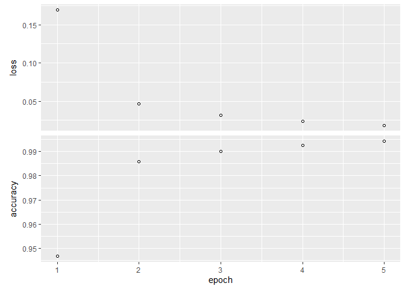

In part one of the workshop we jsut use densly connected neural networks and treated the MNIST data set as a collection of 784 pixels. That's why when we scrambled the images in various, consistent ways, our neural networks worked just fine. However, if we have images we should treat them as such, because then we have access to more powerful techniques. Before we dig into the dog versus cat data set, let's establish our first Convolutional neural network with the MNIST data set. 

## Obtain and prepare data

We saw these steps back in chapter 2. If your not clear about what's happening here, please review that unit.


```r
c(c(train_images, train_labels), c(test_images, test_labels)) %<-% dataset_mnist()

train_images <- array_reshape(train_images, c(60000, 28, 28, 1))/255
test_images <- array_reshape(test_images, c(10000, 28, 28, 1))/255

train_labels <- to_categorical(train_labels)
test_labels <- to_categorical(test_labels)
```

## Convnets: Defining our model 

We saw the structure of our convnet in the presentation. Here's how we would define it using keras.


```r
model <- keras_model_sequential() %>%
  
  layer_conv_2d(filters = 32, kernel_size = c(3, 3), activation = "relu", input_shape = c(28, 28, 1)) %>%
  layer_max_pooling_2d(pool_size = c(2, 2)) %>%
  
  layer_conv_2d(filters = 64, kernel_size = c(3, 3), activation = "relu") %>%
  layer_max_pooling_2d(pool_size = c(2, 2)) %>%
  
  layer_conv_2d(filters = 64, kernel_size = c(3, 3), activation = "relu")

summary(model)
```

```
## Model: "sequential"
## ________________________________________________________________________________
## Layer (type)                        Output Shape                    Param #     
## ================================================================================
## conv2d_2 (Conv2D)                   (None, 26, 26, 32)              320         
## ________________________________________________________________________________
## max_pooling2d_1 (MaxPooling2D)      (None, 13, 13, 32)              0           
## ________________________________________________________________________________
## conv2d_1 (Conv2D)                   (None, 11, 11, 64)              18496       
## ________________________________________________________________________________
## max_pooling2d (MaxPooling2D)        (None, 5, 5, 64)                0           
## ________________________________________________________________________________
## conv2d (Conv2D)                     (None, 3, 3, 64)                36928       
## ================================================================================
## Total params: 55,744
## Trainable params: 55,744
## Non-trainable params: 0
## ________________________________________________________________________________
```


```r
#knitr::include_graphics("Convnets-6.png")
```

Complete the model and compile it


```r
model %>%
  layer_flatten() %>%
  layer_dense(units = 64, activation = "relu") %>%
  layer_dense(units = 10, activation = "softmax")


model %>% compile(
  optimizer = "rmsprop",
  loss = "categorical_crossentropy",
  metrics = c("accuracy")
)

summary(model)
```

```
## Model: "sequential"
## ________________________________________________________________________________
## Layer (type)                        Output Shape                    Param #     
## ================================================================================
## conv2d_2 (Conv2D)                   (None, 26, 26, 32)              320         
## ________________________________________________________________________________
## max_pooling2d_1 (MaxPooling2D)      (None, 13, 13, 32)              0           
## ________________________________________________________________________________
## conv2d_1 (Conv2D)                   (None, 11, 11, 64)              18496       
## ________________________________________________________________________________
## max_pooling2d (MaxPooling2D)        (None, 5, 5, 64)                0           
## ________________________________________________________________________________
## conv2d (Conv2D)                     (None, 3, 3, 64)                36928       
## ________________________________________________________________________________
## flatten (Flatten)                   (None, 576)                     0           
## ________________________________________________________________________________
## dense_1 (Dense)                     (None, 64)                      36928       
## ________________________________________________________________________________
## dense (Dense)                       (None, 10)                      650         
## ================================================================================
## Total params: 93,322
## Trainable params: 93,322
## Non-trainable params: 0
## ________________________________________________________________________________
```


```r
#knitr::include_graphics("Convnets-complete.png")
```


## Fit the model and view the history:


```r
history <- model %>% fit(
  train_images, train_labels,
  epochs = 5, 
  batch_size = 64
)

plot(history)
```

<!-- -->

## Evaluate the model on the test data:

Using just a densly-connected network we obtained a test set accuracy of 0.9803.


```r
model %>% evaluate(test_images, test_labels)
```

```
##       loss   accuracy 
## 0.02895902 0.99150002
```

