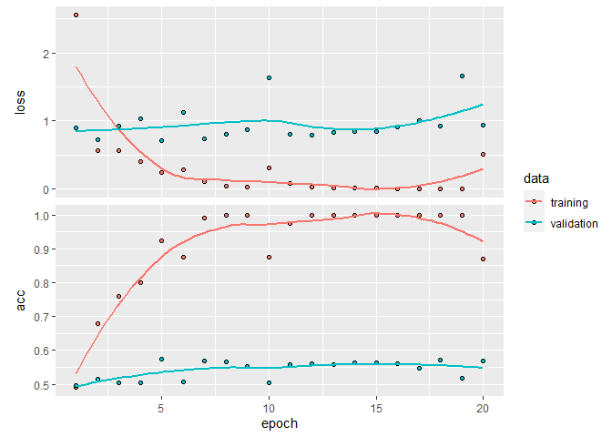
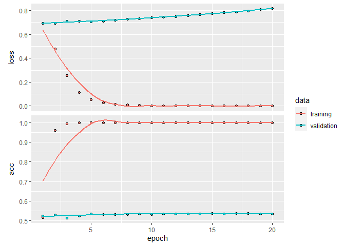

```r
library(keras)
```

```
## Warning: package 'keras' was built under R version 4.0.4
```

## IMDB data set from raw text

Previously we have used the built-in data set, but it's useful to see how we can work with raw text.

You can obtain the data files via `http://ai.stanford.edu/~amaas/data/sentiment/aclImdb_v1.tar.gz`, or you can use the following commands to obtain the IMDB data files if you want to do this via the terminal:  

```
cd Chapter\ 6
mkdir data
cd data
wget "http://ai.stanford.edu/~amaas/data/sentiment/aclImdb_v1.tar.gz"
gunzip aclImdb_v1.tar.gz 
tar xvf aclImdb_v1.tar
rm aclImdb_v1.tar 
```


```r
imdb_dir <- "./data/aclImdb"
train_dir <- file.path(imdb_dir, "train")

labels <- c()
texts <- c()

for (label_type in c("neg", "pos")) {
  label <- switch(label_type, neg = 0, pos = 1)
  dir_name <- file.path(train_dir, label_type)
  for (fname in list.files(dir_name, pattern = glob2rx("*.txt"), 
                           full.names = TRUE)) {
    texts <- c(texts, readChar(fname, file.info(fname)$size))
    labels <- c(labels, label)
  }
}

# Prepare the labels
labels <- as.array(labels)
```

The text is just a vector, where each element is a movie review.


```r
texts[1]
```

```
## [1] "Story of a man who has unnatural feelings for a pig. Starts out with a opening scene that is a terrific example of absurd comedy. A formal orchestra audience is turned into an insane, violent mob by the crazy chantings of it's singers. Unfortunately it stays absurd the WHOLE time with no general narrative eventually making it just too off putting. Even those from the era should be turned off. The cryptic dialogue would make Shakespeare seem easy to a third grader. On a technical level it's better than you might think with some good cinematography by future great Vilmos Zsigmond. Future stars Sally Kirkland and Frederic Forrest can be seen briefly."
```

```r
str(texts)
```

```
##  chr [1:25000] "Story of a man who has unnatural feelings for a pig. Starts out with a opening scene that is a terrific example"| __truncated__ ...
```

```r
typeof(texts)
```

```
## [1] "character"
```

```r
class(texts)
```

```
## [1] "character"
```

```r
length(texts)
```

```
## [1] 25000
```

### Tokenize the data

Let's vectorize the texts we collected, and prepare a training and validation split. We will merely be using the concepts we introduced earlier in this section.

Because pre-trained word embeddings are meant to be particularly useful on problems where little training data is available (otherwise, task-specific embeddings are likely to outperform them), we will add the following twist: we restrict the training data to its first 200 samples. So we will be learning to classify movie reviews after looking at just 200 examples...


```r
max_words <- 10000            # We will only consider the top 10,000 words in the dataset

tokenizer <- text_tokenizer(num_words = max_words) %>% 
  fit_text_tokenizer(texts)

typeof(tokenizer)
```

```
## [1] "environment"
```

```r
names(tokenizer)
```

```
##  [1] "char_level"                   "document_count"              
##  [3] "filters"                      "fit_on_sequences"            
##  [5] "fit_on_texts"                 "get_config"                  
##  [7] "index_docs"                   "index_word"                  
##  [9] "lower"                        "num_words"                   
## [11] "oov_token"                    "sequences_to_matrix"         
## [13] "sequences_to_texts"           "sequences_to_texts_generator"
## [15] "split"                        "texts_to_matrix"             
## [17] "texts_to_sequences"           "texts_to_sequences_generator"
## [19] "to_json"                      "word_counts"                 
## [21] "word_docs"                    "word_index"
```

We have now tokenized the text, the first step in our process:


```r
word_index <- tokenizer$word_index
head(tokenizer$word_index)
```

```
## $the
## [1] 1
## 
## $and
## [1] 2
## 
## $a
## [1] 3
## 
## $of
## [1] 4
## 
## $to
## [1] 5
## 
## $is
## [1] 6
```

Number of unique tokens:


```r
length(tokenizer$word_index)
```

```
## [1] 88584
```


```r
head(tokenizer$index_word)
```

```
## $`1`
## [1] "the"
## 
## $`2`
## [1] "and"
## 
## $`3`
## [1] "a"
## 
## $`4`
## [1] "of"
## 
## $`5`
## [1] "to"
## 
## $`6`
## [1] "is"
```


```r
sequences <- texts_to_sequences(tokenizer, texts)
```

`sequences` contains the vectorized values as a list.


```r
# The vectorized first instance:
sequences[[1]]
```

```
##   [1]   62    4    3  129   34   44 7576 1414   15    3 4252  514   43   16    3
##  [16]  633  133   12    6    3 1301  459    4 1751  209    3 7693  308    6  676
##  [31]   80   32 2137 1110 3008   31    1  929    4   42 5120  469    9 2665 1751
##  [46]    1  223   55   16   54  828 1318  847  228    9   40   96  122 1484   57
##  [61]  145   36    1  996  141   27  676  122    1  411   59   94 2278  303  772
##  [76]    5    3  837   20    3 1755  646   42  125   71   22  235  101   16   46
##  [91]   49  624   31  702   84  702  378 3493    2 8422   67   27  107 3348
```

What the text has become:


```r
paste(unlist(tokenizer$index_word)[sequences[[1]]] ,collapse=" ")
```

```
## [1] "story of a man who has unnatural feelings for a pig starts out with a opening scene that is a terrific example of absurd comedy a orchestra audience is turned into an insane violent mob by the crazy of it's singers unfortunately it stays absurd the whole time with no general narrative eventually making it just too off putting even those from the era should be turned off the dialogue would make shakespeare seem easy to a third on a technical level it's better than you might think with some good cinematography by future great future stars sally and forrest can be seen briefly"
```

From our original text:


```r
texts[[1]]
```

```
## [1] "Story of a man who has unnatural feelings for a pig. Starts out with a opening scene that is a terrific example of absurd comedy. A formal orchestra audience is turned into an insane, violent mob by the crazy chantings of it's singers. Unfortunately it stays absurd the WHOLE time with no general narrative eventually making it just too off putting. Even those from the era should be turned off. The cryptic dialogue would make Shakespeare seem easy to a third grader. On a technical level it's better than you might think with some good cinematography by future great Vilmos Zsigmond. Future stars Sally Kirkland and Frederic Forrest can be seen briefly."
```

Like before, we'll limit ourselves to the first 100 words.


```r
maxlen <- 100                 # We will cut reviews after 100 words

data <- pad_sequences(sequences, maxlen = maxlen)
```


```r
data[1,]
```

```
##   [1]   34   44 7576 1414   15    3 4252  514   43   16    3  633  133   12    6
##  [16]    3 1301  459    4 1751  209    3 7693  308    6  676   80   32 2137 1110
##  [31] 3008   31    1  929    4   42 5120  469    9 2665 1751    1  223   55   16
##  [46]   54  828 1318  847  228    9   40   96  122 1484   57  145   36    1  996
##  [61]  141   27  676  122    1  411   59   94 2278  303  772    5    3  837   20
##  [76]    3 1755  646   42  125   71   22  235  101   16   46   49  624   31  702
##  [91]   84  702  378 3493    2 8422   67   27  107 3348
```


```r
paste(unlist(tokenizer$index_word)[data[1,]] ,collapse=" ")
```

```
## [1] "who has unnatural feelings for a pig starts out with a opening scene that is a terrific example of absurd comedy a orchestra audience is turned into an insane violent mob by the crazy of it's singers unfortunately it stays absurd the whole time with no general narrative eventually making it just too off putting even those from the era should be turned off the dialogue would make shakespeare seem easy to a third on a technical level it's better than you might think with some good cinematography by future great future stars sally and forrest can be seen briefly"
```

Shape of data tensor: 25000, 100, Shape of label tensor: 25000.

And here, instead of letting the fit function produce a validation set split, we'll do that manually.

But first, we'll need to shuffle the data, since we started from an ordered data set (all negative, followed by all positive).


```r
indices <- sample(1:nrow(data))

training_samples <- 200       # We will be training on 200 samples
validation_samples <- 10000   # We will be validating on 10000 samples

training_indices <- indices[1:training_samples]
validation_indices <- indices[(training_samples + 1): 
                              (training_samples + validation_samples)]

x_train <- data[training_indices,]
y_train <- labels[training_indices]

x_val <- data[validation_indices,]
y_val <- labels[validation_indices]
```

### Download the GloVe word embeddings

The GloVE pretrained word embeddings are derived from the 2014 English Wikipedia. It can be downloaded [here](https://nlp.stanford.edu/projects/glove/). The file to look for is `glove.6B.zip` (822MB). In it you'll find  100-dimensional embedding vectors for 400,000 words (or non-word tokens).

Download and unzip the file (it will just a be a `txt` file) and place it in the _pretrained_ folder.

Here are the commands if you want to do this via the terminal:  

```
cd Chapter\ 6
mkdir pretrained
cd pretrained/
mkdir glove.6B
cd glove.6B
wget "http://nlp.stanford.edu/data/glove.6B.zip"
unzip glove.6B.zip
rm glove.6B.zip 
```

### Pre-process the embeddings

We'll parse the `txt` file to build an index mapping words (as strings) to their vector representation (as number 
vectors).


```r
glove_dir <- "./pretrained/glove.6B"
lines <- readLines(file.path(glove_dir, "glove.6B.100d.txt"))

lines[1] # Word embeddings in 100 dimensions.
```

```
## [1] "the -0.038194 -0.24487 0.72812 -0.39961 0.083172 0.043953 -0.39141 0.3344 -0.57545 0.087459 0.28787 -0.06731 0.30906 -0.26384 -0.13231 -0.20757 0.33395 -0.33848 -0.31743 -0.48336 0.1464 -0.37304 0.34577 0.052041 0.44946 -0.46971 0.02628 -0.54155 -0.15518 -0.14107 -0.039722 0.28277 0.14393 0.23464 -0.31021 0.086173 0.20397 0.52624 0.17164 -0.082378 -0.71787 -0.41531 0.20335 -0.12763 0.41367 0.55187 0.57908 -0.33477 -0.36559 -0.54857 -0.062892 0.26584 0.30205 0.99775 -0.80481 -3.0243 0.01254 -0.36942 2.2167 0.72201 -0.24978 0.92136 0.034514 0.46745 1.1079 -0.19358 -0.074575 0.23353 -0.052062 -0.22044 0.057162 -0.15806 -0.30798 -0.41625 0.37972 0.15006 -0.53212 -0.2055 -1.2526 0.071624 0.70565 0.49744 -0.42063 0.26148 -1.538 -0.30223 -0.073438 -0.28312 0.37104 -0.25217 0.016215 -0.017099 -0.38984 0.87424 -0.72569 -0.51058 -0.52028 -0.1459 0.8278 0.27062"
```

The word embeddings are contained in strings that contain the word and then 100 numbers separated by a space. We need to get an embedding matrix that we can use 

Here we'll use a nice trick to work with the embeddings by making them into an environment instead of a lsit.


```r
embeddings_index <- new.env(hash = TRUE, parent = emptyenv())
for (i in 1:length(lines)) {
  line <- lines[[i]]
  values <- strsplit(line, " ")[[1]]
  word <- values[[1]]
  embeddings_index[[word]] <- as.double(values[-1])
}

# 400000
```

This results in 400000 word vectors. i.e. the 100-dimensional embedding vectors for 400,000 words.


```r
embeddings_index[["the"]]
```

```
##   [1] -0.038194 -0.244870  0.728120 -0.399610  0.083172  0.043953 -0.391410
##   [8]  0.334400 -0.575450  0.087459  0.287870 -0.067310  0.309060 -0.263840
##  [15] -0.132310 -0.207570  0.333950 -0.338480 -0.317430 -0.483360  0.146400
##  [22] -0.373040  0.345770  0.052041  0.449460 -0.469710  0.026280 -0.541550
##  [29] -0.155180 -0.141070 -0.039722  0.282770  0.143930  0.234640 -0.310210
##  [36]  0.086173  0.203970  0.526240  0.171640 -0.082378 -0.717870 -0.415310
##  [43]  0.203350 -0.127630  0.413670  0.551870  0.579080 -0.334770 -0.365590
##  [50] -0.548570 -0.062892  0.265840  0.302050  0.997750 -0.804810 -3.024300
##  [57]  0.012540 -0.369420  2.216700  0.722010 -0.249780  0.921360  0.034514
##  [64]  0.467450  1.107900 -0.193580 -0.074575  0.233530 -0.052062 -0.220440
##  [71]  0.057162 -0.158060 -0.307980 -0.416250  0.379720  0.150060 -0.532120
##  [78] -0.205500 -1.252600  0.071624  0.705650  0.497440 -0.420630  0.261480
##  [85] -1.538000 -0.302230 -0.073438 -0.283120  0.371040 -0.252170  0.016215
##  [92] -0.017099 -0.389840  0.874240 -0.725690 -0.510580 -0.520280 -0.145900
##  [99]  0.827800  0.270620
```

Now we're ready to build an embedding matrix that we can load into an embedding layer.

It must be a matrix of shape `(max_words, embedding_dim)`, where each entry _i_ contains the `embedding_dim`-dimensional vector for the word of index _i_ in the reference word index (built during tokenization). Note that index 1 isn't supposed to stand for any word or token -- it's a placeholder.


```r
embedding_dim <- 100

embedding_matrix <- array(0, c(max_words, embedding_dim))

for (word in names(word_index)) {
  index <- word_index[[word]]
  if (index < max_words) {
    embedding_vector <- embeddings_index[[word]]
    if (!is.null(embedding_vector))
      # Words not found in the embedding index will be all zeros.
      embedding_matrix[index+1,] <- embedding_vector
  }
}
```

### Define a model

We will be using the same model architecture as before:


```r
model <- keras_model_sequential() %>% 
  layer_embedding(input_dim = max_words, # 10000 tokens
                  output_dim = embedding_dim, # 100 dimensions
                  input_length = maxlen) %>%  # 100 length of each review.
  layer_flatten() %>% 
  layer_dense(units = 32, activation = "relu") %>% 
  layer_dense(units = 1, activation = "sigmoid")

summary(model)
```

```
## Model: "sequential"
## ________________________________________________________________________________
## Layer (type)                        Output Shape                    Param #     
## ================================================================================
## embedding (Embedding)               (None, 100, 100)                1000000     
## ________________________________________________________________________________
## flatten (Flatten)                   (None, 10000)                   0           
## ________________________________________________________________________________
## dense_1 (Dense)                     (None, 32)                      320032      
## ________________________________________________________________________________
## dense (Dense)                       (None, 1)                       33          
## ================================================================================
## Total params: 1,320,065
## Trainable params: 1,320,065
## Non-trainable params: 0
## ________________________________________________________________________________
```

### Load the GloVe embeddings in the model

The embedding layer has a single weight matrix: a 2D float matrix where each entry _i_ is the word vector meant to be associated with index _i_. Simple enough. Load the GloVe matrix you prepared into the embedding layer, the first layer in the model.


```r
get_layer(model, index = 1) %>% 
  set_weights(list(embedding_matrix)) %>% 
  freeze_weights()
```

Additionally, you'll freeze the weights of the embedding layer, following the same rationale you're already familiar with in the context of pretrained convnet features: when parts of a model are pretrained (like your embedding layer) and parts are randomly initialized (like your classifier), the pretrained parts shouldn't be updated during training, to avoid forgetting  what they already know. The large gradient updates triggered by the randomly initialized layers would be disruptive to the already-learned features.

### Train and evaluate

Let's compile our model and train it:


```r
model %>% compile(
  optimizer = "rmsprop",
  loss = "binary_crossentropy",
  metrics = c("acc")
)

history <- model %>% fit(
  x_train, y_train,
  epochs = 20,
  batch_size = 32,
  validation_data = list(x_val, y_val)
)

save_model_weights_hdf5(model, "pre_trained_glove_model.h5")
```

Let's plot its performance over time:


```r
plot(history)
```

```
## `geom_smooth()` using formula 'y ~ x'
```

<!-- -->

The model quickly starts overfitting, unsurprisingly given the small number of training samples. Validation accuracy has high variance for the same reason, but seems to reach high 50s.

Note that your mileage may vary: since we have so few training samples, performance is heavily dependent on which exact 200 samples we picked, and we picked them at random. If it worked really poorly for you, try picking different random set of 200 samples, just for the sake of the exercise (in real life you don't get to pick your training data).

We can also try to train the same model without loading the pre-trained word embeddings and without freezing the embedding layer. In that case, we would be learning a task-specific embedding of our input tokens, which is generally more powerful than pre-trained word embeddings when lots of data is available. However, in our case, we have only 200 training samples. Let's try it:


```r
model <- keras_model_sequential() %>% 
  layer_embedding(input_dim = max_words, output_dim = embedding_dim, 
                  input_length = maxlen) %>% 
  layer_flatten() %>% 
  layer_dense(units = 32, activation = "relu") %>% 
  layer_dense(units = 1, activation = "sigmoid")

model %>% compile(
  optimizer = "rmsprop",
  loss = "binary_crossentropy",
  metrics = c("acc")
)

history <- model %>% fit(
  x_train, y_train,
  epochs = 20,
  batch_size = 32,
  validation_data = list(x_val, y_val)
)
```


```r
plot(history)
```

```
## `geom_smooth()` using formula 'y ~ x'
```

<!-- -->

Validation accuracy stalls in the low 50s. So in our case, pre-trained word embeddings does outperform jointly learned embeddings. If you increase the number of training samples, this will quickly stop being the case -- try it as an exercise.

Finally, let's evaluate the model on the test data. First, we will need to tokenize the test data:


```r
test_dir <- file.path(imdb_dir, "test")

labels <- c()
texts <- c()

for (label_type in c("neg", "pos")) {
  label <- switch(label_type, neg = 0, pos = 1)
  dir_name <- file.path(test_dir, label_type)
  for (fname in list.files(dir_name, pattern = glob2rx("*.txt"), 
                           full.names = TRUE)) {
    texts <- c(texts, readChar(fname, file.info(fname)$size))
    labels <- c(labels, label)
  }
}

sequences <- texts_to_sequences(tokenizer, texts)
x_test <- pad_sequences(sequences, maxlen = maxlen)
y_test <- as.array(labels)
```

And let's load and evaluate the first model:


```r
model %>% 
  load_model_weights_hdf5("pre_trained_glove_model.h5") %>% 
  evaluate(x_test, y_test, verbose = 0)
```

```
##      loss       acc 
## 0.9263386 0.5706800
```

We get an appalling test accuracy of 57%. Working with just a handful of training samples is hard!
